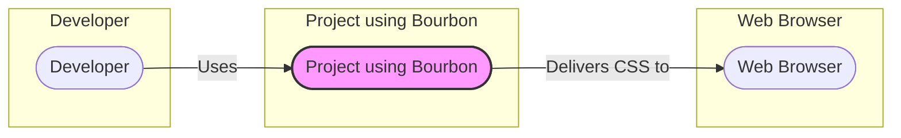
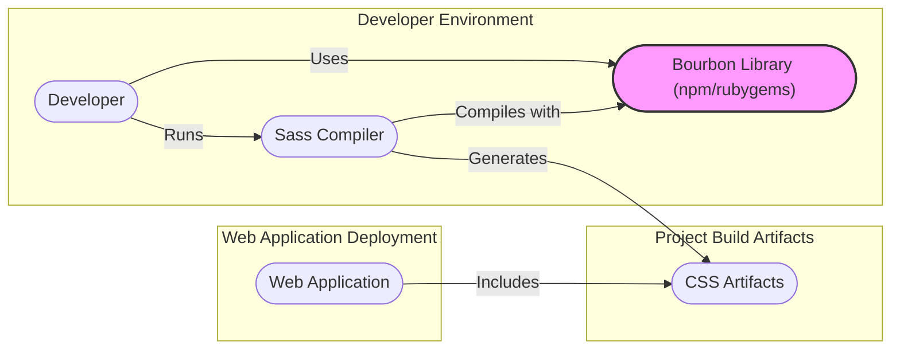
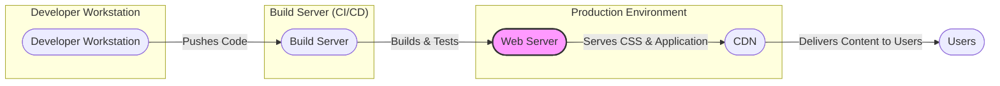

# BUSINESS POSTURE

This project, Bourbon, is a library of Sass mixins and functions that simplifies and streamlines CSS authoring.

Business Priorities and Goals:
- Primary goal is to enhance front-end developer productivity by providing reusable and consistent CSS patterns.
- Secondary goal is to improve the maintainability and readability of CSS codebases by abstracting away vendor prefixes and complex CSS implementations.
- Tertiary goal is to promote best practices in CSS development through well-designed and tested mixins and functions.

Business Risks:
- Dependency Risk: Projects relying on Bourbon become dependent on its continued maintenance and security. Vulnerabilities in Bourbon could potentially impact all dependent projects.
- Compatibility Risk: As web development technologies evolve, Bourbon might become outdated or incompatible with newer Sass versions or browser features, requiring updates or migration.
- Adoption Risk: If Bourbon is perceived as too complex, not flexible enough, or lacking in features compared to alternatives, developers may not adopt it, limiting its impact and return on investment.
- Supply Chain Risk: Compromise of the Bourbon package could lead to malicious code being injected into projects that depend on it.

# SECURITY POSTURE

Existing Security Controls:
- security control: Open Source Codebase - The source code is publicly available on GitHub, allowing for community review and scrutiny.
- security control: Version Control - Git is used for version control, providing history and traceability of changes.
- security control: Dependency Management - Bourbon is distributed through package managers (npm, yarn, RubyGems), leveraging their security features for package integrity and distribution.

Accepted Risks:
- accepted risk: Vulnerabilities in Dependencies - While Bourbon has minimal dependencies, vulnerabilities in those dependencies could indirectly affect Bourbon users.
- accepted risk: Potential for Malicious Contributions - Although unlikely due to maintainer review, there's a theoretical risk of malicious code being introduced through pull requests if not thoroughly vetted.

Recommended Security Controls:
- security control: Automated Dependency Scanning - Implement automated tools to scan Bourbon's dependencies for known vulnerabilities on a regular basis.
- security control: Regular Security Audits - Conduct periodic security audits of the Bourbon codebase, especially before major releases, to identify and address potential security weaknesses.
- security control: Supply Chain Security Measures - Implement measures to enhance supply chain security, such as using signed commits and ensuring secure package distribution channels.

Security Requirements:
- Authentication: Not applicable. Bourbon is a library and does not involve user authentication.
- Authorization: Not applicable. Bourbon is a library and does not involve user authorization.
- Input Validation: Not directly applicable to Bourbon itself as it's a library of Sass mixins and functions. However, Sass compilers and user projects utilizing Bourbon should perform input validation as needed within their own contexts. Bourbon's mixins should be designed to avoid introducing vulnerabilities in how they generate CSS.
- Cryptography: Not applicable. Bourbon does not handle or require cryptographic operations.

# DESIGN

## C4 CONTEXT



Context Diagram Elements:

- Element:
    - Name: Developer
    - Type: Person
    - Description: Front-end developers who use Bourbon to write CSS for web projects.
    - Responsibilities: Develop web applications using Bourbon to streamline CSS development.
    - Security controls: Security controls are not directly implemented by the developer in the context of Bourbon itself, but developers are responsible for secure coding practices in their projects that utilize Bourbon.

- Element:
    - Name: Project using Bourbon
    - Type: Software System
    - Description: A web application or website that utilizes the Bourbon Sass library to generate CSS.
    - Responsibilities: Generate CSS using Bourbon mixins and functions, deliver styled web content to users.
    - Security controls: Security controls are implemented within the project itself, not directly by Bourbon. These include input validation, output encoding, and other web application security best practices.

- Element:
    - Name: Web Browser
    - Type: Software System
    - Description: User's web browser that renders web applications styled with CSS generated using Bourbon.
    - Responsibilities: Render HTML and CSS, execute JavaScript, and provide user interface for web applications.
    - Security controls: Web browsers implement numerous security controls to protect users from malicious web content, such as sandboxing, Content Security Policy (CSP), and same-origin policy.

## C4 CONTAINER



Container Diagram Elements:

- Element:
    - Name: Developer
    - Type: Person
    - Description: Front-end developers who use Bourbon in their development environment.
    - Responsibilities: Write Sass code utilizing Bourbon mixins and functions, manage project dependencies including Bourbon.
    - Security controls: Developer workstations should be secured according to organizational security policies.

- Element:
    - Name: Bourbon Library (npm/rubygems)
    - Type: Container (Library)
    - Description: The Bourbon Sass library distributed as a package through npm, RubyGems, or similar package managers.
    - Responsibilities: Provide Sass mixins and functions to simplify CSS development.
    - Security controls: Supply chain security of the package distribution platform (npm, RubyGems). Integrity checks during package installation by package managers.

- Element:
    - Name: Sass Compiler
    - Type: Container (Application)
    - Description: Software that compiles Sass code, including Bourbon mixins and functions, into CSS. Examples include Dart Sass, LibSass, Ruby Sass.
    - Responsibilities: Compile Sass code into CSS, resolve Bourbon mixins and functions during compilation.
    - Security controls: The Sass compiler itself should be a trusted and up-to-date tool.

- Element:
    - Name: CSS Artifacts
    - Type: Container (Files)
    - Description: The generated CSS files that are the output of the Sass compilation process, incorporating styles from Bourbon.
    - Responsibilities: Contain the final CSS styles for the web application, derived from Sass and Bourbon.
    - Security controls: Ensure CSS artifacts are served securely by the web application, following web server security best practices.

- Element:
    - Name: Web Application
    - Type: Container (Application)
    - Description: The deployed web application that includes the CSS artifacts generated using Bourbon.
    - Responsibilities: Serve web content, including HTML, CSS (generated from Bourbon), and JavaScript, to users' web browsers.
    - Security controls: Comprehensive web application security controls, including authentication, authorization, input validation, output encoding, secure session management, and protection against common web vulnerabilities (OWASP Top 10).

## DEPLOYMENT

Deployment is context-dependent as Bourbon is a library used within other projects. The deployment of Bourbon itself is its publication to package registries. The deployment diagram below illustrates a typical web application deployment scenario where Bourbon-generated CSS is used.



Deployment Diagram Elements:

- Element:
    - Name: Developer Workstation
    - Type: Infrastructure (Physical/Virtual Machine)
    - Description: Developer's local machine used for writing code, including Sass and Bourbon.
    - Responsibilities: Code development, local testing, version control.
    - Security controls: Workstation security policies, endpoint protection, access controls.

- Element:
    - Name: Build Server (CI/CD)
    - Type: Infrastructure (Server)
    - Description: Automated build server in a CI/CD pipeline that compiles Sass code (including Bourbon), runs tests, and prepares deployment artifacts.
    - Responsibilities: Automated build process, testing, integration, and deployment preparation.
    - Security controls: Access control to build server, secure build pipelines, secrets management, vulnerability scanning of build environment.

- Element:
    - Name: Web Server
    - Type: Infrastructure (Server)
    - Description: Server hosting the web application and serving static assets, including CSS files generated using Bourbon.
    - Responsibilities: Serve web application content, handle user requests, application logic execution.
    - Security controls: Web server hardening, access controls, firewalls, intrusion detection/prevention systems, regular security patching.

- Element:
    - Name: CDN
    - Type: Infrastructure (Content Delivery Network)
    - Description: Content Delivery Network used to cache and serve static assets like CSS files generated from Bourbon, improving performance and availability.
    - Responsibilities: Caching and delivering static content, improving website performance and reducing load on origin web servers.
    - Security controls: CDN security features, secure content delivery, DDoS protection, access controls to CDN configuration.

- Element:
    - Name: Users
    - Type: Person
    - Description: End-users accessing the web application styled with CSS generated using Bourbon.
    - Responsibilities: Access and interact with the web application.
    - Security controls: User-side security measures, browser security features.

## BUILD

```mermaid
flowchart LR
    subgraph "Developer"
        Dev(["Developer"])
    end
    subgraph "Version Control (GitHub)"
        VC(["Version Control (GitHub)"])
    end
    subgraph "CI/CD Pipeline (GitHub Actions)"
        CI(["CI/CD Pipeline (GitHub Actions)"])
    end
    subgraph "Package Registry (npm/rubygems)"
        Registry(["Package Registry (npm/rubygems)"])
    end
    Dev -->|Code Changes| VC
    VC -->|Triggers Build| CI
    CI -->|Builds & Tests| Registry
    CI -->|Security Checks (Linters, etc.)| CI
    style CI fill:#f9f,stroke:#333,stroke-width:2px
```

Build Process Description:

1. Developer writes Sass code incorporating Bourbon mixins and functions.
2. Developer commits and pushes code changes to a Version Control System (e.g., GitHub).
3. Code push to the repository triggers a CI/CD pipeline (e.g., GitHub Actions).
4. The CI/CD pipeline performs the following steps:
    - Checks out the code.
    - Installs dependencies, including Bourbon.
    - Compiles Sass code into CSS using a Sass compiler.
    - Runs automated tests (if any are defined for Bourbon itself - typically for library development).
    - Performs security checks, such as running linters and potentially SAST tools on the Sass codebase (though less common for Sass libraries).
    - Packages the library (if publishing a new version of Bourbon).
    - Publishes the package to a package registry (e.g., npm, RubyGems).

Build Security Controls:
- security control: Secure Version Control - Using a secure and access-controlled version control system (GitHub).
- security control: Automated Build Pipeline - Implementing a CI/CD pipeline to automate the build process, reducing manual errors and ensuring consistency.
- security control: Dependency Management - Using package managers (npm, RubyGems) to manage dependencies and ensure package integrity.
- security control: Security Scanning - Integrating security scanning tools (linters, potentially SAST) into the build pipeline to identify potential code quality and security issues.
- security control: Access Control to CI/CD - Restricting access to the CI/CD pipeline and build artifacts to authorized personnel.
- security control: Build Artifact Integrity - Ensuring the integrity of build artifacts through signing or checksumming before publishing to package registries.

# RISK ASSESSMENT

Critical Business Processes:
- Software Development Lifecycle: Bourbon is a tool to improve the efficiency and quality of front-end development. Its security and availability directly impact the software development process.
- Web Application Performance and User Experience: Bourbon contributes to the styling of web applications, impacting user experience and potentially application performance if not used efficiently.

Data to Protect:
- Source Code: The Bourbon source code itself, as well as the source code of projects that depend on Bourbon, needs to be protected from unauthorized access and modification.
- Intellectual Property: Bourbon represents intellectual property in the form of reusable Sass mixins and functions.
- Package Integrity: The integrity of the Bourbon package in package registries is crucial to prevent supply chain attacks.

Data Sensitivity:
- Bourbon Source Code: Publicly available on GitHub, so not confidential in the traditional sense. Integrity and availability are more critical.
- Project Source Code (using Bourbon): Sensitivity depends on the nature of the projects using Bourbon. Could range from public websites to sensitive internal applications.
- Intellectual Property: Moderate sensitivity. Publicly available but represents valuable development effort.
- Package Integrity: High sensitivity. Compromise can have widespread impact on dependent projects.

# QUESTIONS & ASSUMPTIONS

Questions:
- What is the intended scope of security for this document? Is it primarily focused on the security of the Bourbon library itself, or the security of projects that utilize Bourbon? (Assumption: Both, with emphasis on Bourbon as a dependency).
- What is the target audience for this design document? (Assumption: Security team and development team).
- Are there any specific compliance requirements or security standards that need to be considered? (Assumption: General web application security best practices).

Assumptions:
- BUSINESS POSTURE: The primary business driver for Bourbon is developer productivity and CSS consistency.
- SECURITY POSTURE: Security is important, but the primary focus is on supply chain security and ensuring Bourbon does not introduce vulnerabilities into projects that use it.
- DESIGN: Bourbon is used in typical web development workflows involving Sass compilation and deployment of web applications.