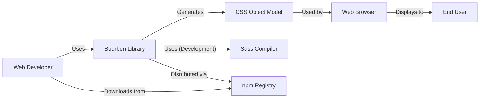
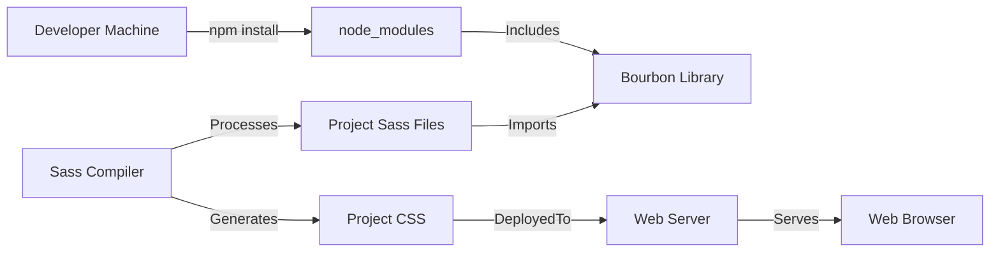
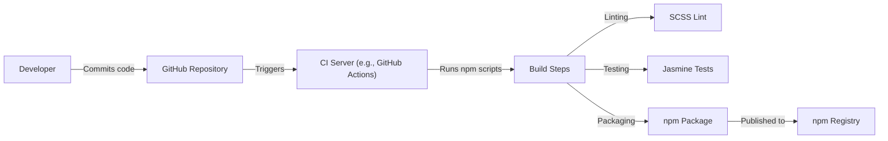

Okay, let's create a design document for the Bourbon project, focusing on aspects relevant to threat modeling.

# BUSINESS POSTURE

Bourbon is a library, a collection of Sass mixins and functions, intended to simplify web development. It's not a standalone application, but rather a tool used within other projects.  The primary business goal is to provide a lightweight, well-maintained, and reliable set of Sass utilities that improve developer productivity and code maintainability.  It's an open-source project, so community adoption and contribution are also key goals.

Business Priorities:

*   Developer Productivity: Reduce repetitive CSS coding.
*   Code Maintainability:  Provide a consistent and well-documented set of mixins.
*   Cross-Browser Compatibility:  Ensure the generated CSS works reliably across different browsers.
*   Lightweight Footprint: Minimize the impact on the final CSS file size.
*   Community Engagement: Foster a community of users and contributors.

Business Risks:

*   Security control: Malicious Code Injection: If a vulnerability exists in a Bourbon mixin, and that mixin is used in a production website, it could potentially be exploited. This is a lower direct risk to Bourbon itself, but a high risk to projects *using* Bourbon.
*   Security control: Supply Chain Attacks: Compromise of the Bourbon repository or distribution mechanism (e.g., npm) could lead to malicious code being distributed to users.
*   Accepted risk: Lack of Maintenance: If the project is abandoned, vulnerabilities may not be patched, increasing the risk to users over time.
*   Accepted risk: Incorrect Usage: Developers might misuse Bourbon mixins, leading to unexpected behavior or potential vulnerabilities in *their* applications, not Bourbon itself. This is an indirect risk.

# SECURITY POSTURE

Existing Security Controls:

*   Security control: Code Reviews: The GitHub repository shows evidence of pull requests and code reviews, which helps to identify potential issues before they are merged. (Described in GitHub pull request process).
*   Security control: Automated Testing: The project includes a test suite (using Jasmine, as indicated by `spec/` directory), which helps to ensure that the mixins function as expected and reduces the risk of regressions. (Described in `spec/` directory and test files).
*   Security control: Linting: The presence of `.scss-lint.yml` suggests that SCSS linting is used to enforce code style and potentially identify some basic errors. (Described in `.scss-lint.yml` file).
*   Security control: Dependency Management: Dependencies are managed via npm, allowing for updates and security patches to be applied to third-party libraries. (Described in `package.json`).
*   Security control: Semantic Versioning: Bourbon follows semantic versioning, which helps users understand the impact of updates (major, minor, patch). (Described in release tags).

Accepted Risks:

*   Accepted risk: Limited Security Focus: As a CSS preprocessor library, the direct security risks are relatively low compared to, for example, a web application handling sensitive data. The primary focus is on functionality and maintainability.
*   Accepted risk: Reliance on User Input Sanitization: Bourbon itself doesn't handle user input directly. It relies on the developers using the library to properly sanitize any user-provided data that might be used within CSS (e.g., to prevent CSS injection attacks).
*   Accepted risk: No Formal Security Audits: There's no indication of regular, formal security audits being conducted.

Recommended Security Controls:

*   Security control: Static Analysis: Integrate a static analysis tool specifically designed for Sass/CSS (e.g., `sass-lint` with security-focused rules) to identify potential security issues in the mixins themselves.
*   Security control: Supply Chain Security: Implement measures to protect the supply chain, such as:
    *   Security control: Regularly audit dependencies for known vulnerabilities (e.g., using `npm audit` or a dedicated dependency scanning tool).
    *   Security control: Consider using a tool like Dependabot to automatically create pull requests for dependency updates.
    *   Security control: Enable two-factor authentication (2FA) for the npm account used to publish the package.
    *   Security control: Digitally sign releases.

Security Requirements:

*   Authentication: Not applicable, as Bourbon is a library and doesn't handle authentication.
*   Authorization: Not applicable, as Bourbon is a library and doesn't handle authorization.
*   Input Validation: Bourbon mixins should handle input values gracefully. While Bourbon itself doesn't directly process user input in a web application context, the mixins should be designed to avoid generating invalid or potentially dangerous CSS based on the provided arguments. For example, mixins that accept color values should ideally validate those values or at least handle unexpected input without causing errors or security issues.
*   Cryptography: Not directly applicable, as Bourbon is a CSS preprocessor library. However, if Bourbon were to include any functionality related to generating URLs or handling sensitive data (which it currently doesn't), then appropriate cryptographic practices (e.g., using HTTPS, secure hashing algorithms) would be required.

# DESIGN

## C4 CONTEXT

Element Descriptions:

*   Element:
    *   Name: Web Developer
    *   Type: Person
    *   Description: A developer who uses Bourbon in their web projects.
    *   Responsibilities: Integrates Bourbon into their Sass stylesheets, configures Bourbon, and uses Bourbon mixins.
    *   Security controls: Follows secure coding practices, sanitizes user input in their application.

*   Element:
    *   Name: Bourbon Library
    *   Type: Software System
    *   Description: A collection of Sass mixins and functions.
    *   Responsibilities: Provides reusable CSS components, simplifies CSS development.
    *   Security controls: Code reviews, automated testing, linting, dependency management, semantic versioning.

*   Element:
    *   Name: CSS Object Model
    *   Type: Software System
    *   Description: A set of APIs for manipulating CSS from JavaScript.
    *   Responsibilities: Apply styles to web pages.
    *   Security controls: Browser's built-in security mechanisms.

*   Element:
    *   Name: Web Browser
    *   Type: Software System
    *   Description: A software application for retrieving, presenting, and traversing information resources on the World Wide Web.
    *   Responsibilities: Renders web pages, executes JavaScript, enforces security policies.
    *   Security controls: Sandboxing, same-origin policy, content security policy (CSP).

*   Element:
    *   Name: End User
    *   Type: Person
    *   Description: The person who interacts with the final web page.
    *   Responsibilities: Views and interacts with the website.
    *   Security controls: Relies on the security of the web browser and the website.

*   Element:
    *   Name: Sass Compiler
    *   Type: Software System
    *   Description: A compiler that translates Sass code into CSS.
    *   Responsibilities: Processes Sass files, including Bourbon mixins, and outputs CSS.
    *   Security controls: Relies on the security of the Sass compiler implementation.

*   Element:
    *   Name: npm Registry
    *   Type: Software System
    *   Description: A public registry of JavaScript packages.
    *   Responsibilities: Stores and distributes Bourbon packages.
    *   Security controls: npm's security measures (e.g., 2FA, package signing).

## C4 CONTAINER

Since Bourbon is a library, the container diagram is essentially the same as the context diagram.  It doesn't have separate deployable units. The "container" is the Bourbon library itself, which is used *within* another project's Sass compilation process.

Element Descriptions:

*   The elements and their descriptions are identical to the C4 Context diagram above. The key difference is the *focus*: the Container diagram emphasizes the Bourbon library as the primary "container" of code, even though it's not a standalone deployable unit.

## DEPLOYMENT

Bourbon is distributed as an npm package.  There isn't a single "deployment" in the traditional sense of deploying a web application. Instead, Bourbon is *integrated* into other projects.  Here are some possible deployment scenarios, with a focus on the most common one:

Possible Deployment Solutions:

1.  **npm install (most common):** Developers use `npm install bourbon` to add Bourbon as a dependency to their project.  The Sass compiler then processes Bourbon's mixins along with the project's Sass files.
2.  **Manual Download:**  A developer could manually download the Bourbon source code from GitHub and include it in their project. This is less common and not recommended.
3.  **CDN (unlikely):** While technically possible to compile Bourbon to CSS and host it on a CDN, this defeats the purpose of using a Sass library. This is highly unusual.

Chosen Deployment Solution (npm install):

Element Descriptions:

*   Element:
    *   Name: Developer Machine
    *   Type: Infrastructure
    *   Description: The developer's local machine.
    *   Responsibilities: Runs npm, builds the project.
    *   Security controls: Developer's machine security (e.g., antivirus, firewall).

*   Element:
    *   Name: node_modules
    *   Type: Directory
    *   Description: A directory containing installed npm packages.
    *   Responsibilities: Stores project dependencies.
    *   Security controls: npm's security features, dependency auditing.

*   Element:
    *   Name: Bourbon Library
    *   Type: Library
    *   Description: The Bourbon library files.
    *   Responsibilities: Provides Sass mixins.
    *   Security controls: As described in previous sections.

*   Element:
    *   Name: Project Sass Files
    *   Type: Files
    *   Description: The project's Sass files, which import Bourbon.
    *   Responsibilities: Define the project's styles.
    *   Security controls: Secure coding practices within the project.

*   Element:
    *   Name: Sass Compiler
    *   Type: Software
    *   Description: The Sass compiler (e.g., Dart Sass, LibSass).
    *   Responsibilities: Compiles Sass to CSS.
    *   Security controls: Security of the Sass compiler itself.

*   Element:
    *   Name: Project CSS
    *   Type: File
    *   Description: The compiled CSS file for the project.
    *   Responsibilities: Styles the web page.
    *   Security controls: Secure coding practices, output validation.

*   Element:
    *   Name: Web Server
    *   Type: Infrastructure
    *   Description: The web server that hosts the project.
    *   Responsibilities: Serves the CSS and other web assets.
    *   Security controls: Web server security (e.g., HTTPS, firewalls).

*   Element:
    *   Name: Web Browser
    *   Type: Software
    *   Description: The user's web browser.
    *   Responsibilities: Renders the web page.
    *   Security controls: Browser security mechanisms.

## BUILD

Bourbon's build process primarily involves compiling the test suite and preparing the package for distribution on npm.  It uses npm scripts for automation.

Build Process Description:

1.  **Code Commit:** A developer commits changes to the Bourbon repository on GitHub.
2.  **CI Trigger:** The commit triggers a CI build (likely using GitHub Actions, although the repository doesn't explicitly show a `.github/workflows` directory, it's a common practice).
3.  **Build Steps:** The CI server executes npm scripts defined in `package.json`. These likely include:
    *   **Linting:** `scss-lint` is used to check the Sass code for style and potential errors.
    *   **Testing:** Jasmine tests are run to verify the functionality of the mixins.
    *   **Packaging:** The `npm pack` command (or similar) creates a tarball of the package for distribution.
4.  **Publish:** If the build is successful and on a designated branch (e.g., `main` or a release branch), the package is published to the npm registry.

Security Controls in Build Process:

*   Security control: Linting (SCSS Lint): Helps to identify potential code quality and security issues.
*   Security control: Automated Testing (Jasmine): Ensures that the mixins function as expected and reduces the risk of regressions.
*   Security control: CI/CD (GitHub Actions or similar): Automates the build process, ensuring consistency and reducing the risk of manual errors.
*   Security control: Dependency Management (npm): Allows for updates and security patches to be applied to third-party libraries.

# RISK ASSESSMENT

*   What are critical business process we are trying to protect?
    *   The primary business process is providing a reliable and useful tool for web developers.  Protecting the integrity and availability of the Bourbon library is crucial.  Compromise of the library could impact many downstream projects.

*   What data we are trying to protect and what is their sensitivity?
    *   Bourbon itself doesn't handle sensitive data.  The "data" being protected is the source code of the library itself.  The sensitivity is moderate: while not containing personal data, malicious modification of the code could have widespread consequences. The source code is publicly available, so confidentiality is not a primary concern; integrity and availability are.

# QUESTIONS & ASSUMPTIONS

Questions:

*   Are there any specific security concerns or incidents that have been raised about Bourbon in the past?
*   What is the process for handling security vulnerabilities reported by external researchers?
*   Is there a specific budget or resource allocation for security-related activities?
*   Are there any plans to add features that might introduce new security considerations (e.g., handling user input or generating URLs)?
*   What is the exact CI/CD setup? (While likely GitHub Actions, it's not explicitly confirmed in the visible repository structure).

Assumptions:

*   BUSINESS POSTURE: The primary goal is to provide a useful and reliable Sass library, with a secondary focus on community engagement.
*   SECURITY POSTURE: Security is a consideration, but not the primary focus, given the nature of the library.  Basic security practices (code reviews, testing) are in place.
*   DESIGN: Bourbon is used as an npm package and integrated into other projects' Sass compilation processes. There is no separate deployment of Bourbon itself. The build process involves linting, testing, and packaging for npm.