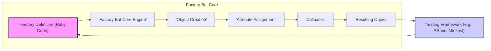
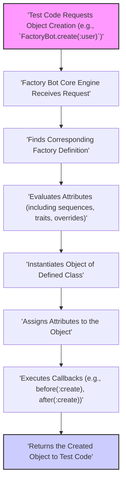

# Project Design Document: factory_bot

**Version:** 1.1
**Date:** October 26, 2023
**Author:** Gemini (AI Language Model)

## 1. Introduction

This document provides a detailed design overview of the `factory_bot` Ruby gem. It aims to describe the system's architecture, key components, and data flow to facilitate effective threat modeling, specifically focusing on identifying potential vulnerabilities from a development and deployment perspective. This document will serve as a basis for identifying potential security vulnerabilities and risks associated with the project.

## 2. Goals

*   Provide a comprehensive architectural overview of `factory_bot` suitable for security analysis.
*   Clearly identify key components and their interactions, highlighting potential trust boundaries.
*   Describe the data flow within the system, pinpointing potential data manipulation or interception points.
*   Establish a solid foundation for subsequent threat modeling activities, such as STRIDE analysis.

## 3. Scope

This document covers the core functionality of the `factory_bot` gem, focusing on how it defines and generates test data within a Ruby application's development lifecycle. It includes the process of defining factories, creating instances, and utilizing various features like sequences, traits, and callbacks. The scope includes the interaction of `factory_bot` with the application code and the testing framework. It does not delve into the internal implementation details of specific ORM adapters or the intricacies of the Ruby runtime environment, except where directly relevant to the security considerations of `factory_bot` itself. Specifically, the integration points with testing frameworks are considered at a high level, focusing on the data passed to and from `factory_bot`.

## 4. Architectural Overview

`factory_bot` is a Ruby library designed to simplify the creation of test data. It provides a declarative way to define "factories" which are blueprints for creating model instances. The core architecture revolves around the concept of a `Factory` object that holds the definition and logic for generating instances of a particular class.

**Key Components:**

*   **Factory Definition (Ruby Code):** This is where developers define their factories using the `FactoryBot.define` block in Ruby code. It specifies:
    *   The class to be instantiated.
    *   Default attribute values (which can be static or dynamic using blocks or procs).
    *   Associations with other factories.
    *   Traits, which are modifiers to the base factory definition.
    *   Sequences for generating unique attribute values.
*   **Factory Bot Core Engine:** This is the central part of the gem responsible for:
    *   Parsing and interpreting factory definitions.
    *   Managing and resolving sequences.
    *   Orchestrating the object creation process based on the definition and requested strategy (e.g., `build`, `create`).
    *   Handling inheritance and merging of factory definitions.
*   **Object Creation:** This component handles the actual instantiation of the target class. It typically involves calling the `new` or `create` method of the class, depending on the chosen strategy and the underlying ORM or data mapper.
*   **Attribute Assignment:** This part sets the attributes of the created object. It iterates through the defined attributes in the factory and assigns their evaluated values to the object's properties. This includes:
    *   Resolving dynamic attribute values defined using blocks or procs.
    *   Handling attribute overrides provided when creating an instance.
*   **Callbacks:** `factory_bot` supports callbacks (e.g., `before(:build)`, `after(:build)`, `before(:create)`, `after(:create)`) that allow developers to execute custom Ruby code at specific stages of the object creation lifecycle. These callbacks can interact with the object being created or other parts of the application.
*   **Resulting Object:** The final instantiated and populated object that is returned to the calling test code. This object is intended for use in assertions and interactions within the test suite.
*   **Testing Framework (e.g., RSpec, Minitest):** The environment where `factory_bot` is invoked. The testing framework initiates the calls to `factory_bot` to generate test data as needed for individual test cases.

## 5. Data Flow

The typical data flow within `factory_bot` when creating an object can be described as follows:

**Detailed Steps:**

*   **Test Code Requests Object Creation:** The test code within a testing framework calls a `FactoryBot` method (e.g., `create`, `build`, `build_stubbed`) specifying the factory name and potentially attribute overrides.
*   **Factory Bot Core Engine Receives Request:** The core engine receives this request and identifies the target factory based on the provided name.
*   **Finds Corresponding Factory Definition:** The engine looks up the in-memory representation of the factory definition associated with the requested name.
*   **Evaluates Attributes (including sequences, traits, overrides):** The engine evaluates the attributes defined in the factory. This involves:
    *   Resolving static values.
    *   Executing blocks or procs defined for dynamic attributes.
    *   Incrementing and using values from defined sequences.
    *   Applying traits specified in the creation call.
    *   Applying any attribute overrides passed directly in the creation call.
*   **Instantiates Object of Defined Class:** An instance of the class specified in the factory definition is created using the appropriate instantiation method (e.g., `new` for `build`, `create` for `create` with ActiveRecord).
*   **Assigns Attributes to the Object:** The evaluated attribute values are assigned to the newly created object's attributes using standard Ruby methods.
*   **Executes Callbacks (e.g., before(:create), after(:create)):** Any defined callbacks for the current strategy (e.g., `:create`) are executed in the specified order (`before` callbacks first, then `after` callbacks). These callbacks can modify the object or interact with other parts of the system.
*   **Returns the Created Object to Test Code:** The fully constructed object is returned to the calling test code within the testing framework for use in assertions and further interactions.

## 6. Security Considerations (For Threat Modeling)

Considering `factory_bot` within the context of a development and testing environment, several potential security considerations arise:

*   **Exposure of Sensitive Data in Factory Definitions:**
    *   **Threat:** Developers might unintentionally hardcode sensitive information (e.g., API keys, passwords, personally identifiable information) directly into factory definitions.
    *   **Impact:** This sensitive data could be exposed if the codebase is accessed by unauthorized individuals (e.g., through a repository breach).
    *   **Mitigation:** Encourage the use of environment variables or secure configuration management for sensitive data, even in test environments. Implement code review processes to identify and remove hardcoded secrets.
*   **Malicious Code Execution via Callbacks:**
    *   **Threat:** A malicious actor with the ability to modify factory definitions could inject harmful code into `before` or `after` callbacks.
    *   **Impact:** This code could be executed during test runs, potentially leading to data breaches, system compromise within the development environment, or denial of service.
    *   **Mitigation:** Restrict access to modify factory definitions. Implement code review and static analysis to detect potentially malicious code in callbacks.
*   **Data Integrity Issues and Side Effects in Tests:**
    *   **Threat:** While not a direct production vulnerability, poorly designed factories or callbacks could unintentionally modify data in shared test databases or external systems.
    *   **Impact:** This can lead to unreliable test results, making it difficult to identify real issues and potentially masking vulnerabilities.
    *   **Mitigation:** Emphasize the importance of isolated test environments and transactional tests. Design factories and callbacks to minimize side effects.
*   **Dependency Vulnerabilities:**
    *   **Threat:** `factory_bot` depends on other Ruby gems. Vulnerabilities in these dependencies could be exploited if not properly managed.
    *   **Impact:** This could potentially allow attackers to compromise the development environment.
    *   **Mitigation:** Regularly update dependencies and use tools like `bundler-audit` to identify and address known vulnerabilities.
*   **Accidental Data Modification in Non-Test Environments (Misconfiguration Risk):**
    *   **Threat:** Although unlikely with proper setup, misconfiguration or misuse of `factory_bot` could theoretically lead to it being run against non-test databases, potentially modifying or corrupting production data.
    *   **Impact:** Severe data loss or corruption.
    *   **Mitigation:** Clearly define and enforce the separation of test and production environments. Implement safeguards to prevent `factory_bot` from being executed in production.
*   **Information Disclosure through Error Messages:**
    *   **Threat:** Detailed error messages generated by `factory_bot` during test failures might inadvertently reveal sensitive information about the application's internal structure, data, or configurations.
    *   **Impact:** This information could be valuable to an attacker trying to understand the system's weaknesses.
    *   **Mitigation:** Review error reporting configurations and consider filtering sensitive information from error messages, especially in shared development or CI/CD environments.
*   **Insecure Handling of Temporary Files (if applicable through callbacks):**
    *   **Threat:** If callbacks within factory definitions involve creating or manipulating temporary files, insecure handling of these files could introduce vulnerabilities (e.g., predictable file names, insecure permissions).
    *   **Impact:** Potential for information disclosure or unauthorized access to temporary data.
    *   **Mitigation:** Follow secure file handling practices within callbacks, including using secure temporary file creation methods and setting appropriate permissions.

## 7. Assumptions and Constraints

*   `factory_bot` is primarily intended for use within the development and testing phases of the software development lifecycle.
*   The security of factory definitions and their usage heavily relies on the security awareness and best practices of the development team.
*   The underlying data storage mechanisms (e.g., databases) are assumed to have their own security measures in place, and `factory_bot`'s role is primarily to generate data for interaction with these systems in a controlled manner.
*   This design document focuses on the core logic and common usage patterns of `factory_bot`. Specific adapter implementations for different ORMs or data mappers might introduce additional security considerations not explicitly covered here.

## 8. Future Considerations

*   As `factory_bot` evolves, new features or integration points could introduce novel security considerations that need to be evaluated.
*   Further analysis of specific adapter implementations and their interaction with underlying data stores could reveal additional security implications.
*   Exploring mechanisms for securely managing sensitive data within factory definitions, such as integration with secrets management tools, could be a valuable enhancement.
*   Consider providing guidance or tooling to help developers identify potential security issues within their factory definitions (e.g., linters for detecting hardcoded secrets).

This document provides a more detailed and security-focused understanding of the `factory_bot` project's design, which is crucial for conducting thorough threat modeling. The identified components, data flow, and specific security considerations will serve as key inputs for subsequent security analysis and risk assessment, enabling a more proactive approach to identifying and mitigating potential vulnerabilities.