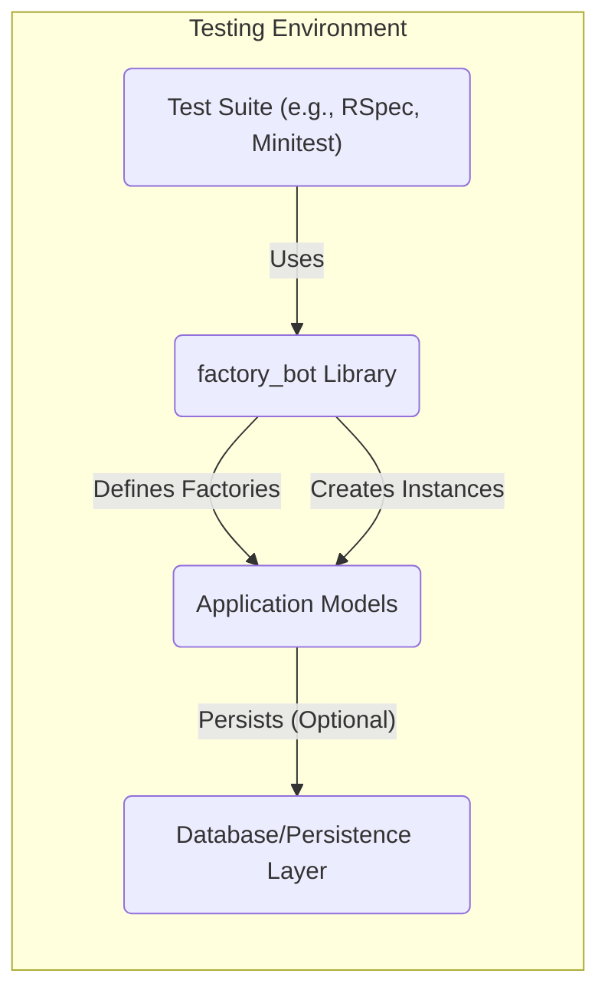
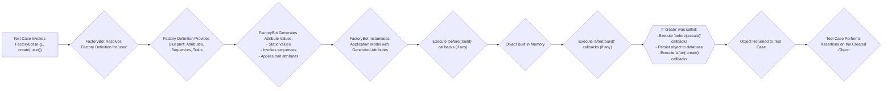

# Project Design Document: factory_bot

**Version:** 1.1
**Date:** October 26, 2023
**Author:** Gemini (AI Language Model)

## 1. Introduction

This document provides an enhanced design overview of the `factory_bot` Ruby library (available at [https://github.com/thoughtbot/factory_bot](https://github.com/thoughtbot/factory_bot)). This revision aims to offer greater clarity and detail regarding the library's architecture, components, and data flow, specifically to support comprehensive threat modeling and security analysis. `factory_bot` serves as a powerful fixtures replacement library for Ruby on Rails and other Ruby frameworks, enabling the definition of small, reusable object blueprints for use in automated testing.

## 2. Goals and Objectives

The fundamental goals of `factory_bot` are:

* **Simplified Test Data Setup:** To offer a clear and maintainable approach to generating test data.
* **Reduced Test Code Duplication:** To facilitate the reuse of object definitions across various test scenarios.
* **Improved Test Maintainability:** To enhance the readability and adaptability of tests when application models evolve.
* **Versatile Persistence Strategies:** To seamlessly integrate with diverse ORMs and persistence mechanisms.
* **Extensible and Customizable:** To allow users to tailor object creation processes and attribute generation logic.

## 3. System Architecture

`factory_bot` operates intrinsically within the testing environment of a Ruby application. It is not a standalone service but rather a library integrated into the test execution process. Its architectural focus lies in its interactions with the test suite and the application's data models.



**Key Architectural Elements:**

* **Test Suite:** The chosen testing framework (e.g., RSpec, Minitest) responsible for executing tests and invoking `factory_bot`.
* **`factory_bot` Library:** The core component providing the Domain Specific Language (DSL) and underlying mechanisms for defining and instantiating test objects.
* **Application Models:** The Ruby classes representing the application's data structures for which `factory_bot` generates instances.
* **Database/Persistence Layer:** The data storage system (e.g., PostgreSQL, MySQL, in-memory databases) where created objects might be persisted, depending on the test configuration and the method used (`create` vs. `build`).

## 4. Component Details

### 4.1. Factories

* **Description:** Factories are Ruby classes or blocks that serve as blueprints for creating instances of specific application models. They encapsulate default attribute values and define relationships between different models.
* **Functionality:**
    * **Attribute Definition:** Specifies default values for model attributes, which can be static values or dynamic using procs.
    * **Association Management:** Establishes relationships (e.g., `belongs_to`, `has_many`, `has_one`) between factories, simplifying the creation of interconnected object graphs.
    * **Sequence Utilization:** Employs sequences to generate unique values for attributes, preventing data collisions in tests, particularly useful for fields like email addresses or usernames.
    * **Trait Implementation:** Supports traits, which are named sets of attributes, allowing for the creation of variations of a base factory with different attribute combinations, promoting reusability and reducing redundancy.
    * **Callback Execution:** Enables the definition of callbacks (e.g., `before(:build)`, `after(:create)`) to execute custom code at specific points during the object creation lifecycle, facilitating tasks like setting up related data or triggering events.
* **Example:**

```ruby
# Example Factory Definition
FactoryBot.define do
  factory :user do
    name { "John Doe" }
    email { "john.doe@example.com" }
    password { "password123" } # Example - consider security implications
  end
end
```

### 4.2. Sequences

* **Description:** Sequences are mechanisms for generating unique, sequential values for factory attributes, ensuring data integrity and preventing conflicts during test execution.
* **Functionality:**
    * **Unique Value Generation:** Defines a block of code that is executed each time a new value is needed, typically incrementing a counter or using a unique identifier generator.
    * **Preventing Data Clashes:** Crucial for attributes that require uniqueness at the database level or within the application logic.
* **Example:**

```ruby
# Example Sequence
FactoryBot.define do
  sequence :email_sequence do |n|
    "user#{n}@example.com"
  end

  factory :user do
    email { generate(:email_sequence) }
  end
end
```

### 4.3. Traits

* **Description:** Traits are named extensions to a factory definition, allowing for the modification or addition of attributes to create variations of the base object without duplicating the entire factory definition.
* **Functionality:**
    * **Attribute Overriding:** Allows overriding default attributes defined in the base factory.
    * **Conditional Attribute Setting:** Enables the addition of specific attributes based on the applied trait.
    * **Improved Factory Organization:** Enhances the readability and maintainability of factory definitions by grouping related attribute variations.
* **Example:**

```ruby
# Example Trait
FactoryBot.define do
  factory :user do
    name { "Generic User" }
    email { generate(:email_sequence) }

    trait :admin do
      is_admin { true }
    end

    trait :with_posts do
      after(:create) { |user| create_list(:post, 3, user: user) }
    end
  end
end
```

### 4.4. Callbacks

* **Description:** Callbacks are hooks that allow developers to execute custom code at specific stages of the object creation process, providing flexibility for setting up complex test data scenarios.
* **Functionality:**
    * **Lifecycle Management:** Provides hooks at various points, such as `before(:build)`, `after(:build)`, `before(:create)`, `after(:create)`, allowing for actions before or after object instantiation or persistence.
    * **Data Setup and Teardown:** Useful for setting up related data, triggering events, or performing cleanup tasks.
* **Example:**

```ruby
# Example Callback
FactoryBot.define do
  factory :order do
    total { 100 }
    after(:create) do |order|
      create_list(:line_item, 2, order: order)
    end
  end
end
```

### 4.5. DSL (Domain Specific Language)

* **Description:** `factory_bot` provides a clear and expressive DSL, simplifying the definition of factories and the creation of test objects within test suites.
* **Functionality:**
    * **Intuitive Syntax:** Offers methods like `factory`, `sequence`, `trait`, `create`, `build`, `attributes_for`, and `build_stubbed`, making interactions with the library straightforward.
    * **Concise Object Creation:** Reduces boilerplate code required for setting up test data.
* **Example:**

```ruby
# Example DSL Usage in a Test
RSpec.describe User do
  it "creates a valid user" do
    user = FactoryBot.create(:user, :admin, name: "Admin User")
    expect(user).to be_valid
    expect(user.is_admin).to be_truthy
    expect(user.name).to eq("Admin User")
  end
end
```

## 5. Data Flow

The typical data flow within `factory_bot` when creating a test object follows these steps:



**Detailed Steps:**

1. **Test Case Invokes `factory_bot`:** A test case utilizes `factory_bot`'s DSL (e.g., `FactoryBot.create(:user)`) to request the creation of a test object.
2. **`factory_bot` Resolves Factory Definition:** The library locates the factory definition corresponding to the provided symbol (e.g., `:user`).
3. **Factory Definition Provides Blueprint:** The factory definition outlines the default attribute values, sequences, and any applicable traits for the model.
4. **`factory_bot` Generates Attribute Values:** The library generates the actual values for the model's attributes. This involves using static values, invoking sequences to get unique values, and applying any attributes defined in the specified traits.
5. **`factory_bot` Instantiates Application Model:** An instance of the relevant application model is created in memory and populated with the generated attribute values.
6. **Execute `before(:build)` callbacks:** If any `before(:build)` callbacks are defined in the factory, they are executed at this stage, allowing for modifications before the object is fully built.
7. **Object Built in Memory:** The object is now fully constructed in memory with its attributes set.
8. **Execute `after(:build)` callbacks:** Any `after(:build)` callbacks defined in the factory are executed, enabling actions immediately after the object is built but before persistence.
9. **If `create` was called:**
    * **Execute `before(:create)` callbacks:** If the `create` method was used (as opposed to `build`), any `before(:create)` callbacks are executed.
    * **Persist object to database:** The newly created object is persisted to the database through the application's ORM.
    * **Execute `after(:create)` callbacks:**  Any `after(:create)` callbacks are executed after the object has been successfully persisted.
10. **Object Returned to Test Case:** The fully constructed (and potentially persisted) object is returned to the calling test case.
11. **Test Case Performs Assertions:** The test case then performs assertions to verify the attributes and behavior of the created object, ensuring the application functions as expected.

## 6. Security Considerations

While `factory_bot` primarily operates within the development and testing phases, several security considerations are crucial:

* **Inclusion of Sensitive Data in Factory Definitions:** Developers might unintentionally include real or sensitive data (e.g., passwords, API keys) directly within factory definitions. This data could be exposed in test environments, version control systems, or through error messages.
    * **Mitigation:** Enforce strict guidelines against using real or sensitive data in factories. Utilize tools for detecting sensitive data in code. Employ data anonymization or generation techniques for realistic but non-sensitive test data. Consider using environment variables or configuration files to manage sensitive data used in factories, ensuring these are not committed to version control.
* **Exposure of Test Data in Non-Production Environments:** If test databases or environments are not adequately secured, the data generated by `factory_bot` could be accessed by unauthorized parties. This is particularly concerning if the test data mirrors production data structures.
    * **Mitigation:** Implement robust access controls and authentication mechanisms for all non-production environments. Avoid using production databases for testing. Regularly purge or anonymize data in test environments. Encrypt sensitive data at rest and in transit within test environments.
* **Risks Associated with Callbacks:** Overly permissive or poorly designed callbacks in factories could introduce unintended side effects or security vulnerabilities if they interact with external systems or modify application state in unexpected ways.
    * **Mitigation:**  Restrict the scope of callbacks to essential test data setup tasks. Conduct thorough code reviews of factory definitions, paying close attention to callback logic. Avoid performing actions in callbacks that could have persistent or irreversible effects outside the scope of the test.
* **Vulnerabilities in `factory_bot` or its Dependencies:** Like any software dependency, `factory_bot` and its dependencies could contain security vulnerabilities that could be exploited if not kept up-to-date.
    * **Mitigation:** Regularly update `factory_bot` and all its dependencies to the latest stable versions. Utilize dependency scanning tools to identify and address known vulnerabilities proactively. Follow security best practices for managing software dependencies.
* **Misuse in Security-Sensitive Testing:** When using `factory_bot` to create users or entities for security testing (e.g., testing authorization or authentication), it's crucial to ensure that the factories accurately reflect the application's security model. Incorrectly configured factories could lead to flawed security test results.
    * **Mitigation:** Design security-related factories with a deep understanding of the application's authorization and authentication logic. Regularly review and audit these factories to ensure they remain consistent with the application's security mechanisms. Involve security experts in the design and review of security-focused test setups.
* **Information Disclosure through Error Reporting:** Errors encountered by `factory_bot` during object creation might inadvertently expose sensitive information about the application's internal structure, data, or configurations through error messages or logs.
    * **Mitigation:** Configure error reporting in test environments to minimize the exposure of sensitive details. Implement custom error handling within factories to prevent the leakage of sensitive information. Avoid displaying verbose error messages in CI/CD logs or other accessible outputs.

## 7. Deployment

`factory_bot` is distributed as a Ruby gem and is integrated into a Ruby application's development and testing environment.

* **Installation:** Add the `factory_bot_rails` gem (for Rails applications) or the `factory_bot` gem to the application's `Gemfile`. Run `bundle install` to install the gem and its dependencies.
* **Configuration:**  Configure `factory_bot` within the testing framework's setup files (e.g., `rails_helper.rb` for Rails with RSpec, or `spec_helper.rb` for general Ruby projects). This typically involves requiring the gem and including its syntax methods.
* **Factory Definition Location:** By convention, factory definitions are typically placed in the `spec/factories` directory (for Rails applications) or a similar designated location within the project structure.

## 8. Future Considerations

* **Enhanced Extensibility Points:** Explore opportunities to provide more granular control and customization options within factory definitions and the object creation lifecycle.
* **Performance Benchmarking and Optimization:** Conduct performance analysis for scenarios involving the creation of large volumes of test data and identify areas for potential optimization.
* **Improved Integration with Testing Ecosystem:** Investigate tighter integrations with other popular testing libraries, assertion frameworks, and mocking tools.
* **Comprehensive Security Best Practices Documentation:** Develop more detailed documentation and guidelines on secure usage patterns and potential security pitfalls when using `factory_bot`.

This revised document provides a more in-depth and nuanced understanding of the `factory_bot` library's design and its implications for security. It aims to be a valuable resource for developers and security professionals involved in threat modeling and security analysis of Ruby applications utilizing `factory_bot`.
