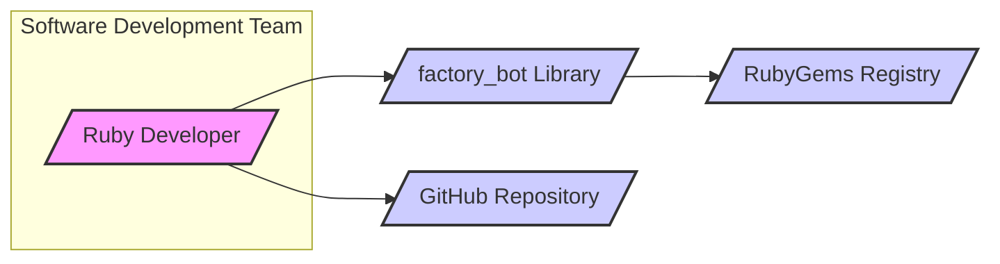
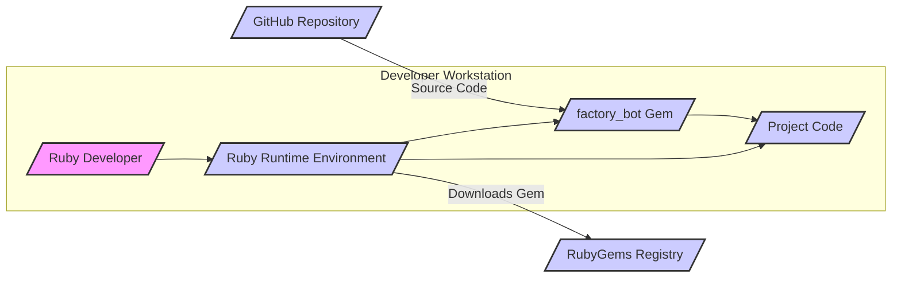
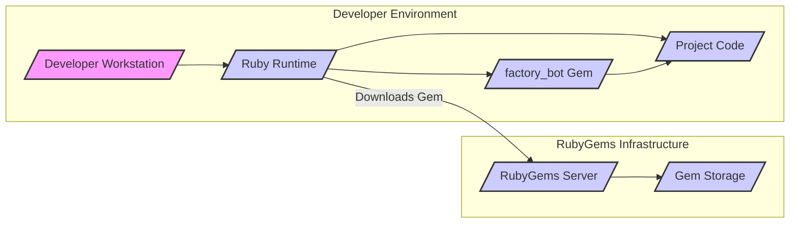

# BUSINESS POSTURE

This project, `factory_bot`, is a Ruby library designed to simplify and streamline the creation of test data within software development projects, particularly those using Ruby on Rails or similar frameworks. The primary business priority it addresses is to enhance developer productivity and improve the quality and maintainability of automated tests. By providing a clean and efficient way to define and generate test data, `factory_bot` helps developers write more robust and reliable tests, leading to higher quality software and faster development cycles.

The main business goal is to reduce the time and effort spent on setting up test environments and creating realistic test data. This directly contributes to faster feature delivery and reduced development costs.  A secondary goal is to improve the consistency and readability of test code, making it easier for developers to understand and maintain tests over time.

The most important business risks associated with `factory_bot` are:

- Risk of reduced developer productivity if the library is unreliable, buggy, or difficult to use.
- Risk of decreased software quality if tests are not comprehensive or realistic due to difficulties in data setup.
- Risk of increased maintenance costs if test code becomes complex and hard to understand due to poor data setup practices.
- Indirect security risk: If vulnerabilities are introduced into applications due to inadequate testing practices stemming from difficulties in test data setup, or if `factory_bot` itself has vulnerabilities that are exploited in development environments.

# SECURITY POSTURE

## Existing Security Controls

- security control: Open source project with public code repository. (Location: GitHub repository)
- security control: Community review and contributions. (Location: GitHub pull requests, issues)
- security control: Usage of standard RubyGems package management ecosystem. (Location: Gemfile, gemspec)
- security control: Automated testing as part of development process. (Location: GitHub Actions workflows, test suite)

## Accepted Risks

- accepted risk: Reliance on community for security vulnerability identification and patching.
- accepted risk: Potential vulnerabilities in dependencies managed by RubyGems.
- accepted risk: Security of developer workstations and CI/CD environments where the library is used is assumed to be managed separately.

## Recommended Security Controls

- security control: Implement automated dependency scanning to identify known vulnerabilities in `factory_bot`'s dependencies.
- security control: Integrate static analysis security testing (SAST) tools into the CI/CD pipeline to scan the `factory_bot` codebase for potential security flaws.
- security control: Regularly review and update dependencies to incorporate security patches.
- security control: Encourage and facilitate security vulnerability reporting through a clear process.

## Security Requirements

- Authentication: Not directly applicable to `factory_bot` library itself. Authentication is relevant for accessing the GitHub repository and RubyGems registry where the library is hosted and distributed.
- Authorization: Not directly applicable to `factory_bot` library itself. Authorization is relevant for controlling access to the GitHub repository and RubyGems registry.
- Input Validation: While `factory_bot` primarily generates data based on predefined factories, input validation is relevant in the context of factory definitions. If factory definitions are dynamically generated or accept external input, proper validation should be applied to prevent unexpected behavior or potential vulnerabilities.
- Cryptography: Cryptography is not a core requirement for `factory_bot` itself. However, if `factory_bot` is used to generate data for testing cryptographic functionalities in applications, it should be capable of handling and generating data relevant to cryptographic operations without introducing weaknesses.

# DESIGN

## C4 CONTEXT



### Context Diagram Elements

- Name: Ruby Developer
  - Type: Person
  - Description: Software developers who use the `factory_bot` library to create test data for their Ruby projects.
  - Responsibilities: Writing and maintaining automated tests, using `factory_bot` to define and generate test data, integrating `factory_bot` into their development workflow.
  - Security controls: Secure coding practices, secure development environment, access control to development tools and resources.

- Name: factory_bot Library
  - Type: Software System
  - Description: A Ruby library for creating test data. It provides a framework for defining factories that represent data models and generating instances of these models for use in tests.
  - Responsibilities: Providing a DSL for defining factories, generating data based on factory definitions, simplifying test data setup, being a dependency for Ruby projects.
  - Security controls: Input validation in factory definitions (if applicable), dependency management, secure coding practices during development, automated testing, vulnerability scanning.

- Name: RubyGems Registry
  - Type: Software System
  - Description: A public repository for Ruby libraries (gems). `factory_bot` is published and distributed through RubyGems.
  - Responsibilities: Hosting and distributing Ruby gems, providing access to gem packages, managing gem versions and dependencies.
  - Security controls: Access control, vulnerability scanning of hosted gems, secure infrastructure, package integrity verification.

- Name: GitHub Repository
  - Type: Software System
  - Description: The source code repository for `factory_bot` hosted on GitHub. It is used for version control, collaboration, issue tracking, and releases.
  - Responsibilities: Hosting the source code, managing contributions, tracking issues and bugs, facilitating collaboration, providing version control.
  - Security controls: Access control, code review process, branch protection, vulnerability scanning, security audits of GitHub platform.

## C4 CONTAINER



### Container Diagram Elements

- Name: Ruby Developer
  - Type: Person
  - Description: Software developers who use `factory_bot` on their local workstations.
  - Responsibilities: Developing and running tests, using `factory_bot` in their Ruby projects, managing their development environment.
  - Security controls: Secure workstation configuration, access control, secure coding practices.

- Name: Ruby Runtime Environment
  - Type: Container
  - Description: The Ruby interpreter and associated libraries installed on the developer's workstation. It executes the project code and the `factory_bot` library.
  - Responsibilities: Executing Ruby code, providing necessary libraries and dependencies, managing the runtime environment.
  - Security controls: Keeping Ruby runtime updated with security patches, secure configuration of the runtime environment.

- Name: factory_bot Gem
  - Type: Container
  - Description: The packaged `factory_bot` library installed as a Ruby gem. It is downloaded from RubyGems and used by the project code.
  - Responsibilities: Providing the `factory_bot` functionality to the project, being a dependency managed by RubyGems/Bundler.
  - Security controls: Dependency scanning, vulnerability monitoring of gem dependencies, integrity verification of downloaded gem.

- Name: Project Code
  - Type: Container
  - Description: The Ruby project code that utilizes `factory_bot` for testing. This includes application code and test suites.
  - Responsibilities: Implementing application logic, defining and running tests, using `factory_bot` to generate test data.
  - Security controls: Secure coding practices, input validation in application code, secure test data handling.

- Name: RubyGems Registry
  - Type: External Container
  - Description: The external RubyGems package registry from where the `factory_bot` gem is downloaded.
  - Responsibilities: Hosting and distributing Ruby gems, providing access to gem packages.
  - Security controls: Access control, vulnerability scanning of hosted gems, secure infrastructure.

- Name: GitHub Repository
  - Type: External Container
  - Description: The external GitHub repository hosting the source code of `factory_bot`.
  - Responsibilities: Hosting the source code, managing contributions, version control.
  - Security controls: Access control, code review process, branch protection.

## DEPLOYMENT

For `factory_bot`, deployment primarily refers to its distribution as a Ruby gem and its usage within developer environments and CI/CD pipelines. A typical deployment scenario involves developers downloading the gem from RubyGems and incorporating it into their projects.



### Deployment Diagram Elements

- Name: Developer Workstation
  - Type: Infrastructure Node
  - Description: The local computer used by a software developer.
  - Responsibilities: Running development tools, executing code, hosting the development environment.
  - Security controls: Workstation security policies, endpoint protection, access control, software updates.

- Name: Ruby Runtime
  - Type: Software
  - Description: The Ruby interpreter and libraries installed on the developer workstation.
  - Responsibilities: Executing Ruby code, providing the runtime environment for `factory_bot` and project code.
  - Security controls: Keeping Ruby runtime updated, secure configuration.

- Name: factory_bot Gem
  - Type: Software
  - Description: The `factory_bot` library installed as a Ruby gem on the developer workstation.
  - Responsibilities: Providing test data generation functionality.
  - Security controls: Gem integrity verification during download, dependency scanning.

- Name: Project Code
  - Type: Software
  - Description: The Ruby project code that uses `factory_bot`.
  - Responsibilities: Implementing application logic and tests.
  - Security controls: Secure coding practices, code review.

- Name: RubyGems Server
  - Type: Infrastructure Node
  - Description: Server infrastructure hosting the RubyGems registry.
  - Responsibilities: Serving gem packages, managing gem metadata.
  - Security controls: Server hardening, access control, intrusion detection, regular security audits.

- Name: Gem Storage
  - Type: Infrastructure Node
  - Description: Storage system where gem packages are physically stored.
  - Responsibilities: Storing gem files, ensuring data integrity and availability.
  - Security controls: Data encryption at rest, access control, backup and recovery.

## BUILD

The build process for `factory_bot` involves steps to ensure code quality, run tests, and package the library for distribution. A typical build process might use GitHub Actions for CI/CD.

```mermaid
flowchart LR
    A[/"Developer"/] --> B("Git Commit");
    B --> C[/"GitHub Repository"/];
    C --> D{/"GitHub Actions Workflow"/};
    D -- "Run Tests, Linters, SAST" --> E[/"Build Artifacts (Gem)"/];
    E --> F[/"RubyGems Registry"/];
    style A fill:#f9f,stroke:#333,stroke-width:2px
    style B fill:#ccf,stroke:#333,stroke-width:2px
    style C fill:#ccf,stroke:#333,stroke-width:2px
    style D fill:#ccf,stroke:#333,stroke-width:2px
    style E fill:#ccf,stroke:#333,stroke-width:2px
    style F fill:#ccf,stroke:#333,stroke-width:2px
```

### Build Diagram Elements

- Name: Developer
  - Type: Person
  - Description: A developer contributing to the `factory_bot` project.
  - Responsibilities: Writing code, committing changes, initiating the build process through code commits.
  - Security controls: Secure coding practices, code review, access control to repository.

- Name: Git Commit
  - Type: Process
  - Description: The action of committing code changes to the Git repository.
  - Responsibilities: Version control, tracking changes, triggering the CI/CD pipeline.
  - Security controls: Commit signing, branch protection.

- Name: GitHub Repository
  - Type: System
  - Description: The GitHub repository hosting the `factory_bot` source code.
  - Responsibilities: Storing code, triggering workflows, managing versions.
  - Security controls: Access control, branch protection, audit logs.

- Name: GitHub Actions Workflow
  - Type: System
  - Description: The automated CI/CD pipeline defined in GitHub Actions.
  - Responsibilities: Automating build, test, and release processes, running security checks.
  - Security controls: Secure workflow definition, secret management, access control to workflow configuration, SAST integration, dependency scanning.

- Name: Build Artifacts (Gem)
  - Type: Data
  - Description: The packaged `factory_bot` gem produced by the build process.
  - Responsibilities: Distributable package of the library.
  - Security controls: Integrity checks, signing of artifacts (if applicable).

- Name: RubyGems Registry
  - Type: System
  - Description: The RubyGems registry where the built gem is published.
  - Responsibilities: Hosting and distributing the gem.
  - Security controls: Secure gem upload process, vulnerability scanning, access control.

# RISK ASSESSMENT

## Critical Business Processes

The critical business process being supported by `factory_bot` is **software development and testing**.  Ensuring efficient and reliable test data creation directly impacts the speed and quality of software development.  Indirectly, it supports the process of delivering functional and secure software applications.

## Data Sensitivity

The data primarily associated with `factory_bot` is the **source code of the library itself** and potentially **test data definitions (factories)** created by users.

- Source code of `factory_bot`: Publicly available on GitHub. Sensitivity is low in terms of confidentiality, but integrity and availability are important. Tampering with the source code could lead to supply chain attacks or introduce vulnerabilities.
- Test data definitions (factories):  Typically part of the application's codebase and might contain sensitive information depending on the application being tested. However, the sensitivity from `factory_bot`'s perspective is low as it merely facilitates the creation of this data. The sensitivity is determined by the application using `factory_bot`.

# QUESTIONS & ASSUMPTIONS

## Questions

- Are there any specific security concerns related to `factory_bot`'s usage in a particular environment (e.g., enterprise, regulated industry)?
- Are there any specific compliance requirements that need to be considered for the development or distribution of `factory_bot`?
- Are there any known past security vulnerabilities or incidents related to `factory_bot` or similar libraries that should be taken into account?

## Assumptions

- It is assumed that `factory_bot` is primarily used in development and testing environments and not directly deployed into production systems.
- It is assumed that developers using `factory_bot` are responsible for the security of their own development environments and the applications they are testing.
- It is assumed that standard Ruby development practices and security measures are in place for the development and maintenance of `factory_bot`.
- It is assumed that the primary distribution channel for `factory_bot` is RubyGems, and the security of RubyGems infrastructure is managed by the RubyGems team.