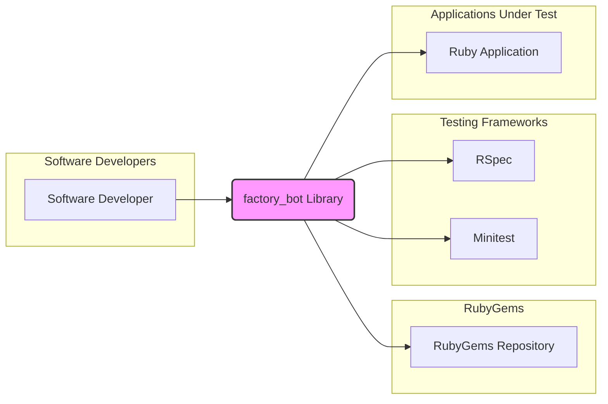
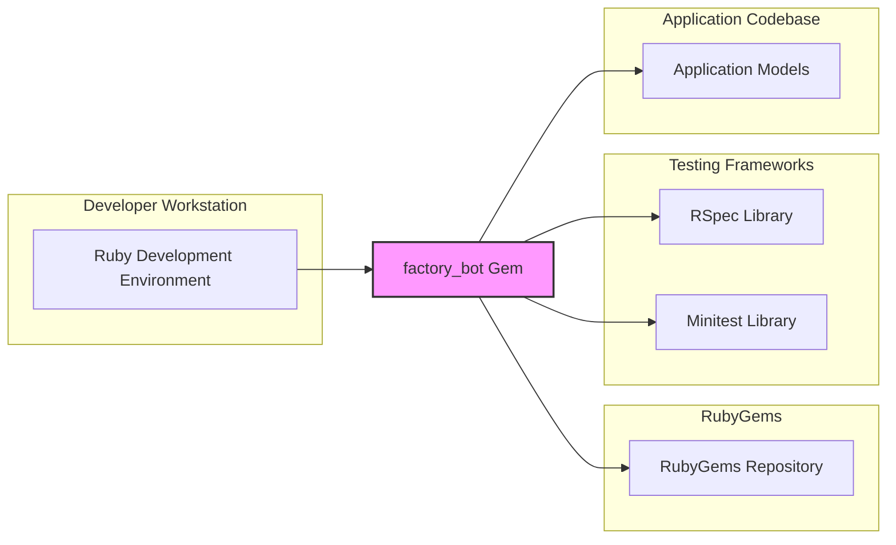
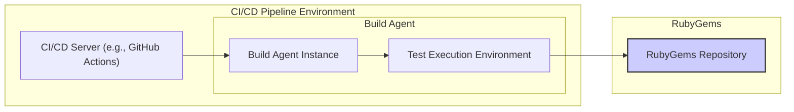

# BUSINESS POSTURE

This project, represented by the GitHub repository `thoughtbot/factory_bot`, provides a Ruby library for creating test data. The primary business goal it addresses is to improve the efficiency and maintainability of software testing processes for Ruby developers. By providing a structured and reusable way to define test data, `factory_bot` aims to reduce the time and effort spent on writing and maintaining tests, ultimately contributing to faster development cycles and improved software quality.

The most important business risks associated with this project are:

*   Risk of vulnerabilities in the `factory_bot` library itself. If vulnerabilities are present, they could be exploited by malicious actors to compromise the security of applications that depend on this library for testing. While `factory_bot` is primarily used in testing environments, vulnerabilities could still lead to denial of service, information disclosure, or other security issues during development and testing phases, potentially delaying releases or introducing flawed code into production.
*   Risk of supply chain compromise. As a dependency in Ruby projects, `factory_bot` introduces a supply chain risk. If the library is compromised at its source (e.g., GitHub repository, RubyGems package), malicious code could be injected and propagated to all projects using it. This could lead to widespread security breaches in dependent applications.
*   Risk of reduced developer productivity if the library is unreliable or poorly maintained. While the goal is to improve productivity, issues with the library, such as bugs or lack of updates, could hinder developer workflows and increase test maintenance overhead, negating the intended benefits.

# SECURITY POSTURE

Existing security controls for the `factory_bot` project include:

*   security control: Public GitHub repository. The project is hosted on GitHub, providing transparency and allowing for community review of the code.
*   security control: GitHub issue tracking. GitHub issues are used for bug reports, feature requests, and potentially vulnerability reports, providing a channel for reporting and addressing security concerns.
*   security control: GitHub pull requests. Code changes are submitted via pull requests, enabling code review and scrutiny by maintainers before changes are merged into the main codebase.
*   security control: RubyGems package management security. The library is distributed via RubyGems, which has its own security measures for package integrity and distribution.

Accepted risks for the `factory_bot` project include:

*   accepted risk: Reliance on community contributions. As an open-source project, `factory_bot` relies on community contributions, which introduces a risk of potentially malicious or low-quality code being submitted. This risk is mitigated by code review processes.
*   accepted risk: Potential for undiscovered vulnerabilities. Like any software project, `factory_bot` may contain undiscovered vulnerabilities. The risk is mitigated by community review, testing, and security best practices in development.

Recommended security controls to implement for the `factory_bot` project:

*   security control: Automated dependency scanning. Implement automated scanning of dependencies used by `factory_bot` to identify and address known vulnerabilities in third-party libraries. This can be integrated into the CI/CD pipeline.
*   security control: Static Application Security Testing (SAST). While less critical for a testing library compared to a production application, SAST tools could be used to analyze the `factory_bot` codebase for potential security flaws or coding weaknesses.
*   security control: Software Composition Analysis (SCA). Use SCA tools to gain visibility into the components of `factory_bot`, including dependencies, licenses, and known vulnerabilities.

Security requirements for the `factory_bot` project:

*   Authentication: Not directly applicable to a library. `factory_bot` itself does not handle user authentication. However, developers using `factory_bot` in their applications must ensure proper authentication in their applications and tests.
*   Authorization: Not directly applicable to a library. `factory_bot` itself does not handle user authorization. However, developers using `factory_bot` in their applications must ensure proper authorization in their applications and tests.
*   Input validation: `factory_bot` should implement robust input validation to prevent unexpected behavior or errors when processing factory definitions and data generation requests. This is important to ensure the library functions reliably and does not introduce vulnerabilities in testing environments. Input validation should be applied to factory definitions, attribute values, and any other user-provided input.
*   Cryptography: Cryptography is not a core requirement for `factory_bot`. However, if `factory_bot` is used in contexts where test data includes sensitive information that needs to be encrypted, developers should ensure they use appropriate cryptographic libraries and practices within their tests, outside of `factory_bot`'s core functionality. `factory_bot` itself should not implement custom cryptography.

# DESIGN

## C4 CONTEXT

Elements of the context diagram:

*   Element:
    *   Name: Software Developer
    *   Type: Person
    *   Description: Developers who write and maintain Ruby applications and use `factory_bot` to create test data for their tests.
    *   Responsibilities: Uses `factory_bot` library to define and generate test data, writes and executes tests for Ruby applications.
    *   Security controls: Responsible for secure coding practices in their applications and tests, including proper handling of sensitive data and secure use of dependencies like `factory_bot`.

*   Element:
    *   Name: factory_bot Library
    *   Type: Software System
    *   Description: A Ruby library that provides a framework for defining and generating test data (factories) for use in automated tests.
    *   Responsibilities: Provides API for defining factories, generating instances of Ruby objects based on factory definitions, simplifying test data setup.
    *   Security controls: Input validation on factory definitions and data generation requests, adherence to secure coding practices in library development, dependency management.

*   Element:
    *   Name: RubyGems Repository
    *   Type: Software System
    *   Description: A public repository for Ruby packages (gems). `factory_bot` library is published and distributed through RubyGems.
    *   Responsibilities: Hosts and distributes Ruby gems, including `factory_bot`, provides package management functionality for Ruby developers.
    *   Security controls: Package signing and verification, vulnerability scanning of hosted gems, infrastructure security for the repository.

*   Element:
    *   Name: RSpec
    *   Type: Software System
    *   Description: A popular testing framework for Ruby. `factory_bot` is often used in conjunction with RSpec for writing expressive and maintainable tests.
    *   Responsibilities: Provides a framework for writing and running tests, integrates with libraries like `factory_bot` for test data management.
    *   Security controls: Security features of the testing framework itself, secure test execution environment.

*   Element:
    *   Name: Minitest
    *   Type: Software System
    *   Description: Another testing framework for Ruby, included in the Ruby standard library. `factory_bot` can also be used with Minitest.
    *   Responsibilities: Provides a framework for writing and running tests, integrates with libraries like `factory_bot` for test data management.
    *   Security controls: Security features of the testing framework itself, secure test execution environment.

*   Element:
    *   Name: Ruby Application
    *   Type: Software System
    *   Description: The Ruby application being tested. `factory_bot` is used to create test data that represents the application's data model for testing purposes.
    *   Responsibilities: Implements the business logic and functionality of the software, relies on tests to ensure quality and correctness.
    *   Security controls: Application-level security controls (authentication, authorization, input validation, etc.), secure deployment and operation.

## C4 CONTAINER

Elements of the container diagram:

*   Element:
    *   Name: factory_bot Gem
    *   Type: Library
    *   Description: The `factory_bot` library packaged as a Ruby gem. It contains the Ruby code that defines the factory DSL and data generation logic.
    *   Responsibilities: Provides the core functionality of `factory_bot`, including factory definition parsing, object instantiation, attribute assignment, and callback execution.
    *   Security controls: Input validation within the gem's code, dependency management, adherence to secure coding practices.

*   Element:
    *   Name: Ruby Development Environment
    *   Type: Development Environment
    *   Description: The developer's local machine or development environment where they write Ruby code, run tests, and use tools like `factory_bot`.
    *   Responsibilities: Provides the environment for developers to use `factory_bot` and develop Ruby applications.
    *   Security controls: Developer workstation security, secure development practices, access controls to development resources.

*   Element:
    *   Name: RubyGems Repository
    *   Type: Package Repository
    *   Description: The remote repository where the `factory_bot` gem is hosted and from which developers download and install it.
    *   Responsibilities: Stores and distributes Ruby gems, including `factory_bot`.
    *   Security controls: Package signing, vulnerability scanning, infrastructure security.

*   Element:
    *   Name: RSpec Library
    *   Type: Library
    *   Description: The RSpec testing framework library, used in conjunction with `factory_bot` in many Ruby projects.
    *   Responsibilities: Provides testing framework features, integrates with `factory_bot` for test setup.
    *   Security controls: Security features of the RSpec library itself.

*   Element:
    *   Name: Minitest Library
    *   Type: Library
    *   Description: The Minitest testing framework library, another option for use with `factory_bot`.
    *   Responsibilities: Provides testing framework features, integrates with `factory_bot` for test setup.
    *   Security controls: Security features of the Minitest library itself.

*   Element:
    *   Name: Application Models
    *   Type: Code Component
    *   Description: Ruby classes representing the data models of the application under test. `factory_bot` creates instances of these models for testing.
    *   Responsibilities: Define the data structure and business logic of the application's data.
    *   Security controls: Application-level security controls applied to the models and the application using them.

## DEPLOYMENT

`factory_bot` itself is not deployed as a standalone application. It is deployed as a library within the development and testing environments of Ruby applications that use it.  A typical deployment scenario is within a developer's local environment and a CI/CD pipeline. Let's focus on the CI/CD pipeline deployment as it's more relevant for security considerations.

Elements of the deployment diagram (CI/CD Pipeline):

*   Element:
    *   Name: CI/CD Server (e.g., GitHub Actions)
    *   Type: Infrastructure
    *   Description: The CI/CD platform that orchestrates the build, test, and deployment processes for Ruby applications. Examples include GitHub Actions, Jenkins, GitLab CI.
    *   Responsibilities: Automates the software delivery pipeline, including running tests that utilize `factory_bot`.
    *   Security controls: Access control to CI/CD configuration, secure pipeline definition, secrets management for credentials, audit logging.

*   Element:
    *   Name: Build Agent Instance
    *   Type: Compute Instance
    *   Description: A virtual machine or container that executes the build and test jobs within the CI/CD pipeline.
    *   Responsibilities: Executes build scripts, runs tests, and performs other tasks defined in the CI/CD pipeline.
    *   Security controls: Hardened operating system, minimal software installed, regular patching, network segmentation, monitoring.

*   Element:
    *   Name: Test Execution Environment
    *   Type: Runtime Environment
    *   Description: The environment within the build agent where tests are executed. This environment includes Ruby runtime, application code, test libraries (including `factory_bot`), and test data.
    *   Responsibilities: Provides the runtime environment for executing automated tests that rely on `factory_bot` for test data setup.
    *   Security controls: Secure configuration of the runtime environment, isolation from other environments, access controls to test data and resources.

*   Element:
    *   Name: RubyGems Repository
    *   Type: Package Repository
    *   Description: The RubyGems repository from which the `factory_bot` gem and other dependencies are downloaded during the build process.
    *   Responsibilities: Provides access to Ruby gems required for building and testing the application.
    *   Security controls: Package signing, vulnerability scanning, secure access protocols (HTTPS).

## BUILD

```mermaid
flowchart LR
    subgraph "Developer Workstation"
        A[Developer]
        B["Code Changes"]
    end
    subgraph "GitHub Repository"
        C[GitHub]
        D["Source Code"]
    end
    subgraph "CI/CD Pipeline (GitHub Actions)"
        E["GitHub Actions Workflow"]
        F["Build Process"]
        G["Test Execution"]
        H["Artifacts (Gem Package)"]
    end
    subgraph "RubyGems Repository"
        I[RubyGems]
        J["Published Gem"]
    end

    A --> B --> C
    C --> D
    D --> E
    E --> F --> G --> H
    H --> I
    I --> J
    style I fill:#ccf,stroke:#333,stroke-width:2px
```

Elements of the build process diagram:

*   Element:
    *   Name: Developer
    *   Type: Person
    *   Description: A software developer who writes code and contributes to the `factory_bot` project.
    *   Responsibilities: Writes code, performs local testing, commits and pushes code changes to the GitHub repository.
    *   Security controls: Secure coding practices, code review participation, workstation security.

*   Element:
    *   Name: Code Changes
    *   Type: Data
    *   Description: Modifications to the source code of `factory_bot` made by developers.
    *   Responsibilities: Represent new features, bug fixes, or security improvements to the library.
    *   Security controls: Code review process via pull requests, version control using Git.

*   Element:
    *   Name: GitHub
    *   Type: Platform
    *   Description: The GitHub platform hosting the `factory_bot` repository, providing version control, issue tracking, and CI/CD capabilities.
    *   Responsibilities: Hosts the source code, manages pull requests, triggers CI/CD workflows.
    *   Security controls: Access control to the repository, authentication and authorization, audit logging, security features of the GitHub platform.

*   Element:
    *   Name: Source Code
    *   Type: Data
    *   Description: The source code of the `factory_bot` library stored in the GitHub repository.
    *   Responsibilities: Contains the complete codebase of the project.
    *   Security controls: Version control, access control via GitHub permissions.

*   Element:
    *   Name: GitHub Actions Workflow
    *   Type: Automation
    *   Description: A CI/CD workflow defined in GitHub Actions that automates the build, test, and publishing process for `factory_bot`.
    *   Responsibilities: Automates the build process, runs tests, performs security checks (if configured), and publishes the gem.
    *   Security controls: Secure workflow definition, secrets management for publishing credentials, access control to workflow configuration.

*   Element:
    *   Name: Build Process
    *   Type: Process
    *   Description: The steps involved in compiling and packaging the `factory_bot` library. This may include running linters, static analysis tools, and building the gem package.
    *   Responsibilities: Transforms source code into build artifacts.
    *   Security controls: Use of secure build environments, dependency scanning, SAST integration (optional), build process hardening.

*   Element:
    *   Name: Test Execution
    *   Type: Process
    *   Description: Automated execution of unit and integration tests for `factory_bot` to ensure code quality and functionality.
    *   Responsibilities: Verifies the correctness and stability of the code.
    *   Security controls: Secure test environment, test isolation, code coverage analysis.

*   Element:
    *   Name: Artifacts (Gem Package)
    *   Type: Data
    *   Description: The packaged Ruby gem file (`.gem`) containing the compiled `factory_bot` library, ready for distribution.
    *   Responsibilities: Deployable unit of the `factory_bot` library.
    *   Security controls: Gem signing, integrity checks, secure storage of build artifacts.

*   Element:
    *   Name: RubyGems
    *   Type: Platform
    *   Description: The RubyGems platform used to host and distribute the `factory_bot` gem.
    *   Responsibilities: Distributes the `factory_bot` gem to Ruby developers.
    *   Security controls: Package signing and verification, vulnerability scanning, infrastructure security.

*   Element:
    *   Name: Published Gem
    *   Type: Data
    *   Description: The publicly available `factory_bot` gem on the RubyGems repository.
    *   Responsibilities: The final distributable artifact of the project.
    *   Security controls: RubyGems platform security controls, gem signing.

# RISK ASSESSMENT

Critical business process we are trying to protect:

*   Software development and testing processes that rely on `factory_bot` to ensure the quality and reliability of Ruby applications.  A compromise of `factory_bot` could lead to unreliable tests, potentially allowing vulnerabilities to slip into production applications.
*   The integrity and availability of the `factory_bot` library itself as a critical dependency for many Ruby projects.

Data we are trying to protect and their sensitivity:

*   Source code of `factory_bot`: Sensitivity is relatively low as it is an open-source project. However, maintaining the integrity of the source code is crucial to prevent supply chain attacks.
*   Build artifacts (gem package): Sensitivity is medium. Ensuring the integrity of the published gem is vital to prevent distribution of compromised versions of the library.
*   Test data used in tests that utilize `factory_bot`: Sensitivity depends on the nature of the applications being tested. If tests involve sensitive data (e.g., PII, financial data), then the test data and the tools used to generate it (including `factory_bot`) become more sensitive. In general, test data should not include production sensitive data, but if it does, it needs to be protected accordingly.

# QUESTIONS & ASSUMPTIONS

Questions:

*   What are the specific security concerns or threat scenarios that are most relevant to the user in the context of `factory_bot`?
*   Is `factory_bot` being used in environments that handle particularly sensitive data in tests?
*   Are there any specific compliance requirements that need to be considered for projects using `factory_bot`?
*   What is the risk appetite of the organization using or contributing to `factory_bot`?

Assumptions:

*   `factory_bot` is primarily used in development and testing environments and not directly deployed into production systems.
*   The primary security risks are related to supply chain security and potential vulnerabilities in the library itself.
*   Standard open-source development practices are followed in the `factory_bot` project, including code review and community engagement.
*   Developers using `factory_bot` are responsible for ensuring the security of their own applications and tests, including the secure use of `factory_bot` and handling of sensitive data in tests.