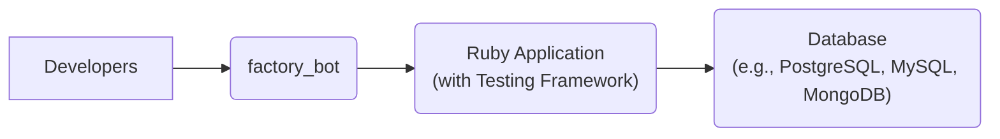
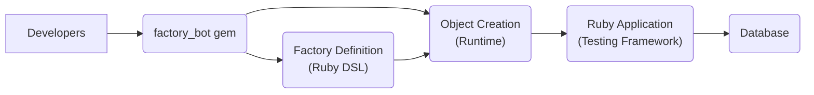
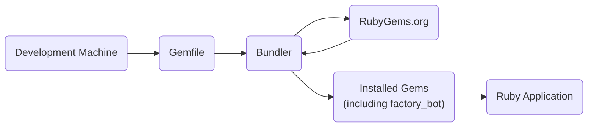
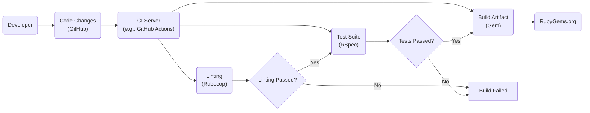

Okay, let's create a design document for the `factory_bot` project.

# BUSINESS POSTURE

Business Priorities and Goals:

*   Enable rapid and reliable test setup in Ruby projects.
*   Reduce boilerplate code in tests, making them more readable and maintainable.
*   Provide a flexible and extensible API for defining and creating test data.
*   Support various ORM/ODM frameworks (like ActiveRecord, Mongoid, etc.).
*   Maintain backward compatibility and stability for existing users.
*   Foster a strong community and ecosystem around the project.

Most Important Business Risks:

*   Introduction of bugs or regressions that break existing test suites.
*   Security vulnerabilities that could be exploited in development or testing environments.
*   Performance issues that slow down test execution.
*   Lack of compatibility with new Ruby versions or ORM/ODM frameworks.
*   Loss of community trust due to instability or lack of maintenance.

# SECURITY POSTURE

Existing Security Controls:

*   security control: Regular dependency updates to address known vulnerabilities (implied by project maintenance).
*   security control: Test suite to ensure functionality and prevent regressions (explicit in the project).
*   security control: Community scrutiny and contributions (inherent to open-source projects).
*   security control: Code linting (implied by Ruby best practices and observed in .rubocop.yml).

Accepted Risks:

*   accepted risk: The library is primarily used in development and testing environments, reducing the risk of direct exploitation in production.
*   accepted risk: The library does not handle sensitive data directly, minimizing the impact of potential data breaches.
*   accepted risk: The library's core functionality does not involve network communication or external services, reducing the attack surface.

Recommended Security Controls:

*   security control: Implement a static analysis security testing (SAST) tool in the CI pipeline to detect potential vulnerabilities early.
*   security control: Introduce a security policy (SECURITY.md) to guide users and contributors on reporting vulnerabilities.
*   security control: Conduct regular security audits of the codebase and dependencies.
*   security control: Consider using a Software Composition Analysis (SCA) tool to identify and manage vulnerabilities in third-party libraries.

Security Requirements:

*   Authentication: Not applicable, as the library does not involve user authentication.
*   Authorization: Not applicable, as the library does not involve user authorization.
*   Input Validation: The library should handle various input types gracefully and avoid potential injection vulnerabilities when processing user-defined factories and attributes. Specifically, ensure that attribute names and values are properly sanitized and escaped to prevent code injection or unexpected behavior.
*   Cryptography: Not directly applicable, as the library does not handle sensitive data requiring encryption. However, if the library is used to generate test data that includes cryptographic keys or secrets, it should provide guidance on securely generating and managing these values.

# DESIGN

## C4 CONTEXT

Element Descriptions:

*   Element 1
    *   Name: Developers
    *   Type: Person
    *   Description: Software developers writing tests for their Ruby applications.
    *   Responsibilities: Use factory\_bot to define and create test data.
    *   Security controls: Follow secure coding practices.

*   Element 2
    *   Name: factory\_bot
    *   Type: Software System
    *   Description: The factory\_bot library itself.
    *   Responsibilities: Provide an API for defining and creating test data.
    *   Security controls: Input validation, regular dependency updates, test suite.

*   Element 3
    *   Name: Ruby Application (with Testing Framework)
    *   Type: Software System
    *   Description: The application being tested, which uses a testing framework like RSpec or Minitest.
    *   Responsibilities: Execute tests and interact with the database.
    *   Security controls: Application-specific security controls.

*   Element 4
    *   Name: Database (e.g., PostgreSQL, MySQL, MongoDB)
    *   Type: Software System
    *   Description: The database used by the application.
    *   Responsibilities: Store and retrieve data.
    *   Security controls: Database-specific security controls (access control, encryption, etc.).

## C4 CONTAINER

Element Descriptions:

*   Element 1
    *   Name: Developers
    *   Type: Person
    *   Description: Software developers writing tests.
    *   Responsibilities: Use factory\_bot to define factories and create objects.
    *   Security controls: Follow secure coding practices.

*   Element 2
    *   Name: factory\_bot gem
    *   Type: Library
    *   Description: The installed factory\_bot gem.
    *   Responsibilities: Provide the core functionality of the library.
    *   Security controls: Regular dependency updates, test suite.

*   Element 3
    *   Name: Factory Definition (Ruby DSL)
    *   Type: Code
    *   Description: User-defined factory definitions using the factory\_bot DSL.
    *   Responsibilities: Define the structure and attributes of test objects.
    *   Security controls: Input validation (sanitization of attribute names and values).

*   Element 4
    *   Name: Object Creation (Runtime)
    *   Type: Code
    *   Description: The runtime component of factory\_bot that creates objects based on factory definitions.
    *   Responsibilities: Instantiate objects and assign attributes.
    *   Security controls: Input validation, error handling.

*   Element 5
    *   Name: Ruby Application (Testing Framework)
    *   Type: Software System
    *   Description: The application being tested.
    *   Responsibilities: Execute tests and interact with the database.
    *   Security controls: Application-specific security controls.

*   Element 6
    *   Name: Database
    *   Type: Software System
    *   Description: The database used by the application.
    *   Responsibilities: Store and retrieve data.
    *   Security controls: Database-specific security controls.

## DEPLOYMENT

Possible Deployment Solutions:

1.  Bundler (most common): Included as a gem in the Gemfile and installed via Bundler.
2.  Manual gem installation: `gem install factory_bot`.
3.  System-wide gem installation (not recommended): `sudo gem install factory_bot`.

Chosen Solution (Bundler):

Element Descriptions:

*   Element 1
    *   Name: Development Machine
    *   Type: Infrastructure
    *   Description: The developer's local machine.
    *   Responsibilities: Host the development environment.
    *   Security controls: Operating system security, firewall, antivirus.

*   Element 2
    *   Name: Gemfile
    *   Type: File
    *   Description: The file that lists the project's gem dependencies.
    *   Responsibilities: Specify the required gems and their versions.
    *   Security controls: Version pinning to avoid unexpected updates.

*   Element 3
    *   Name: Bundler
    *   Type: Tool
    *   Description: The Ruby gem dependency manager.
    *   Responsibilities: Install and manage gem dependencies.
    *   Security controls: Verify gem signatures (if configured).

*   Element 4
    *   Name: RubyGems.org
    *   Type: Service
    *   Description: The central repository for Ruby gems.
    *   Responsibilities: Host and distribute Ruby gems.
    *   Security controls: RubyGems.org's security measures.

*   Element 5
    *   Name: Installed Gems (including factory\_bot)
    *   Type: Library
    *   Description: The gems installed by Bundler.
    *   Responsibilities: Provide functionality to the application.
    *   Security controls: Regular dependency updates.

*   Element 6
    *   Name: Ruby Application
    *   Type: Software System
    *   Description: The application being developed.
    *   Responsibilities: Run the application code and tests.
    *   Security controls: Application-specific security controls.

## BUILD

Build Process Description:

1.  Developer: A developer makes code changes and pushes them to the GitHub repository.
2.  CI Server (GitHub Actions): A CI server (like GitHub Actions) is triggered by the push.
3.  Linting (Rubocop): The CI server runs a linter (Rubocop) to check for code style violations.
4.  Test Suite (RSpec): If linting passes, the CI server runs the test suite (RSpec).
5.  Build Artifact (Gem): If the tests pass, the CI server builds the gem file.
6.  Publish to RubyGems.org: The gem is published to RubyGems.org.

Security Controls:

*   security control: Linting (Rubocop) enforces code style and helps prevent some common errors.
*   security control: Test suite (RSpec) ensures functionality and prevents regressions.
*   security control: CI server (GitHub Actions) automates the build and testing process, ensuring consistency.
*   security control: Dependency management (Bundler) helps manage and update dependencies.
*   security control: (Recommended) SAST and SCA tools in the CI pipeline.

# RISK ASSESSMENT

Critical Business Processes:

*   Test suite execution: Ensuring that tests run quickly and reliably is crucial for developer productivity.
*   Gem distribution: Making the library easily available to users via RubyGems.org is essential.

Data Sensitivity:

*   factory\_bot itself does not handle sensitive data. However, it may be used to *generate* test data that mimics sensitive data.  The sensitivity of this generated data depends on how factory\_bot is used within a specific project.  Developers should be careful not to include actual sensitive data (e.g., production passwords, API keys) in their factory definitions.  Generated test data should be treated with appropriate care, especially if it resembles real data.

# QUESTIONS & ASSUMPTIONS

Questions:

*   Are there any specific compliance requirements (e.g., GDPR, HIPAA) that apply to the use of factory\_bot, even in a testing context?
*   Are there any plans to use factory\_bot in environments other than development and testing?
*   What is the current process for handling security vulnerabilities reported by users or discovered internally?

Assumptions:

*   BUSINESS POSTURE: The primary goal is to provide a stable and reliable tool for test data generation.
*   SECURITY POSTURE: The library is primarily used in non-production environments, reducing the risk of direct exploitation.
*   DESIGN: Developers are responsible for securely managing any sensitive data generated by factory\_bot.
*   DESIGN: The project follows standard Ruby development practices and conventions.
*   DESIGN: The project uses GitHub Actions for CI/CD.