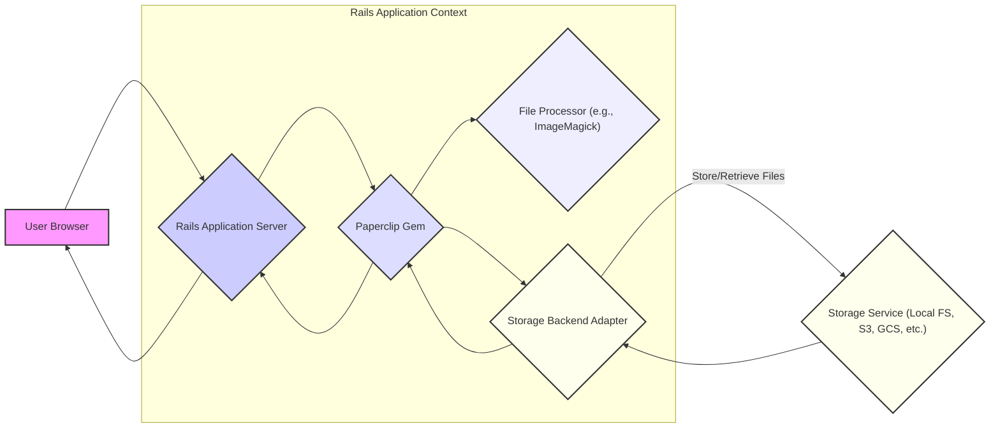

# Project Design Document: Paperclip File Attachment Library

**Version:** 1.1
**Date:** October 26, 2023
**Author:** Gemini (AI Language Model)

## 1. Introduction

This document provides an enhanced design overview of the Paperclip gem, a widely used file attachment library for Ruby on Rails applications. This detailed description is specifically intended to serve as a foundation for effective threat modeling activities. It outlines the key architectural components, the flow of data during file uploads and retrievals, and highlights inherent security considerations within the library's design.

### 1.1. Purpose

The primary objective of this document is to furnish a comprehensive and clear architectural description of the Paperclip gem. This detailed overview will empower security professionals, software developers, and operations engineers to collaboratively identify potential security vulnerabilities and design appropriate mitigation strategies.

### 1.2. Scope

This document encompasses the core functionalities of the Paperclip gem, including the processes of file uploading, manipulation (e.g., resizing), storage, and retrieval. The focus is on architectural aspects directly relevant to security considerations. While it touches upon interactions with external libraries and storage providers, it does not delve into the intricate implementation details of those specific external systems.

### 1.3. Audience

This document is primarily intended for the following individuals and teams:

*   Security architects and security engineers responsible for assessing and mitigating risks.
*   Software developers integrating and utilizing the Paperclip gem within their Rails applications.
*   DevOps engineers and system administrators managing the deployment and infrastructure of applications using Paperclip.

## 2. System Overview

Paperclip simplifies the management of file attachments within Ruby on Rails applications. It acts as a crucial intermediary, bridging the gap between the application's data models and the underlying file storage mechanisms. A key feature is its ability to define various "styles" or transformations of uploaded files (e.g., creating thumbnails or different sized versions of an image). Paperclip offers flexibility by supporting multiple storage options, ranging from the local file system to various cloud storage services like Amazon S3 and Google Cloud Storage.

**Explanation of Interactions:**

*   **User Upload:** Users initiate file uploads through their web browser, interacting with the Rails application.
*   **Interception:** The Paperclip gem intercepts the uploaded file data within the Rails application context.
*   **Processing (Optional):** Based on configured styles, Paperclip may invoke a file processor (like ImageMagick) to manipulate the uploaded file (e.g., resizing images, creating different formats).
*   **Storage:** Paperclip utilizes a storage backend adapter to interact with the configured storage service, storing the original file and any processed versions.
*   **Retrieval:** The Rails application can retrieve URLs or access paths to the stored files through Paperclip.
*   **User Access:** Users can access the stored files via the generated URLs or through application logic that streams the file data.

## 3. Components

The Paperclip gem's functionality can be dissected into the following key components:

*   **Attachment Definition DSL (Domain Specific Language):** This allows developers to declare an attribute within a Rails model as an attachment. The definition includes configuration options such as:
    *   The chosen storage backend (e.g., `:s3`, `:filesystem`).
    *   Processing styles and transformations.
    *   Validation rules for file type and size.
    *   Metadata configuration.
*   **Upload Receiver:** This component handles the incoming file data from the Rails application's web request. It manages the temporary storage of the uploaded file before further processing.
*   **File Processor Interface:** Paperclip provides an interface for interacting with external file processing libraries. Common implementations include:
    *   **ImageMagick Processor:** Used for image manipulation tasks like resizing, cropping, and format conversion.
    *   Custom Processors:** Developers can create custom processors for specific file manipulation needs.
*   **Storage Backend Adapters:** These components provide an abstraction layer for interacting with different storage services. Paperclip includes adapters for:
    *   **Filesystem Adapter:** Stores files on the local server's file system.
    *   **AWS S3 Adapter:** Integrates with Amazon Simple Storage Service (S3).
    *   **Google Cloud Storage Adapter:** Integrates with Google Cloud Storage.
    *   Other community-maintained adapters for various storage solutions.
*   **URL Generator:** This component is responsible for constructing URLs that can be used to access the stored files. The URL format depends on the active storage backend and its configuration (e.g., public URLs for S3, direct file paths for local storage).
*   **Validation Engine:** Paperclip incorporates a validation engine to enforce rules defined in the attachment definition, such as:
    *   Allowed content types (MIME types).
    *   Maximum file size.
    *   Presence of a file.
*   **Metadata Handler:** This component manages metadata associated with the attached files, including:
    *   Original filename.
    *   Content type.
    *   File size.
    *   Timestamps.

## 4. Data Flow

The typical sequence of actions during a file upload and subsequent retrieval using Paperclip is illustrated below:

```mermaid
graph LR
    subgraph Upload Process
        A["User Browser"] --> B{"Rails Application (Form Submission)"};
        B --> C{"Paperclip Interceptor (Model Attribute Assignment)"};
        C --> D{"Upload Receiver (Temporary File Storage)"};
        D --> E{"Validation Engine"};
        E -- "File is Valid" --> F{"File Processor (if styles defined)"};
        F -- "Processed Files" --> G{"Storage Backend Adapter"};
        D -- "Original File" --> G;
        G -- "Files Stored" --> H{"Metadata Handler (Model Update)"};
        H --> I{"Rails Application (Success Response)"};
        I --> A;
    end
    subgraph Retrieval Process
        J["User Browser"] --> K{"Rails Application (Request for File URL)"};
        K --> L{"Paperclip URL Generator"};
        L --> M{"Storage Backend Adapter (if needed)"};
        M --> N{"Storage Service"};
        N --> O{"Delivered File"};
        O --> J;
    end
    style A fill:#f9f,stroke:#333,stroke-width:2px
    style B fill:#ccf,stroke:#333,stroke-width:2px
    style C fill:#ddf,stroke:#333,stroke-width:2px
    style D fill:#eef,stroke:#333,stroke-width:2px
    style E fill:#ffe,stroke:#333,stroke-width:2px
    style F fill:#eef,stroke:#333,stroke-width:2px
    style G fill:#ffe,stroke:#333,stroke-width:2px
    style H fill:#ddf,stroke:#333,stroke-width:2px
    style I fill:#ccf,stroke:#333,stroke-width:2px
    style J fill:#f9f,stroke:#333,stroke-width:2px
    style K fill:#ccf,stroke:#333,stroke-width:2px
    style L fill:#ddf,stroke:#333,stroke-width:2px
    style M fill:#ffe,stroke:#333,stroke-width:2px
    style N fill:#ffe,stroke:#333,stroke-width:2px
    style O fill:#ccf,stroke:#333,stroke-width:2px
```

**Detailed Steps - Upload Process:**

1. The user selects a file and submits a form through their web browser to the Rails application.
2. The Rails application receives the file upload data.
3. When the model attribute associated with the Paperclip attachment is assigned, the Paperclip Interceptor takes over.
4. The Upload Receiver temporarily stores the uploaded file (typically in the operating system's temporary directory).
5. The Validation Engine executes the defined validation rules (e.g., checking file size and content type against allowed values).
6. If the attachment has defined styles, the File Processor (e.g., ImageMagick) is invoked to generate the different versions of the file according to the specified transformations.
7. The Storage Backend Adapter is used to upload the original file and any processed versions to the configured storage service (local file system or cloud storage).
8. The Storage Service confirms successful storage of the files.
9. The Metadata Handler updates the model with relevant information about the stored files, such as their paths or URLs.
10. The Rails application sends a success response back to the user's browser.

**Detailed Steps - Retrieval Process:**

1. The user's browser requests access to an attached file, typically through a link or image tag.
2. The Rails application receives the request and identifies the need to retrieve the file's URL.
3. The Paperclip URL Generator constructs the appropriate URL based on the configured storage backend and the requested style (if applicable).
4. Depending on the storage backend, the URL Generator might interact with the Storage Backend Adapter to generate signed URLs or retrieve access information.
5. The Storage Service serves the file directly to the user's browser (for public URLs) or after verifying the validity of a signed URL.

## 5. Security Considerations

Several security aspects are paramount when considering the use of Paperclip:

*   **Risks Associated with Malicious File Uploads:**
    *   **Unrestricted File Types:** Failure to properly validate allowed content types can lead to the execution of malicious scripts or exploitation of vulnerabilities in processing software.
    *   **Bypassing Client-Side Validation:** Client-side validation is easily bypassed; therefore, server-side validation is crucial.
    *   **Filename Exploits:**  Malicious filenames can be crafted to exploit vulnerabilities in file systems or web servers.
    *   **Mitigation Strategies:**
        *   **Strict Whitelisting of Content Types:** Only allow explicitly approved MIME types.
        *   **Server-Side Validation:** Implement robust server-side validation for file types, sizes, and potentially content.
        *   **Sanitization of Filenames:**  Rename uploaded files to a safe format, removing potentially harmful characters.
        *   **Content Security Policy (CSP):** Configure CSP headers to mitigate the risk of executing malicious scripts.
*   **Vulnerabilities in File Processing:**
    *   **ImageMagick and Similar Libraries:**  Image processing libraries can have known vulnerabilities that could lead to remote code execution if not patched.
    *   **Exploiting Processing Logic:** Attackers might craft specific files to exploit vulnerabilities in the processing logic itself.
    *   **Mitigation Strategies:**
        *   **Keep Processing Libraries Updated:** Regularly update ImageMagick and other processing dependencies to the latest secure versions.
        *   **Resource Limits:** Implement resource limits (e.g., memory, CPU time) for file processing to prevent denial-of-service attacks.
        *   **Secure Configuration:**  Configure processing libraries securely, disabling any unnecessary or risky features.
*   **Storage Security:**
    *   **Local File System Permissions:** Incorrect file system permissions can allow unauthorized access to uploaded files.
    *   **Cloud Storage Access Control:** Misconfigured S3 buckets or GCS permissions can lead to data breaches and unauthorized access.
    *   **Publicly Accessible URLs:**  Unintentionally making uploaded files publicly accessible can expose sensitive data.
    *   **Mitigation Strategies:**
        *   **Principle of Least Privilege:** Grant only the necessary permissions to the application for accessing the storage backend.
        *   **Private Storage by Default:** Configure storage backends to be private by default, requiring authentication for access.
        *   **Signed URLs for Access Control:** Utilize signed URLs for cloud storage to provide time-limited and authenticated access to files.
        *   **Regular Security Audits:** Conduct regular audits of storage configurations to identify and rectify any misconfigurations.
*   **Access Control and Authorization:**
    *   **Lack of Access Control:**  Without proper access controls, any user might be able to access any uploaded file.
    *   **URL Guessing:**  Predictable or sequential URL patterns can allow attackers to guess URLs of private files.
    *   **Mitigation Strategies:**
        *   **Application-Level Authorization:** Implement robust authorization checks within the Rails application to control access to file URLs.
        *   **Non-Predictable URLs:**  Generate non-sequential and difficult-to-guess URLs for accessing uploaded files.
        *   **Authentication Required:** Ensure that users are authenticated before they can access file URLs.
*   **Information Disclosure:**
    *   **Exposing Metadata:**  Metadata like original filenames might reveal sensitive information about users or the system.
    *   **Error Messages:**  Verbose error messages during file processing or storage can leak information.
    *   **Mitigation Strategies:**
        *   **Careful Handling of Metadata:**  Avoid exposing sensitive metadata unnecessarily.
        *   **Generic Error Messages:**  Provide generic error messages to users and log detailed errors securely.
*   **Denial of Service (DoS):**
    *   **Large File Uploads:**  Allowing excessively large file uploads can consume server resources and lead to DoS.
    *   **Resource-Intensive Processing:**  Complex file processing operations can strain server resources.
    *   **Mitigation Strategies:**
        *   **File Size Limits:**  Enforce reasonable file size limits.
        *   **Rate Limiting:**  Limit the number of file uploads from a single user or IP address within a given time frame.
        *   **Background Processing:**  Offload resource-intensive file processing to background jobs to avoid blocking the main application thread.
*   **Dependency Vulnerabilities:**
    *   **Outdated Gems:**  Using outdated versions of Paperclip or its dependencies can expose the application to known vulnerabilities.
    *   **Transitive Dependencies:**  Vulnerabilities in the dependencies of Paperclip's dependencies can also pose a risk.
    *   **Mitigation Strategies:**
        *   **Regularly Update Dependencies:**  Keep Paperclip and all its dependencies updated to the latest secure versions.
        *   **Dependency Scanning:**  Use tools to scan for known vulnerabilities in project dependencies.

## 6. Deployment Considerations

Secure deployment of applications using Paperclip requires careful attention to the following:

*   **Secure Storage Backend Configuration:**
    *   **Principle of Least Privilege for Credentials:**  Ensure the application has only the necessary permissions to access the storage backend. Avoid using root or overly permissive credentials.
    *   **Secure Storage of Credentials:**  Store cloud storage API keys and secrets securely using environment variables, vault solutions, or other secure secrets management practices. Avoid hardcoding credentials in the application code.
    *   **Network Security for Cloud Storage:**  Ensure network traffic to cloud storage services is encrypted (e.g., using HTTPS). Consider using VPC endpoints for enhanced security within cloud environments.
*   **File Processor Security:**
    *   **Installation from Trusted Sources:** Install file processing libraries like ImageMagick from trusted repositories.
    *   **Regular Updates:**  Implement a process for regularly updating these libraries to patch security vulnerabilities.
    *   **Restricting Access:** Limit access to the file processing binaries to only the necessary users and processes.
*   **File System Permissions (for Local Storage):**
    *   **Restrictive Permissions:**  Set restrictive file system permissions on the directories where uploaded files are stored to prevent unauthorized access.
    *   **Dedicated User Account:**  Run the application server under a dedicated user account with minimal privileges.
*   **Monitoring and Logging:**
    *   **Log File Upload Activity:**  Log file upload attempts, including user information, filenames, and results (success/failure).
    *   **Monitor Resource Usage:**  Monitor server resource usage (CPU, memory, disk space) to detect potential DoS attacks or resource exhaustion.
    *   **Security Audits:**  Regularly audit the application's configuration and dependencies for security vulnerabilities.

## 7. Future Considerations

Potential future enhancements and security considerations for Paperclip could include:

*   **Built-in Content Scanning Integration:**  Provide a more streamlined way to integrate with antivirus or malware scanning services directly within Paperclip.
*   **Enhanced URL Security Options:**  Offer more granular control over URL generation, including options for expiring URLs with specific permissions.
*   **Improved Metadata Security:**  Provide options for encrypting sensitive metadata associated with uploaded files.
*   **Pluggable Validation Framework with Security Focus:**  Allow developers to easily integrate custom validation logic, with guidance and best practices for secure validation.
*   **Support for Content Integrity Checks:**  Implement mechanisms to verify the integrity of uploaded and stored files (e.g., using checksums).

This document provides a comprehensive architectural overview of the Paperclip gem, specifically tailored for threat modeling purposes. It serves as a valuable resource for understanding the library's inner workings and identifying potential security vulnerabilities. A thorough security assessment should also include a review of the Paperclip codebase and its interactions with the specific application context.
