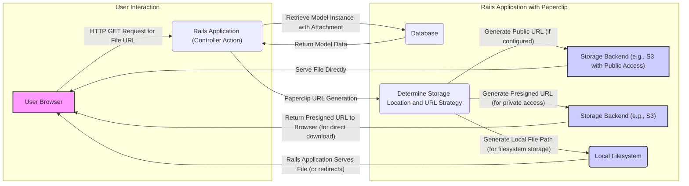

## Project Design Document: Paperclip File Attachment Library (Improved)

**Project Repository:** https://github.com/thoughtbot/paperclip

**1. Introduction**

This document provides an enhanced and more detailed design overview of the Paperclip gem, a widely adopted Ruby on Rails library for managing file attachments. The purpose of this document is to offer a clear and comprehensive understanding of Paperclip's architecture, its constituent components, and the flow of data during file upload and retrieval processes. This detailed design serves as a foundation for subsequent threat modeling exercises, enabling a thorough analysis of potential security vulnerabilities. The focus remains on how Paperclip seamlessly integrates with a Rails application to handle file uploads, storage across various backends, and file processing tasks.

**2. Goals and Objectives**

The core objectives of the Paperclip gem are to:

*   **Simplify File Management:** Provide an intuitive and straightforward mechanism for handling file attachments within Ruby on Rails applications, abstracting away the complexities of file uploads and storage.
*   **Consistent Interface:** Offer a uniform and predictable API for managing file attachments, regardless of the underlying storage backend used.
*   **Storage Backend Agnosticism:** Support a diverse range of storage solutions, including local filesystems for development and testing, and robust cloud storage services for production environments.
*   **File Processing Capabilities:** Enable the manipulation of uploaded files on-the-fly, such as generating thumbnails, resizing images, and applying watermarks, without requiring manual intervention.
*   **Robust Validation Framework:** Provide built-in validation mechanisms to ensure the integrity and security of uploaded files by enforcing constraints on file types, sizes, and other attributes.

**3. System Architecture**

Paperclip's architecture is centered around extending ActiveRecord models within a Rails application. It introduces a declarative approach to managing file attachments through configurations and a set of interacting components.

*   **Key Architectural Components:**
    *   **Attachment Definition (within ActiveRecord Model):** This is the primary configuration block where an attachment is declared for a specific model attribute. It defines:
        *   `storage`: Specifies the storage backend to be used (e.g., `:filesystem`, `:s3`, `:fog`).
        *   `url`: Defines how the URL to access the stored file is generated, often using interpolations.
        *   `path`:  Determines the storage path for the file within the chosen backend, also supporting interpolations for dynamic paths.
        *   `bucket` (for S3): The name of the Amazon S3 bucket where files will be stored.
        *   `s3_credentials` (for S3):  Configuration details for authenticating with Amazon S3, ideally using environment variables.
        *   `processors`: An array of processors to be applied to the uploaded file (e.g., `[:thumbnail]`).
        *   `styles`:  Specific configurations for different versions or renditions of the uploaded file, often used with image processing (e.g., `:thumb => "100x100#"`, `:medium => "300x300>"`).
        *   `validations`:  Constraints to be enforced on the uploaded file (e.g., `content_type: { content_type: ["image/jpg", "image/png"] }`, `size: { in: 0..10.megabytes }`).
    *   **Storage Adapters (Strategies):** These are responsible for the actual interaction with the configured storage backend. Paperclip provides built-in adapters and allows for custom implementations:
        *   `Filesystem`: Stores files on the local server's filesystem.
        *   `S3`:  Leverages the Amazon S3 service for scalable cloud storage.
        *   `Fog`:  Provides an abstraction layer over multiple cloud storage providers.
    *   **Processors (Transformation Logic):** These components handle the manipulation of uploaded files. They take the original file as input and produce processed versions based on the attachment's `styles`. Common processors include:
        *   `Thumbnail`: Generates thumbnail images of various sizes using libraries like MiniMagick or RMagick.
        *   Custom Processors: Developers can create custom processors to implement specific file transformations.
    *   **Validators (Constraint Enforcement):** These ensure that uploaded files adhere to the rules defined in the attachment definition. Key validators include:
        *   `ContentTypeValidator`: Verifies the MIME type of the uploaded file.
        *   `FileSizeValidator`: Checks if the file size falls within the allowed range.
    *   **Interpolators (Dynamic Path/URL Generation):** These allow for the dynamic construction of storage paths and URLs based on model attributes, attachment attributes, and timestamps. This enables organized storage and predictable URL structures.

*   **Integration within a Rails Application:**
    *   **Gem Inclusion:** Paperclip is added as a dependency in the Rails application's `Gemfile`.
    *   **Database Migrations:**  Migrations are used to add specific columns to the database table associated with the model having attachments. These columns store metadata about the attached file (e.g., `file_name`, `content_type`, `file_size`, `updated_at`).
    *   **`has_attached_file` Macro:**  Within the ActiveRecord model, the `has_attached_file` macro is invoked to declare an attachment and configure its properties.

**4. Data Flow (Detailed)**

The following diagrams illustrate the detailed flow of data during file uploads and retrieval using Paperclip.

**4.1. File Upload Flow:**

```mermaid
flowchart LR
    subgraph "User Interaction"
        A["User Browser"] -- "HTTP POST Request with File" --> B("Rails Application (Controller Action)");
    end

    subgraph "Rails Application with Paperclip"
        B -- "Receives Uploaded File Data" --> C("ActiveRecord Model Instance with Attachment");
        C -- "Paperclip Interceptor" --> D("Validation Layer");
        D -- "Apply Validations (ContentType, Size, etc.)" --> E{Validation Successful?};
        E -- "Yes" --> F("Processor Pipeline (if configured)");
        E -- "No" --> G("Return Error to Controller");
        F -- "Apply Processors (Thumbnail, etc.)" --> H("Storage Adapter Selection");
        H -- "Select Appropriate Storage Adapter (e.g., S3, Filesystem)" --> I("Storage Backend Interaction");
        I -- "Store Original File" --> J["Storage Backend (e.g., S3, Local Filesystem)"];
        I -- "Store Processed Files (Thumbnails, etc.)" --> J;
        I -- "Update Model Attributes (file_name, content_type, etc.)" --> K("Database");
        K --> L("Return Success to Controller");
        L --> B;
        B -- "Send HTTP Response (Success or Error)" --> A;
    end

    style A fill:#f9f,stroke:#333,stroke-width:2px
    style J fill:#ccf,stroke:#333,stroke-width:2px
```

Detailed steps in the file upload process:

*   **User Initiates Upload:** The user selects a file through a web form and submits it to the Rails application via an HTTP POST request.
*   **Rails Controller Receives File:** The designated controller action in the Rails application receives the uploaded file data, typically as part of the `params` hash.
*   **ActiveRecord Model Interaction:** The uploaded file data is associated with an instance of the ActiveRecord model that has the Paperclip attachment defined.
*   **Paperclip Interception:** Paperclip intercepts the file assignment and begins its processing workflow.
*   **Validation Phase:** Paperclip applies the configured validators to the uploaded file, checking for constraints like allowed content types and file size limits.
*   **Processing Pipeline (Conditional):** If processors are defined in the attachment configuration, Paperclip invokes them to manipulate the file (e.g., generating thumbnails). This often involves external libraries.
*   **Storage Adapter Selection:** Based on the `storage` configuration, Paperclip selects the appropriate storage adapter (e.g., the S3 adapter if `storage: :s3` is configured).
*   **Storage Backend Interaction:** The selected storage adapter interacts with the designated storage backend to store the original uploaded file and any processed versions.
*   **Database Update:** Paperclip updates the corresponding attributes of the ActiveRecord model in the database with metadata about the stored file, such as its filename, content type, and file size.
*   **Response to User:** The Rails controller sends an HTTP response back to the user's browser, indicating the success or failure of the file upload.

**4.2. File Retrieval Flow:**

Detailed steps in the file retrieval process:

*   **User Requests File:** The user's browser initiates an HTTP GET request for the URL of a file managed by Paperclip.
*   **Rails Controller Handles Request:** The Rails controller action responsible for serving the file receives the request.
*   **Retrieve Model Data:** The controller retrieves the ActiveRecord model instance containing the attachment information from the database.
*   **Paperclip URL Generation:** Paperclip's URL generation logic is invoked to determine the correct URL for accessing the stored file.
*   **URL Strategy Determination:** Paperclip considers the storage backend configuration and access control settings to determine the appropriate URL generation strategy.
    *   **Public URLs:** If the storage backend allows public access (e.g., a publicly readable S3 bucket), Paperclip can generate a direct, publicly accessible URL.
    *   **Presigned URLs:** For private storage, Paperclip can generate temporary, signed URLs that grant time-limited access to the file.
    *   **Local File Paths:** If using local filesystem storage, Paperclip might generate a path that the Rails application uses to serve the file directly or through a redirect.
*   **File Serving:**
    *   **Direct Serving (Public URLs):** The browser directly accesses and downloads the file from the storage backend using the public URL.
    *   **Presigned URL Redirection:** The Rails application returns the presigned URL to the browser, which then uses it to directly download the file from the storage backend.
    *   **Rails Application Serving (Local Filesystem):** The Rails application reads the file from the local filesystem and sends it as the response, or it might redirect the request to a web server configured to serve static files.

**5. Security Considerations (Expanded)**

Paperclip's functionality introduces several security considerations that need careful attention:

*   **Storage Backend Security:**
    *   **Access Control Policies:**  Incorrectly configured access control policies on cloud storage buckets (e.g., overly permissive S3 bucket policies) can lead to unauthorized access, modification, or deletion of stored files.
    *   **Data Encryption at Rest:**  For sensitive data, enabling encryption at rest on the storage backend is crucial to protect data even if the storage is compromised.
    *   **Secure Credential Management:**  Storing storage backend credentials (e.g., AWS access keys) securely, preferably using environment variables or dedicated secrets management services, is paramount. Avoid hardcoding credentials.
    *   **Regular Security Audits:** Periodically reviewing the security configurations of the storage backend is essential to identify and address potential vulnerabilities.
*   **File Processing Security:**
    *   **ImageMagick/MiniMagick Vulnerabilities:**  Outdated versions of image processing libraries like ImageMagick or MiniMagick can have known vulnerabilities that attackers can exploit by uploading specially crafted image files. Regularly update these libraries.
    *   **Denial of Service (DoS) via Processing:**  Attackers might upload extremely large or complex files designed to consume excessive processing resources, leading to denial of service. Implement file size limits and timeouts for processing tasks.
    *   **Input Sanitization during Processing:**  Ensure that any user-provided data used during file processing (e.g., watermarking text) is properly sanitized to prevent injection attacks.
*   **Input Validation and Sanitization:**
    *   **Server-Side Validation is Mandatory:**  Never rely solely on client-side validation. Implement robust server-side validation using Paperclip's validators to enforce file type, size, and other restrictions.
    *   **Content Type Verification:**  Thoroughly verify the content type of uploaded files to prevent attackers from uploading malicious files disguised as legitimate ones.
    *   **Filename Sanitization:** Sanitize uploaded filenames to prevent path traversal vulnerabilities or issues with filesystem storage.
*   **Access Control and Authorization:**
    *   **Protecting Access to Private Files:** Implement proper authorization mechanisms to control who can access and download private files. Presigned URLs offer a secure way to grant temporary access.
    *   **Secure URL Generation:** Ensure that the logic for generating file URLs does not inadvertently expose sensitive information or create predictable URLs that could be guessed.
*   **Error Handling and Information Disclosure:**
    *   **Avoid Verbose Error Messages:**  Ensure that error messages related to file uploads or processing do not reveal sensitive information about the application's internal workings or storage configuration.
    *   **Secure Logging Practices:** Implement secure logging practices to track file uploads and access attempts for auditing and security monitoring purposes.

**6. Deployment Considerations (Best Practices)**

*   **Storage Backend Provisioning and Configuration:**  Properly provision and configure the chosen storage backend (e.g., creating S3 buckets, setting appropriate permissions).
*   **Image Processing Library Installation:** Ensure that the necessary image processing libraries (MiniMagick or RMagick) are installed and correctly configured on the server environment.
*   **Environment Variable Management:**  Store sensitive configuration details like storage backend credentials as environment variables, utilizing tools like `dotenv` or platform-specific secrets management.
*   **Filesystem Permissions (for Local Storage):**  If using local filesystem storage, set appropriate file system permissions to restrict access to uploaded files.
*   **Load Balancing and Scalability:**  Consider load balancing and scaling strategies, especially when using cloud storage, to handle high volumes of file uploads and downloads.
*   **Content Delivery Network (CDN) Integration:**  Integrate with a CDN to improve the performance and availability of served files, especially for publicly accessible assets.

**7. Dependencies**

Paperclip relies on the following Ruby gems:

*   `activesupport`:  A fundamental component of the Rails framework, providing utility classes and methods.
*   `mini_magick` or `rmagick`:  Libraries for image processing. `mini_magick` is generally preferred for its lower memory footprint and simpler installation.
*   `aws-sdk-s3`:  The official AWS SDK for Ruby, specifically for interacting with Amazon S3 (required if using S3 storage).
*   `fog-aws` (or other `fog-*` gems):  If using the `fog` storage adapter, the appropriate `fog` provider gem is required.

**8. Future Considerations and Potential Enhancements**

*   **Direct Uploads to Cloud Storage (Presigned URLs):**  Implement direct uploads from the user's browser to cloud storage using presigned URLs to reduce server load and improve upload speeds.
*   **More Granular Access Control at the Attachment Level:**  Provide more fine-grained control over access permissions for individual file attachments.
*   **Enhanced CDN Integration:**  Offer more seamless integration with CDN services for automatic cache invalidation and optimized content delivery.
*   **Asynchronous Processing of Files:**  Move computationally intensive file processing tasks to background jobs (e.g., using Sidekiq or Resque) to prevent blocking the main application thread and improve responsiveness.
*   **Improved Monitoring and Logging:**  Enhance monitoring and logging capabilities for file uploads, downloads, and processing events for better security auditing and troubleshooting.

This improved design document provides a more in-depth understanding of the Paperclip gem, its architecture, data flow, and security considerations. This detailed information is crucial for conducting thorough threat modeling and implementing secure file attachment management within Ruby on Rails applications.