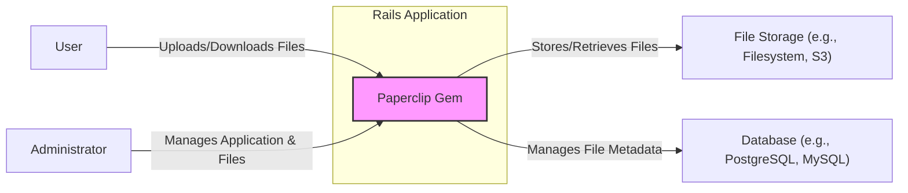
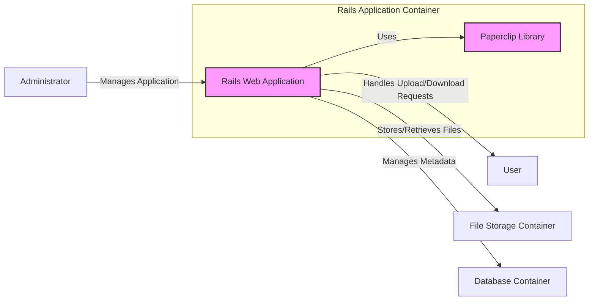

# BUSINESS POSTURE

- Business Priorities and Goals:
  - Simplify file attachment management for Ruby on Rails applications.
  - Provide an easy-to-use interface for developers to handle file uploads, storage, and retrieval.
  - Reduce development time and complexity associated with file management in web applications.
- Business Risks:
  - Data loss due to improper file handling or storage.
  - Unauthorized access to uploaded files, potentially containing sensitive information.
  - Insecure file handling practices leading to vulnerabilities such as arbitrary file upload or server-side request forgery (SSRF).
  - Dependency on an open-source library, requiring ongoing maintenance and security updates.

# SECURITY POSTURE

- Existing Security Controls:
  - security control: Rails Framework Security - The project is built as a Ruby on Rails gem, leveraging the inherent security features provided by the Rails framework, such as protection against common web vulnerabilities (CSRF, SQL Injection, etc.). Implemented within the Rails application using the gem.
  - security control: Server Security - The security of the server infrastructure where the Rails application and Paperclip are deployed. This includes operating system hardening, network security, and access controls. Implemented at the infrastructure level.
  - security control: Database Security - Security measures implemented for the database system used by the Rails application to store metadata related to file attachments. Implemented at the database level.
- Accepted Risks:
  - accepted risk: Dependency Vulnerabilities - As an open-source gem, Paperclip relies on other libraries and dependencies. Vulnerabilities in these dependencies could introduce security risks. Risk is accepted by using open-source components and needs to be mitigated by dependency scanning and updates.
  - accepted risk: Configuration Errors - Misconfiguration of Paperclip or the underlying storage mechanisms (e.g., incorrect permissions on file storage) could lead to security vulnerabilities. Risk is accepted as part of operational responsibility and needs to be mitigated by proper documentation and secure configuration practices.
- Recommended Security Controls:
  - security control: Input Validation - Implement robust input validation for file uploads, including file type, size, and content checks, to prevent malicious file uploads.
  - security control: Secure File Storage - Ensure files are stored securely, considering encryption at rest and appropriate access controls to prevent unauthorized access.
  - security control: Access Control - Implement proper authorization mechanisms to control who can upload, access, and manage files.
  - security control: Vulnerability Scanning - Regularly scan the project's dependencies for known vulnerabilities and update them promptly.
  - security control: Static Application Security Testing (SAST) - Integrate SAST tools into the development pipeline to automatically detect potential security vulnerabilities in the codebase.
- Security Requirements:
  - Authentication:
    - Requirement: The Rails application using Paperclip must implement authentication to verify the identity of users uploading and accessing files.
    - Requirement: Paperclip itself should not handle authentication, but rely on the authentication mechanisms provided by the host Rails application.
  - Authorization:
    - Requirement: The Rails application must implement authorization to control which users can upload files and access specific files.
    - Requirement: Paperclip should provide mechanisms to integrate with the application's authorization logic, allowing control over file access based on user roles or permissions.
  - Input Validation:
    - Requirement: Paperclip must provide features to validate file uploads, including checking file types, sizes, and potentially file content (e.g., using content type detection).
    - Requirement: Validation should occur both on the client-side (for user feedback) and server-side (for security enforcement).
  - Cryptography:
    - Requirement: Consider encryption at rest for stored files, especially if they contain sensitive data. This might be implemented at the storage provider level (e.g., cloud storage encryption) or within the application.
    - Requirement: Ensure secure communication channels (HTTPS) are used for file uploads and downloads to protect data in transit.

# DESIGN

- C4 CONTEXT



- C4 CONTEXT Elements:
  - - Name: User
    - Type: Person
    - Description: End-users of the Rails application who interact with file upload and download functionalities provided by Paperclip.
    - Responsibilities: Uploading files to the application, downloading files from the application.
    - Security controls: Authentication and authorization provided by the Rails application to control access to file functionalities.
  - - Name: Paperclip Gem
    - Type: Software System
    - Description: Ruby on Rails gem that provides easy file attachment management for ActiveRecord models. It handles file uploads, storage, retrieval, and processing.
    - Responsibilities: Receiving file uploads from users, storing files in configured storage, retrieving files when requested, managing file metadata in the database, providing image processing capabilities (thumbnails, resizing).
    - Security controls: Input validation for file uploads (provided by Paperclip and application), integration with application's authentication and authorization, secure configuration of storage backend.
  - - Name: Storage
    - Type: External System
    - Description: External file storage system where Paperclip stores the uploaded files. This could be the local filesystem, cloud storage services like Amazon S3, Google Cloud Storage, or Azure Blob Storage.
    - Responsibilities: Persistently storing uploaded files, providing access to files for retrieval by Paperclip.
    - Security controls: Access control policies on the storage system, encryption at rest (if supported by storage provider), secure configuration of storage buckets/directories.
  - - Name: Database
    - Type: External System
    - Description: Database system used by the Rails application to store metadata associated with file attachments managed by Paperclip. This includes file names, paths, content types, and sizes.
    - Responsibilities: Storing and retrieving file metadata, ensuring data integrity and availability.
    - Security controls: Database access controls, encryption at rest for database data, regular database backups.
  - - Name: Administrator
    - Type: Person
    - Description: Individuals responsible for managing the Rails application and the files managed by Paperclip. This includes tasks like monitoring, configuration, and potentially manual file management.
    - Responsibilities: Application configuration, monitoring application health, managing user access, potentially handling file-related issues.
    - Security controls: Strong authentication for administrator access, role-based access control for administrative functions, audit logging of administrative actions.

- C4 CONTAINER



- C4 CONTAINER Elements:
  - - Name: Rails Web Application
    - Type: Web Application
    - Description: The main Rails application that utilizes the Paperclip library to provide file attachment functionality. It handles user requests, application logic, and interacts with other containers.
    - Responsibilities: Handling HTTP requests for file uploads and downloads, implementing application-specific business logic, integrating with Paperclip for file management, interacting with the database and file storage containers.
    - Security controls: Web application firewall (WAF), input validation, output encoding, session management, authentication and authorization, secure routing, vulnerability scanning.
  - - Name: Paperclip Library
    - Type: Library
    - Description: The Paperclip Ruby gem integrated into the Rails application. It provides the core file attachment management functionalities.
    - Responsibilities: Handling file uploads, managing file storage and retrieval operations, generating thumbnails and performing other image processing tasks, interacting with the configured storage backend.
    - Security controls: Input validation within the library, secure handling of file operations, dependency vulnerability management.
  - - Name: File Storage Container
    - Type: Storage Service
    - Description: Container representing the chosen file storage service. This could be a local filesystem, or a cloud storage service like AWS S3, Google Cloud Storage, or Azure Blob Storage.
    - Responsibilities: Storing and serving files, ensuring data durability and availability, managing access to stored files.
    - Security controls: Access control lists (ACLs) or Identity and Access Management (IAM) policies, encryption at rest, secure transfer protocols (HTTPS), storage service security features.
  - - Name: Database Container
    - Type: Database
    - Description: Container representing the database system used by the Rails application. It stores metadata related to file attachments managed by Paperclip.
    - Responsibilities: Storing and managing file metadata, providing data persistence, ensuring data integrity and availability.
    - Security controls: Database access controls, database user authentication, encryption at rest for database data, regular backups, database vulnerability scanning and patching.

- DEPLOYMENT

```mermaid
flowchart LR
    subgraph "Production Environment"
        subgraph "Web Server Instance"
            Web সার্ভার["Web Server (e.g., Nginx, Apache)"]
            Application সার্ভার["Application Server (e.g., Puma, Unicorn)"]
            RailsWebAppDeployment["Rails Web Application Deployment"]
            Web সার্ভার -- "Proxies Requests to" --> Application সার্ভার
            Application সার্ভার -- "Runs" --> RailsWebAppDeployment
        end
        FileStorageService["File Storage Service (e.g., AWS S3)"]
        Database সার্ভার["Database Server"]
        LoadBalancer["Load Balancer"] -- "Distributes Traffic to" --> Web সার্ভার
        Internet["Internet"] -- "Access via HTTPS" --> LoadBalancer
        Application সার্ভার -- "Uses" --> PaperclipLib["Paperclip Library (within Application)"]
        RailsWebAppDeployment -- "Uses" --> PaperclipLib
        RailsWebAppDeployment -- "Stores Files in" --> FileStorageService
        RailsWebAppDeployment -- "Uses" --> Database সার্ভার
    end
    User["User"] -- "Accesses Application" --> Internet
    Admin["Administrator"] -- "Manages Application" --> Web সার্ভার
    style RailsWebAppDeployment fill:#f9f,stroke:#333,stroke-width:2px
    style PaperclipLib fill:#f9f,stroke:#333,stroke-width:2px
```

- DEPLOYMENT Elements:
  - - Name: Web Server (e.g., Nginx, Apache)
    - Type: Web Server
    - Description: Handles incoming HTTP/HTTPS requests from the internet, provides static content, and proxies requests to the application server.
    - Responsibilities: Serving static assets, handling TLS/SSL termination, load balancing, reverse proxying to application servers, basic security filtering.
    - Security controls: Web server hardening, TLS/SSL configuration, rate limiting, request filtering, access logs.
  - - Name: Application Server (e.g., Puma, Unicorn)
    - Type: Application Server
    - Description: Executes the Rails application code, including the Paperclip library. Processes requests from the web server and interacts with the database and file storage services.
    - Responsibilities: Running the Rails application, handling application logic, processing file uploads and downloads via Paperclip, interacting with the database and file storage.
    - Security controls: Application server hardening, secure application configuration, resource limits, monitoring and logging.
  - - Name: Rails Web Application Deployment
    - Type: Software Deployment
    - Description: Deployed instance of the Rails web application, including the Paperclip library and application code.
    - Responsibilities: Executing the application logic, managing file attachments using Paperclip, interacting with the database and file storage services.
    - Security controls: Secure deployment practices, regular application updates and patching, vulnerability scanning of application dependencies.
  - - Name: File Storage Service (e.g., AWS S3)
    - Type: Cloud Storage Service
    - Description: External cloud-based file storage service used to store uploaded files. Provides scalability, durability, and accessibility for stored files.
    - Responsibilities: Securely storing files, providing access to files for retrieval, ensuring data durability and availability, managing storage permissions.
    - Security controls: IAM policies for access control, encryption at rest, encryption in transit (HTTPS), storage service security features (e.g., bucket policies, versioning).
  - - Name: Database Server
    - Type: Database Server
    - Description: Dedicated server hosting the database system used by the Rails application. Stores metadata related to file attachments.
    - Responsibilities: Managing database operations, storing and retrieving file metadata, ensuring data integrity and availability, handling database connections from the application servers.
    - Security controls: Database access controls, database user authentication, encryption at rest for database data, regular backups, database server hardening, database monitoring and logging.
  - - Name: Load Balancer
    - Type: Network Load Balancer
    - Description: Distributes incoming traffic across multiple web server instances to ensure high availability and scalability.
    - Responsibilities: Distributing network traffic, improving application availability and performance, basic DDoS protection.
    - Security controls: Load balancer security configuration, DDoS protection features, health checks, traffic monitoring.

- BUILD

```mermaid
flowchart LR
    Developer["Developer"] -- "Code Changes" --> SourceCodeRepo["Source Code Repository (e.g., GitHub)"]
    SourceCodeRepo -- "Code Push/Merge" --> CI সার্ভার["CI Server (e.g., GitHub Actions)"]
    CI সার্ভার -- "Build & Test" --> BuildProcess["Build Process"]
    BuildProcess -- "Security Checks (SAST, Dependency Scan)" --> SecurityChecks["Security Checks"]
    SecurityChecks -- "Artifacts & Reports" --> ArtifactRepo["Artifact Repository"]
    ArtifactRepo -- "Deployment" --> DeploymentEnv["Deployment Environment"]
    subgraph "Build Process"
        Build["Build Gem"]
        Test["Run Tests"]
        Package["Package Gem"]
        Build --> Test --> Package
    end
    style BuildProcess fill:#f9f,stroke:#333,stroke-width:2px
    style SecurityChecks fill:#f9f,stroke:#333,stroke-width:2px
```

- BUILD Elements:
  - - Name: Developer
    - Type: Person
    - Description: Software developer contributing code changes to the Paperclip project.
    - Responsibilities: Writing code, committing changes, creating pull requests, addressing code review feedback.
    - Security controls: Secure development practices, code review, access control to source code repository.
  - - Name: Source Code Repository (e.g., GitHub)
    - Type: Code Repository
    - Description: Version control system hosting the Paperclip source code.
    - Responsibilities: Storing source code, managing code versions, facilitating collaboration, tracking code changes.
    - Security controls: Access control to repository, branch protection, audit logging, vulnerability scanning of repository settings.
  - - Name: CI Server (e.g., GitHub Actions)
    - Type: CI/CD System
    - Description: Continuous Integration server automating the build, test, and security check processes.
    - Responsibilities: Automating build process, running tests, performing security scans, generating build artifacts, triggering deployments.
    - Security controls: Secure CI/CD pipeline configuration, access control to CI/CD system, secret management, audit logging.
  - - Name: Build Process
    - Type: Automated Process
    - Description: Automated steps to compile, test, and package the Paperclip gem.
    - Responsibilities: Compiling code, running unit and integration tests, packaging the gem into distributable format.
    - Security controls: Build environment hardening, dependency management, build process integrity checks.
  - - Name: Security Checks
    - Type: Automated Security Tools
    - Description: Automated security scans performed during the build process, including SAST and dependency vulnerability scanning.
    - Responsibilities: Static code analysis, dependency vulnerability scanning, generating security reports, failing builds on security issues.
    - Security controls: SAST tool configuration, dependency scanning tool configuration, vulnerability database updates, integration with CI/CD pipeline.
  - - Name: Artifact Repository
    - Type: Artifact Storage
    - Description: Repository for storing build artifacts, such as the packaged Paperclip gem.
    - Responsibilities: Storing build artifacts, versioning artifacts, providing access to artifacts for deployment.
    - Security controls: Access control to artifact repository, artifact integrity checks, secure storage of artifacts.
  - - Name: Deployment Environment
    - Type: Target Environment
    - Description: Target environment where the Paperclip gem and Rails applications using it are deployed (e.g., staging, production).
    - Responsibilities: Running the deployed application, providing runtime environment for Paperclip, serving user requests.
    - Security controls: Environment hardening, runtime security monitoring, intrusion detection systems, security incident response.

# RISK ASSESSMENT

- Critical Business Processes:
  - File Upload Functionality: Allowing users to upload files is critical for applications relying on user-generated content, document management, or data collection.
  - File Download/Access Functionality: Providing users with access to uploaded files is essential for content delivery, data sharing, and application functionality.
  - Management of File Metadata: Maintaining accurate metadata about files is important for organization, searchability, and data integrity.
- Data Sensitivity:
  - User Uploaded Files: Sensitivity varies greatly depending on the application. Files could contain highly sensitive personal data, confidential business documents, or publicly available information. The sensitivity level is determined by the application using Paperclip and the types of files users are allowed to upload.
  - File Metadata: Metadata itself might not be highly sensitive, but it can reveal information about file content and user activity. Sensitivity depends on the context and application requirements.

# QUESTIONS & ASSUMPTIONS

- BUSINESS POSTURE Questions & Assumptions:
  - Assumption: The primary business goal is to provide a convenient and efficient way for Rails developers to handle file attachments.
  - Assumption: Security is a secondary but important consideration, especially for applications handling sensitive user data.
  - Question: What are the specific compliance requirements (e.g., GDPR, HIPAA, PCI DSS) for applications using Paperclip? This will influence the required security controls.
  - Question: What is the acceptable level of risk for file data loss and unauthorized access? This will help prioritize security investments.
- SECURITY POSTURE Questions & Assumptions:
  - Assumption: The Rails application using Paperclip will implement its own authentication and authorization mechanisms. Paperclip is not responsible for user authentication.
  - Assumption: Secure coding practices are followed in the development of Paperclip and the applications using it.
  - Question: What are the specific security requirements for file storage? (e.g., encryption at rest, data retention policies).
  - Question: Are there any existing security policies or guidelines that the project must adhere to?
- DESIGN Questions & Assumptions:
  - Assumption: Paperclip is designed to be storage agnostic and can be configured to use various storage backends (filesystem, cloud storage).
  - Assumption: The deployment environment will include standard components like web servers, application servers, and database servers.
  - Question: What are the expected performance and scalability requirements for file uploads and downloads? This might influence the choice of storage backend and deployment architecture.
  - Question: Are there any specific requirements for disaster recovery and business continuity related to file attachments?