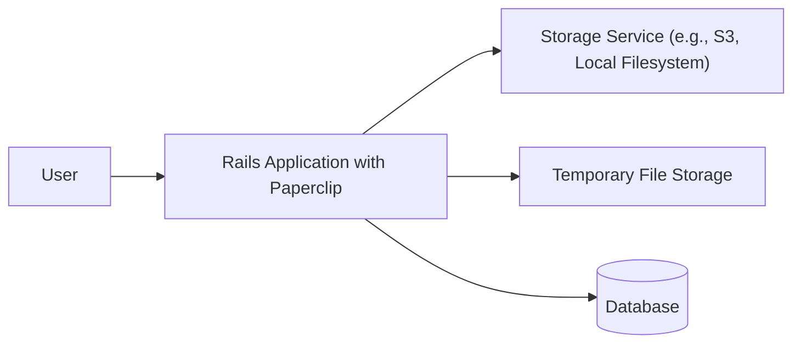
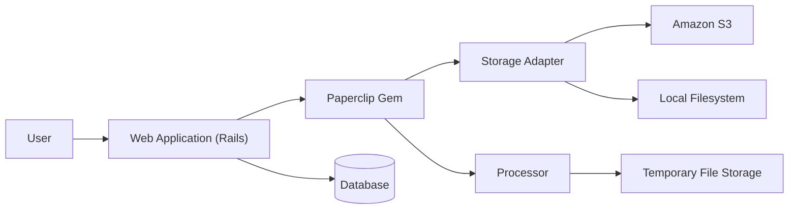
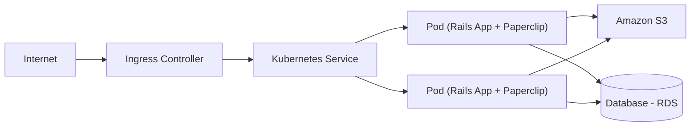
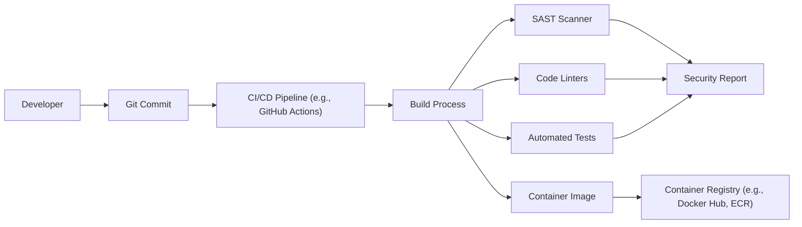

# BUSINESS POSTURE

Business Priorities and Goals:

*   Provide a robust and reliable file attachment library for Ruby on Rails applications.
*   Simplify the process of handling file uploads and storage for developers.
*   Offer flexibility in terms of storage options (local file system, cloud storage).
*   Maintain a high level of security and data integrity for uploaded files.
*   Provide good performance and scalability for applications handling a large number of file attachments.
*   Ensure compatibility with various Rails versions and maintain a well-documented and easy-to-use API.

Most Important Business Risks:

*   Data breaches or unauthorized access to uploaded files.
*   Data loss due to storage failures or misconfiguration.
*   Performance bottlenecks or scalability issues affecting application responsiveness.
*   Vulnerabilities in the library that could be exploited by attackers.
*   Incompatibility with future Rails versions or dependencies, leading to application breakage.
*   Lack of support for required storage providers or features.

# SECURITY POSTURE

Existing Security Controls:

*   security control: File type validation using a whitelist approach (paperclip/lib/paperclip/validators/attachment_content_type_validator.rb).
*   security control: File size validation (paperclip/lib/paperclip/validators/attachment_size_validator.rb).
*   security control: Storage abstraction to support multiple storage backends (local, S3, etc.) (paperclip/lib/paperclip/storage).
*   security control: Use of temporary files for processing to minimize exposure (paperclip/lib/paperclip/io_adapters).
*   security control: Sanitization of filenames to prevent directory traversal attacks (paperclip/lib/paperclip/interpolations.rb).
*   security control: Regular expression checks for allowed and forbidden content types.
*   security control: Documentation advising secure configuration and usage.

Accepted Risks:

*   accepted risk: Reliance on external libraries (e.g., `cocaine` for command-line execution, `mime-types` for MIME type detection). Potential vulnerabilities in these dependencies could impact Paperclip.
*   accepted risk: The default configuration might not be suitable for all security contexts. Users are responsible for configuring Paperclip according to their specific security requirements.
*   accepted risk: Storage provider security is ultimately the responsibility of the user. Paperclip provides the abstraction, but the user must ensure the chosen storage provider is securely configured.

Recommended Security Controls:

*   security control: Implement integrity checks (e.g., checksums or digital signatures) to verify the integrity of uploaded files after storage and before retrieval.
*   security control: Provide options for encryption at rest for sensitive files, integrating with storage provider encryption capabilities or offering application-level encryption.
*   security control: Integrate with a security scanner to automatically scan uploaded files for malware or other malicious content.
*   security control: Implement more robust logging and auditing of file operations (upload, download, deletion) to facilitate security monitoring and incident response.
*   security control: Provide built-in support for Content Security Policy (CSP) headers to mitigate XSS risks associated with displaying user-uploaded content.

Security Requirements:

*   Authentication: Not directly applicable to Paperclip itself, as it relies on the application's authentication mechanisms. However, Paperclip should ensure that file access is properly authorized based on the application's authentication context.
*   Authorization: Paperclip should integrate with the application's authorization system to enforce access control policies on uploaded files. This includes restricting access to files based on user roles, permissions, or other criteria.
*   Input Validation: Paperclip already implements file type and size validation. These should be configurable by the user and enforced rigorously. Additional validation, such as filename sanitization and content inspection, should be considered.
*   Cryptography: Paperclip should support encryption at rest and in transit, depending on the storage provider and application requirements. This may involve integrating with storage provider encryption features or implementing application-level encryption. Key management should be carefully considered.

# DESIGN

## C4 CONTEXT

Element Description:

*   Element:
    *   Name: User
    *   Type: Person
    *   Description: A user interacting with the Rails application that uses Paperclip.
    *   Responsibilities: Uploading files, viewing files, potentially deleting files.
    *   Security controls: Authentication and authorization are handled by the Rails application, not directly by Paperclip.

*   Element:
    *   Name: Rails Application with Paperclip
    *   Type: Software System
    *   Description: The Ruby on Rails application that integrates the Paperclip gem for file attachment management.
    *   Responsibilities: Handling user requests, processing file uploads, storing files, retrieving files, managing file metadata.
    *   Security controls: File type validation, file size validation, filename sanitization, storage abstraction.

*   Element:
    *   Name: Storage Service (e.g., S3, Local Filesystem)
    *   Type: External System
    *   Description: The storage service used to store the uploaded files. This could be a cloud storage service like Amazon S3 or the local filesystem.
    *   Responsibilities: Storing files persistently, providing access to stored files.
    *   Security controls: Dependent on the specific storage service. Encryption at rest, access control lists (ACLs), and other security features should be configured by the user.

*   Element:
    *   Name: Temporary File Storage
    *   Type: External System
    *   Description: Temporary storage used during file processing.
    *   Responsibilities: Holding files temporarily during upload and processing.
    *   Security controls: Should be configured with appropriate permissions to prevent unauthorized access.

*   Element:
    *   Name: Database
    *   Type: External System
    *   Description: Database used by Rails application.
    *   Responsibilities: Store file metadata (filename, content type, size, storage location).
    *   Security controls: Database security best practices (access control, encryption, etc.).

## C4 CONTAINER

Element Description:

*   Element:
    *   Name: User
    *   Type: Person
    *   Description: A user interacting with the Rails application.
    *   Responsibilities: Uploading, viewing, and potentially deleting files.
    *   Security controls: Authentication and authorization are handled by the Rails application.

*   Element:
    *   Name: Web Application (Rails)
    *   Type: Web Application
    *   Description: The Ruby on Rails application that uses Paperclip.
    *   Responsibilities: Handling user requests, interacting with the Paperclip gem, managing application logic.
    *   Security controls: Application-level security controls, including authentication, authorization, and input validation.

*   Element:
    *   Name: Paperclip Gem
    *   Type: Library
    *   Description: The Paperclip library integrated into the Rails application.
    *   Responsibilities: Handling file uploads, processing files, interacting with storage adapters.
    *   Security controls: File type validation, file size validation, filename sanitization.

*   Element:
    *   Name: Storage Adapter
    *   Type: Component
    *   Description: An abstraction layer within Paperclip that handles communication with different storage services.
    *   Responsibilities: Providing a consistent interface for interacting with various storage backends.
    *   Security controls: Abstracting storage-specific security configurations.

*   Element:
    *   Name: Amazon S3
    *   Type: External System
    *   Description: Amazon S3 cloud storage service.
    *   Responsibilities: Storing files persistently.
    *   Security controls: S3 security features (bucket policies, IAM roles, encryption).

*   Element:
    *   Name: Local Filesystem
    *   Type: External System
    *   Description: The server's local filesystem.
    *   Responsibilities: Storing files persistently.
    *   Security controls: Filesystem permissions, operating system security.

*   Element:
    *   Name: Processor
    *   Type: Component
    *   Description: Component within Paperclip responsible for processing files (e.g., resizing images).
    *   Responsibilities: Performing transformations on uploaded files.
    *   Security controls: Secure handling of temporary files.

*   Element:
    *   Name: Temporary File Storage
    *   Type: External System
    *   Description: Temporary storage used during file processing.
    *   Responsibilities: Holding files temporarily.
    *   Security controls: Appropriate permissions to prevent unauthorized access.

*   Element:
    *   Name: Database
    *   Type: External System
    *   Description: Database used by Rails application.
    *   Responsibilities: Store file metadata.
    *   Security controls: Database security best practices.

## DEPLOYMENT

Possible Deployment Solutions:

1.  Traditional Server Deployment (e.g., using Capistrano, AWS Elastic Beanstalk, Heroku).
2.  Containerized Deployment (e.g., using Docker, Kubernetes, AWS ECS, Google Kubernetes Engine).
3.  Serverless Deployment (e.g., using AWS Lambda, Google Cloud Functions, Azure Functions - less likely for Paperclip's core functionality, but could be used for specific processing tasks).

Chosen Solution (Containerized Deployment with Kubernetes):

Element Description:

*   Element:
    *   Name: Internet
    *   Type: External System
    *   Description: The public internet.
    *   Responsibilities: Routing traffic to the application.
    *   Security controls: Firewall, DDoS protection.

*   Element:
    *   Name: Ingress Controller
    *   Type: Infrastructure
    *   Description: Manages external access to the services in a Kubernetes cluster, typically HTTP.
    *   Responsibilities: Routing external traffic to the appropriate Kubernetes service.
    *   Security controls: TLS termination, potentially web application firewall (WAF).

*   Element:
    *   Name: Kubernetes Service
    *   Type: Infrastructure
    *   Description: An abstraction which defines a logical set of Pods and a policy by which to access them.
    *   Responsibilities: Providing a stable endpoint for accessing the application pods.
    *   Security controls: Network policies.

*   Element:
    *   Name: Pod (Rails App + Paperclip)
    *   Type: Container
    *   Description: A Kubernetes pod running the Rails application with the Paperclip gem. Multiple pods can exist for scalability and redundancy.
    *   Responsibilities: Handling user requests, processing file uploads, interacting with storage and database.
    *   Security controls: Container security best practices (least privilege, image scanning).

*   Element:
    *   Name: Amazon S3
    *   Type: External System
    *   Description: Amazon S3 cloud storage service.
    *   Responsibilities: Storing files persistently.
    *   Security controls: S3 security features (bucket policies, IAM roles, encryption).

*   Element:
    *   Name: Database - RDS
    *   Type: External System
    *   Description: Managed database service (e.g., Amazon RDS).
    *   Responsibilities: Storing file metadata.
    *   Security controls: Database security best practices (access control, encryption, network isolation).

## BUILD

Build Process Description:

1.  Developer commits code to a Git repository.
2.  A CI/CD pipeline (e.g., GitHub Actions, Jenkins) is triggered.
3.  The build process starts, which typically includes:
    *   Checking out the code.
    *   Setting up the build environment (installing dependencies).
    *   Running code linters to enforce code style and identify potential issues.
    *   Running static application security testing (SAST) tools to scan the code for vulnerabilities.
    *   Running automated tests (unit tests, integration tests).
    *   Building a container image (e.g., Docker image) that includes the application and its dependencies.
    *   Pushing the container image to a container registry (e.g., Docker Hub, Amazon ECR).

Security Controls:

*   security control: SAST scanning to identify vulnerabilities in the code.
*   security control: Code linters to enforce coding standards and prevent common errors.
*   security control: Automated tests to ensure code quality and prevent regressions.
*   security control: Container image scanning to identify vulnerabilities in the container image.
*   security control: Securely managing secrets and credentials used in the build process.
*   security control: Using signed commits to ensure the integrity of the code.
*   security control: Using a secure container registry with access control.

# RISK ASSESSMENT

Critical Business Processes:

*   File upload and storage: Ensuring users can reliably upload and store files.
*   File retrieval: Ensuring users can access their uploaded files when needed.
*   Application functionality: Maintaining the overall functionality of the Rails application that relies on Paperclip.

Data We Are Trying to Protect and Sensitivity:

*   Uploaded files: Sensitivity varies greatly depending on the application. Could range from non-sensitive public files to highly confidential documents or personal data.
*   File metadata (filename, content type, size, storage location): Moderately sensitive. Could be used to infer information about the uploaded files or the application.
*   Database credentials, storage service credentials: Highly sensitive. Must be protected to prevent unauthorized access to data.

# QUESTIONS & ASSUMPTIONS

Questions:

*   What types of files will be uploaded? (This is crucial for determining appropriate validation and security measures.)
*   What is the expected volume of file uploads and downloads? (This impacts scalability requirements.)
*   What are the specific security requirements of the application and its users? (e.g., compliance requirements, data sensitivity)
*   What storage providers are being considered? (Each provider has different security considerations.)
*   What is the existing infrastructure and deployment process?
*   Are there any existing security policies or guidelines that need to be followed?

Assumptions:

*   BUSINESS POSTURE: The application using Paperclip has a moderate risk appetite, balancing the need for functionality and ease of use with security concerns.
*   SECURITY POSTURE: The development team is familiar with basic security best practices but may not have extensive security expertise.
*   DESIGN: The application will use a cloud-based storage provider (e.g., Amazon S3) for storing uploaded files. The application will be deployed using a containerized approach (e.g., Docker, Kubernetes). A CI/CD pipeline will be used for building and deploying the application.