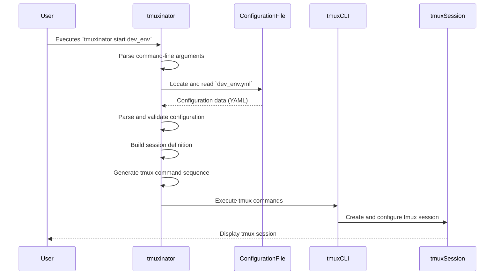

# Project Design Document: tmuxinator

**Version:** 1.1
**Date:** October 26, 2023
**Author:** AI Software Architect

## 1. Project Overview

tmuxinator is a Ruby gem designed to streamline the management of complex tmux sessions. It empowers users to define their desired tmux environment – including windows, panes, and the commands to be executed within them – using declarative YAML configuration files. Upon invocation, tmuxinator interprets this configuration and automatically constructs the tmux session, eliminating the manual and repetitive process of setting up environments. This significantly enhances productivity for developers and system administrators who frequently work with multiple tmux sessions.

This document provides a detailed design of tmuxinator, specifically intended to serve as a foundation for subsequent threat modeling activities. It meticulously outlines the core components, the flow of data, and potential areas where security vulnerabilities might arise.

## 2. Goals

*   Enable users to define tmux session layouts in a declarative and human-readable format.
*   Automate the creation and setup of tmux sessions, windows, and panes based on predefined configurations.
*   Allow specification of commands to be automatically executed within designated panes upon session creation.
*   Provide a user-friendly and intuitive command-line interface for interacting with tmuxinator.
*   Maintain compatibility with various versions of tmux.
*   Ensure a straightforward installation and configuration process.

## 3. Non-Goals

*   To manage the installation, configuration, or lifecycle of the tmux application itself.
*   To offer a graphical user interface (GUI) for managing tmux sessions or tmuxinator configurations.
*   To implement advanced session sharing or collaborative features beyond the inherent capabilities of tmux.
*   To function as a general-purpose process manager outside the context of tmux sessions.
*   To provide real-time monitoring or dynamic control of tmux sessions after their initial setup.

## 4. Architecture Overview

The architecture of tmuxinator is centered around the processing of configuration files and the orchestration of the tmux command-line interface.

```mermaid
flowchart LR
    subgraph "User Domain"
        A("User")
    end
    subgraph "tmuxinator Application"
        B("CLI Argument Parser")
        C("Configuration File Locator")
        D("Configuration Parser")
        E("Session Definition Builder")
        F("tmux Command Generator")
        G("tmux Command Executor")
    end
    subgraph "System Components"
        H("Configuration File (.yml)")
        I("tmux CLI")
    end

    A --> B
    B --> C
    C --> D
    D --> E
    E --> F
    F --> G
    G --> I
    H --> D
    I -- Executes Commands --> "tmux Session"
    "tmux Session" -- Displays --> A
```

**Component Descriptions:**

*   **User:** The individual interacting with tmuxinator through the command-line interface.
*   **CLI Argument Parser:** Responsible for interpreting commands and options provided by the user via the command line (e.g., `tmuxinator start my_project`).
*   **Configuration File Locator:** Determines the location of the project's YAML configuration file based on naming conventions and default search paths.
*   **Configuration Parser:** Reads and parses the YAML configuration file into an internal data structure that tmuxinator can understand.
*   **Session Definition Builder:**  Interprets the parsed configuration data and constructs a representation of the desired tmux session layout, including windows, panes, and commands.
*   **tmux Command Generator:** Translates the session definition into a sequence of specific `tmux` commands required to create the desired environment.
*   **tmux Command Executor:** Executes the generated `tmux` commands using the system's command execution capabilities.
*   **Configuration File (.yml):** The YAML file containing the declarative specification of the tmux session layout, windows, panes, and commands.
*   **tmux CLI:** The command-line interface of tmux, which tmuxinator interacts with to manage sessions.

## 5. Component Details

### 5.1. CLI Argument Parser

*   **Responsibility:**  Handles the initial processing of user commands.
*   **Functionality:**
    *   Identifies the specific action requested by the user (e.g., `start`, `stop`, `edit`).
    *   Extracts the target project name or other relevant parameters.
    *   Parses any options or flags provided with the command.
    *   Provides basic validation of the command syntax.
*   **Implementation:** Likely utilizes a Ruby library for command-line argument parsing, such as `OptionParser`.

### 5.2. Configuration File Locator

*   **Responsibility:**  Finds the correct configuration file for a given project.
*   **Functionality:**
    *   Searches for configuration files based on the project name in predefined locations (e.g., `~/.tmuxinator`, `$XDG_CONFIG_HOME/tmuxinator`).
    *   Supports different file naming conventions (e.g., `project_name.yml`, `project_name.yaml`).
    *   Handles cases where the configuration file is not found.
*   **Implementation:** Involves file system operations and path manipulation in Ruby.

### 5.3. Configuration Parser

*   **Responsibility:**  Reads and interprets the contents of the YAML configuration file.
*   **Functionality:**
    *   Reads the YAML file from disk.
    *   Parses the YAML content into a structured data format (e.g., Ruby hashes and arrays).
    *   Performs basic validation of the configuration structure and data types to ensure it conforms to the expected schema.
    *   Handles potential errors during file reading or YAML parsing.
*   **Implementation:** Relies on a Ruby YAML parsing library, such as `Psych`.

### 5.4. Session Definition Builder

*   **Responsibility:**  Transforms the parsed configuration into a logical representation of the tmux session.
*   **Functionality:**
    *   Interprets the configuration directives for windows, panes, and commands.
    *   Builds an internal model of the desired tmux session structure.
    *   Resolves dependencies and relationships between windows and panes.
    *   Handles features like `root` directories, `before_start`, and `after_start` hooks.
*   **Implementation:**  Core logic of tmuxinator, involving object manipulation and algorithmic processing of the configuration data.

### 5.5. tmux Command Generator

*   **Responsibility:**  Creates the specific `tmux` commands needed to realize the session definition.
*   **Functionality:**
    *   Translates the abstract session definition into a concrete sequence of `tmux` commands.
    *   Constructs commands for creating sessions, windows, splitting panes, and sending commands.
    *   Handles different versions of tmux and their command syntax variations.
*   **Implementation:**  Involves string formatting and conditional logic to generate the appropriate `tmux` commands.

### 5.6. tmux Command Executor

*   **Responsibility:**  Executes the generated `tmux` commands.
*   **Functionality:**
    *   Utilizes Ruby's system execution capabilities to run the `tmux` command-line tool.
    *   Captures the standard output and standard error streams from the `tmux` command.
    *   Handles potential errors returned by the `tmux` command.
*   **Implementation:**  Leverages Ruby's standard library methods for interacting with the operating system's command execution environment (e.g., backticks, `system`, `Open3`).

## 6. Data Flow

The primary flow of data involves the user initiating a command, tmuxinator processing the configuration, and subsequently instructing tmux to create the desired session.



**Detailed Data Flow Description:**

1. The user initiates an action by executing a `tmuxinator` command in their terminal, specifying the desired operation and target project (e.g., `tmuxinator start my_project`).
2. The CLI Argument Parser within tmuxinator receives the command and extracts the relevant information, such as the action and project name.
3. The Configuration File Locator uses the project name to locate the corresponding YAML configuration file within the designated directories.
4. The Configuration Parser reads the contents of the identified YAML file.
5. The Configuration Parser parses the YAML data into an internal data structure that represents the configuration.
6. The Session Definition Builder takes the parsed configuration data and constructs a logical model of the desired tmux session, including windows, panes, and their associated commands.
7. The tmux Command Generator translates this session definition into a sequence of specific `tmux` commands required to create the described environment. These commands might include:
    *   `tmux new-session -d -s <session_name>` (to create a detached session)
    *   `tmux new-window -n <window_name>` (to create a new window)
    *   `tmux split-window -h` or `tmux split-window -v` (to split panes horizontally or vertically)
    *   `tmux send-keys -t <target_pane> "<command>"` (to send commands to a specific pane)
    *   `tmux select-pane -t <target_pane>` (to select a specific pane)
    *   `tmux attach-session -t <session_name>` (to attach the session to the user's terminal).
8. The tmux Command Executor executes these generated `tmux` commands using the system's command execution capabilities.
9. The `tmux` CLI receives and processes these commands, creating and configuring the tmux session according to the instructions.
10. Finally, the newly created or attached tmux session is displayed to the user in their terminal.

## 7. Security Considerations

This section outlines potential security considerations relevant to tmuxinator, which should be thoroughly examined during threat modeling.

*   **Configuration File Parsing Vulnerabilities:**
    *   **YAML Deserialization Attacks:** If the YAML parsing library (`Psych`) has vulnerabilities, maliciously crafted YAML configuration files could potentially be used to execute arbitrary code on the user's system when parsed by tmuxinator. This could lead to remote code execution if an attacker can influence the configuration file.
    *   **Path Traversal:** If the Configuration File Locator does not properly sanitize or validate file paths, an attacker might be able to trick tmuxinator into loading configuration files from arbitrary locations outside the intended configuration directories, potentially leading to the execution of unintended commands or exposure of sensitive information.
*   **Command Injection Risks:**
    *   **Unsanitized Commands:** The configuration file allows users to specify commands to be executed within tmux panes. If these commands are not properly sanitized or escaped before being passed to the `tmux` command executor, it could create a command injection vulnerability. An attacker could craft malicious commands within the configuration file that would be executed with the privileges of the user running tmuxinator.
    *   **Interpretation of Special Characters:**  Care must be taken to ensure that special characters within commands specified in the configuration file are handled correctly to prevent unintended behavior or security exploits.
*   **Dependency Management Security:**
    *   **Vulnerable Dependencies:** tmuxinator relies on third-party Ruby gems. If these dependencies have known security vulnerabilities, they could be exploited to compromise tmuxinator or the user's system. Regular dependency updates and security audits are crucial.
*   **Permissions and Access Control:**
    *   **Configuration File Permissions:** The security of tmuxinator heavily relies on the integrity of the configuration files. If these files are writable by unauthorized users, attackers could modify them to inject malicious commands. Proper file system permissions are essential.
    *   **tmux Permissions:** tmux itself has a permission model. tmuxinator operates within the security context of the user running it. Understanding and adhering to tmux's security best practices is important.
*   **Environment Variable Exposure:**
    *   Commands executed within tmux panes might have access to environment variables. If sensitive information is stored in environment variables, it could potentially be exposed through commands defined in the configuration file.
*   **Error Handling and Information Disclosure:**
    *   Detailed error messages, while helpful for debugging, could potentially reveal sensitive information about the system or tmuxinator's internal workings to an attacker. Error handling should be carefully implemented to avoid excessive information disclosure.

## 8. Deployment

tmuxinator is typically deployed as a Ruby gem installed on a user's local system.

*   **Installation:** Users install tmuxinator using the RubyGems package manager with the command `gem install tmuxinator`.
*   **Configuration:** Configuration files are typically stored in the user's home directory under `.tmuxinator` or in the `$XDG_CONFIG_HOME/tmuxinator` directory.
*   **Execution:** Users interact with tmuxinator by running commands in their terminal. tmuxinator then interacts with the locally installed `tmux` application.

## 9. Future Considerations

*   **Enhanced Input Validation:** Implement more robust input validation for both command-line arguments and configuration file content to prevent various types of attacks.
*   **Secure Command Execution:** Explore safer methods for executing commands within tmux, potentially using APIs or more controlled execution environments if available.
*   **Configuration File Encryption:** Consider options for encrypting sensitive information within configuration files.
*   **Security Audits and Code Reviews:** Conduct regular security audits and code reviews to identify and address potential vulnerabilities.
*   **Support for More Secure Configuration Formats:** Investigate the possibility of supporting alternative configuration formats that might offer better security features.

This revised design document provides a more comprehensive and detailed overview of tmuxinator's architecture and includes expanded security considerations, making it a more effective resource for threat modeling activities.