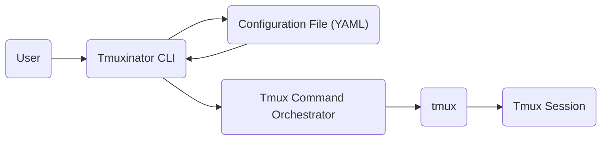
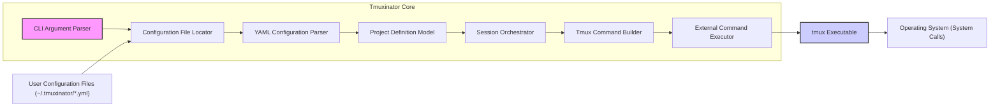

# Project Design Document: Tmuxinator

**Version:** 1.1
**Date:** October 26, 2023
**Author:** AI Software Architect

## 1. Introduction

This document provides an enhanced design overview of Tmuxinator, a Ruby gem designed to streamline the management of complex tmux sessions. It serves as a blueprint for understanding the system's architecture, individual components, and the flow of data within it. This detailed description is essential for conducting comprehensive threat modeling exercises.

## 2. Goals and Objectives

*   To furnish a clear, concise, and comprehensive explanation of Tmuxinator's functionalities.
*   To delineate the core architectural components and elucidate their interactions.
*   To meticulously describe the data flow within the application, highlighting key stages.
*   To proactively identify areas of potential security concern, thereby informing subsequent threat modeling activities with specific insights.

## 3. High-Level Architecture

Tmuxinator operates as a configuration-driven interface for the `tmux` command-line utility. Users define their desired tmux session structures—including windows, panes, and initial commands—within human-readable YAML configuration files. Tmuxinator then interprets these configurations and orchestrates the execution of corresponding `tmux` commands to materialize the specified environment.

## 4. Detailed Architecture

The subsequent diagram presents a more detailed breakdown of Tmuxinator's internal components and their interactions.

### 4.1 Components

*   **CLI Argument Parser:** This component, part of the "Tmuxinator CLI Entry Point" from the high-level view, is responsible for processing command-line arguments provided by the user (e.g., `start`, `stop`, project names). It determines the intended action and passes control to the appropriate internal modules.
*   **Configuration File Locator:**  This module searches the filesystem for the relevant YAML configuration file based on the project name provided by the user. It typically checks predefined directories and uses naming conventions to locate the correct file.
    *   Looks in `~/.tmuxinator/`
    *   Looks in `.tmuxinator/` in the current working directory.
*   **YAML Configuration Parser:**  Utilizes a YAML parsing library (likely `Psych` in Ruby's standard library) to convert the text-based YAML configuration file into a structured data representation that can be easily processed by Tmuxinator. This involves validating the YAML syntax and extracting the configuration parameters.
*   **Project Definition Model:** This internal data structure represents the parsed configuration data in an object-oriented format. It encapsulates all the information about a specific tmux project, including:
    *   Project name
    *   Window definitions (names, layout, start directory)
    *   Pane definitions within each window (layout, start directory, commands to execute)
    *   Pre and post commands to run at the session or window level.
*   **Session Orchestrator:** This is the core logic component that drives the tmux session creation process. It takes the Project Definition Model as input and determines the sequence of `tmux` commands needed to achieve the desired session layout. It manages the creation of sessions, windows, and panes in the correct order.
*   **Tmux Command Builder:**  This module is responsible for constructing the specific `tmux` commands as strings based on the instructions from the Session Orchestrator. It translates the abstract definitions in the Project Definition Model into concrete `tmux` command syntax. Examples include:
    *   `tmux new-session -d -s <session_name>`
    *   `tmux new-window -t <session_name>:<window_index> -n <window_name>`
    *   `tmux split-window -h -t <session_name>:<window_index>.0`
    *   `tmux send-keys -t <session_name>:<window_index>.<pane_index> "<command>" Enter`
*   **External Command Executor:** This component handles the execution of the generated `tmux` commands. It interacts with the operating system to invoke the `tmux` executable with the constructed command strings. This typically involves using Ruby's backtick operator (` `` `), `system()` calls, or similar mechanisms for executing external processes.
*   **User Configuration Files (~/.tmuxinator/*.yml):** These are YAML files created and maintained by users. They define the desired state of their tmux sessions for different projects. The structure of these files dictates how Tmuxinator will configure tmux.
*   **tmux Executable:**  This is the external, standalone command-line utility provided by tmux itself. Tmuxinator relies on this executable to perform the actual session management tasks.
*   **Operating System (System Calls):** The underlying operating system provides the necessary interfaces (system calls) for Tmuxinator to execute external commands like `tmux`.

## 5. Data Flow

The typical data flow within Tmuxinator unfolds as follows:

1. **User Initiates Action:** The user executes a Tmuxinator command via the command line, such as `tmuxinator start my_coding_project`.
2. **CLI Arguments Processed:** The CLI Argument Parser analyzes the command, identifying the action (`start`) and the target project (`my_coding_project`).
3. **Configuration File Located:** The Configuration File Locator searches for the configuration file associated with `my_coding_project`, typically looking for `~/.tmuxinator/my_coding_project.yml`.
4. **YAML Configuration Parsed:** The YAML Configuration Parser reads the content of the configuration file and transforms it into a structured data format within Tmuxinator.
5. **Project Model Instantiated:** The parsed data is used to create an instance of the Project Definition Model, which holds all the configuration details for the project in a programmatic way.
6. **Session Creation Orchestrated:** The Session Orchestrator analyzes the Project Definition Model and plans the sequence of steps required to build the tmux session.
7. **tmux Commands Generated:** The Tmux Command Builder constructs the specific `tmux` commands needed to create the sessions, windows, panes, and execute initial commands, based on the Session Orchestrator's plan.
8. **tmux Commands Executed:** The External Command Executor executes the generated `tmux` commands by invoking the `tmux` executable through system calls.
9. **tmux Session Established:** The `tmux` utility receives and processes the commands, creating the desired session, windows, and panes according to the specifications.
10. **User Interaction Begins:** The user can now interact with the newly created and configured tmux session.

## 6. Security Considerations (Pre-Threat Modeling)

Building upon the initial considerations, here are more detailed security aspects relevant for threat modeling:

*   **Configuration File Security:**
    *   **Permissions:** Ensure configuration files have appropriate permissions (e.g., readable only by the user) to prevent unauthorized viewing or modification of potentially sensitive data.
    *   **Secret Management:**  Discourage storing sensitive information directly in configuration files. Explore integration with secret management tools or environment variables as a more secure alternative.
    *   **Code Injection via Configuration:**  Carefully consider the implications of allowing arbitrary commands within configuration files. Thorough input validation and sanitization might be necessary if dynamic command generation based on configuration is implemented.
*   **Command Injection:**
    *   **`send-keys` Vulnerabilities:**  The `send-keys` functionality, while powerful, can be a significant attack vector if configuration files are compromised. Malicious commands could be injected into running tmux panes.
    *   **Input Sanitization:** Implement robust input sanitization for any user-provided commands or data within the configuration files to prevent the execution of unintended or malicious commands.
    *   **Least Privilege:** Consider the principle of least privilege when executing commands within tmux panes. Avoid running commands with unnecessary elevated privileges.
*   **Dependency Management:**
    *   **Vulnerability Scanning:** Regularly scan Tmuxinator's dependencies for known vulnerabilities using tools like `bundler-audit` or Dependabot.
    *   **Dependency Pinning:**  Pin dependency versions in the `Gemfile.lock` to ensure consistent and predictable behavior and to mitigate risks associated with unexpected updates.
*   **Privilege Escalation:**
    *   **tmux Socket Permissions:** Be aware of the permissions on the tmux server socket, as this can potentially be a point of interaction for unauthorized access or control.
    *   **Command Execution Context:** Understand the user context under which commands within tmux panes are executed. Ensure that users cannot easily escalate their privileges through commands initiated by Tmuxinator.
*   **Path Traversal:**
    *   **Configuration File Inclusion:** If Tmuxinator were to introduce features allowing the inclusion of other configuration files, strict validation of file paths would be crucial to prevent path traversal attacks.
    *   **Script Execution:** If configuration files allow the execution of external scripts, validate the paths to these scripts to prevent execution of arbitrary files.
*   **Denial of Service:**
    *   **Resource Exhaustion:**  Consider the potential for a malicious configuration file to cause excessive resource consumption (e.g., opening a very large number of windows or panes), leading to a denial-of-service condition.

## 7. Deployment

Tmuxinator is typically deployed as a Ruby gem, installed on a user's local machine or a development/server environment.

*   **Installation:** Users install Tmuxinator using the RubyGems package manager: `gem install tmuxinator`.
*   **Configuration:** Users create and manage YAML configuration files within designated directories (`~/.tmuxinator/` or `.tmuxinator/`).
*   **Execution:** Users interact with Tmuxinator through its command-line interface, executing commands like `mux start <project_name>` or `tmuxinator open <project_name>`.

## 8. Future Considerations

*   **Enhanced Security Features:**
    *   Integration with secure secret storage mechanisms (e.g., HashiCorp Vault, environment variables).
    *   More granular control over command execution within panes.
    *   Configuration file validation against a schema to prevent syntax errors and potential vulnerabilities.
*   **More Flexible Configuration Options:**
    *   Support for templating within configuration files.
    *   Conditional configuration based on environment variables or other factors.
*   **GUI or Web Interface:** Explore the feasibility of a graphical user interface or a web-based interface for managing Tmuxinator configurations, potentially improving usability for some users.
*   **Improved Error Handling and Reporting:** Provide more informative error messages and logging to aid in debugging and troubleshooting configuration issues.
*   **Plugin System:** Allow users to extend Tmuxinator's functionality through a plugin architecture.

This enhanced design document provides a more in-depth understanding of Tmuxinator's architecture, components, and data flow. The expanded security considerations section offers a more comprehensive starting point for conducting a thorough threat model.