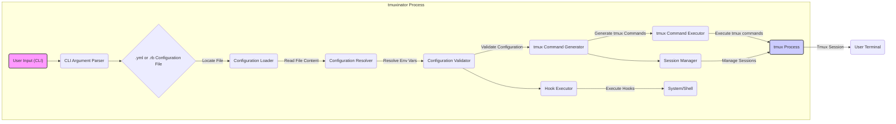

# Project Design Document: tmuxinator

**Version:** 1.1
**Date:** October 26, 2023
**Author:** Gemini (AI Language Model)

## 1. Introduction

This document provides a detailed design overview of tmuxinator, a Ruby gem used to manage complex tmux sessions. This document aims to provide a comprehensive understanding of the system's architecture, components, and data flow, which will serve as the foundation for subsequent threat modeling activities.

### 1.1. Purpose

The primary purpose of this document is to describe the design of tmuxinator in sufficient detail to facilitate effective threat modeling. It outlines the key components, their interactions, and the data they process, focusing on potential attack surfaces and security considerations.

### 1.2. Scope

This document covers the core functionality of tmuxinator, including:

*   Configuration file parsing (YAML and Ruby).
*   Resolution of environment variables within configurations.
*   tmux command generation and execution for session, window, and pane management.
*   Execution of commands within panes upon creation.
*   Session management operations (start, stop, list, attach).
*   Hook execution at various stages of the session lifecycle.
*   CLI interface and argument parsing.

### 1.3. Goals

*   Provide a clear and concise description of tmuxinator's architecture and its internal workings.
*   Identify key components and their specific responsibilities and dependencies.
*   Illustrate the data flow within the system, highlighting data transformations and potential injection points.
*   Serve as a robust basis for identifying potential security vulnerabilities and attack vectors.

## 2. System Overview

tmuxinator is a command-line tool that simplifies the creation and management of tmux sessions by using declarative configuration files. It abstracts away the complexity of manually creating tmux sessions, windows, and panes, allowing users to define their desired environment in a structured format.

### 2.1. Key Components

*   **CLI (Command Line Interface):** The primary interface for user interaction, responsible for parsing commands and delegating actions.
*   **Configuration Loader:**  Locates, reads, and parses configuration files, supporting both YAML and Ruby formats, and handles environment variable substitution.
*   **Configuration Resolver:**  Resolves and substitutes environment variables referenced within the configuration file.
*   **Configuration Validator:** Ensures the loaded configuration adheres to the defined schema and contains semantically correct data.
*   **tmux Command Generator:** Translates the validated configuration into a sequence of specific `tmux` commands.
*   **tmux Command Executor:** Executes the generated `tmux` commands using system calls to interact with the `tmux` process.
*   **Session Manager:**  Manages the lifecycle of tmux sessions, including creation, attachment, listing, and stopping.
*   **Hook Executor:** Executes user-defined scripts or commands at predefined points in the session lifecycle.

### 2.2. High-Level Architecture Diagram

## 3. Detailed Design

### 3.1. CLI (Command Line Interface)

*   **Responsibility:**  Serves as the entry point for user interaction. It parses command-line arguments, such as `start`, `stop`, `list`, and the project name, and then invokes the corresponding tmuxinator functionality.
*   **Implementation:** Likely implemented using a Ruby gem for command-line parsing, such as `thor` or `optparse`, to handle argument parsing and command dispatch.
*   **Input:** Command-line arguments provided by the user.
*   **Output:**  Invocation of specific tmuxinator components with relevant parameters based on the parsed arguments.

### 3.2. Configuration Loader

*   **Responsibility:**  Locates and reads configuration files based on the provided project name. It supports both YAML (`.yml`) and Ruby (`.rb`) file formats.
*   **Implementation:**
    *   **File Location:** Searches for configuration files in a predefined set of directories, typically including `~/.tmuxinator/`, `$XDG_CONFIG_HOME/tmuxinator/`, and potentially others.
    *   **File Reading:** Uses standard Ruby file reading mechanisms to access the file content.
*   **Input:** The project name provided by the CLI.
*   **Output:**  The raw content of the configuration file as a string.

### 3.3. Configuration Resolver

*   **Responsibility:**  Identifies and substitutes environment variables referenced within the configuration file. This allows for dynamic configuration based on the user's environment.
*   **Implementation:**  Uses regular expressions to find environment variable placeholders (e.g., `$VAR_NAME` or `${VAR_NAME}`) within the configuration string and then retrieves the corresponding values from the system's environment variables.
*   **Input:** The raw content of the configuration file.
*   **Output:**  The configuration content with environment variables resolved.

### 3.4. Configuration Validator

*   **Responsibility:**  Ensures the loaded and resolved configuration is valid and adheres to the expected schema. This includes checking for required keys, valid data types for values, and logical consistency between configuration elements.
*   **Implementation:**
    *   **YAML:** Uses a YAML parsing library (e.g., `Psych`) to parse the YAML content into a Ruby data structure and then performs validation checks on this structure.
    *   **Ruby:** Executes the Ruby configuration file, and relies on the structure and logic within the Ruby file to define the configuration. Validation might involve checking the types and presence of specific attributes within the resulting Ruby object.
*   **Input:** The resolved configuration data (either a Ruby data structure from YAML or the result of executing a Ruby file).
*   **Output:**  Indication of whether the configuration is valid or a list of validation errors, including details about the invalid elements.

### 3.5. tmux Command Generator

*   **Responsibility:**  Translates the validated configuration data into a sequence of `tmux` commands necessary to create the desired session, windows, panes, and layouts. This involves mapping configuration directives to specific `tmux` command syntax.
*   **Implementation:**  Iterates through the validated configuration data structure and constructs the appropriate `tmux` command strings. This involves string interpolation and careful construction of command arguments based on the configuration.
*   **Input:** The validated configuration data structure.
*   **Output:**  An ordered list of `tmux` command strings ready for execution.

### 3.6. tmux Command Executor

*   **Responsibility:**  Executes the generated `tmux` commands. This involves making system calls to the `tmux` executable.
*   **Implementation:**  Uses Ruby's `system` method, backticks (` `` `), or the `Open3` module to execute the `tmux` commands as external processes. `Open3` provides more control over input, output, and error streams.
*   **Input:**  A `tmux` command string.
*   **Output:**  The exit code of the executed command and potentially the standard output and standard error streams.

### 3.7. Session Manager

*   **Responsibility:**  Provides functionality for managing tmux sessions. This includes checking if a session with a given name already exists, attaching to an existing session, and listing available sessions.
*   **Implementation:**  Relies on executing specific `tmux` commands via the `tmux Command Executor`, such as `tmux has-session -t <session_name>`, `tmux attach-session -t <session_name>`, and `tmux list-sessions`.
*   **Input:**  Session name or other session identifiers.
*   **Output:**  Information about the session status or the result of the management operation (e.g., success or failure).

### 3.8. Hook Executor

*   **Responsibility:**  Executes user-defined scripts or commands specified in the configuration file at designated points in the session lifecycle (e.g., `before_start`, `after_start`).
*   **Implementation:**  Uses Ruby's `system` method or similar mechanisms to execute the hook commands as external processes. The hook commands are typically defined as strings within the configuration.
*   **Input:**  The hook command string and the context in which the hook is being executed.
*   **Output:**  The exit code of the executed hook command and potentially the standard output and standard error streams.

### 3.9. Data Flow (Detailed)

1. The user enters a command like `tmuxinator start my_project` in the terminal.
2. The **CLI Argument Parser** within tmuxinator parses the command, identifying the action (`start`) and the project name (`my_project`).
3. The **Configuration Loader** is invoked with the project name. It searches for `my_project.yml` or `my_project.rb` in the configured directories.
4. The **Configuration Loader** reads the content of the found configuration file.
5. The **Configuration Resolver** scans the file content for environment variables (e.g., `$HOME`, `${PROJECT_PATH}`) and replaces them with their current values.
6. The **Configuration Validator** parses the resolved content (either as YAML or by executing the Ruby code) and validates it against the expected schema and rules.
7. If the configuration is valid, the **tmux Command Generator** iterates through the configuration and constructs a series of `tmux` commands. For example, for each window and pane defined, it generates commands like `tmux new-window -n "my_window"` and `tmux split-window -v`.
8. The **tmux Command Executor** takes each generated `tmux` command and executes it using a system call.
9. The **Session Manager** might be involved to check if the session already exists or to attach to the newly created session.
10. The **Hook Executor** is invoked at various stages. For example, if a `pre_window` hook is defined, it will be executed before creating each window. Similarly, `post_session` hooks are executed after the session is created.

## 4. Security Considerations (For Threat Modeling)

This section expands on the initial security considerations, providing more specific examples and potential attack vectors.

*   **Configuration File Parsing Vulnerabilities:**
    *   **YAML Deserialization:**  Using older versions of YAML parsing libraries can expose the application to vulnerabilities where maliciously crafted YAML files can lead to arbitrary code execution during the deserialization process. An attacker could craft a YAML file that, when parsed, executes arbitrary commands on the system.
    *   **Unsafe `instance_eval` (Ruby):** If using `instance_eval` or similar methods to execute Ruby code from configuration files, this allows for arbitrary code execution if the configuration source is untrusted. An attacker could inject malicious Ruby code into the configuration file.
*   **Command Injection Vulnerabilities:**
    *   **Unsanitized Input in `tmux` Commands:** If data from the configuration file (which might originate from user input or external sources) is directly embedded into `tmux` command strings without proper sanitization or escaping, an attacker could inject arbitrary `tmux` commands. For example, a malicious window name could include shell metacharacters.
    *   **Hook Command Injection:**  If the commands specified in hook definitions are not carefully handled, an attacker who can modify the configuration file could inject arbitrary shell commands that will be executed by the `Hook Executor`.
*   **Path Traversal Vulnerabilities:**
    *   **Unvalidated Configuration File Paths:** If tmuxinator allows specifying include paths or other file paths within the configuration, and these paths are not properly validated, an attacker could potentially read or access arbitrary files on the system.
*   **Environment Variable Injection:**
    *   While environment variable substitution is a feature, if the source of environment variables is not carefully considered (e.g., relying on user-controlled environment variables), it could lead to unexpected behavior or security vulnerabilities. An attacker might be able to influence the configuration by setting specific environment variables.
*   **Dependency Vulnerabilities:**
    *   tmuxinator relies on Ruby gems. Vulnerabilities in these dependencies (e.g., the YAML parsing library) could be exploited if not kept up-to-date.
*   **Insufficient Input Validation:**
    *   Beyond just schema validation, insufficient validation of the *values* within the configuration could lead to unexpected behavior or vulnerabilities. For example, excessively long names or invalid characters could cause issues.
*   **Information Disclosure:**
    *   Error messages or logging that reveal sensitive information about file paths, environment variables, or internal workings could be exploited by attackers.

## 5. Future Considerations (Out of Scope for Current Threat Model)

These are potential future enhancements that are not part of the current design but might be considered later.

*   **GUI Interface:** Providing a graphical user interface for creating and managing tmuxinator configurations.
*   **Remote Management Capabilities:** Allowing users to manage tmux sessions on remote servers through tmuxinator.
*   **Plugin System:** Enabling users to extend tmuxinator functionality through a plugin architecture. This would introduce new considerations regarding plugin security and trust.

This improved document provides a more detailed and nuanced understanding of tmuxinator's design, offering a stronger foundation for identifying and mitigating potential security threats. The expanded security considerations section highlights specific areas that require careful attention during the threat modeling process.