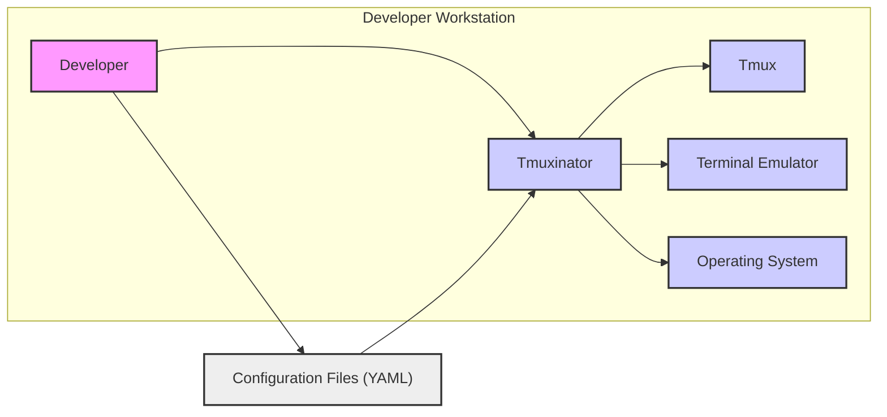
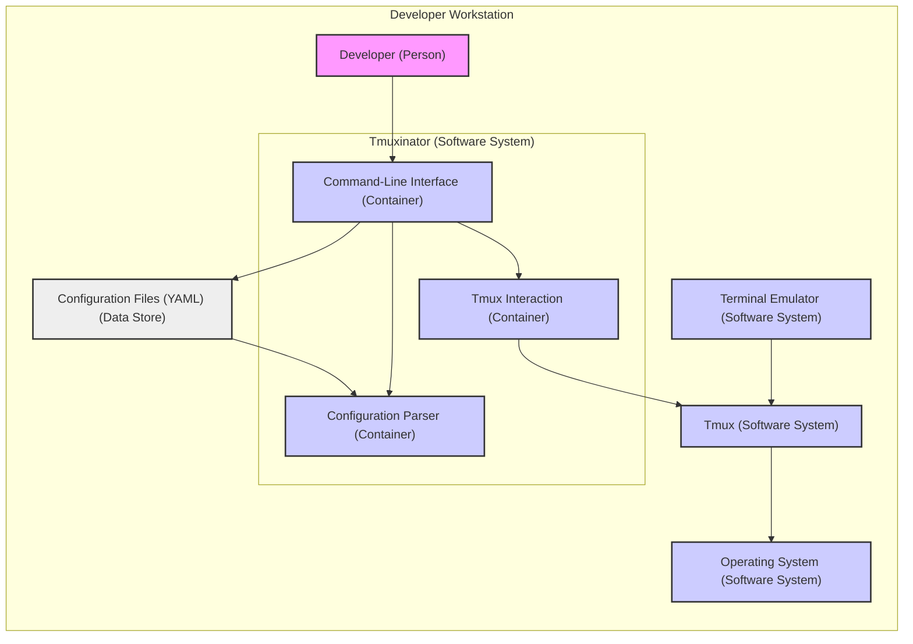
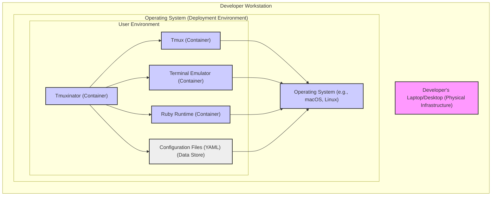

# BUSINESS POSTURE

This project, tmuxinator, is an open-source tool designed to enhance developer productivity by simplifying the management of tmux sessions. It allows users to define and manage complex tmux layouts and configurations through simple YAML files.

* Business Priorities and Goals:
  - Primary goal: Increase developer productivity by streamlining tmux session management.
  - Secondary goal: Provide a user-friendly and configurable tool for tmux users.
  - Tertiary goal: Foster an open-source community around tmux session management.

* Business Risks:
  - Risk 1: Loss of developer productivity due to tool malfunction or unexpected behavior. This is a low impact risk as tmuxinator is a productivity enhancement tool, not a critical system dependency.
  - Risk 2: Security vulnerabilities in tmuxinator could potentially compromise developer workstations if exploited. This risk is moderate, as tmuxinator operates locally but handles configuration files that could be manipulated.
  - Risk 3: Lack of adoption or community support could lead to project stagnation and reduced value over time. This is a low impact risk as the project is already established and has a user base.

# SECURITY POSTURE

* Existing Security Controls:
  - security control: Code hosted on GitHub, leveraging GitHub's infrastructure security. Implemented by: GitHub.
  - security control: Open-source project, allowing community review and contributions. Implemented by: Open-source nature of the project.
  - security control: RubyGems package distribution. Implemented by: RubyGems infrastructure.

* Accepted Risks:
  - accepted risk: Reliance on RubyGems infrastructure for package integrity and availability.
  - accepted risk: Potential vulnerabilities in dependencies (Ruby gems).
  - accepted risk: Limited formal security testing or audits.

* Recommended Security Controls:
  - security control: Implement automated security scanning (SAST/DAST) in the CI/CD pipeline.
  - security control: Dependency vulnerability scanning to identify and address vulnerable Ruby gems.
  - security control: Regularly update dependencies to patch known vulnerabilities.
  - security control: Provide clear security guidelines for users regarding configuration file security.

* Security Requirements:
  - Authentication: Not applicable. Tmuxinator is a local command-line tool and does not handle user authentication.
  - Authorization: Not applicable. Tmuxinator operates within the user's local environment and relies on the operating system's user permissions.
  - Input Validation:
    - Requirement: Validate user-provided YAML configuration files to prevent unexpected behavior or potential vulnerabilities.
    - Requirement: Sanitize user inputs in command-line arguments to prevent command injection.
  - Cryptography: Not applicable. Tmuxinator does not handle sensitive data that requires encryption. However, consider potential future features that might require secure storage of credentials or sensitive information.

# DESIGN

## C4 CONTEXT

* Context Diagram Elements:
  - Element:
    - Name: Developer
    - Type: Person
    - Description: A software developer who uses tmuxinator to manage tmux sessions for increased productivity.
    - Responsibilities: Defines tmux session configurations in YAML files, uses tmuxinator commands to start, stop, and manage tmux sessions.
    - Security controls: Responsible for securing their workstation and configuration files.

  - Element:
    - Name: Tmuxinator
    - Type: Software System
    - Description: A command-line tool written in Ruby that simplifies tmux session management using YAML configuration files.
    - Responsibilities: Parses YAML configuration files, interacts with tmux to create and manage sessions, provides a command-line interface for user interaction.
    - Security controls: Input validation of configuration files and command-line arguments.

  - Element:
    - Name: Tmux
    - Type: Software System
    - Description: A terminal multiplexer that allows users to create, access, and control multiple terminal sessions from a single console.
    - Responsibilities: Manages terminal sessions, windows, and panes. Provides the core functionality that tmuxinator orchestrates.
    - Security controls: Operating system level security controls, tmux session access controls.

  - Element:
    - Name: Terminal Emulator
    - Type: Software System
    - Description: A graphical application that emulates a terminal within a windowing environment, providing the user interface for interacting with tmux and tmuxinator.
    - Responsibilities: Provides a user interface for interacting with the command line, displays output from tmux and tmuxinator.
    - Security controls: Operating system level security controls, terminal emulator specific security settings.

  - Element:
    - Name: Operating System
    - Type: Software System
    - Description: The underlying operating system (e.g., Linux, macOS) on which tmuxinator, tmux, and the terminal emulator run.
    - Responsibilities: Provides the runtime environment, manages system resources, enforces user permissions and security policies.
    - Security controls: Operating system level security controls, user access management, file system permissions.

  - Element:
    - Name: Configuration Files (YAML)
    - Type: Data Store
    - Description: YAML files created by developers to define tmux session configurations, including windows, panes, and commands.
    - Responsibilities: Stores tmux session configurations, read by tmuxinator to create tmux sessions.
    - Security controls: File system permissions to control access, user responsibility to secure configuration files.

## C4 CONTAINER

* Container Diagram Elements:
  - Element:
    - Name: Command-Line Interface
    - Type: Container
    - Description: The entry point for user interaction with tmuxinator. Accepts user commands and arguments.
    - Responsibilities: Provides command-line interface, parses user commands, invokes other tmuxinator components.
    - Security controls: Input validation of command-line arguments to prevent command injection.

  - Element:
    - Name: Configuration Parser
    - Type: Container
    - Description: Reads and parses YAML configuration files to understand tmux session definitions.
    - Responsibilities: Reads YAML files, validates YAML syntax, extracts session configurations.
    - Security controls: YAML parsing library security, input validation of configuration file content to prevent unexpected behavior or vulnerabilities.

  - Element:
    - Name: Tmux Interaction
    - Type: Container
    - Description: Interacts with the tmux command-line interface to create, manage, and control tmux sessions based on parsed configurations.
    - Responsibilities: Executes tmux commands, manages tmux sessions, windows, and panes.
    - Security controls: Relies on tmux's security controls, ensures commands sent to tmux are properly constructed to avoid unintended actions.

  - Element:
    - Name: Tmux
    - Type: Software System
    - Description: External system - terminal multiplexer.
    - Responsibilities: Manages terminal sessions as instructed by tmuxinator.
    - Security controls: Operating system level security, tmux access controls.

  - Element:
    - Name: Terminal Emulator
    - Type: Software System
    - Description: External system - provides user interface.
    - Responsibilities: Displays terminal output.
    - Security controls: Operating system level security, terminal emulator security settings.

  - Element:
    - Name: Operating System
    - Type: Software System
    - Description: External system - provides runtime environment.
    - Responsibilities: Provides runtime environment and security.
    - Security controls: Operating system level security controls.

  - Element:
    - Name: Configuration Files (YAML)
    - Type: Data Store
    - Description: Data store - YAML files defining tmux sessions.
    - Responsibilities: Stores session configurations.
    - Security controls: File system permissions.

## DEPLOYMENT

Deployment for tmuxinator is typically local installation on a developer's workstation. There are no multiple deployment architectures in the traditional sense for this type of command-line tool.

* Deployment Diagram Elements:
  - Element:
    - Name: Developer's Laptop/Desktop
    - Type: Physical Infrastructure
    - Description: The physical hardware used by the developer, such as a laptop or desktop computer.
    - Responsibilities: Provides the physical infrastructure for running the operating system and software.
    - Security controls: Physical security of the device, device encryption.

  - Element:
    - Name: Operating System (e.g., macOS, Linux)
    - Type: Deployment Environment
    - Description: The operating system installed on the developer's workstation, providing the runtime environment.
    - Responsibilities: Provides the runtime environment, manages system resources, enforces security policies.
    - Security controls: Operating system level security controls, user access management, firewall, anti-malware.

  - Element:
    - Name: User Environment
    - Type: Deployment Environment
    - Description: The user-specific environment within the operating system where tmuxinator and its dependencies are installed and run.
    - Responsibilities: Provides isolated user space for applications.
    - Security controls: User account permissions, file system permissions.

  - Element:
    - Name: Tmuxinator (Container)
    - Type: Software Component
    - Description: The tmuxinator Ruby gem installed in the user's environment.
    - Responsibilities: Manages tmux sessions.
    - Security controls: As defined in previous sections.

  - Element:
    - Name: Ruby Runtime (Container)
    - Type: Software Component
    - Description: The Ruby runtime environment required to execute tmuxinator.
    - Responsibilities: Executes Ruby code.
    - Security controls: Ruby runtime security updates.

  - Element:
    - Name: Tmux (Container)
    - Type: Software Component
    - Description: The tmux application installed on the system.
    - Responsibilities: Terminal multiplexing.
    - Security controls: Operating system level security, tmux access controls.

  - Element:
    - Name: Terminal Emulator (Container)
    - Type: Software Component
    - Description: The terminal emulator application used by the developer.
    - Responsibilities: Provides terminal interface.
    - Security controls: Operating system level security, terminal emulator security settings.

  - Element:
    - Name: Configuration Files (YAML) (Data Store)
    - Type: Data Store
    - Description: YAML configuration files stored in the user's file system.
    - Responsibilities: Stores session configurations.
    - Security controls: File system permissions.

## BUILD

```mermaid
flowchart LR
    A["Developer"] --> B["Code Changes (Git)"]
    B --> C["GitHub Repository"]
    C --> D["GitHub Actions (CI)"]
    D --> E["Build Process (RubyGems Package)"]
    E --> F["Security Checks (Linters, Dependency Scan)"]
    F --> G["Build Artifacts (tmuxinator gem)"]
    G --> H["RubyGems.org (Package Registry)"]
    H --> I["Developer Workstation (gem install)"]

    style A fill:#f9f,stroke:#333,stroke-width:2px
    style B fill:#eee,stroke:#333,stroke-width:2px
    style C fill:#ccf,stroke:#333,stroke-width:2px
    style D fill:#ccf,stroke:#333,stroke-width:2px
    style E fill:#ccf,stroke:#333,stroke-width:2px
    style F fill:#ccf,stroke:#333,stroke-width:2px
    style G fill:#eee,stroke:#333,stroke-width:2px
    style H fill:#ccf,stroke:#333,stroke-width:2px
    style I fill:#ccf,stroke:#333,stroke-width:2px
```

* Build Process Elements:
  - Element:
    - Name: Developer
    - Type: Person
    - Description: Software developer contributing to the tmuxinator project.
    - Responsibilities: Writes code, commits changes, creates pull requests.
    - Security controls: Secure development practices, code review.

  - Element:
    - Name: Code Changes (Git)
    - Type: Data
    - Description: Code modifications tracked using Git version control.
    - Responsibilities: Version control, change tracking.
    - Security controls: Git commit signing, branch protection.

  - Element:
    - Name: GitHub Repository
    - Type: Code Repository
    - Description: GitHub repository hosting the tmuxinator source code.
    - Responsibilities: Source code management, collaboration platform.
    - Security controls: GitHub access controls, branch protection, vulnerability scanning.

  - Element:
    - Name: GitHub Actions (CI)
    - Type: CI/CD System
    - Description: GitHub Actions workflows for automated build and testing.
    - Responsibilities: Automated build, testing, and deployment pipeline.
    - Security controls: GitHub Actions security best practices, secret management, workflow permissions.

  - Element:
    - Name: Build Process (RubyGems Package)
    - Type: Build System
    - Description: Processes to compile and package the Ruby code into a RubyGem.
    - Responsibilities: Compiling, packaging, creating release artifacts.
    - Security controls: Build environment security, dependency management, secure packaging practices.

  - Element:
    - Name: Security Checks (Linters, Dependency Scan)
    - Type: Security Tooling
    - Description: Automated security checks integrated into the build process, including linters and dependency vulnerability scanners.
    - Responsibilities: Identify potential code quality issues and security vulnerabilities.
    - Security controls: SAST/DAST tools, dependency scanning tools, configuration of security tools.

  - Element:
    - Name: Build Artifacts (tmuxinator gem)
    - Type: Software Artifact
    - Description: The packaged tmuxinator RubyGem file.
    - Responsibilities: Distributable software package.
    - Security controls: Signing of artifacts (if implemented), storage security.

  - Element:
    - Name: RubyGems.org (Package Registry)
    - Type: Package Registry
    - Description: Public registry for RubyGems, distributing tmuxinator.
    - Responsibilities: Package hosting and distribution.
    - Security controls: RubyGems infrastructure security, package verification.

  - Element:
    - Name: Developer Workstation (gem install)
    - Type: Deployment Target
    - Description: Developer's local machine where tmuxinator is installed using `gem install`.
    - Responsibilities: Installation and execution environment.
    - Security controls: User workstation security, gem installation from trusted sources.

# RISK ASSESSMENT

* Critical Business Processes:
  - Protecting developer productivity and efficiency. Any disruption to the tool's functionality could slightly impact developer workflows.

* Data to Protect and Sensitivity:
  - Configuration Files (YAML): These files define developer's tmux session setups and might contain project names, directory structures, and commands. Sensitivity is low to medium. Exposure might reveal project details or workflow preferences, but no highly sensitive data is typically stored.
  - Source Code: The source code of tmuxinator itself. Sensitivity is low as it is open source. Integrity and availability are important for the project's continued development and distribution.

# QUESTIONS & ASSUMPTIONS

* BUSINESS POSTURE:
  - Assumption: The primary business goal is to enhance developer productivity within organizations or for individual developers.
  - Question: Are there specific target user segments (e.g., specific industries, company sizes) for tmuxinator?

* SECURITY POSTURE:
  - Assumption: Current security posture relies on community contributions and standard open-source development practices.
  - Question: Are there any formal security audits or penetration testing planned or conducted for tmuxinator?
  - Question: Are there specific security guidelines for contributors or users beyond general best practices?

* DESIGN:
  - Assumption: The design is intentionally simple and focused on local execution without network dependencies.
  - Question: Are there any plans to introduce features that might require network communication or handling of more sensitive data in the future?
  - Assumption: Deployment is primarily local installation via RubyGems.
  - Question: Are there alternative deployment methods or considerations for different operating systems or environments?

These questions and assumptions can be further clarified with the project maintainers and community to refine the design document and threat model.