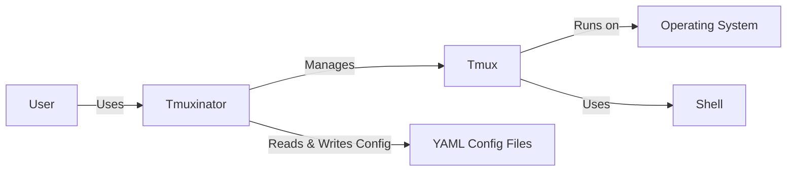
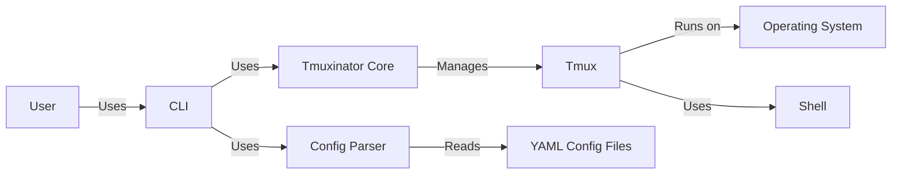
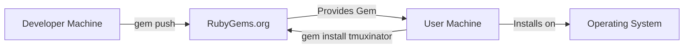
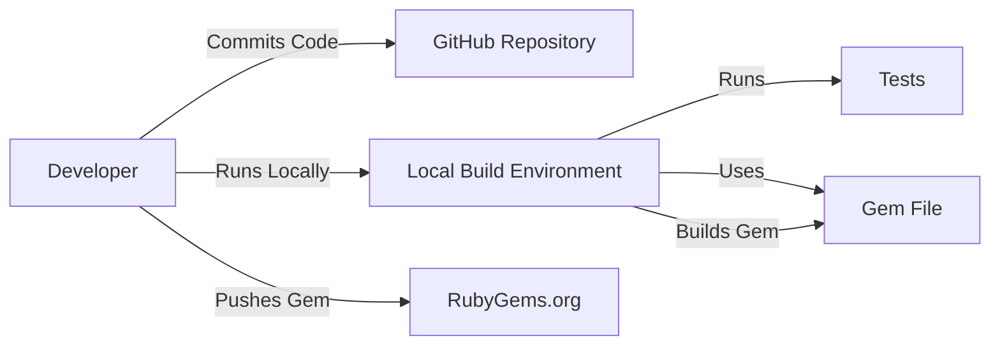

# Project Design Document: Tmuxinator

## BUSINESS POSTURE

Tmuxinator is a tool that allows users to easily manage complex tmux sessions using simple configuration files. It's targeted at developers and system administrators who frequently work with multiple terminal sessions.

Priorities:

-   Ease of use: Simplify the creation and management of tmux sessions.
-   Maintainability: Ensure the project is easy to maintain and extend.
-   Reliability: Provide a stable and predictable user experience.
-   Community: Foster a community around the project for contributions and support.

Goals:

-   Reduce the time spent setting up and managing tmux sessions.
-   Provide a consistent and reproducible way to define tmux configurations.
-   Increase productivity for users who rely on tmux.

Business Risks:

-   Low adoption rate: If users don't find the tool useful or easy to use, it won't be widely adopted.
-   Maintenance burden: If the project is not well-maintained, it may become difficult to fix bugs and add new features.
-   Security vulnerabilities: Although primarily a client-side tool, vulnerabilities could potentially be exploited if user-provided configurations are not handled safely.
-   Compatibility issues: Changes in tmux or underlying operating systems could break compatibility, leading to user frustration.

## SECURITY POSTURE

Existing Security Controls:

-   security control: Code linting: The project uses RuboCop for code style and linting (implied by the presence of `.rubocop.yml`).
-   security control: Test coverage: The project includes a test suite (implied by the presence of a `spec` directory).
-   security control: Dependency management: The project uses Bundler for dependency management (implied by the presence of `Gemfile` and `Gemfile.lock`).

Accepted Risks:

-   accepted risk: Limited input sanitization: Tmuxinator primarily deals with configuration files, but user-provided input (e.g., project names, window names) might not be fully sanitized.
-   accepted risk: Reliance on external dependencies: The project depends on external gems, which could introduce vulnerabilities.
-   accepted risk: No formal security audits: The project does not appear to have undergone formal security audits.

Recommended Security Controls:

-   security control: Input validation: Implement robust input validation to prevent potential injection vulnerabilities.
-   security control: Regular dependency updates: Keep dependencies up-to-date to mitigate known vulnerabilities.
-   security control: Security-focused code review: Emphasize security during code reviews.
-   security control: Consider using a static analysis security tool (SAST) to identify potential vulnerabilities.

Security Requirements:

-   Authentication: Not directly applicable, as Tmuxinator is a client-side tool that leverages the user's existing system authentication.
-   Authorization: Not directly applicable, as Tmuxinator operates within the user's existing permissions.
-   Input Validation:
    -   Validate all user-provided input, including project names, window names, commands, and paths.
    -   Sanitize input to prevent potential injection attacks (e.g., shell command injection).
    -   Enforce length limits on input fields where appropriate.
-   Cryptography: Not directly applicable, as Tmuxinator does not handle sensitive data requiring encryption. However, if secrets are ever stored (which should be avoided), they should be encrypted.
-   Configuration files:
    -   Warn users about the potential risks of executing arbitrary commands from configuration files.
    -   Consider providing a "safe mode" that disables potentially dangerous features.

## DESIGN

### C4 CONTEXT

Context Diagram Element List:

-   Element:
    -   Name: User
    -   Type: Person
    -   Description: A developer or system administrator who uses Tmuxinator to manage their tmux sessions.
    -   Responsibilities: Provides configuration files, interacts with Tmuxinator commands.
    -   Security controls: Relies on operating system user authentication and authorization.

-   Element:
    -   Name: Tmuxinator
    -   Type: Software System
    -   Description: The Tmuxinator application itself.
    -   Responsibilities: Parses configuration files, generates tmux commands, manages tmux sessions.
    -   Security controls: Input validation, dependency management, code linting, test coverage.

-   Element:
    -   Name: Tmux
    -   Type: Software System
    -   Description: The tmux terminal multiplexer.
    -   Responsibilities: Manages terminal sessions, windows, and panes.
    -   Security controls: Relies on operating system security mechanisms.

-   Element:
    -   Name: Operating System
    -   Type: Software System
    -   Description: The underlying operating system (e.g., Linux, macOS).
    -   Responsibilities: Provides the environment for Tmux and Tmuxinator to run.
    -   Security controls: Operating system security features, user permissions.

-   Element:
    -   Name: Shell
    -   Type: Software System
    -   Description: The user's shell (e.g., bash, zsh).
    -   Responsibilities: Executes commands within tmux sessions.
    -   Security controls: Shell configuration, user permissions.

-   Element:
    -   Name: YAML Config Files
    -   Type: Data Store
    -   Description: YAML files that define tmux sessions.
    -   Responsibilities: Store the configuration for tmux sessions.
    -   Security controls: File system permissions.

### C4 CONTAINER

Container Diagram Element List:

-   Element:
    -   Name: User
    -   Type: Person
    -   Description: A developer or system administrator.
    -   Responsibilities: Provides configuration, interacts with the CLI.
    -   Security controls: Relies on operating system user authentication and authorization.

-   Element:
    -   Name: CLI
    -   Type: Command Line Interface
    -   Description: The command-line interface for Tmuxinator.
    -   Responsibilities: Accepts user commands, interacts with other components.
    -   Security controls: Input validation.

-   Element:
    -   Name: Config Parser
    -   Type: Component
    -   Description: Parses Tmuxinator configuration files.
    -   Responsibilities: Reads and interprets YAML configuration files.
    -   Security controls: Input validation, error handling.

-   Element:
    -   Name: Tmuxinator Core
    -   Type: Component
    -   Description: The core logic of Tmuxinator.
    -   Responsibilities: Generates tmux commands, manages tmux sessions.
    -   Security controls: Code linting, test coverage.

-   Element:
    -   Name: Tmux
    -   Type: Software System
    -   Description: The tmux terminal multiplexer.
    -   Responsibilities: Manages terminal sessions, windows, and panes.
    -   Security controls: Relies on operating system security mechanisms.

-   Element:
    -   Name: Operating System
    -   Type: Software System
    -   Description: The underlying operating system.
    -   Responsibilities: Provides the environment for Tmux and Tmuxinator.
    -   Security controls: Operating system security features, user permissions.

-   Element:
    -   Name: Shell
    -   Type: Software System
    -   Description: The user's shell.
    -   Responsibilities: Executes commands within tmux sessions.
    -   Security controls: Shell configuration, user permissions.

-   Element:
    -   Name: YAML Config Files
    -   Type: Data Store
    -   Description: YAML files defining tmux sessions.
    -   Responsibilities: Store configuration for tmux sessions.
    -   Security controls: File system permissions.

### DEPLOYMENT

Deployment Options:

1.  Gem Installation: The standard and recommended way to install Tmuxinator is via RubyGems.
2.  Source Installation: Users can clone the repository and install it manually.
3.  Package Managers: Tmuxinator may be available through OS-specific package managers (e.g., apt, brew).

Chosen Deployment (Gem Installation):

Deployment Diagram Element List:

-   Element:
    -   Name: Developer Machine
    -   Type: Device
    -   Description: The machine where the Tmuxinator gem is built and published.
    -   Responsibilities: Building and publishing the gem.
    -   Security controls: Developer access controls.

-   Element:
    -   Name: RubyGems.org
    -   Type: Software System
    -   Description: The RubyGems package repository.
    -   Responsibilities: Hosting and distributing the Tmuxinator gem.
    -   Security controls: RubyGems.org security measures.

-   Element:
    -   Name: User Machine
    -   Type: Device
    -   Description: The machine where Tmuxinator is installed.
    -   Responsibilities: Running Tmuxinator.
    -   Security controls: User access controls, operating system security.

-   Element:
    -   Name: Operating System
    -   Type: Software System
    -   Description: The underlying operating system.
    -   Responsibilities: Provides the environment for Tmuxinator.
    -   Security controls: Operating system security features.

### BUILD

Build Process Description:

1.  Developers write code and commit it to the GitHub repository.
2.  Developers can build and test the gem locally using Bundler and RSpec.
3.  The `Gemfile` and `Gemfile.lock` define the project's dependencies.
4.  The `rake build` command (implied) is used to build the gem.
5.  The `rake release` command (implied) is used to publish the gem to RubyGems.org.

Security Controls:

-   security control: Dependency management with Bundler: Ensures consistent and controlled dependencies.
-   security control: Test suite: Helps to identify bugs and regressions.
-   security control: Code linting with RuboCop: Enforces code style and helps to prevent some types of errors.
-   security control: Manual gem publishing: Requires developer credentials to publish to RubyGems.org.

## RISK ASSESSMENT

Critical Business Processes:

-   Managing tmux sessions efficiently.
-   Reproducing development environments consistently.

Data Protection:

-   Data Sensitivity: Low. Tmuxinator primarily handles configuration data, not sensitive personal or business data. However, configuration files *could* contain sensitive information if users embed secrets directly (which is strongly discouraged).
-   Data to Protect: Tmuxinator configuration files. While not inherently sensitive, they define the user's development environment and should be protected from unauthorized modification.

## QUESTIONS & ASSUMPTIONS

Questions:

-   Are there any specific compliance requirements (e.g., GDPR, HIPAA) that need to be considered? (Assumption: No specific compliance requirements beyond general best practices.)
-   Are there any plans to integrate Tmuxinator with other tools or services? (Assumption: No immediate plans for integration.)
-   What is the expected user base and usage patterns? (Assumption: Primarily developers and system administrators using it for personal or small-team projects.)
-   Is there a mechanism for users to report security vulnerabilities? (Assumption: Users can report issues via GitHub.)

Assumptions:

-   BUSINESS POSTURE: The primary goal is to provide a convenient and reliable tool for managing tmux sessions.
-   SECURITY POSTURE: The project follows basic security best practices, but there is room for improvement.
-   DESIGN: The design is relatively simple and straightforward, with a focus on ease of use and maintainability. The provided C4 diagrams are accurate representations of the system. The deployment process relies on RubyGems. The build process is standard for a Ruby gem.