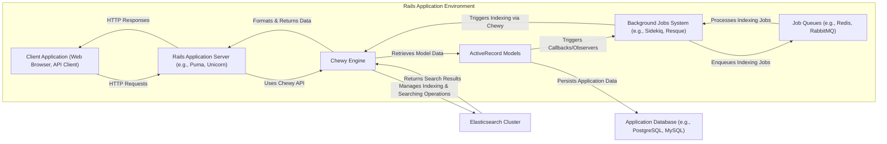

# Project Design Document: Chewy - Elasticsearch Management Tool

**Version:** 1.1
**Date:** October 26, 2023
**Author:** AI Software Architect

## 1. Introduction

This document provides an enhanced design overview of the Chewy project, an open-source Elasticsearch management tool developed by Toptal. This revised document aims to provide a more detailed and nuanced understanding of the system's architecture, components, data flow, and security considerations. This level of detail is crucial for effective threat modeling, enabling the identification of a broader range of potential security vulnerabilities and the design of more targeted mitigation strategies.

## 2. Project Overview

Chewy is a powerful Ruby on Rails engine designed to streamline the integration of Elasticsearch into Rails applications. It offers a sophisticated abstraction layer, empowering developers to interact with Elasticsearch through a Ruby-centric DSL, thereby minimizing the need for writing raw Elasticsearch queries. Chewy's core functionalities revolve around indexing, searching, and managing data within Elasticsearch, providing features such as type definitions, custom analyzers, and seamless synchronization with ActiveRecord models. It promotes a more maintainable and developer-friendly approach to leveraging Elasticsearch within a Rails environment.

## 3. System Architecture

The following diagram illustrates the detailed architecture of a typical application leveraging Chewy:

### 3.1. Components

*   **Client Application (Web Browser, API Client):** Represents the external interface through which users or other systems interact with the Rails application. This could be a web browser making HTTP requests, a mobile application using an API, or another service integrating with the application's API.
*   **Rails Application Server (e.g., Puma, Unicorn):** The runtime environment for the Rails application, responsible for handling incoming HTTP requests, routing them to the appropriate controllers, and managing the application's lifecycle. It hosts the Chewy engine and interacts with the application database.
*   **Chewy Engine:** The core abstraction layer for Elasticsearch interaction within the Rails application. Its key responsibilities include:
    *   **Index Definition and Management:** Defining Elasticsearch indices and types based on application models, including mappings, settings, and analyzers.
    *   **Data Synchronization:**  Orchestrating the process of transferring data from ActiveRecord models to Elasticsearch indices, either synchronously or asynchronously.
    *   **Query Building and Execution:** Providing a Ruby DSL for constructing complex Elasticsearch queries and executing them against the Elasticsearch cluster.
    *   **Result Handling:**  Processing and formatting search results returned from Elasticsearch for use within the Rails application.
    *   **Configuration Management:**  Handling the configuration of the connection to the Elasticsearch cluster and other Chewy-specific settings.
*   **ActiveRecord Models:** The representation of the application's data within the relational database. Chewy integrates with ActiveRecord to observe data changes and trigger indexing operations. Models define the structure of the data that will be indexed in Elasticsearch.
*   **Background Jobs System (e.g., Sidekiq, Resque):**  A system for processing asynchronous tasks. In the context of Chewy, this is primarily used for handling potentially time-consuming indexing operations, preventing them from blocking the main application thread and improving responsiveness.
*   **Job Queues (e.g., Redis, RabbitMQ):**  The underlying infrastructure for the background job system. It stores and manages the queue of indexing jobs to be processed.
*   **Elasticsearch Cluster:** The distributed search and analytics engine responsible for storing and indexing the application data. It provides powerful search capabilities and allows for efficient retrieval of information. Key aspects include:
    *   **Nodes:** Individual servers within the cluster that store data and handle search requests.
    *   **Indices:** Logical groupings of related documents.
    *   **Shards:** Horizontal partitions of an index, allowing for scalability and distribution.
    *   **Replicas:** Copies of shards, providing redundancy and high availability.
*   **Application Database (e.g., PostgreSQL, MySQL):** The primary persistent storage for the application's data. ActiveRecord models are typically backed by this database.

## 4. Data Flow

The following outlines the detailed data flow within a system utilizing Chewy:

1. **Data Creation/Update in Application Database:** A user action or system event triggers the creation or modification of data, which is persisted in the application database via ActiveRecord models.
2. **ActiveRecord Callbacks/Observers:** Upon successful data persistence, ActiveRecord callbacks or observers (configured by Chewy) are triggered.
3. **Asynchronous Indexing Job Enqueueing:**  If configured for asynchronous indexing (the recommended approach for performance), a background job is enqueued into the job queue (e.g., Redis, RabbitMQ). This job contains information about the model and the changes that need to be reflected in Elasticsearch.
4. **Background Job Processing:** A worker process from the background job system (e.g., Sidekiq worker) picks up the indexing job from the queue.
5. **Chewy Indexing Logic:** The background job invokes Chewy's indexing logic. Chewy retrieves the relevant data from the ActiveRecord model (potentially fetching related data as well).
6. **Data Transformation and Mapping:** Chewy transforms the data from the ActiveRecord model into a JSON document according to the defined index mappings. This may involve applying custom analyzers or transformations.
7. **Elasticsearch Indexing Request:** Chewy sends an indexing request (typically an HTTP request with a JSON payload) to the Elasticsearch cluster's API.
8. **Elasticsearch Data Storage and Indexing:** The Elasticsearch cluster receives the indexing request, processes the document, and stores it in the appropriate index and shard.
9. **Search Request from Client:** A client application sends a search request to the Rails application, typically via an HTTP request.
10. **Rails Application Processing:** The Rails application receives the search request and delegates the search operation to Chewy.
11. **Chewy Query Construction:** Chewy uses its DSL to construct an Elasticsearch query based on the search parameters provided by the application. This involves translating the Ruby-based search logic into an Elasticsearch query DSL.
12. **Elasticsearch Search Execution:** Chewy sends the search query to the Elasticsearch cluster's search API.
13. **Elasticsearch Result Retrieval:** The Elasticsearch cluster processes the query, searches the relevant indices, and returns matching documents along with scores and other metadata.
14. **Chewy Result Processing:** Chewy receives the raw search results from Elasticsearch. It may perform further processing, such as mapping the results back to application models or formatting the data.
15. **Response to Client:** The Rails application sends the processed search results back to the client application in the appropriate format (e.g., JSON, HTML).

## 5. Security Considerations

This section outlines potential security considerations for threat modeling, categorized by component and data flow.

*   **Client Application:**
    *   **Cross-Site Scripting (XSS):** If search results are displayed without proper sanitization, malicious scripts could be injected.
    *   **Injection Attacks:**  If user input is directly used in search parameters without validation, it could lead to Elasticsearch injection vulnerabilities (though Chewy's abstraction helps mitigate this).
*   **Rails Application Server:**
    *   **Authentication and Authorization:**  Ensuring only authorized users can perform search and data modification operations that trigger indexing.
    *   **Session Management:** Securely managing user sessions to prevent unauthorized access.
    *   **Exposure of Sensitive Data:** Preventing the accidental exposure of sensitive data in logs or error messages related to Chewy or Elasticsearch interactions.
*   **Chewy Engine:**
    *   **Elasticsearch Injection:** While Chewy provides an abstraction, developers must still be cautious about how user input influences search queries to avoid potential injection attacks.
    *   **Configuration Security:** Securely storing and managing Elasticsearch connection details and API keys.
    *   **Denial of Service (DoS):**  Poorly constructed or excessively broad search queries generated by Chewy could potentially overload the Elasticsearch cluster.
*   **ActiveRecord Models:**
    *   **Data Integrity:** Ensuring that data indexed in Elasticsearch accurately reflects the data in the application database.
    *   **Access Control:**  Enforcing appropriate access controls on the underlying data that is being indexed.
*   **Background Jobs System and Job Queues:**
    *   **Unauthorized Job Enqueueing:** Preventing unauthorized entities from enqueuing malicious indexing jobs.
    *   **Job Data Security:** Ensuring the data within the job queue (which may contain sensitive information about the data being indexed) is protected.
    *   **Job Processing Security:** Securing the worker processes that handle indexing jobs.
*   **Elasticsearch Cluster:**
    *   **Authentication and Authorization:** Implementing robust authentication and authorization mechanisms to control access to the Elasticsearch API.
    *   **Network Security:** Restricting network access to the Elasticsearch cluster to only authorized applications and services.
    *   **Data Encryption:** Encrypting data at rest and in transit between the Rails application and the Elasticsearch cluster.
    *   **Node Security:** Securing individual nodes within the Elasticsearch cluster.
    *   **Version Control and Patching:** Keeping the Elasticsearch cluster software up-to-date with the latest security patches.
*   **Application Database:**
    *   **Standard Database Security Practices:** Implementing standard security measures for the application database, as this is the source of truth for the data being indexed.

## 6. Deployment Considerations

*   **Deployment Environment:** Chewy is typically deployed as part of a Ruby on Rails application in various environments, including:
    *   **Cloud Platforms (e.g., AWS, Google Cloud, Azure):** Utilizing services like EC2, Compute Engine, or Azure VMs, often in conjunction with containerization technologies like Docker and orchestration platforms like Kubernetes.
    *   **Containerized Environments:** Deploying the Rails application and potentially Elasticsearch within Docker containers, managed by platforms like Kubernetes or Docker Swarm. This offers portability and scalability.
    *   **On-Premises Infrastructure:** Deploying the application and Elasticsearch on physical or virtual servers within a private data center.
*   **Elasticsearch Deployment:** The Elasticsearch cluster can be deployed in several ways, each with its own security implications:
    *   **Self-Managed:** Installing and configuring Elasticsearch directly on servers. This requires careful attention to security configuration and maintenance.
    *   **Managed Services (e.g., AWS OpenSearch Service, Elastic Cloud):** Utilizing cloud-based managed Elasticsearch services, which often handle security aspects like patching and infrastructure security. However, proper configuration of access policies and encryption is still crucial.
*   **Network Configuration:** Secure network configuration is essential:
    *   **Firewalls:** Implementing firewalls to restrict access to the Rails application and the Elasticsearch cluster.
    *   **Virtual Private Networks (VPNs):** Using VPNs to secure communication between different components, especially if they are in different networks.
    *   **Network Segmentation:** Isolating the Elasticsearch cluster within a separate network segment to limit the impact of potential breaches.
*   **Scalability and High Availability:** Consider security implications when scaling the application and Elasticsearch cluster. Ensure that security measures are maintained as the infrastructure grows.

## 7. Technologies Used

*   **Programming Language:** Ruby (Specify version if relevant)
*   **Framework:** Ruby on Rails (Specify version if relevant)
*   **Search Engine:** Elasticsearch (Specify version if relevant)
*   **Elasticsearch Client:**  The specific Ruby Elasticsearch client gem used by Chewy (e.g., `elasticsearch-ruby`).
*   **Background Job Processing (Optional):** Sidekiq (with Redis), Resque (with Redis), or similar (specify versions if relevant).
*   **Job Queue:** Redis, RabbitMQ, or similar (specify versions if relevant).
*   **Application Database:** PostgreSQL, MySQL, or similar (specify versions if relevant).
*   **Web Server:** Puma, Unicorn, or similar (specify versions if relevant).

## 8. Future Considerations

*   **Enhanced Security Features within Chewy:** Exploring the possibility of integrating more fine-grained access control mechanisms directly within Chewy.
*   **Comprehensive Auditing:** Implementing detailed auditing of indexing and search operations performed through Chewy for security monitoring and compliance.
*   **Data Masking and Anonymization at Indexing:** Investigating techniques for masking or anonymizing sensitive data before it is indexed in Elasticsearch.
*   **Integration with Security Information and Event Management (SIEM) Systems:**  Facilitating the integration of Chewy and Elasticsearch logs with SIEM systems for centralized security monitoring.

This enhanced document provides a more comprehensive understanding of the Chewy project's design and its security considerations. It serves as a valuable resource for conducting thorough threat modeling and developing effective security strategies.
