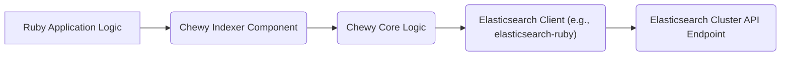
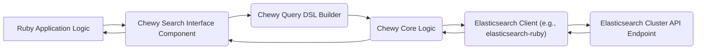
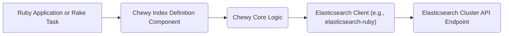

# Project Design Document: Chewy - Elasticsearch Integration Gem

**Version:** 1.1
**Date:** October 26, 2023
**Author:** AI Software Architect

## 1. Introduction

This document provides a detailed design overview of the Chewy Ruby gem, a high-level Elasticsearch client designed to simplify indexing, searching, and managing data within Elasticsearch clusters. This document serves as a foundation for subsequent threat modeling activities, outlining the system's architecture, components, and data flow.

This design is based on the publicly available codebase of Chewy found at: [https://github.com/toptal/chewy](https://github.com/toptal/chewy). This revision aims to provide more clarity and detail based on initial review.

## 2. Goals and Objectives

The primary goals of Chewy are to:

*   Provide a declarative and intuitive Ruby syntax for defining Elasticsearch indexes and their mappings within Ruby applications.
*   Simplify and abstract common Elasticsearch operations such as indexing, searching, updating, and deleting documents, reducing boilerplate code.
*   Offer a flexible and extensible architecture to accommodate various Elasticsearch features, including different query types, aggregations, and analysis options.
*   Improve developer productivity by providing a more Ruby-centric way to interact with Elasticsearch.

## 3. High-Level Architecture

Chewy acts as an abstraction layer, a Ruby gem integrated into a Ruby application. It translates Ruby-based definitions and operations into the corresponding Elasticsearch REST API calls.

*   **Ruby Application Process:** The runtime environment of the Ruby application that includes and utilizes the Chewy gem.
*   **Chewy Gem (within Application):** The Chewy library loaded into the Ruby application's memory space, handling the translation and communication logic.
*   **Elasticsearch Cluster (Network):** The external Elasticsearch cluster accessed over a network connection.

## 4. Detailed Design

### 4.1. Core Components

*   **Index Definition DSL (Domain Specific Language):**
    *   Allows developers to define Elasticsearch indexes and their settings (e.g., number of shards, replicas) using Ruby code.
    *   Example: Defining an index named 'products' with specific settings.
    *   Specifies document types within the index, including their properties and Elasticsearch data types (e.g., `text`, `integer`, `date`).
    *   Supports configuration of analyzers for text fields, influencing how text is indexed and searched.
    *   Provides mechanisms for defining index aliases for easier management and zero-downtime reindexing.
*   **Type Definition DSL:**
    *   Enables defining the structure and mapping of document types within an index.
    *   Allows specifying the data type and properties of each field in a document.
    *   Example: Defining a 'product' type with 'name' (text), 'price' (float), and 'description' (text) fields.
    *   Supports defining associations or relationships between different document types (though Elasticsearch is not primarily relational).
*   **Query DSL:**
    *   Offers a Ruby-based, object-oriented DSL for constructing Elasticsearch queries, abstracting away the raw JSON syntax.
    *   Provides methods for building various query types (e.g., `match`, `term`, `bool`).
    *   Supports filtering, sorting, pagination, and highlighting of search results.
    *   Allows for building complex queries using logical operators (AND, OR, NOT).
    *   Example: Constructing a query to find products with 'red' in their name and a price less than 50.
*   **Indexers:**
    *   Responsible for taking Ruby objects or data structures and transforming them into Elasticsearch documents for indexing.
    *   Handles the process of serializing Ruby data into the JSON format expected by Elasticsearch.
    *   Supports batch indexing to improve performance when indexing large amounts of data.
    *   Provides callbacks or hooks that allow developers to execute custom logic before or after indexing operations.
    *   Offers mechanisms for handling data transformations or enrichment before indexing.
*   **Search Interface:**
    *   Provides methods for executing queries built using the Query DSL against Elasticsearch indexes.
    *   Handles the communication with the Elasticsearch cluster to send the query.
    *   Parses the JSON response from Elasticsearch and transforms it into more usable Ruby objects or data structures.
    *   Provides access to search hits, aggregations, and other information returned by Elasticsearch.
*   **Configuration:**
    *   Allows configuring the connection parameters for the Elasticsearch cluster(s), such as hostnames, ports, and authentication credentials.
    *   Supports connecting to multiple Elasticsearch clusters for different purposes or environments.
    *   Provides options for configuring logging, timeouts, and other client-related settings.
    *   May integrate with environment variables or configuration files for managing settings.
*   **Tasks and Utilities:**
    *   Includes Rake tasks (for Ruby on Rails applications) or similar utilities for managing Elasticsearch indexes.
    *   Provides tasks for creating, deleting, and refreshing indexes.
    *   Offers tasks for importing or reindexing data.
    *   May include utilities for checking the status of the Elasticsearch cluster.

### 4.2. Data Flow

The following describes the typical data flow for common operations:

#### 4.2.1. Indexing Data

1. The Ruby application logic triggers an indexing operation, passing data to the appropriate Chewy indexer.
2. The Chewy indexer component transforms the Ruby objects into Elasticsearch documents based on the defined mappings.
3. The Chewy core logic orchestrates the process and utilizes an Elasticsearch client library.
4. The Elasticsearch client library (e.g., `elasticsearch-ruby`) sends the indexing request (typically an HTTP POST request with a JSON payload) to the Elasticsearch cluster's API endpoint.
5. The Elasticsearch cluster processes the request and indexes the documents.

#### 4.2.2. Searching Data

1. The Ruby application logic initiates a search request, often using Chewy's Query DSL to define the search criteria.
2. The Chewy search interface component takes the query definition.
3. The Chewy Query DSL builder translates the Ruby DSL into the corresponding Elasticsearch JSON query.
4. The Chewy core logic uses the Elasticsearch client library.
5. The Elasticsearch client library sends the search request (typically an HTTP GET or POST request with a JSON query) to the Elasticsearch cluster's API endpoint.
6. The Elasticsearch cluster executes the search and returns the results (as a JSON response).
7. The Elasticsearch client library receives the response.
8. The Chewy core logic parses and transforms the JSON response into Ruby objects or data structures.
9. The search interface component returns the results to the Ruby application logic.

#### 4.2.3. Index Management (Creation/Deletion)

1. The Ruby application or a Rake task interacts with Chewy's index definition to trigger index management operations.
2. The Chewy index definition component translates the request into the appropriate Elasticsearch API calls for index creation, deletion, or other management tasks.
3. The Chewy core logic utilizes the Elasticsearch client library.
4. The Elasticsearch client library sends the request to the Elasticsearch cluster's API endpoint.
5. The Elasticsearch cluster performs the requested index management operation.

## 5. Security Considerations (Preliminary)

This section outlines initial security considerations relevant for threat modeling. A more detailed analysis will be performed during the threat modeling process.

*   **Secure Communication:**
    *   Ensure all communication between the Ruby application (where Chewy resides) and the Elasticsearch cluster uses HTTPS/TLS to encrypt data in transit, protecting against eavesdropping and man-in-the-middle attacks.
    *   Verify that the Elasticsearch cluster is configured to enforce HTTPS.
*   **Authentication and Authorization:**
    *   Chewy relies on the underlying Elasticsearch client's authentication mechanisms. Properly configure Elasticsearch security features such as:
        *   Basic authentication (username/password).
        *   API keys.
        *   Role-Based Access Control (RBAC) to restrict access to specific indexes and operations based on user roles.
    *   Avoid embedding sensitive credentials directly in the application code; use environment variables or secure configuration management.
*   **Input Validation and Sanitization:**
    *   While Chewy provides a DSL, be cautious about directly incorporating user input into search queries or indexing operations to prevent injection attacks (e.g., Elasticsearch query injection).
    *   Utilize Chewy's DSL features to construct queries programmatically rather than concatenating strings with user input.
    *   Sanitize any user-provided data before indexing it into Elasticsearch to prevent stored cross-site scripting (XSS) or other injection vulnerabilities.
*   **Dependency Management:**
    *   Regularly audit and update Chewy's dependencies, especially the Elasticsearch client library, to patch known security vulnerabilities.
    *   Use dependency management tools (e.g., Bundler for Ruby) to track and manage dependencies effectively.
*   **Error Handling and Information Disclosure:**
    *   Implement robust error handling to prevent the leakage of sensitive information about the Elasticsearch cluster or data in error messages or logs.
    *   Avoid exposing stack traces or internal details in production environments.
*   **Access Control to Chewy Configuration:**
    *   Restrict access to the application's configuration files or environment variables that contain Elasticsearch connection details and credentials.
    *   Employ secure configuration management practices.
*   **Rate Limiting and Denial of Service (DoS) Prevention:**
    *   Consider implementing rate limiting on the application side to prevent malicious actors from overwhelming the Elasticsearch cluster with excessive requests.
    *   Configure appropriate resource limits within the Elasticsearch cluster itself.
*   **Data Security at Rest (Elasticsearch Configuration):**
    *   While not directly a Chewy concern, ensure that the Elasticsearch cluster itself is configured for data security at rest, including encryption of data on disk if necessary.

## 6. Assumptions and Constraints

*   The Elasticsearch cluster is assumed to be a trusted and properly secured environment.
*   The Ruby application has the necessary network connectivity and permissions to communicate with the Elasticsearch cluster.
*   Developers using Chewy are expected to have a basic understanding of Elasticsearch concepts and security best practices.
*   The specific version of the Elasticsearch client library used by Chewy can influence security considerations.
*   This design focuses on the core functionality of Chewy and assumes standard deployment scenarios.

## 7. Future Considerations

*   Integration with more advanced Elasticsearch security features, such as fine-grained access control.
*   Enhanced logging and auditing capabilities within Chewy for security monitoring.
*   Support for more sophisticated data masking or anonymization techniques during indexing.
*   Improved tools for validating and sanitizing data before indexing.

This document provides a more detailed and refined understanding of the Chewy gem's architecture and functionality, incorporating additional context and examples. This enhanced information will be valuable for a more thorough and effective threat modeling exercise.
