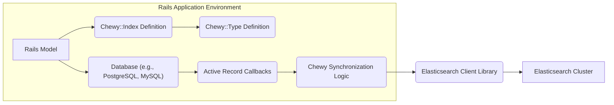
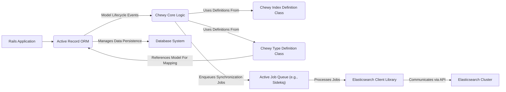
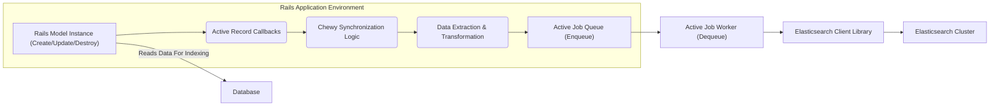
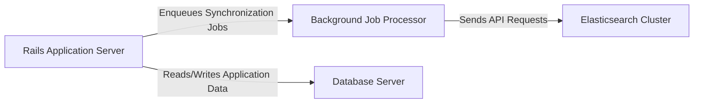

# Project Design Document: Chewy - Elasticsearch Synchronization

**Version:** 1.1
**Date:** October 26, 2023
**Author:** AI Software Architect

## 1. Introduction

This document provides an enhanced design overview of the Chewy project, an open-source library designed to simplify the integration of Ruby on Rails applications with Elasticsearch. This document aims to provide a more detailed and refined understanding of Chewy's architecture, components, and data flow, serving as a robust foundation for subsequent threat modeling activities. We have expanded on key areas to provide greater clarity and depth.

## 2. Project Goals

The primary goals of the Chewy project are:

*   Provide a declarative and intuitive way to define Elasticsearch indices and mappings directly from Rails models.
*   Automate the process of synchronizing data changes from Rails models to corresponding Elasticsearch indices, ensuring data consistency.
*   Offer flexible and extensible configuration options for various indexing strategies, data transformations, and custom logic.
*   Simplify common Elasticsearch operations within a Rails application, abstracting away low-level client interactions.
*   Maintain performance and efficiency in data synchronization, minimizing impact on application responsiveness.

## 3. High-Level Architecture

Chewy acts as a middleware layer within a Ruby on Rails application, orchestrating the communication and data transfer between the application's persistent data store (typically a relational database) and an Elasticsearch cluster.

**Components:**

*   **Rails Model:** The fundamental data entity within the Rails application, serving as the source of truth for the data to be indexed in Elasticsearch.
*   **Chewy::Index Definition:** A Ruby class that declaratively defines the structure of an Elasticsearch index, including its name, settings (e.g., number of shards and replicas), and analyzer configurations.
*   **Chewy::Type Definition:** A Ruby class associated with a specific `Chewy::Index`, defining the mapping for a particular type of document within that index. This typically corresponds to a Rails model and specifies how its attributes are mapped to Elasticsearch fields.
*   **Database:** The persistent storage system for the Rails application's data, such as PostgreSQL or MySQL.
*   **Active Record Callbacks:** Hooks provided by the Rails Active Record ORM that trigger specific actions in response to model lifecycle events (creation, update, deletion).
*   **Chewy Synchronization Logic:** The core component of Chewy responsible for intercepting Active Record callbacks, determining the necessary Elasticsearch operations, and managing the data synchronization process.
*   **Elasticsearch Client Library:** A Ruby library (e.g., `elasticsearch-ruby`) used by Chewy to communicate with the Elasticsearch cluster via its REST API. This handles the low-level details of HTTP requests and responses.
*   **Elasticsearch Cluster:** The distributed search and analytics engine where the indexed data is stored and made available for searching and analysis.

## 4. Detailed Design

### 4.1. Chewy::Index Definition

*   **Purpose:** To define the blueprint for an Elasticsearch index, encapsulating its structure and behavior.
*   **Configuration:**
    *   **Index Name:** A unique identifier for the Elasticsearch index.
    *   **Index Settings:** Configuration parameters for the index, such as the number of shards, number of replicas, and refresh interval.
    *   **Analyzer Definitions:** Specifications for how text fields should be analyzed during indexing and searching, including tokenizers, filters, and character filters.
    *   **Optional Index Lifecycle Management:** Logic for creating or deleting the index programmatically.
*   **Implementation:** Ruby classes that inherit from `Chewy::Index`, providing a declarative syntax for defining index properties.

### 4.2. Chewy::Type Definition

*   **Purpose:** To define the mapping between a specific Rails model and the document structure within an Elasticsearch index.
*   **Configuration:**
    *   **Associated Rails Model:** Specifies the Rails model whose data will be indexed in this type.
    *   **Field Mappings:** Defines how attributes of the Rails model are mapped to fields in the Elasticsearch document, including data types, analyzers, and whether the field should be indexed, stored, etc.
    *   **Custom Data Transformation Logic:** Allows developers to define custom methods or blocks to transform model data before it is indexed in Elasticsearch.
    *   **Filtering Logic:** Enables specifying conditions to determine which instances of the associated Rails model should be indexed.
*   **Implementation:** Ruby classes that inherit from `Chewy::Type`, providing a declarative way to define the mapping and transformations.

### 4.3. Data Synchronization Process

1. **Model Event Trigger:** An event occurs on a tracked Rails model instance (e.g., creation, update, or destruction), triggering Active Record callbacks.
2. **Callback Interception by Chewy:** Chewy registers these callbacks and intercepts the relevant model changes.
3. **Synchronization Job Creation (Asynchronous):**  Chewy typically creates background jobs (using a job queue like Active Job with an adapter like Sidekiq or Resque) to perform the Elasticsearch updates asynchronously. This prevents blocking the main application thread.
4. **Data Extraction and Transformation:** The background job retrieves the relevant data from the affected Rails model instance. Any custom transformations defined in the corresponding `Chewy::Type` are applied to prepare the data for indexing.
5. **Elasticsearch API Interaction:** The background job utilizes the configured `Elasticsearch Client Library` to send requests to the Elasticsearch cluster. These requests can include:
    *   **Index/Create:** Adding a new document to the index for model creation.
    *   **Update:** Modifying an existing document in the index for model updates.
    *   **Delete:** Removing a document from the index for model deletion.
    *   **Bulk Operations:** Chewy often uses bulk API calls to efficiently send multiple indexing operations in a single request, improving performance.
6. **Elasticsearch Index Update:** The Elasticsearch cluster receives the API requests and updates the index accordingly, making the changes searchable.

### 4.4. Configuration

*   **Chewy Configuration File (Optional):**  Allows for global configuration of Chewy, such as specifying the Elasticsearch client connection details (e.g., host, port, authentication).
*   **Environment Variables:** Can be used to override configuration settings defined in the configuration file or within the index/type definitions, providing flexibility for different environments.
*   **Index and Type Definition Classes:** The primary method of configuration, where developers define the structure, mappings, and behavior of their Elasticsearch indices and types.

### 4.5. Key Components and Interactions

**Interaction Flow:**

1. The `Rails Application` interacts with the `Database System` through the `Active Record ORM`.
2. `Active Record ORM` triggers model lifecycle events upon data changes.
3. `Chewy Core Logic` intercepts these events.
4. `Chewy Core Logic` utilizes the configurations defined in `Chewy Index Definition Class` and `Chewy Type Definition Class`.
5. `Chewy Core Logic` enqueues asynchronous synchronization jobs into the `Active Job Queue (e.g., Sidekiq)`.
6. Worker processes from the `Active Job Queue (e.g., Sidekiq)` consume these jobs.
7. The jobs use the `Elasticsearch Client Library` to interact with the `Elasticsearch Cluster`.
8. The `Elasticsearch Client Library` sends API calls to the `Elasticsearch Cluster` to update the index.
9. `Chewy Type Definition Class` references the `Active Record ORM` to understand the model structure for mapping.

## 5. Data Flow Diagram

**Data Flow Description:**

1. A data modification event (create, update, or destroy) occurs on a `Rails Model Instance`.
2. `Active Record Callbacks` are triggered in response to the model event.
3. `Chewy Synchronization Logic` intercepts these callbacks.
4. `Chewy Synchronization Logic` initiates `Data Extraction & Transformation` from the model instance.
5. A synchronization job is enqueued into the `Active Job Queue (Enqueue)`.
6. An `Active Job Worker (Dequeue)` retrieves the job from the queue.
7. The worker utilizes the `Elasticsearch Client Library`.
8. The `Elasticsearch Client Library` sends the prepared data to the `Elasticsearch Cluster` to update the index.
9. During the `Data Extraction & Transformation` phase, Chewy may read data directly from the `Database` through the associated Rails model.

## 6. Security Considerations (For Threat Modeling)

This section expands on the initial security considerations, providing more specific examples of potential threats and vulnerabilities that should be addressed during threat modeling.

*   **Communication Security:**
    *   **Threat:** Man-in-the-middle attacks intercepting data transmitted between the Rails application and the Elasticsearch cluster.
    *   **Consideration:** Ensure all communication with the Elasticsearch cluster is encrypted using HTTPS/TLS. Verify the Elasticsearch client library is configured to enforce secure connections.
    *   **Consideration:** If using authentication credentials in the connection string, ensure these are not exposed in logs or configuration files.
*   **Authentication and Authorization:**
    *   **Threat:** Unauthorized access to the Elasticsearch cluster, potentially leading to data breaches or manipulation.
    *   **Consideration:** Implement robust authentication mechanisms for accessing the Elasticsearch cluster (e.g., API keys, username/password authentication, or certificate-based authentication).
    *   **Consideration:** Securely store Elasticsearch credentials, avoiding hardcoding them in the application code. Utilize environment variables or secure configuration management tools.
    *   **Consideration:** If Chewy supports different levels of access or authorization for indexing, ensure these are correctly implemented and enforced.
*   **Data Security:**
    *   **Threat:** Exposure of sensitive data stored in Elasticsearch.
    *   **Consideration:** Identify all sensitive data being indexed. Consider data masking, anonymization, or encryption at rest within Elasticsearch for sensitive fields.
    *   **Consideration:** Implement proper input validation and sanitization within Chewy's data transformation logic to prevent injection attacks (e.g., Elasticsearch query injection).
*   **Dependency Management:**
    *   **Threat:** Vulnerabilities in third-party libraries used by Chewy (including the Elasticsearch client) being exploited.
    *   **Consideration:** Regularly audit and update dependencies to their latest secure versions. Utilize dependency scanning tools to identify known vulnerabilities.
*   **Error Handling and Logging:**
    *   **Threat:** Sensitive information being leaked through error messages or logs.
    *   **Consideration:** Implement secure logging practices, ensuring that sensitive data (e.g., API keys, user credentials) is not included in log messages.
    *   **Consideration:** Implement robust error handling to prevent the application from crashing and potentially revealing internal information.
*   **Access Control:**
    *   **Threat:** Unauthorized access to Chewy's configuration or the Elasticsearch cluster.
    *   **Consideration:** Implement strict access control policies for the servers and environments where the Rails application and Elasticsearch cluster are deployed.
    *   **Consideration:** Limit access to Chewy's configuration files and code repositories to authorized personnel.
*   **Injection Vulnerabilities:**
    *   **Threat:** Malicious data in the Rails application leading to Elasticsearch query injection or other injection attacks during indexing.
    *   **Consideration:** Carefully sanitize and validate all data before it is used to construct Elasticsearch queries or indexing operations.
*   **Denial of Service:**
    *   **Threat:** Malicious actors overwhelming the synchronization process or the Elasticsearch cluster with a large number of requests.
    *   **Consideration:** Implement rate limiting or other mechanisms to protect against denial-of-service attacks.
    *   **Consideration:** Properly configure Elasticsearch cluster resources to handle expected load and potential spikes.

## 7. Deployment Architecture (Typical Scenario)

Chewy is integrated within a Ruby on Rails application and typically deployed in an environment that includes background job processing capabilities.

*   **Rails Application Server(s):**  One or more servers running the Ruby on Rails application, including the Chewy library. These handle web requests and enqueue synchronization jobs.
*   **Background Job Processor(s):** Dedicated worker processes (e.g., using Sidekiq, Resque, or similar) responsible for asynchronously processing the Elasticsearch synchronization jobs enqueued by Chewy.
*   **Elasticsearch Cluster:** A separate, dedicated Elasticsearch cluster responsible for storing and indexing the data. This can be hosted on-premises or in the cloud.
*   **Database Server(s):** The primary database server(s) for the Rails application, where the source data resides.

## 8. Technology Stack

*   **Primary Programming Language:** Ruby
*   **Web Application Framework:** Ruby on Rails
*   **Elasticsearch Client Library (Commonly):** `elasticsearch-ruby`
*   **Asynchronous Job Processing:** Typically Active Job with an adapter like Sidekiq or Resque
*   **Data Serialization Format (for Elasticsearch Communication):** Primarily JSON
*   **Testing Framework (for Chewy and Application):** Commonly RSpec or Minitest

## 9. Future Considerations (Beyond Initial Threat Model)

*   Enhanced support for more complex and nuanced indexing scenarios, including parent-child relationships and nested objects.
*   Improved monitoring and observability tools for tracking the health and performance of the synchronization process.
*   Potential integration with other search engines or data stores beyond Elasticsearch.
*   More granular control over indexing performance tuning and resource utilization.
*   Features for managing and migrating Elasticsearch indices.

This improved document provides a more detailed and comprehensive design overview of the Chewy project, with a stronger focus on aspects relevant to security and threat modeling. The enhanced descriptions and diagrams should facilitate a more thorough and effective threat modeling exercise.