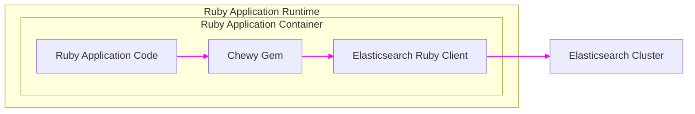

# BUSINESS POSTURE

This project, represented by the 'chewy' GitHub repository, aims to provide a Ruby library that simplifies the integration of Elasticsearch into Ruby applications. The primary business goal is to enhance the development experience for Ruby developers working with Elasticsearch, enabling them to build efficient and robust search and data indexing functionalities more easily. This can lead to faster development cycles, reduced development costs, and improved application performance related to search and data retrieval.

From a business perspective, the priorities are:

- Developer productivity: Streamlining the process of working with Elasticsearch in Ruby.
- Application performance: Enabling efficient search and data indexing within Ruby applications.
- Maintainability: Providing a well-structured and easy-to-maintain abstraction layer.
- Community adoption: Encouraging widespread use within the Ruby developer community.

The most important business risks associated with this project are:

- Security vulnerabilities in the library itself could be exploited by applications using it, leading to data breaches or service disruption.
- Inefficient or incorrect usage of the library by developers could lead to performance issues or data integrity problems in applications.
- Lack of maintenance or community support could lead to the library becoming outdated or unusable over time.
- Compatibility issues with different versions of Elasticsearch or Ruby could hinder adoption and cause integration problems.

# SECURITY POSTURE

Existing security controls:

- security control: Source code hosted on GitHub, providing version control and transparency. (Implemented: GitHub repository)
- security control: Open-source license (MIT License), allowing for community review and contribution. (Implemented: LICENSE file in repository)
- security control: Dependency management using Bundler and gemspec, allowing for tracking and management of external dependencies. (Implemented: Gemfile and .gemspec file in repository)

Accepted risks:

- accepted risk: Reliance on external dependencies (gems) which may have their own vulnerabilities.
- accepted risk: Security of applications using 'chewy' is the responsibility of the application developers, not the library itself.
- accepted risk: Potential for vulnerabilities to be introduced in future updates or contributions.

Recommended security controls:

- security control: Implement automated dependency scanning to identify vulnerabilities in gem dependencies.
- security control: Integrate static application security testing (SAST) tools into the development and CI/CD pipeline to identify potential code-level vulnerabilities.
- security control: Conduct regular security code reviews, especially for new features and contributions.
- security control: Provide clear documentation and examples on secure usage of the library, including input validation and sanitization when interacting with Elasticsearch.
- security control: Establish a process for reporting and addressing security vulnerabilities in the library.

Security requirements:

- Authentication: Not directly applicable to a library. Authentication is handled by the applications using 'chewy' and Elasticsearch itself.
- Authorization: Not directly applicable to a library. Authorization is handled by the applications using 'chewy' and Elasticsearch itself.
- Input validation: While 'chewy' itself doesn't directly handle user input, it's crucial that applications using 'chewy' properly validate and sanitize any user input before using it in Elasticsearch queries or index operations. 'chewy' should encourage and facilitate secure practices in its documentation and examples.
- Cryptography: 'chewy' might interact with sensitive data indexed in Elasticsearch. While 'chewy' itself might not implement cryptography, it should support and encourage the use of encrypted connections to Elasticsearch (HTTPS) and the proper handling of sensitive data within applications.

# DESIGN

## C4 CONTEXT

```mermaid
flowchart LR
    subgraph "Ruby Application"
        A["Ruby Application"]
    end
    subgraph "Elasticsearch Cluster"
        B["Elasticsearch"]
    end
    C["Ruby Developer"]
    D["Chewy Ruby Gem"]

    C --> D
    D --> A
    A --> D
    A --> B

    linkStyle 0,1,2,3,4 stroke:#f0f,stroke-width:2px
```

Context Diagram Elements:

- Element:
    - Name: Ruby Developer
    - Type: Person
    - Description: Software developers who use the 'chewy' gem to build Ruby applications with Elasticsearch integration.
    - Responsibilities: Develop Ruby applications, integrate 'chewy' gem, write code that uses 'chewy' to interact with Elasticsearch.
    - Security controls: Code reviews, secure coding practices, developer training.

- Element:
    - Name: Chewy Ruby Gem
    - Type: Software System
    - Description: A Ruby library (gem) that provides a high-level DSL for interacting with Elasticsearch, simplifying indexing, searching, and data management.
    - Responsibilities: Abstracting Elasticsearch API, providing a Ruby-friendly interface, handling data mapping and query construction, simplifying common Elasticsearch operations.
    - Security controls: Dependency scanning, SAST, security code reviews, vulnerability reporting process.

- Element:
    - Name: Ruby Application
    - Type: Software System
    - Description: A Ruby application that utilizes the 'chewy' gem to integrate with Elasticsearch for search, data indexing, and other data-related functionalities.
    - Responsibilities: Implementing application logic, handling user requests, using 'chewy' to interact with Elasticsearch, managing data flow between application and Elasticsearch.
    - Security controls: Authentication, authorization, input validation, secure session management, application-level security testing.

- Element:
    - Name: Elasticsearch
    - Type: Software System
    - Description: A distributed, RESTful search and analytics engine that stores and indexes data, providing powerful search capabilities.
    - Responsibilities: Storing and indexing data, performing search queries, managing data replication and sharding, providing REST API for data access.
    - Security controls: Authentication, authorization, network security (firewalls, TLS), data encryption at rest and in transit, access control lists, security auditing.

## C4 CONTAINER



Container Diagram Elements:

- Element:
    - Name: Ruby Application Code
    - Type: Container - Application
    - Description: The custom Ruby code of the application that utilizes the 'chewy' gem to implement specific business logic and interact with Elasticsearch.
    - Responsibilities: Application-specific logic, handling user requests, orchestrating data flow, using 'chewy' API.
    - Security controls: Application-level security controls (authentication, authorization, input validation), secure coding practices.

- Element:
    - Name: Chewy Gem
    - Type: Container - Library
    - Description: The 'chewy' Ruby gem, providing the abstraction layer and DSL for Elasticsearch interaction.
    - Responsibilities: DSL for Elasticsearch, query building, data mapping, interaction with Elasticsearch Ruby client.
    - Security controls: Dependency scanning, SAST, security code reviews, vulnerability reporting process.

- Element:
    - Name: Elasticsearch Ruby Client
    - Type: Container - Library
    - Description: A Ruby library (like `elasticsearch-ruby`) used by 'chewy' to communicate with the Elasticsearch cluster via its REST API.
    - Responsibilities: Low-level communication with Elasticsearch REST API, handling HTTP requests and responses, data serialization/deserialization.
    - Security controls: Dependency scanning, TLS/HTTPS for communication with Elasticsearch, secure configuration.

- Element:
    - Name: Elasticsearch Cluster
    - Type: Container - Database
    - Description: The Elasticsearch cluster responsible for storing, indexing, and searching data.
    - Responsibilities: Data storage, indexing, search query processing, data replication, cluster management.
    - Security controls: Elasticsearch security features (authentication, authorization, TLS, network policies, auditing).

## DEPLOYMENT

Deployment Diagram for Ruby Application using Chewy and Elasticsearch (Example: Cloud Deployment on AWS)

```mermaid
flowchart LR
    subgraph "AWS Cloud"
        subgraph "Elasticsearch Service"
            A["Elasticsearch Cluster"]
        end
        subgraph "Application Environment"
            B["Load Balancer"]
            subgraph "Application Instances"
                C["Application Instance 1"]
                D["Application Instance 2"]
                E["Application Instance N"]
            end
        end
    end
    F["Internet"]

    F --> B
    B --> C
    B --> D
    B --> E
    C --> A
    D --> A
    E --> A

    linkStyle 0,1,2,3,4,5,6,7 stroke:#f0f,stroke-width:2px
```

Deployment Diagram Elements:

- Element:
    - Name: Internet
    - Type: Environment
    - Description: Public internet, representing users accessing the Ruby application.
    - Responsibilities: User access to the application.
    - Security controls: None directly controlled by the project, relies on application and infrastructure security.

- Element:
    - Name: Load Balancer
    - Type: Infrastructure
    - Description: Distributes incoming traffic across multiple application instances for scalability and availability.
    - Responsibilities: Traffic distribution, health checks, SSL termination (optional).
    - Security controls: HTTPS/TLS termination, DDoS protection, access logs, security groups.

- Element:
    - Name: Application Instance 1, 2, N
    - Type: Infrastructure - Compute Instance (e.g., EC2, ECS)
    - Description: Virtual machines or containers running the Ruby application code, including the 'chewy' gem and Elasticsearch client.
    - Responsibilities: Running application code, processing requests, interacting with Elasticsearch.
    - Security controls: Operating system hardening, security patching, firewalls, intrusion detection, access control lists, application-level security controls.

- Element:
    - Name: Elasticsearch Cluster
    - Type: Infrastructure - Managed Service (e.g., AWS Elasticsearch Service)
    - Description: Managed Elasticsearch service in the cloud, providing scalable and reliable Elasticsearch infrastructure.
    - Responsibilities: Data storage, indexing, search, cluster management, backups, monitoring.
    - Security controls: Managed service security controls (AWS security best practices), network policies, encryption at rest and in transit, access policies, auditing.

## BUILD


Build Process Description:

1. Developer: Ruby developers write code for the 'chewy' gem and commit changes to the code repository.
2. Code Repository (GitHub): The source code is hosted on GitHub, providing version control and collaboration.
    - security control: Access control to the repository (GitHub permissions).
    - security control: Branch protection policies (e.g., requiring code reviews).
3. CI/CD Pipeline (GitHub Actions): GitHub Actions is used for automated build, test, and release processes.
    - security control: Secure configuration of GitHub Actions workflows.
    - security control: Secrets management for API keys and credentials.
4. Build Process (Bundler, Rake): The build process uses Bundler to manage dependencies and Rake for build tasks (e.g., running tests, packaging the gem).
    - security control: Dependency lock files (Gemfile.lock) to ensure consistent builds.
    - security control: Automated testing to verify code functionality.
5. Security Checks (SAST, Dependency Scan, Linters): Security checks are integrated into the build pipeline.
    - security control: Static Application Security Testing (SAST) tools to scan for code vulnerabilities.
    - security control: Dependency scanning tools to identify vulnerable dependencies.
    - security control: Code linters to enforce code quality and style, potentially catching security-related issues.
6. Build Artifacts (Gem Package): The build process produces a gem package (.gem file), which is the distributable artifact.
    - security control: Signing of gem packages (if implemented) to ensure integrity and authenticity.
7. Gem Registry (rubygems.org): The gem package is published to a public gem registry like rubygems.org, making it available for Ruby developers to download and use.
    - security control: Account security for publishing to rubygems.org.
    - security control: Rubygems.org security measures to protect against malicious packages.

# RISK ASSESSMENT

Critical business process:

- Enabling search functionality in Ruby applications. This is critical for applications where users need to find information quickly and efficiently. Disruption or compromise of this functionality can negatively impact user experience and business operations.

Data we are trying to protect:

- Data indexed in Elasticsearch: The 'chewy' gem is used to manage data that is indexed and stored in Elasticsearch. The sensitivity of this data depends on the applications using 'chewy'. It could range from publicly available information to highly sensitive personal or financial data.
- Sensitivity: The sensitivity of the data is application-dependent. For applications handling user data, the data indexed in Elasticsearch could be highly sensitive (e.g., user profiles, transaction history, personal information). For other applications, it might be less sensitive (e.g., product catalogs, public website content). It is crucial to understand the data sensitivity in the context of each application using 'chewy'.

# QUESTIONS & ASSUMPTIONS

Questions:

- What are the primary use cases for the 'chewy' gem? Understanding the typical applications and scenarios will help tailor security recommendations.
- What is the intended audience and their security awareness? Are they mostly experienced developers in large enterprises or a broader range of developers including beginners?
- Are there any specific compliance requirements that applications using 'chewy' need to adhere to (e.g., GDPR, HIPAA, PCI DSS)?
- What is the expected lifespan and maintenance plan for the 'chewy' gem?

Assumptions:

- BUSINESS POSTURE:
    - The primary goal is to provide a useful and developer-friendly library for the Ruby community.
    - Security is important but balanced with usability and ease of adoption.
    - The project aims for community adoption and long-term maintainability.

- SECURITY POSTURE:
    - Applications using 'chewy' will handle security aspects like authentication, authorization, and input validation.
    - Developers using 'chewy' are expected to have a basic understanding of security best practices.
    - The open-source nature of the project allows for community security reviews and contributions.

- DESIGN:
    - 'chewy' is primarily used in web applications or backend systems that require search functionality.
    - Elasticsearch is deployed as a separate service or cluster, either on-premises or in the cloud.
    - The build process involves standard Ruby gem development practices and CI/CD pipelines.