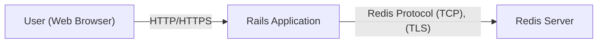
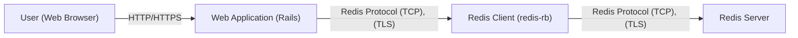
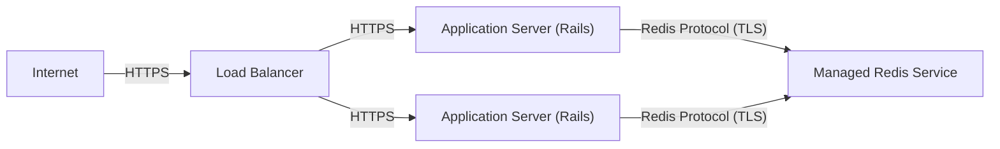
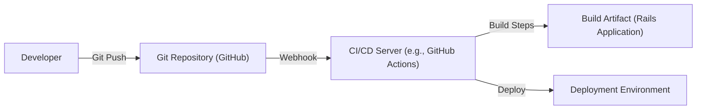

Okay, let's create a detailed design document for the Chewy project, focusing on aspects relevant for threat modeling.

# BUSINESS POSTURE

Chewy is a Rails session store leveraging Redis for storage.  The primary business goal is to provide a simple, fast, and reliable session management solution for Rails applications.  It aims to be a drop-in replacement for the default cookie-based session store, offering improved performance and scalability, especially for applications with a large number of concurrent users or large session data.  The project prioritizes ease of use and integration with existing Rails applications.

Business Priorities:

*   Provide a reliable and performant session storage mechanism.
*   Ensure seamless integration with Rails applications.
*   Maintain simplicity and ease of use for developers.
*   Offer a scalable solution for growing applications.

Business Risks:

*   Session data loss or corruption:  Failure of the Redis instance or network connectivity issues could lead to loss of user session data, disrupting user experience and potentially causing data loss.
*   Session hijacking or fixation:  Vulnerabilities in the session management implementation could allow attackers to hijack user sessions or perform session fixation attacks, leading to unauthorized access to user accounts and sensitive data.
*   Denial of Service (DoS):  The Redis instance could be a target for DoS attacks, rendering the application unusable by overwhelming the session storage.
*   Data breaches: If the Redis instance is compromised, sensitive session data could be exposed.
*   Dependency vulnerabilities: Vulnerabilities in the `redis-rb` gem or other dependencies could be exploited to compromise the application.

# SECURITY POSTURE

Existing Security Controls:

*   security control: Leverages Redis, which can be configured with authentication (password protection) and TLS encryption for secure communication. (Described in Chewy's README and Redis documentation).
*   security control: Uses signed, serialized cookies to store the session ID. This helps prevent tampering with the session ID itself. (Implied by Rails session management).
*   security control: Relies on Rails' built-in session management features, which include mechanisms to prevent session fixation (e.g., regenerating session IDs on login). (Part of Rails' framework).
*   security control: The `redis-rb` gem handles the communication with Redis, and its security depends on the gem's implementation and configuration. (Dependency on `redis-rb`).

Accepted Risks:

*   accepted risk: Assumes that the Redis instance is properly secured and managed, including network access control, authentication, and potentially TLS encryption. This is a deployment-specific concern.
*   accepted risk: Relies on the security of the underlying Rails framework and its session management implementation.
*   accepted risk: Does not implement custom encryption of session data *within* Redis; it relies on Redis's own security features and the serialization/deserialization process.

Recommended Security Controls:

*   security control: Explicitly document and enforce the requirement for Redis authentication and TLS encryption in production environments.
*   security control: Implement monitoring and alerting for the Redis instance to detect potential issues (e.g., connection failures, high memory usage, slow queries).
*   security control: Regularly update the `redis-rb` gem and other dependencies to address security vulnerabilities.
*   security control: Consider implementing a mechanism to periodically rotate the secret key used for signing cookies.
*   security control: Implement rate limiting on session creation to mitigate potential DoS attacks targeting session creation.

Security Requirements:

*   Authentication:
    *   The application itself doesn't handle user authentication directly; it relies on the Rails application using it.
    *   Redis connection should always require authentication.

*   Authorization:
    *   The application itself doesn't handle user authorization; it relies on the Rails application using it.
    *   Redis access should be restricted to the application server only.

*   Input Validation:
    *   Session data is serialized and deserialized by Rails, which should handle basic input validation. However, developers should be cautious about storing complex or untrusted data directly in the session.
    *   Redis key names (session IDs) are generated by Rails and should be validated by the framework.

*   Cryptography:
    *   Session IDs are signed using a secret key (managed by Rails).
    *   Communication with Redis should use TLS encryption in production environments.
    *   Consider encrypting sensitive data stored *within* the session, in addition to relying on Redis's security features.

# DESIGN

## C4 CONTEXT

Element Descriptions:

*   Element:
    *   Name: User
    *   Type: Person
    *   Description: A user interacting with the Rails application through a web browser.
    *   Responsibilities: Initiates requests, views responses, provides input.
    *   Security controls: Browser security settings, HTTPS.

*   Element:
    *   Name: Rails Application
    *   Type: Software System
    *   Description: The Rails application using Chewy for session management.
    *   Responsibilities: Handles user requests, processes business logic, manages sessions using Chewy.
    *   Security controls: Rails' built-in security features, application-specific security logic, secure coding practices.

*   Element:
    *   Name: Redis Server
    *   Type: Software System
    *   Description: The Redis instance used for storing session data.
    *   Responsibilities: Stores and retrieves session data.
    *   Security controls: Redis authentication, TLS encryption, network access control, regular security updates.

## C4 CONTAINER

Element Descriptions:

*   Element:
    *   Name: User
    *   Type: Person
    *   Description: A user interacting with the Rails application through a web browser.
    *   Responsibilities: Initiates requests, views responses, provides input.
    *   Security controls: Browser security settings, HTTPS.

*   Element:
    *   Name: Web Application
    *   Type: Container: Web Application
    *   Description: The Rails application code, including controllers, models, views, and the Chewy gem integration.
    *   Responsibilities: Handles user requests, processes business logic, interacts with the Redis client to manage sessions.
    *   Security controls: Rails' built-in security features, application-specific security logic, secure coding practices, input validation, output encoding.

*   Element:
    *   Name: Redis Client
    *   Type: Container: Library
    *   Description: The `redis-rb` gem, which provides a Ruby interface for interacting with Redis.
    *   Responsibilities: Establishes and manages connections to the Redis server, sends commands, and receives responses.
    *   Security controls: Secure connection management (TLS), proper handling of Redis authentication.

*   Element:
    *   Name: Redis Server
    *   Type: Container: Database
    *   Description: The Redis instance used for storing session data.
    *   Responsibilities: Stores and retrieves session data.
    *   Security controls: Redis authentication, TLS encryption, network access control, regular security updates, data persistence configuration.

## DEPLOYMENT

Possible deployment solutions:

1.  Single server deployment: Rails application and Redis server on the same machine. (Simplest, but not recommended for production).
2.  Separate servers: Rails application and Redis server on separate machines within the same private network.
3.  Cloud-based deployment (e.g., AWS, GCP, Azure): Rails application deployed on a platform-as-a-service (PaaS) offering (e.g., Heroku, AWS Elastic Beanstalk) and Redis deployed as a managed service (e.g., AWS ElastiCache, GCP Memorystore, Azure Cache for Redis).
4.  Containerized deployment (e.g., Docker, Kubernetes): Rails application and Redis server deployed as separate containers, potentially orchestrated by Kubernetes.

Chosen solution (for detailed description): Cloud-based deployment (Option 3).

Element Descriptions:

*   Element:
    *   Name: Internet
    *   Type: External Entity
    *   Description: The public internet.
    *   Responsibilities: Source of user requests.
    *   Security controls: N/A

*   Element:
    *   Name: Load Balancer
    *   Type: Infrastructure Node
    *   Description: Distributes incoming traffic across multiple application servers.
    *   Responsibilities: Traffic distribution, SSL termination (potentially).
    *   Security controls: DDoS protection, WAF (Web Application Firewall), access control lists.

*   Element:
    *   Name: Application Server
    *   Type: Infrastructure Node
    *   Description: A server running the Rails application.
    *   Responsibilities: Executes the Rails application code.
    *   Security controls: Operating system security, firewall, intrusion detection system.

*   Element:
    *   Name: Managed Redis Service
    *   Type: Infrastructure Node
    *   Description: A managed Redis service provided by a cloud provider (e.g., AWS ElastiCache).
    *   Responsibilities: Provides a managed Redis instance.
    *   Security controls: Managed by the cloud provider, including security updates, patching, and potentially network isolation.  Configuration options for authentication and TLS.

## BUILD

The build process for Chewy itself is relatively simple, as it's a Ruby gem. However, the build process for a Rails application *using* Chewy is more relevant from a security perspective.

Build process description:

1.  Developer commits code to the Git repository (GitHub).
2.  A webhook triggers the CI/CD server (e.g., GitHub Actions, Jenkins).
3.  The CI/CD server checks out the code.
4.  Build steps are executed:
    *   Dependency installation (Bundler): `bundle install` - This step is crucial for supply chain security.  Dependencies should be carefully managed and vetted.  Tools like `bundler-audit` can be used to check for known vulnerabilities in gems.
    *   Static code analysis (e.g., RuboCop, Brakeman): These tools can identify potential code quality and security issues.
    *   Tests (unit, integration, etc.): Running tests helps ensure the application's functionality and can also catch security regressions.
    *   Asset compilation (if applicable).
5.  A build artifact is created (e.g., a Docker image, a deployment package).
6.  The artifact is deployed to the target environment.

Security Controls in Build Process:

*   security control: Dependency vulnerability scanning (e.g., `bundler-audit`, Snyk).
*   security control: Static application security testing (SAST) (e.g., Brakeman).
*   security control: Code quality checks (e.g., RuboCop).
*   security control: Automated testing.
*   security control: Secure build environment (e.g., limited access to CI/CD server).
*   security control: Signed commits (GPG).

# RISK ASSESSMENT

Critical Business Processes:

*   User session management: Maintaining user sessions is critical for the functionality of most Rails applications.  Without it, users would have to log in repeatedly, and any stateful interactions would be impossible.

Data Sensitivity:

*   Session data: The sensitivity of session data depends on the specific application.  It can range from low (e.g., storing user preferences) to high (e.g., storing authentication tokens, personally identifiable information (PII), or financial data).  Chewy itself doesn't know the sensitivity of the data; it's the responsibility of the application using Chewy to manage this appropriately.
*   Session IDs: Session IDs are sensitive because they can be used to hijack user sessions.

# QUESTIONS & ASSUMPTIONS

Questions:

*   What specific data will be stored in the session by applications using Chewy? This is crucial for determining the appropriate level of security controls.
*   What is the expected load (number of concurrent users) on applications using Chewy? This will influence the scaling requirements for Redis.
*   What are the specific compliance requirements (e.g., GDPR, HIPAA) for applications using Chewy?
*   What is the existing security infrastructure and tooling in place for the Rails applications that will use Chewy?

Assumptions:

*   BUSINESS POSTURE: The organization has a moderate risk appetite, prioritizing functionality and ease of use but also recognizing the importance of security.
*   SECURITY POSTURE: The organization has basic security practices in place, such as using HTTPS and managing secrets securely. The development team is aware of common web application vulnerabilities (e.g., OWASP Top 10).
*   DESIGN: The Redis instance will be properly configured and secured, including authentication and TLS encryption. The Rails application using Chewy will follow secure coding practices. The deployment environment will have appropriate network security controls.