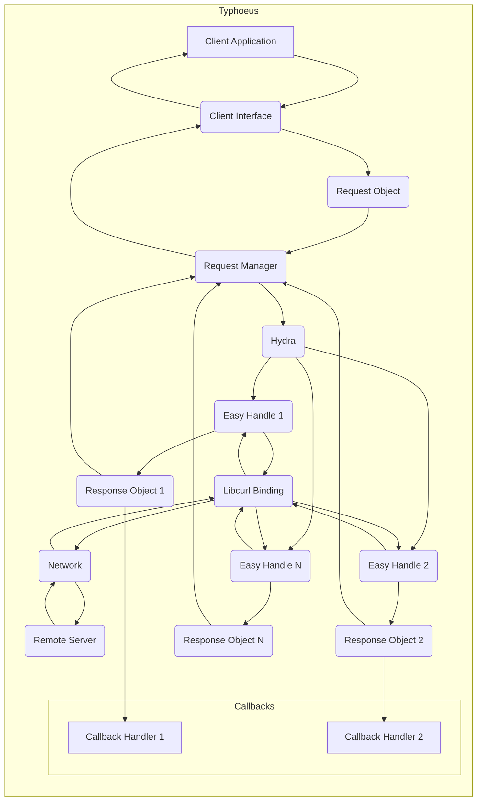

## Project Design Document: Typhoeus HTTP Client (Improved)

**1. Introduction**

This document provides a detailed design overview of the Typhoeus HTTP client library for Ruby, specifically intended to facilitate threat modeling activities. It outlines the key components, architecture, data flow, and security considerations of the project. This document serves as a foundational resource for identifying potential security vulnerabilities and attack vectors.

**1.1. Purpose**

The primary purpose of this document is to provide a comprehensive and security-focused understanding of the Typhoeus project's design and functionality. This detailed understanding is crucial for security engineers, architects, and developers to effectively identify and analyze potential security threats during the threat modeling process.

**1.2. Scope**

This document covers the core architecture and functionality of the Typhoeus library, focusing on how it constructs, sends, and receives HTTP requests and responses. It details Typhoeus's interaction with the underlying libcurl library but does not delve into the internal implementation details of libcurl itself. The scope is limited to the Typhoeus library and its immediate interactions.

**1.3. Target Audience**

This document is intended for:

* Security engineers and architects responsible for conducting threat modeling and security assessments.
* Developers contributing to or maintaining the Typhoeus project, requiring a security-focused understanding.
* Anyone seeking a detailed understanding of Typhoeus's internal workings with a security perspective.

**2. Project Overview**

Typhoeus is a Ruby HTTP client library that leverages the power and performance of the libcurl C library. It offers a Ruby-friendly interface for making various types of HTTP requests, providing features such as:

* Asynchronous and parallel request execution for improved performance.
* Comprehensive support for standard HTTP methods (GET, POST, PUT, DELETE, PATCH, HEAD, OPTIONS).
* Flexible handling of HTTP headers, cookies, and request bodies (including file uploads).
* Implementation of common HTTP authentication schemes (Basic, Digest, Bearer tokens, etc.).
* Robust support for SSL/TLS, enabling secure communication over HTTPS.
* Configuration options for proxy servers, allowing requests to be routed through intermediaries.
* Customizable timeouts and retry mechanisms for handling transient network issues.
* Callback mechanisms for processing responses and handling events during the request lifecycle.

By utilizing libcurl, Typhoeus benefits from its mature and well-tested networking capabilities.

**3. System Architecture**

The architecture of Typhoeus is designed around managing and executing HTTP requests efficiently. Key components interact to handle the lifecycle of a request.

**3.1. Components**

* **Client Interface:** The public-facing API that Ruby developers use to create and initiate HTTP requests. This includes methods for defining request parameters, headers, and callbacks.
* **Request Object:** Represents a single HTTP request, encapsulating all necessary information such as URL, method, headers, body, and options.
* **Request Manager:** Responsible for orchestrating the execution of requests. It manages the queue of pending requests and interacts with the Hydra for concurrent execution.
* **Hydra:** The core concurrency manager. It utilizes libcurl's multi interface to handle multiple requests asynchronously on a single thread, improving performance.
* **Easy Handle (Libcurl):**  Each individual HTTP request is associated with a libcurl "easy handle". Typhoeus configures these handles with the specific details of each request.
* **MIME Parser:** Handles the encoding and decoding of MIME data for request bodies (e.g., `multipart/form-data`) and responses.
* **Response Object:**  Represents the HTTP response received from the server. It contains the response body, headers, status code, and metadata about the request and response.
* **Callback Handlers:**  User-defined blocks of code that are executed at various stages of the request lifecycle (e.g., on success, on failure, on complete).
* **Libcurl Binding:** The low-level interface that bridges Typhoeus with the libcurl C library. It translates Typhoeus's requests into libcurl function calls.

**3.2. Component Interactions and Data Flow**

**Data Flow Description:**

1. The **Client Application** initiates an HTTP request by interacting with the **Client Interface**, providing details like URL, method, headers, and body.
2. The **Client Interface** creates a **Request Object** to encapsulate the request details.
3. The **Request Object** is passed to the **Request Manager**.
4. The **Request Manager** adds the request to the **Hydra** for asynchronous execution.
5. **Hydra** manages a pool of **Easy Handles** (from libcurl). For each request, it configures an **Easy Handle** with the request details.
6. The **Easy Handle** interacts with the **Libcurl Binding**, which makes the actual network call to the **Remote Server**.
7. The **Remote Server** processes the request and sends the HTTP response back through the **Network**.
8. The **Libcurl Binding** receives the response data and provides it back to the corresponding **Easy Handle**.
9. The **Easy Handle** processes the raw response data and creates a **Response Object**, containing headers, body, and status code.
10. The **Response Object** is passed back to the **Hydra**.
11. **Hydra** notifies the **Request Manager** that the request is complete.
12. The **Request Manager** retrieves the **Response Object** and passes it back to the **Client Interface**.
13. The **Client Interface** triggers any associated **Callback Handlers**, passing the **Response Object** as an argument.
14. Finally, the **Client Interface** returns the **Response Object** to the **Client Application**.

**4. Security Considerations**

This section details potential security considerations inherent in the design and functionality of Typhoeus, crucial for effective threat modeling.

* **Dependency Vulnerabilities (libcurl):** Typhoeus's security is directly tied to libcurl. Any vulnerabilities discovered in libcurl could be exploited through Typhoeus. Regular updates to libcurl are essential.
* **Input Validation and Sanitization:**
    * **URL Handling:** Improper validation of URLs provided by the user could lead to Server-Side Request Forgery (SSRF) attacks, where Typhoeus could be tricked into making requests to internal or unintended systems.
    * **Header Injection:**  If user-controlled input is directly used to construct HTTP headers without proper sanitization, attackers could inject malicious headers, leading to vulnerabilities like HTTP Response Splitting or Cross-Site Scripting (XSS).
    * **Body Handling:**  Careless handling of request bodies, especially when dealing with file uploads or user-provided data, could lead to injection attacks or the transmission of malicious content.
* **SSL/TLS Configuration:**
    * **Certificate Verification:** Disabling or improperly configuring certificate verification makes Typhoeus susceptible to man-in-the-middle (MITM) attacks.
    * **Protocol Negotiation:**  Using outdated or insecure TLS protocols can expose communication to known vulnerabilities.
    * **Cipher Suite Selection:**  Weak cipher suites can be vulnerable to cryptographic attacks.
* **Authentication Handling:**
    * **Credential Storage:**  Typhoeus itself doesn't store credentials, but applications using it must handle authentication credentials securely to prevent leakage.
    * **Insecure Transmission:** Transmitting credentials over unencrypted connections (HTTP instead of HTTPS) exposes them to interception.
    * **Authentication Bypass:**  Vulnerabilities in the application logic using Typhoeus could lead to authentication bypass.
* **Callback Security:**
    * **Malicious Callbacks:** If the application allows users to define arbitrary callbacks, malicious users could inject code that is executed within the application's context, leading to code execution vulnerabilities.
    * **Information Disclosure:** Callbacks might inadvertently expose sensitive information from the response or the application's internal state.
* **Error Handling and Information Disclosure:**  Verbose error messages or stack traces that include sensitive information about the application's environment or internal workings could be exposed to attackers.
* **Resource Exhaustion:**
    * **Parallel Requests:**  The ability to make many parallel requests could be abused to perform denial-of-service (DoS) attacks against target servers. Applications should implement safeguards to prevent excessive concurrency.
    * **Memory Consumption:**  Handling large responses or making a large number of concurrent requests could lead to excessive memory consumption.
* **Proxy Security:**
    * **Proxy Misconfiguration:**  Incorrectly configured proxy settings could expose internal systems or lead to unintended routing of traffic.
    * **Compromised Proxies:** If the configured proxy is compromised, all traffic routed through it could be intercepted or manipulated.
* **Cookie Handling:**
    * **Insecure Cookie Attributes:**  Applications using Typhoeus need to ensure that cookies are handled with appropriate security attributes (e.g., `Secure`, `HttpOnly`, `SameSite`) to prevent attacks like session hijacking or cross-site scripting (XSS).
* **HTTP Method Tampering:** While less of a direct vulnerability in Typhoeus, applications should ensure that the intended HTTP method is used and cannot be easily manipulated by an attacker.
* **Data Injection in Callbacks:** If response data is processed in callbacks without proper sanitization, it could lead to vulnerabilities in the consuming application (e.g., XSS if rendering HTML).

**5. Deployment Considerations**

Typhoeus is typically deployed as a library embedded within Ruby applications. The security of Typhoeus in a deployed environment is influenced by several factors.

* **Application Security Posture:** The overall security of the application using Typhoeus is the primary factor. Vulnerabilities in the application logic can be exploited regardless of Typhoeus's security.
* **Runtime Environment:** The security of the server or container where the application runs is crucial. This includes operating system security, network configurations, and access controls.
* **Network Security:** Network firewalls, intrusion detection systems, and other network security measures can help protect against attacks targeting applications using Typhoeus.
* **Dependency Management:** Regularly updating Typhoeus and its dependencies (especially libcurl) is essential to patch known vulnerabilities.

**6. Dependencies**

* **libcurl:** The fundamental dependency providing the underlying HTTP transfer capabilities. Its security is paramount.
* **Ruby:** The programming language in which Typhoeus is implemented. Security vulnerabilities in the Ruby interpreter could potentially impact Typhoeus.

**7. Future Considerations (Security Focused)**

* **Improved Input Validation Libraries:** Explore integrating or recommending robust input validation libraries to help developers sanitize inputs effectively.
* **Secure Defaults:**  Review default configurations to ensure they align with security best practices (e.g., enabling certificate verification by default).
* **Security Audits and Static Analysis:**  Conduct regular security audits and utilize static analysis tools to identify potential vulnerabilities in the codebase.
* **Content Security Policy (CSP) Awareness:**  Consider adding features or guidance to help applications enforce CSP when processing responses received through Typhoeus.
* **Subresource Integrity (SRI) for Dependencies:** Encourage or provide mechanisms for verifying the integrity of libcurl and other dependencies.
* **Rate Limiting at the Library Level:** Explore options for providing built-in rate limiting capabilities to prevent abuse.

This improved design document provides a more detailed and security-focused overview of the Typhoeus HTTP client, intended to be a valuable resource for threat modeling and security analysis. The outlined security considerations highlight potential areas of vulnerability that should be carefully examined during the threat modeling process.
