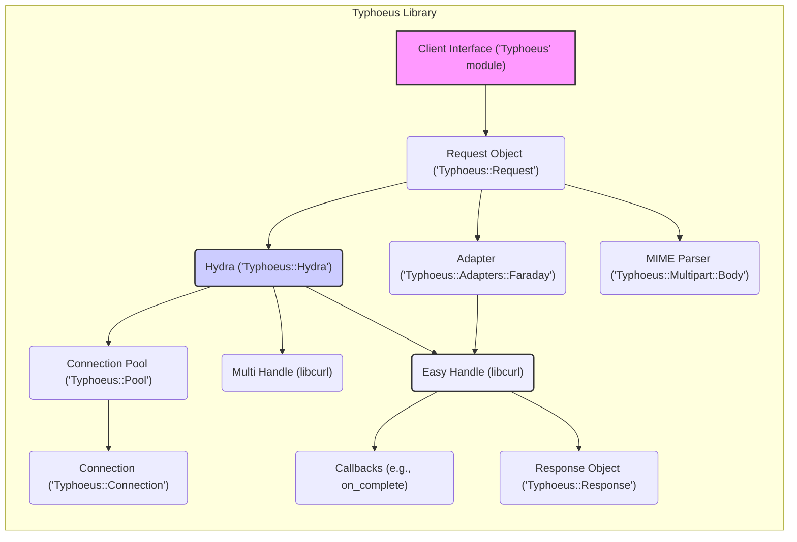

# Project Design Document: Typhoeus HTTP Client

**Version:** 1.1
**Date:** October 26, 2023
**Author:** Gemini (AI Assistant)
**Project:** Typhoeus HTTP Client

## 1. Introduction

This document provides an enhanced and more detailed design overview of the Typhoeus HTTP client library for Ruby. This document is specifically intended for software architects, security engineers, and developers requiring an in-depth understanding of Typhoeus's architecture and functionality, particularly for the purpose of conducting thorough threat modeling. It elaborates on the key components, data flow, and dependencies of the library, providing greater granularity than the previous version.

## 2. Goals

*   Provide a clear, concise, and more detailed description of the Typhoeus library's architecture.
*   Identify the key components and explicitly describe their interactions and responsibilities.
*   Illustrate the data flow within the library during HTTP request processing with increased granularity.
*   Highlight important dependencies and explain their relevance, especially from a security perspective.
*   Serve as a robust and comprehensive foundation for subsequent threat modeling activities.

## 3. Overview

Typhoeus is a powerful Ruby HTTP client library built upon the foundation of libcurl, offering a non-blocking and parallel request interface. It is designed to provide performance and efficiency for Ruby applications that need to execute multiple concurrent HTTP requests. Key features include:

*   Support for making both synchronous and asynchronous HTTP requests.
*   Efficient handling of parallel requests through its Hydra component.
*   A clean and idiomatic Ruby API for ease of use.
*   Comprehensive support for various HTTP methods (GET, POST, PUT, DELETE, etc.), headers, and request bodies.
*   Seamless integration with other Ruby libraries and frameworks within the Ruby ecosystem.

## 4. System Architecture

Typhoeus's architecture is composed of several interconnected components that collaborate to manage and execute HTTP requests. Each component has specific responsibilities, contributing to the overall functionality of the library.

### 4.1. Components

*   **Client Interface (`Typhoeus` module):** This serves as the primary entry point for users to interact with Typhoeus. It exposes methods like `get`, `post`, `put`, `delete`, and `head` for initiating HTTP requests. Users configure request parameters (URL, method, headers, body, callbacks, etc.) through this interface.
*   **Request Object (`Typhoeus::Request`):** Represents a single, self-contained HTTP request. It encapsulates all the necessary information required to execute a request, including the target URL, HTTP method, request headers, request body, authentication details, and user-defined callback functions.
*   **Hydra (`Typhoeus::Hydra`):** The central component responsible for orchestrating and executing multiple requests concurrently. It maintains a pool of libcurl multi-handles and efficiently distributes individual `Request` objects to available handles for non-blocking execution. Hydra manages the overall lifecycle of parallel requests.
*   **Easy Handle (from libcurl):**  A fundamental structure provided by libcurl that represents a single HTTP transfer or session. Typhoeus leverages these handles to perform the actual low-level network communication. Each Easy handle is configured based on the `Request` object's parameters.
*   **Multi Handle (from libcurl):** A structure within libcurl that enables the management of multiple Easy Handles concurrently in a non-blocking manner. Hydra utilizes the Multi Handle to achieve parallelism, allowing it to monitor and manage multiple ongoing requests efficiently.
*   **Connection Pool (`Typhoeus::Pool`):**  Manages a pool of persistent HTTP connections (using `Connection` objects) to improve performance by reusing existing TCP connections for subsequent requests to the same host. This reduces the overhead of establishing new connections for each request.
*   **Connection (`Typhoeus::Connection`):** Represents a single persistent HTTP connection. It encapsulates the underlying socket and associated state, allowing for the reuse of connections.
*   **Adapter (`Typhoeus::Adapters::Faraday`):** An abstraction layer responsible for translating Typhoeus's `Request` objects into the specific configurations required by libcurl. While the example shows `Faraday`, Typhoeus can potentially support other adapters. The adapter handles setting up the libcurl Easy Handle with the correct options.
*   **Callbacks (e.g., `on_complete`, `on_success`, `on_failure`):** User-defined functions or blocks of code that are executed at specific stages of the request lifecycle. These allow users to process the response data, handle errors, or perform actions after the request is completed.
*   **Response Object (`Typhoeus::Response`):**  Represents the HTTP response received from the server. It encapsulates the HTTP status code, response headers, response body, and other relevant metadata about the response.
*   **MIME Parser (`Typhoeus::Multipart::Body`):**  Handles the construction and parsing of MIME encoded data, particularly for multipart form data requests (e.g., file uploads).

### 4.2. Component Interactions

The following list describes how the components interact with each other during the request lifecycle:

*   The user initiates a request through the **Client Interface**, which creates a **Request Object**.
*   For parallel requests, the **Request Object** is passed to the **Hydra**.
*   The **Hydra** manages a pool of **Easy Handles** and uses the **Multi Handle** from libcurl to manage their concurrent execution.
*   The **Hydra** interacts with the **Connection Pool** to acquire or establish **Connection** objects for the requests.
*   The **Adapter** receives the **Request Object** and configures a libcurl **Easy Handle** with the appropriate settings.
*   The **Easy Handle** performs the network communication using the underlying libcurl library.
*   The **Connection Pool** provides persistent connections to the **Easy Handle**, if available.
*   Upon receiving a response, the **Adapter** creates a **Response Object**.
*   **Callbacks** defined in the **Request Object** are executed, receiving the **Response Object** as an argument.
*   The **MIME Parser** is used by the **Request Object** to format the request body for multipart requests.



## 5. Data Flow

The detailed data flow for an HTTP request using Typhoeus can be broken down into the following steps:

1. **User Initiates Request:** The user calls a method on the **Client Interface** (e.g., `Typhoeus.get`) with the target URL and optional parameters.
2. **Request Object Creation:** A new **Request Object** is instantiated, encapsulating the provided parameters (URL, HTTP method, headers, body, callbacks).
3. **Request Scheduling (Hydra):** If using `Hydra`, the **Request Object** is added to the Hydra's internal queue of pending requests.
4. **Hydra Processing:** The **Hydra** continuously monitors its queue and available libcurl **Easy Handles**.
5. **Easy Handle Assignment:** When an **Easy Handle** becomes available, the **Hydra** assigns a pending **Request Object** to it.
6. **Adapter Configuration:** The **Adapter** receives the **Request Object** and configures the assigned libcurl **Easy Handle**. This involves setting:
    *   The target URL.
    *   The HTTP method (GET, POST, etc.).
    *   Request headers.
    *   The request body (if applicable), potentially using the **MIME Parser** for multipart data.
    *   SSL/TLS options.
    *   Callback functions for different stages of the request.
7. **Connection Acquisition:** The **Adapter** (or libcurl internally) interacts with the **Connection Pool** to either retrieve an existing persistent **Connection** to the target host or establish a new one.
8. **Network Communication (libcurl):** The configured libcurl **Easy Handle** performs the underlying network communication:
    *   DNS resolution of the target hostname.
    *   Establishment of a TCP connection (potentially reusing a pooled **Connection**).
    *   Sending the HTTP request to the server.
    *   Receiving the HTTP response from the server.
9. **Response Handling (libcurl):** Libcurl receives the raw response data, including headers and body.
10. **Response Processing (Typhoeus):** Typhoeus processes the raw response data.
11. **Response Object Creation:** A **Response Object** is created, populated with the HTTP status code, response headers, response body, and other relevant information.
12. **Callback Execution:** Typhoeus executes the registered callback functions (e.g., `on_success`, `on_failure`, `on_complete`) defined in the original **Request Object**, passing the **Response Object** as an argument.

```mermaid
graph LR
    A["User Initiates Request on Client Interface"] --> B("Request Object Created");
    B --> C{ "Hydra (if used)" };
    C -- "Add to Queue" --> D("Request Queued in Hydra");
    C -- "Direct Execution" --> E("Adapter Configures libcurl Easy Handle");
    D --> E;
    E --> F("Connection Pool Interaction (Acquire/Establish Connection)");
    F --> G("libcurl Network Communication");
    G --> H("Raw Response Data Received by libcurl");
    H --> I("Typhoeus Processes Response Data");
    I --> J("Response Object Created");
    J --> K("Execute Callbacks");
    style A fill:#f9f,stroke:#333,stroke-width:2px
    style C fill:#ccf,stroke:#333,stroke-width:2px
    style G fill:#eef,stroke:#333,stroke-width:2px
```

## 6. Dependencies

Typhoeus relies on the following key external dependencies, which are critical to its functionality and security:

*   **libcurl:** The fundamental C library responsible for handling the low-level details of network communication (HTTP, HTTPS, etc.). Security vulnerabilities in libcurl can directly impact Typhoeus. Regular updates and security patching of libcurl are essential.
*   **ffi (Foreign Function Interface):**  A Ruby library that provides the mechanism for Typhoeus to interact with the native libcurl C library. Vulnerabilities in `ffi` could potentially be exploited.
*   **Addressable:**  Used for parsing and manipulating URLs. This is important for ensuring that URLs are handled correctly and securely, preventing issues like URL injection.
*   **mime-types:**  Used for determining the correct MIME type for request bodies, especially for file uploads. Incorrect MIME type handling could lead to security vulnerabilities.

## 7. Deployment Considerations

When deploying applications that use Typhoeus, consider the following:

*   **Ruby Environment:** Ensure a compatible and up-to-date Ruby version is used.
*   **libcurl Installation and Version:** Libcurl must be installed on the deployment environment. The specific version of libcurl can impact performance, available features, and security. It's crucial to use a version with known security vulnerabilities patched.
*   **Concurrency Limits (Hydra):** When using `Hydra` for parallel requests, carefully consider the number of concurrent requests to avoid overwhelming target servers or the application's own resources, potentially leading to denial-of-service issues.
*   **SSL/TLS Configuration:** Proper configuration of SSL/TLS options is paramount for secure communication over HTTPS. This includes:
    *   **Certificate Verification:** Ensure that Typhoeus is configured to verify the SSL certificates of the servers it connects to, preventing man-in-the-middle attacks.
    *   **Cipher Suite Selection:** Configure secure cipher suites to avoid using weak or outdated encryption algorithms.
    *   **Certificate Management:**  Properly manage and store any client-side certificates if required for authentication.
*   **Dependency Management:** Use a robust dependency management tool (like Bundler) to manage Typhoeus and its dependencies, ensuring that specific versions are used and can be easily updated.
*   **Resource Limits:** Be aware of system-level resource limits (e.g., file descriptors, network connections) that might be relevant when making a large number of concurrent requests.

## 8. Security Considerations (Detailed)

Based on the architecture and data flow, here are some more detailed security considerations:

*   **libcurl Vulnerabilities:** As the core dependency, vulnerabilities in libcurl (e.g., buffer overflows, protocol weaknesses) directly translate to potential vulnerabilities in Typhoeus. Regularly monitor libcurl security advisories and update accordingly.
*   **Server-Side Request Forgery (SSRF):** If the URLs provided to Typhoeus are derived from user input without proper validation and sanitization, attackers could potentially make requests to internal or unintended external resources.
*   **Insecure SSL/TLS Configuration:**
    *   Disabling certificate verification makes the application vulnerable to man-in-the-middle attacks.
    *   Using weak or outdated cipher suites can expose communication to eavesdropping.
    *   Not enforcing HTTPS can lead to data being transmitted in plaintext.
*   **Callback Security:** If user-provided callback functions are not carefully handled, malicious actors could potentially inject code or exploit vulnerabilities within the callback logic. Ensure callbacks operate within a secure context and do not have excessive privileges.
*   **Header Injection:** If request headers are constructed using unsanitized user input, attackers could inject malicious headers, potentially leading to issues like HTTP response splitting or cross-site scripting (XSS) if the response is mishandled.
*   **Request Body Manipulation:** For POST/PUT requests, ensure that the request body is constructed securely and that user-provided data within the body is properly encoded and sanitized to prevent injection attacks on the receiving server.
*   **Connection Reuse Security:** While connection pooling improves performance, in multi-tenant environments or applications handling sensitive data, ensure that connections are not inadvertently reused across different user sessions, potentially leading to data leakage.
*   **Error Handling and Information Disclosure:** Ensure that error messages do not reveal sensitive information about the application's internal workings or the target servers.

## 9. Threat Modeling Focus Areas

For subsequent threat modeling activities, the following areas should be the primary focus, considering the components and data flow outlined above:

*   **Typhoeus Client Interface:** Analyze how user input is processed and used to construct `Request` objects, focusing on potential SSRF and header injection vulnerabilities.
*   **Interaction with libcurl (via the Adapter):** Scrutinize the interface between the Typhoeus Adapter and libcurl for potential vulnerabilities related to data marshalling, incorrect configuration of libcurl options, or improper error handling.
*   **Request Construction and Modification:** Examine the process of building and modifying request parameters (URLs, headers, body) to identify potential injection points.
*   **Response Handling and Callback Execution:** Analyze how responses are processed and how callback functions are invoked, looking for vulnerabilities related to insecure deserialization or the execution of potentially malicious code within callbacks.
*   **SSL/TLS Implementation within libcurl and Typhoeus:** Thoroughly assess the configuration and enforcement of SSL/TLS to ensure secure communication and prevent man-in-the-middle attacks.
*   **Dependency Management and Updates:** Evaluate the risks associated with outdated dependencies (especially libcurl) and the process for keeping them up-to-date with security patches.
*   **Hydra's Concurrency Management:** Consider potential denial-of-service attack vectors related to the number of concurrent requests managed by Hydra and resource exhaustion.
*   **Connection Pool Management:** Analyze the security implications of connection reuse, particularly in scenarios involving sensitive data or multi-tenancy.

This enhanced document provides a more granular and comprehensive understanding of the Typhoeus HTTP client library's design. This detailed information is crucial for performing thorough threat modeling and identifying potential security vulnerabilities within applications that utilize Typhoeus.