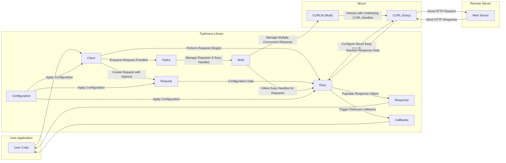

## Project Design Document: Typhoeus HTTP Client (Improved)

**1. Introduction**

This document provides an enhanced and detailed design overview of the Typhoeus HTTP client library for Ruby. It aims to provide a clear and comprehensive understanding of Typhoeus's architecture, core components, and data flow, specifically tailored for effective threat modeling. This document will serve as a robust foundation for identifying potential security vulnerabilities, understanding attack surfaces, and designing appropriate mitigation strategies.

**2. Goals of this Document**

*   Provide an in-depth understanding of Typhoeus's internal architecture, functionalities, and key interactions.
*   Clearly identify and describe the core components of Typhoeus and their specific responsibilities.
*   Illustrate the complete flow of data within the system, with a particular focus on interactions with external entities and user-provided data.
*   Thoroughly highlight areas of significant relevance for security considerations, detailing potential threat vectors and attack surfaces.
*   Serve as a definitive reference point for ongoing development, security audits, and future architectural discussions.

**3. Project Overview: Typhoeus**

Typhoeus is a powerful and efficient Ruby HTTP client library built upon the solid foundation of libcurl. It offers a high-level, Ruby-friendly interface for making HTTP requests, with a particular emphasis on handling concurrent and parallel requests effectively. Typhoeus excels in scenarios requiring high performance and the ability to interact with multiple endpoints simultaneously. Its key strengths include:

*   **Parallel Request Execution:**  Leveraging libcurl's multi interface for efficient concurrent requests.
*   **Ease of Use:** Providing a clean and intuitive Ruby API for common HTTP operations.
*   **Performance:**  Benefiting from the underlying performance of libcurl.
*   **Flexibility:** Offering extensive configuration options for customizing request behavior.

**4. Detailed Design**

Typhoeus is composed of several interconnected components, each with specific responsibilities.

*   **Client:** The primary interface for users to interact with Typhoeus. It offers methods for initiating and managing HTTP requests. Key responsibilities include:
    *   Creating `Request` objects.
    *   Executing single requests directly.
    *   Enqueuing requests for parallel execution via `Hydra`.
    *   Managing global configuration settings.
*   **Request:**  Represents a single, self-contained HTTP request. It encapsulates all the necessary information for making an HTTP call. Key attributes include:
    *   `url`: The target URL for the request.
    *   `method`: The HTTP method (e.g., GET, POST, PUT, DELETE).
    *   `headers`:  HTTP headers to be sent with the request.
    *   `body`: The request body for methods like POST and PUT.
    *   `params`:  Query parameters for the request.
    *   `options`:  A collection of configuration settings specific to this request (e.g., timeouts, SSL settings, authentication details).
*   **Response:** Represents the HTTP response received from the server after a request is made. Key attributes include:
    *   `status_code`: The HTTP status code returned by the server.
    *   `headers`: The HTTP headers returned by the server.
    *   `body`: The response body content.
    *   `return_code`:  A libcurl-specific code indicating the outcome of the request.
    *   `total_time`: The total time taken for the request.
    *   `effective_url`: The final URL accessed after any redirects.
*   **Hydra:** The central component for managing and executing parallel HTTP requests. Its core responsibilities include:
    *   Maintaining a pool of `Easy` handles.
    *   Scheduling and executing enqueued `Request` objects concurrently.
    *   Interacting with the `Multi` interface of libcurl.
    *   Orchestrating the lifecycle of parallel requests.
*   **Easy:** A lightweight wrapper around libcurl's "easy interface" (`CURL`). Each `Easy` object is responsible for handling a single HTTP request. `Hydra` manages a pool of these for parallel execution. Key responsibilities include:
    *   Configuring the underlying `CURL` handle with request details.
    *   Performing the actual HTTP request using libcurl.
    *   Receiving and processing the HTTP response.
    *   Triggering callbacks.
*   **Multi:** A wrapper around libcurl's "multi interface" (`CURLM`). This interface enables asynchronous and non-blocking operations, which is fundamental to `Hydra`'s ability to handle parallel requests efficiently. Key responsibilities include:
    *   Managing multiple `CURL` easy handles concurrently.
    *   Polling for network activity.
    *   Handling events related to multiple ongoing requests.
*   **Callbacks:**  Ruby blocks that can be attached to `Request` objects to handle specific events during the request lifecycle. These provide a mechanism for users to interact with the request process. Key callback types include:
    *   `on_headers`: Executed when response headers are received. Allows inspection and manipulation of headers.
    *   `on_body`: Executed as chunks of the response body are received. Useful for handling large responses.
    *   `on_complete`: Executed when the request is fully completed (success or failure). Provides access to the `Response` object.
    *   `on_failure`: Executed when the request encounters an error. Provides information about the error.
*   **Configuration:**  Provides mechanisms for setting global and per-request options to customize Typhoeus's behavior. This includes settings for:
    *   Default headers.
    *   Timeouts (connect, read).
    *   SSL/TLS verification and certificate settings.
    *   Proxy configurations.
    *   Authentication details.
*   **Adapters:**  An abstraction layer that allows Typhoeus to potentially use different HTTP backends. While libcurl is the primary and most commonly used adapter, this architecture allows for future extensibility.

**5. Data Flow**

The following diagram illustrates the typical data flow for both single and parallel requests within Typhoeus.

**Detailed Data Flow Steps:**

1. **User Initiates Request:** The user application interacts with the `Client` to create a `Request` object, specifying the target URL, HTTP method, headers, body, and any necessary options.
2. **Request Execution (Single):** If a single request is initiated, the `Client` directly utilizes an `Easy` object. The `Request` object's configuration is applied to the `Easy` object, which then configures the underlying `CURL` easy handle.
3. **Request Enqueueing (Parallel):** For parallel requests, the `Client` enqueues the `Request` with the `Hydra`.
4. **Hydra Orchestration:** The `Hydra` manages a pool of `Easy` objects. It takes enqueued requests and assigns them to available `Easy` handles. The `Hydra` interacts with libcurl's `Multi` interface to manage the concurrent execution of these requests.
5. **libcurl Configuration:** The `Easy` object configures the underlying `CURL` easy handle with all the necessary details from the `Request` object, including URL, headers, body, timeouts, SSL settings, etc.
6. **HTTP Request Transmission:** The configured `CURL` easy handle (managed by either `Easy` for single requests or `Multi` via `Hydra` for parallel requests) sends the HTTP request to the remote `Web Server`.
7. **Response Reception:** The `Web Server` processes the request and sends back an HTTP response. libcurl receives this response.
8. **Response Processing:** The `Easy` object receives the response data from libcurl, including the status code, headers, and body.
9. **Response Object Creation:** Typhoeus creates a `Response` object and populates it with the received data.
10. **Callback Invocation:**  During the response processing, the `Easy` object triggers any registered callbacks (`on_headers`, `on_body`, `on_complete`, `on_failure`) associated with the `Request`. These callbacks allow the user application to react to different stages of the request lifecycle.
11. **Response Delivery:** The `Response` object is returned to the user application, providing access to the response data.

**6. Key Security Considerations**

Typhoeus's architecture and reliance on external components introduce several important security considerations.

*   **Dependency Vulnerabilities (libcurl):** Typhoeus's security is intrinsically linked to the security of libcurl. Vulnerabilities in libcurl can directly impact Typhoeus.
    *   **Threat:** Exploitation of known libcurl vulnerabilities (e.g., buffer overflows, TLS flaws) could compromise Typhoeus and the applications using it.
    *   **Mitigation:** Regularly update libcurl to the latest stable version and monitor security advisories.
*   **Input Validation and Sanitization:** Typhoeus must handle user-provided input (URLs, headers, bodies) securely to prevent various attacks.
    *   **Threat:**
        *   **Server-Side Request Forgery (SSRF):** Maliciously crafted URLs could target internal or unintended external resources.
        *   **Header Injection:**  Manipulating headers could lead to HTTP response splitting, session hijacking, or other vulnerabilities.
        *   **Command Injection (Indirect):** While Typhoeus doesn't directly execute commands, unsanitized input passed through Typhoeus could be used in command injection vulnerabilities elsewhere in the application.
    *   **Mitigation:** Implement robust input validation and sanitization on all user-provided data before using it in Typhoeus requests.
*   **TLS/SSL Configuration:** Secure communication over HTTPS is crucial. Misconfigurations can lead to man-in-the-middle attacks.
    *   **Threat:**
        *   **Man-in-the-Middle (MITM) Attacks:** If SSL certificate verification is disabled or improperly configured, attackers could intercept and modify communication.
        *   **Downgrade Attacks:**  Weak or outdated TLS protocols could be exploited to downgrade connections to less secure versions.
    *   **Mitigation:** Enforce strict SSL certificate verification, use strong TLS protocols, and avoid insecure SSL options.
*   **Callback Security:** Callbacks, while powerful, introduce potential risks if not used carefully.
    *   **Threat:**
        *   **Malicious Callback Execution:** If user-provided code is used as a callback, it could execute arbitrary code within the application's context.
        *   **Information Disclosure:** Callbacks might inadvertently expose sensitive information.
    *   **Mitigation:**  Exercise caution when using dynamic or user-provided callbacks. Ensure callbacks are well-understood and do not introduce security vulnerabilities.
*   **Error Handling and Information Disclosure:** How Typhoeus handles errors is important to prevent information leaks.
    *   **Threat:**
        *   **Sensitive Information Exposure:** Verbose error messages or stack traces could reveal internal system details or sensitive data.
    *   **Mitigation:** Implement robust error handling that avoids exposing sensitive information in error messages.
*   **Resource Exhaustion and Denial of Service:** The ability to make parallel requests can be abused.
    *   **Threat:**
        *   **Denial of Service (DoS):**  An attacker could overwhelm a target server by initiating a large number of parallel requests.
    *   **Mitigation:** Implement rate limiting and resource management within the application using Typhoeus to prevent abuse.
*   **Cookie Handling Security:** Improper handling of cookies can lead to vulnerabilities.
    *   **Threat:**
        *   **Session Hijacking:**  If cookies are not handled securely (e.g., transmitted over HTTP, not marked as HttpOnly or Secure), attackers could steal session cookies and hijack user sessions.
    *   **Mitigation:** Ensure cookies are handled securely, using appropriate flags (HttpOnly, Secure) and transmitted over HTTPS.
*   **Proxy Security:** If proxies are used, their configuration and security are critical.
    *   **Threat:**
        *   **Exposure through Malicious Proxies:** Using untrusted proxies could expose traffic to interception or modification.
        *   **Proxy Credential Leakage:** Improper handling of proxy credentials could lead to their compromise.
    *   **Mitigation:**  Use trusted proxies and ensure proxy credentials are managed securely.

**7. Threat Model Summary**

Based on the design and security considerations, Typhoeus is susceptible to the following categories of threats:

*   **Injection Attacks:**  Primarily through unsanitized input leading to SSRF and header injection.
*   **Dependency Exploitation:** Vulnerabilities in the underlying libcurl library.
*   **Authentication and Authorization Flaws:** Related to insecure TLS/SSL configurations and potential misuse of authentication features.
*   **Information Disclosure:** Through verbose error messages or insecure handling of sensitive data.
*   **Denial of Service:** By abusing the parallel request functionality.
*   **Session Management Vulnerabilities:** Through insecure cookie handling.

**8. Assumptions and Constraints**

*   This design document assumes a foundational understanding of HTTP and web security principles.
*   The primary focus is on the core functionality of Typhoeus as implemented with the libcurl adapter.
*   Security considerations primarily address potential vulnerabilities within Typhoeus and its direct interactions. Security within the user application utilizing Typhoeus is considered the responsibility of the application developer.

**9. Future Considerations**

*   Detailed security analysis of specific configuration options and their potential security implications.
*   Exploration of potential security enhancements within Typhoeus itself, such as built-in input validation or secure defaults.
*   Development of comprehensive guidelines and best practices for secure usage of Typhoeus.
*   Integration with security scanning and static analysis tools for automated vulnerability detection in applications using Typhoeus.