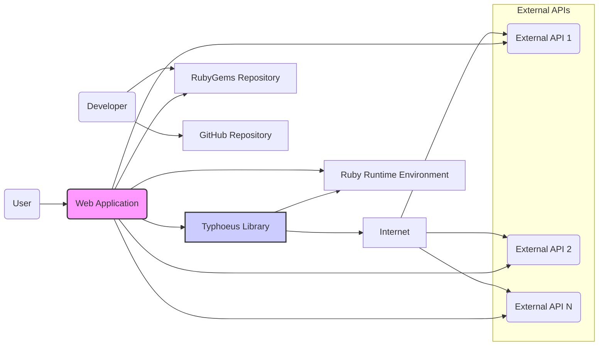
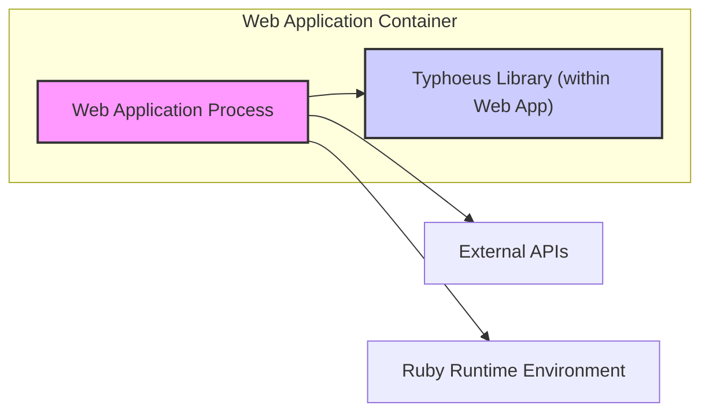

# BUSINESS POSTURE

- Business Priorities and Goals:
  - Improve application performance by enabling parallel HTTP requests to external services.
  - Reduce latency and response times for user interactions that depend on multiple external API calls.
  - Increase efficiency of data retrieval and processing from distributed systems.
  - Enhance scalability of applications by optimizing resource utilization through concurrent operations.

- Business Risks:
  - Dependency on an open-source library introduces potential vulnerabilities and maintenance overhead.
  - Performance bottlenecks in external APIs or network infrastructure can negate the benefits of parallel requests.
  - Improper handling of concurrent requests can lead to resource exhaustion or instability in the application or external services.
  - Security vulnerabilities in Typhoeus or its dependencies could be exploited to compromise the application or sensitive data.

# SECURITY POSTURE

- Existing Security Controls:
  - security control: Open Source Code Review - The Typhoeus library is publicly available on GitHub, allowing for community review of the code. (Implemented: GitHub Repository)
  - security control: Dependency Management - Bundler is used for managing Ruby dependencies, which helps in specifying and resolving library dependencies. (Implemented: Gemfile)
  - security control: HTTPS Support - Typhoeus supports HTTPS for secure communication with external services. (Implemented: Library Code)
  - accepted risk: Reliance on Community Security - Security vulnerabilities are primarily identified and addressed by the open-source community.
  - accepted risk: Dependency Vulnerabilities - Vulnerabilities in Typhoeus's dependencies might exist and require updates.

- Recommended Security Controls:
  - security control: Dependency Scanning - Implement automated dependency scanning to identify known vulnerabilities in Typhoeus and its dependencies.
  - security control: Software Composition Analysis (SCA) - Integrate SCA tools into the development pipeline to continuously monitor and manage open-source components and their associated risks.
  - security control: Input Validation and Output Encoding - Ensure proper input validation and output encoding when using Typhoeus to construct and process HTTP requests and responses to prevent injection attacks.
  - security control: Rate Limiting and Circuit Breakers - Implement rate limiting and circuit breaker patterns when making requests to external services using Typhoeus to prevent abuse and service disruptions.

- Security Requirements:
  - Authentication:
    - Requirement: If Typhoeus is used to interact with authenticated APIs, ensure secure handling of API keys, tokens, or credentials. Use environment variables or secure vault solutions to manage secrets.
    - Requirement: Avoid hardcoding credentials directly in the application code.
  - Authorization:
    - Requirement: Authorization logic should be implemented within the application using Typhoeus, not within Typhoeus itself, as it is a client library.
    - Requirement: Ensure that the application using Typhoeus only requests and accesses data that the authenticated user is authorized to access from external APIs.
  - Input Validation:
    - Requirement: Validate all inputs used to construct HTTP requests made by Typhoeus, including URLs, headers, and request bodies, to prevent injection vulnerabilities (e.g., HTTP header injection, request smuggling).
    - Requirement: Sanitize and validate responses received from external APIs before processing them within the application to prevent injection attacks or data corruption.
  - Cryptography:
    - Requirement: Enforce HTTPS for all communication with external services using Typhoeus to protect data in transit.
    - Requirement: If sensitive data is included in request bodies or needs to be stored locally (though not recommended for Typhoeus itself), ensure appropriate encryption at rest and in transit.

# DESIGN

## C4 CONTEXT



- Context Diagram Elements:
  - Element:
    - Name: User
    - Type: Person
    - Description: End-user interacting with the Web Application.
    - Responsibilities: Initiates requests to the Web Application.
    - Security controls: Authentication and authorization are handled by the Web Application.
  - Element:
    - Name: Web Application
    - Type: Software System
    - Description: The application that utilizes the Typhoeus library to make concurrent HTTP requests.
    - Responsibilities: Serves user requests, orchestrates calls to external APIs using Typhoeus, processes and aggregates data.
    - Security controls: security control: User authentication, security control: Input validation, security control: Authorization, security control: Session management, security control: Output encoding.
  - Element:
    - Name: Typhoeus Library
    - Type: Software System
    - Description: Ruby library for making fast, parallel HTTP requests.
    - Responsibilities: Handles HTTP request construction, execution, and response processing. Manages concurrency and connection pooling.
    - Security controls: security control: HTTPS support, security control: Dependency management (via Bundler).
  - Element:
    - Name: External APIs
    - Type: Software System
    - Description: Third-party APIs that the Web Application interacts with to retrieve data or perform actions.
    - Responsibilities: Provides data and services to the Web Application.
    - Security controls: security control: API authentication (varies by API), security control: Rate limiting, security control: Input validation, security control: Output encoding.
  - Element:
    - Name: Ruby Runtime Environment
    - Type: Technology
    - Description: The Ruby environment in which the Web Application and Typhoeus library are executed.
    - Responsibilities: Provides the execution environment for Ruby code.
    - Security controls: security control: Operating system security, security control: Ruby runtime security updates.
  - Element:
    - Name: RubyGems Repository
    - Type: Software System
    - Description: Public repository for Ruby libraries (gems), including Typhoeus.
    - Responsibilities: Hosts and distributes Ruby libraries.
    - Security controls: security control: Gem signing (limited in RubyGems), security control: Vulnerability scanning (RubyGems.org).
  - Element:
    - Name: Developer
    - Type: Person
    - Description: Software developer who uses Typhoeus library and contributes to its development.
    - Responsibilities: Develops and maintains the Web Application, integrates and configures Typhoeus, contributes to Typhoeus library.
    - Security controls: security control: Secure coding practices, security control: Access control to code repositories, security control: Code review.
  - Element:
    - Name: GitHub Repository
    - Type: Software System
    - Description: Source code repository for Typhoeus library.
    - Responsibilities: Hosts the source code, manages version control, facilitates collaboration.
    - Security controls: security control: Access control, security control: Branch protection, security control: Issue tracking for vulnerability reporting.
  - Element:
    - Name: Network
    - Type: Infrastructure
    - Description: The internet network connecting all systems.
    - Responsibilities: Provides communication channels between systems.
    - Security controls: security control: Network security controls (firewalls, intrusion detection systems) - generally outside the scope of this project but relevant to overall security.

## C4 CONTAINER



- Container Diagram Elements:
  - Element:
    - Name: Web Application Process
    - Type: Container
    - Description: The running instance of the Web Application, responsible for handling user requests and orchestrating business logic.
    - Responsibilities: Receives user requests, manages application state, calls Typhoeus to interact with external APIs, processes responses, and renders views.
    - Security controls: security control: Web application firewall (WAF), security control: Input validation, security control: Output encoding, security control: Session management, security control: Authentication and authorization mechanisms.
  - Element:
    - Name: Typhoeus Library (within Web App)
    - Type: Container
    - Description: The Typhoeus Ruby library integrated into the Web Application process. It's not a separate deployable container but a library within the application's runtime.
    - Responsibilities: Making HTTP requests to external APIs concurrently, handling connection pooling, managing request timeouts, and parsing HTTP responses.
    - Security controls: security control: HTTPS configuration, security control: Dependency updates, security control: Secure request construction within the application code.
  - Element:
    - Name: Ruby Runtime Environment
    - Type: Container
    - Description: The Ruby interpreter and associated libraries required to run the Web Application and Typhoeus.
    - Responsibilities: Provides the execution environment for Ruby code, manages memory, and handles system calls.
    - Security controls: security control: Operating system level security controls, security control: Ruby runtime security patches, security control: Resource limits.
  - Element:
    - Name: External APIs
    - Type: External System
    - Description: External third-party APIs that the Web Application communicates with.
    - Responsibilities: Providing data and services to the Web Application.
    - Security controls: security control: API keys or tokens for authentication, security control: Rate limiting, security control: HTTPS endpoints.

## DEPLOYMENT

- Deployment Architecture Options:
  - Option 1: On-Premise Deployment - Deploying the Web Application and its dependencies on physical servers within a company's own data center.
  - Option 2: Cloud VM Deployment - Deploying the Web Application on virtual machines in a cloud environment (e.g., AWS EC2, Azure VMs, GCP Compute Engine).
  - Option 3: Containerized Deployment (Chosen for detailed description) - Deploying the Web Application as Docker containers orchestrated by a container orchestration platform like Kubernetes in the cloud.
  - Option 4: Serverless Deployment - Deploying parts of the application as serverless functions (e.g., AWS Lambda, Azure Functions, GCP Cloud Functions), although less common for full web applications using libraries like Typhoeus directly.

- Detailed Deployment Architecture (Containerized Deployment on Kubernetes):

```mermaid
flowchart LR
    subgraph "Kubernetes Cluster"
        subgraph "Nodes"
            Node1["Node 1"]
            Node2["Node 2"]
            WebAppPod["Web Application Pod"] -- Runs on --> Node1
        end
        K8sService["Kubernetes Service"] -- Exposes --> WebAppPod
        Ingress["Ingress Controller"] -- Routes to --> K8sService
    end
    LoadBalancer["Cloud Load Balancer"] -- Routes to --> Ingress
    User["User"] -- Accesses via --> LoadBalancer
    ExternalAPIs["External APIs"] <-- WebAppPod
    ContainerRegistry["Container Registry"] <-- Developer
    Developer --> GitHub["GitHub Repository"]
    GitHub --> CI_CD["CI/CD Pipeline"]
    CI_CD --> ContainerRegistry
    CI_CD --> KubernetesCluster
    style WebAppPod fill:#f9f,stroke:#333,stroke-width:2px
```

- Deployment Diagram Elements:
  - Element:
    - Name: User
    - Type: Person
    - Description: End-user accessing the Web Application.
    - Responsibilities: Initiates requests to the Web Application.
    - Security controls: User device security, network security (user's network).
  - Element:
    - Name: Cloud Load Balancer
    - Type: Infrastructure
    - Description: Cloud provider's load balancer distributing traffic to the Ingress Controller.
    - Responsibilities: Load balancing, SSL termination, DDoS protection.
    - Security controls: security control: SSL/TLS configuration, security control: DDoS mitigation, security control: Access control lists.
  - Element:
    - Name: Ingress Controller
    - Type: Software
    - Description: Kubernetes Ingress controller managing external access to the Kubernetes cluster services.
    - Responsibilities: Routing external requests to Kubernetes Services, SSL termination, path-based routing.
    - Security controls: security control: Ingress controller configuration (e.g., rate limiting, security headers), security control: SSL/TLS configuration.
  - Element:
    - Name: Kubernetes Service
    - Type: Software
    - Description: Kubernetes Service exposing the Web Application Pods within the cluster.
    - Responsibilities: Internal load balancing within the cluster, service discovery.
    - Security controls: security control: Network policies to restrict traffic, security control: Service account security.
  - Element:
    - Name: Web Application Pod
    - Type: Container
    - Description: Pod in Kubernetes running the Web Application container, including Typhoeus library and Ruby runtime.
    - Responsibilities: Running the Web Application code, handling requests, interacting with external APIs.
    - Security controls: security control: Container image security scanning, security control: Resource limits, security control: Network policies, security control: Application-level security controls (as described in Container Diagram).
  - Element:
    - Name: Node 1, Node 2
    - Type: Infrastructure
    - Description: Worker nodes in the Kubernetes cluster, physical or virtual machines.
    - Responsibilities: Running Pods, providing compute resources.
    - Security controls: security control: Operating system security hardening, security control: Node security updates, security control: Network security (node firewalls).
  - Element:
    - Name: Kubernetes Cluster
    - Type: Infrastructure
    - Description: Managed Kubernetes cluster orchestrating containers.
    - Responsibilities: Container orchestration, scaling, management, service discovery.
    - Security controls: security control: Kubernetes RBAC (Role-Based Access Control), security control: Kubernetes security policies, security control: Regular security audits and updates.
  - Element:
    - Name: Container Registry
    - Type: Software
    - Description: Registry for storing and distributing container images (e.g., Docker Hub, private registry).
    - Responsibilities: Storing container images, providing access control to images.
    - Security controls: security control: Access control to container images, security control: Vulnerability scanning of container images, security control: Image signing (if supported).
  - Element:
    - Name: CI/CD Pipeline
    - Type: Software
    - Description: Automated CI/CD pipeline for building, testing, and deploying the Web Application.
    - Responsibilities: Automating build, test, and deployment processes, ensuring code quality and security.
    - Security controls: security control: Secure pipeline configuration, security control: Code scanning (SAST, DAST), security control: Dependency scanning, security control: Access control to pipeline resources.
  - Element:
    - Name: GitHub Repository
    - Type: Software System
    - Description: Source code repository for the Web Application.
    - Responsibilities: Version control, source code management.
    - Security controls: security control: Access control, security control: Branch protection, security control: Code review.
  - Element:
    - Name: External APIs
    - Type: External System
    - Description: External third-party APIs.
    - Responsibilities: Providing data and services.
    - Security controls: As described in Context and Container Diagrams.

## BUILD

```mermaid
flowchart LR
    Developer["Developer"] --> CodeRepository["Code Repository (GitHub)"]
    CodeRepository --> CI_Server["CI Server (GitHub Actions)"]
    CI_Server --> BuildProcess["Build Process"]
    subgraph BuildProcess
        DependencyInstall["Dependency Install (Bundler)"]
        SAST["SAST Scanning"]
        Linting["Linting"]
        UnitTests["Unit Tests"]
        ContainerBuild["Container Image Build (Docker)"]
        ImageScanning["Container Image Scanning"]
    end
    BuildProcess --> ArtifactRepository["Artifact Repository (Container Registry)"]
    ArtifactRepository --> DeploymentEnvironment["Deployment Environment (Kubernetes)"]
    style BuildProcess fill:#ccf,stroke:#333,stroke-width:2px
```



- Build Process Description:
  - Developer commits code changes to the Code Repository (GitHub).
  - CI Server (e.g., GitHub Actions) is triggered by code changes.
  - CI Server initiates the Build Process.
  - Build Process steps:
    - Dependency Install: Bundler installs Ruby dependencies defined in Gemfile, including Typhoeus.
    - SAST Scanning: Static Application Security Testing tools scan the application code for potential vulnerabilities.
    - Linting: Code linters check for code style and potential code quality issues.
    - Unit Tests: Unit tests are executed to verify the functionality of the application code.
    - Container Image Build: Docker image is built, packaging the application, Typhoeus library, Ruby runtime, and dependencies.
    - Image Scanning: Container image is scanned for known vulnerabilities in base images and dependencies.
  - Build artifacts (Container Image) are pushed to the Artifact Repository (Container Registry).
  - Deployment Environment (Kubernetes) pulls the container image from the Artifact Repository for deployment.

- Build Process Security Controls:
  - security control: Secure Code Repository - Access control and branch protection on the code repository (GitHub).
  - security control: CI/CD Pipeline Security - Secure configuration of the CI/CD pipeline, access control to pipeline resources, and audit logging.
  - security control: Dependency Management - Using Bundler for managing and locking dependencies, ensuring reproducible builds.
  - security control: Dependency Scanning - Automated scanning of dependencies for known vulnerabilities during the build process.
  - security control: SAST Scanning - Static Application Security Testing integrated into the build pipeline to identify code-level vulnerabilities early.
  - security control: Linting - Code linting to enforce code quality and potentially catch subtle security issues.
  - security control: Unit Testing - Unit tests to ensure code functionality and prevent regressions.
  - security control: Container Image Scanning - Scanning container images for vulnerabilities before deployment.
  - security control: Artifact Repository Security - Access control to the artifact repository (Container Registry) to prevent unauthorized access to container images.
  - security control: Immutable Infrastructure - Building container images as immutable artifacts to ensure consistency and prevent runtime modifications.

# RISK ASSESSMENT

- Critical Business Processes:
  - API Integrations: Reliant on external APIs for core functionality, data retrieval, or service delivery. Performance and reliability of these integrations are critical.
  - Application Performance: User experience is directly impacted by application response times. Typhoeus is used to improve performance, so its availability and correct functioning are important.
  - Data Aggregation and Processing: If the application aggregates data from multiple sources via APIs, the ability to do this efficiently and reliably is a critical process.

- Data Sensitivity:
  - API Request/Response Data: Sensitivity depends on the APIs being called. Could include Personally Identifiable Information (PII), financial data, or other sensitive business information.
  - Application Data: Data processed and stored by the Web Application. Sensitivity depends on the application's purpose.
  - Configuration Data: API keys, tokens, and other credentials used to access external APIs. Highly sensitive and must be protected.

# QUESTIONS & ASSUMPTIONS

- Questions:
  - What specific external APIs will the Web Application interact with using Typhoeus? Knowing the APIs will help assess specific API-related security risks.
  - What type of data will be exchanged with these APIs? Understanding data sensitivity is crucial for risk assessment.
  - What is the expected volume of requests and concurrency levels when using Typhoeus? This will help in understanding performance and potential denial-of-service risks.
  - What are the specific performance goals that Typhoeus is intended to address? This will clarify the business criticality of Typhoeus.
  - Are there any specific compliance requirements (e.g., GDPR, HIPAA, PCI DSS) that the Web Application and its use of Typhoeus must adhere to?

- Assumptions:
  - BUSINESS POSTURE:
    - The primary business goal is to improve application performance and efficiency through parallel API requests.
    - The application is business-critical and requires high availability and reliability.
    - The organization has a moderate risk appetite, balancing performance gains with security considerations.
  - SECURITY POSTURE:
    - The organization follows basic secure development practices but may not have advanced security controls in place for open-source library usage.
    - Security is a concern, but performance optimization is also a high priority.
    - The application handles some level of sensitive data, requiring attention to data protection and confidentiality.
  - DESIGN:
    - The Web Application is deployed in a containerized environment on Kubernetes in the cloud.
    - The build process is automated using a CI/CD pipeline.
    - HTTPS is used for all communication with external APIs.
    - API keys or tokens are used for authentication with external APIs, and these are managed securely (e.g., using environment variables or secrets management).