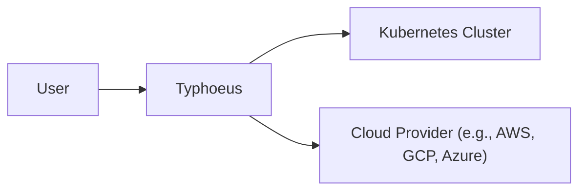
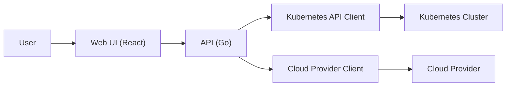
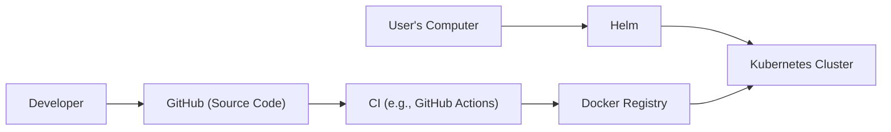
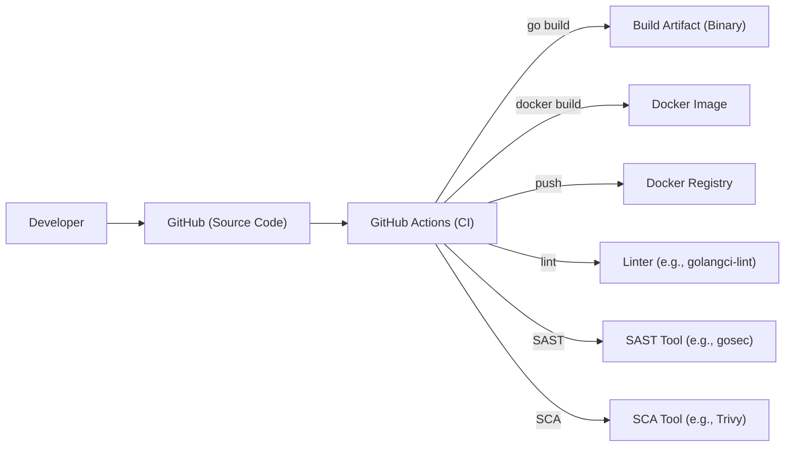

Okay, let's create a detailed design document for the Typhoeus project, focusing on aspects relevant for threat modeling.

# BUSINESS POSTURE

Typhoeus appears to be a project focused on providing a user-friendly interface and tooling for interacting with Kubernetes clusters, specifically targeting cost optimization and resource management.  It seems to be in a relatively early stage of development.

Business Priorities:

*   Provide a simplified, user-friendly way to manage Kubernetes resources.
*   Enable users to visualize and understand their Kubernetes cluster costs.
*   Offer tools to optimize Kubernetes resource utilization and reduce costs.
*   Potentially attract a user base and build a community around the project.
*   Establish a foundation for future expansion and feature additions.

Business Goals:

*   Increase user adoption of the tool.
*   Reduce the complexity of Kubernetes management for users.
*   Demonstrably help users save money on their Kubernetes deployments.
*   Gather user feedback to guide future development.

Most Important Business Risks:

*   Data breaches or unauthorized access to user's Kubernetes clusters.
*   Incorrect cost calculations or optimization recommendations leading to financial losses for users.
*   Lack of adoption due to usability issues or insufficient features.
*   Competition from existing Kubernetes management and cost optimization tools.
*   Vulnerabilities in the software that could be exploited by attackers.
*   Inability to scale the application to handle a large number of users or clusters.

# SECURITY POSTURE

Existing Security Controls:

*   security control: The project utilizes Go, which offers some memory safety features compared to languages like C/C++. (Implicit in the choice of language).
*   security control: Relies on Kubernetes' existing RBAC system for authorization within the target cluster. (Implicit in the interaction with Kubernetes).
*   security control: Uses standard Kubernetes API client libraries. (Implicit in the code).
*   security control: The project is open-source, allowing for community scrutiny and contributions to security. (Project nature).

Accepted Risks:

*   accepted risk: The project is in early development, and comprehensive security audits may not have been performed.
*   accepted risk: Relies on the user's existing Kubernetes cluster security configuration.  Typhoeus itself doesn't manage cluster security.
*   accepted risk: The project may have unknown vulnerabilities due to its early stage.

Recommended Security Controls:

*   Implement a robust authentication mechanism for users accessing the Typhoeus UI, potentially leveraging existing identity providers (e.g., OAuth 2.0/OIDC).
*   Introduce input validation and sanitization for all user-provided data, especially when interacting with the Kubernetes API.
*   Implement regular security audits and penetration testing.
*   Establish a clear security vulnerability disclosure and response process.
*   Integrate static application security testing (SAST) and software composition analysis (SCA) tools into the build pipeline.
*   Consider implementing dynamic application security testing (DAST) to identify runtime vulnerabilities.
*   Implement logging and monitoring to detect and respond to suspicious activity.
*   Provide documentation and guidance on securely deploying and configuring Typhoeus.

Security Requirements:

*   Authentication:
    *   Users must be authenticated before accessing the Typhoeus UI and interacting with Kubernetes clusters.
    *   Support for multi-factor authentication (MFA) should be considered.
    *   Authentication tokens should be securely stored and managed.
*   Authorization:
    *   Typhoeus should leverage Kubernetes RBAC to enforce authorization within the target cluster.
    *   Access to Typhoeus features and data should be controlled based on user roles and permissions.
*   Input Validation:
    *   All user-provided input must be validated and sanitized to prevent injection attacks (e.g., command injection, XSS).
    *   Data received from the Kubernetes API should also be treated with caution and validated.
*   Cryptography:
    *   All sensitive data, including API tokens and credentials, should be encrypted in transit and at rest.
    *   Use strong, industry-standard cryptographic algorithms and libraries.
    *   Proper key management practices must be followed.

# DESIGN

## C4 CONTEXT

C4 Context Element List:

*   Element:
    *   Name: User
    *   Type: Person
    *   Description: A user interacting with Typhoeus to manage their Kubernetes clusters.
    *   Responsibilities:
        *   Authenticates with Typhoeus.
        *   Views Kubernetes cluster information and costs.
        *   Uses Typhoeus tools to optimize resources.
    *   Security controls:
        *   Authentication (planned).
        *   Authorization (via Kubernetes RBAC).

*   Element:
    *   Name: Typhoeus
    *   Type: Software System
    *   Description: The main application providing a UI and tools for Kubernetes management.
    *   Responsibilities:
        *   Provides a user interface.
        *   Interacts with the Kubernetes API.
        *   Fetches cost data from cloud providers.
        *   Provides optimization recommendations.
    *   Security controls:
        *   Authentication (planned).
        *   Authorization (via Kubernetes RBAC).
        *   Input validation (planned).
        *   Secure communication with Kubernetes API.

*   Element:
    *   Name: Kubernetes Cluster
    *   Type: Software System
    *   Description: The target Kubernetes cluster being managed.
    *   Responsibilities:
        *   Runs containerized workloads.
        *   Provides an API for management.
    *   Security controls:
        *   Relies on its own security configuration (RBAC, network policies, etc.).

*   Element:
    *   Name: Cloud Provider
    *   Type: Software System
    *   Description: The cloud provider hosting the Kubernetes cluster (e.g., AWS, GCP, Azure).
    *   Responsibilities:
        *   Provides infrastructure for the Kubernetes cluster.
        *   Provides cost data.
    *   Security controls:
        *   Relies on the cloud provider's security mechanisms.

## C4 CONTAINER

C4 Container Element List:

*   Element:
    *   Name: User
    *   Type: Person
    *   Description: A user interacting with the Typhoeus Web UI.
    *   Responsibilities: Same as in C4 Context.
    *   Security controls: Same as in C4 Context.

*   Element:
    *   Name: Web UI
    *   Type: Container: React Application
    *   Description: The user interface built with React.
    *   Responsibilities:
        *   Displays data to the user.
        *   Handles user interactions.
        *   Sends requests to the API.
    *   Security controls:
        *   Input validation (planned).
        *   Protection against XSS (planned).

*   Element:
    *   Name: API
    *   Type: Container: Go Application
    *   Description: The backend API built with Go.
    *   Responsibilities:
        *   Handles requests from the Web UI.
        *   Interacts with the Kubernetes API and Cloud Provider.
        *   Processes data.
        *   Provides optimization logic.
    *   Security controls:
        *   Authentication (planned).
        *   Authorization (via Kubernetes RBAC).
        *   Input validation (planned).
        *   Secure communication with Kubernetes API and Cloud Provider.

*   Element:
    *   Name: Kubernetes API Client
    *   Type: Library
    *   Description: Standard Kubernetes client library for Go.
    *   Responsibilities:
        *   Communicates with the Kubernetes API.
    *   Security controls:
        *   Uses TLS for secure communication.
        *   Relies on Kubernetes RBAC for authorization.

*   Element:
    *   Name: Kubernetes Cluster
    *   Type: Software System
    *   Description: The target Kubernetes cluster.
    *   Responsibilities: Same as in C4 Context.
    *   Security controls: Same as in C4 Context.

*   Element:
    *   Name: Cloud Provider Client
    *   Type: Library
    *   Description: Client library for interacting with the cloud provider's API (e.g., AWS SDK).
    *   Responsibilities:
        *   Fetches cost data.
    *   Security controls:
        *   Uses secure communication (TLS).
        *   Relies on cloud provider's authentication and authorization mechanisms.

*   Element:
    *   Name: Cloud Provider
    *   Type: Software System
    *   Description: The cloud provider (e.g., AWS, GCP, Azure).
    *   Responsibilities: Same as in C4 Context.
    *   Security controls: Same as in C4 Context.

## DEPLOYMENT

Possible Deployment Solutions:

1.  **Manual Deployment to a Kubernetes Cluster:**  Users could manually build the Docker image and deploy it to their Kubernetes cluster using `kubectl`.
2.  **Helm Chart:** A Helm chart could be provided to simplify deployment and configuration.
3.  **Kubernetes Operator:** A Kubernetes Operator could be developed to manage the lifecycle of Typhoeus instances within a cluster.
4.  **SaaS Offering:**  Typhoeus could be offered as a hosted service (SaaS), abstracting away the deployment details from the user.

Chosen Solution (for detailed description): **Helm Chart**

This is a good balance between ease of deployment and user control.

Deployment Element List:

*   Element:
    *   Name: Developer
    *   Type: Person
    *   Description: A developer working on the Typhoeus project.
    *   Responsibilities:
        *   Writes code.
        *   Commits changes to GitHub.
    *   Security controls:
        *   Code review (planned).

*   Element:
    *   Name: GitHub
    *   Type: Software System
    *   Description: Source code repository.
    *   Responsibilities:
        *   Stores the project's source code.
        *   Triggers CI pipelines.
    *   Security controls:
        *   Access control.
        *   Branch protection rules.

*   Element:
    *   Name: CI
    *   Type: Software System
    *   Description: Continuous Integration system (e.g., GitHub Actions).
    *   Responsibilities:
        *   Builds the Docker image.
        *   Runs tests.
        *   Pushes the image to the Docker Registry.
    *   Security controls:
        *   SAST (planned).
        *   SCA (planned).

*   Element:
    *   Name: Docker Registry
    *   Type: Software System
    *   Description: Registry for storing Docker images.
    *   Responsibilities:
        *   Stores the Typhoeus Docker image.
    *   Security controls:
        *   Access control.
        *   Image scanning (planned).

*   Element:
    *   Name: User's Computer
    *   Type: Node
    *   Description: The user's local machine.
    *   Responsibilities:
        *   Runs Helm commands.
    *   Security controls: N/A

*   Element:
    *   Name: Helm
    *   Type: Software System
    *   Description: Package manager for Kubernetes.
    *   Responsibilities:
        *   Deploys Typhoeus to the Kubernetes cluster using the Helm chart.
    *   Security controls: N/A

*   Element:
    *   Name: Kubernetes Cluster
    *   Type: Node
    *   Description: The target Kubernetes cluster.
    *   Responsibilities:
        *   Runs the Typhoeus application.
    *   Security controls:
        *   Relies on its own security configuration.

## BUILD

Build Process Description:

1.  A developer commits code changes to the GitHub repository.
2.  GitHub Actions triggers a CI workflow.
3.  The workflow performs the following steps:
    *   Checks out the code.
    *   Runs a linter (e.g., `golangci-lint`) to check for code style and potential issues.
    *   Runs a SAST tool (e.g., `gosec`) to scan for security vulnerabilities in the Go code.
    *   Runs an SCA tool (e.g., `Trivy`) to scan for vulnerabilities in dependencies.
    *   Builds the Go binary using `go build`.
    *   Builds a Docker image using `docker build`.
    *   Pushes the Docker image to a Docker registry.

Security Controls in Build Process:

*   security control: Linting (using `golangci-lint`).
*   security control: Static Application Security Testing (SAST) using a tool like `gosec`.
*   security control: Software Composition Analysis (SCA) using a tool like `Trivy`.
*   security control: Automated build process using GitHub Actions.

# RISK ASSESSMENT

Critical Business Processes:

*   Providing accurate Kubernetes cost information.
*   Offering effective resource optimization recommendations.
*   Maintaining the availability and responsiveness of the Typhoeus application.
*   Protecting user data and credentials.

Data to Protect and Sensitivity:

*   Kubernetes API credentials/tokens: Highly sensitive.  Unauthorized access could allow complete control of the user's cluster.
*   Cloud provider credentials/tokens: Highly sensitive.  Unauthorized access could allow access to the user's cloud resources.
*   Kubernetes cluster resource usage data: Moderately sensitive.  Could reveal information about the user's applications and infrastructure.
*   Cost data: Moderately sensitive.  Could reveal information about the user's spending.
*   User authentication information (if implemented): Highly sensitive.  Must be protected to prevent unauthorized access to Typhoeus.

# QUESTIONS & ASSUMPTIONS

Questions:

*   What specific cloud providers are targeted for initial support?
*   What level of granularity is required for cost reporting?
*   What types of resource optimization recommendations will be provided?
*   Will there be any integration with other Kubernetes tools or platforms?
*   What is the expected scale of the application (number of users, clusters)?
*   What is the authentication method used to connect to Kubernetes cluster?
*   What is the authentication method used to connect to Cloud Provider?

Assumptions:

*   BUSINESS POSTURE: The project is aimed at individual developers and small teams initially.
*   BUSINESS POSTURE: Cost optimization is a primary driver for user adoption.
*   SECURITY POSTURE: Users are responsible for the security of their own Kubernetes clusters.
*   SECURITY POSTURE: Typhoeus will not store any persistent user data initially.
*   DESIGN: The initial deployment target is a Kubernetes cluster.
*   DESIGN: The project will use standard Kubernetes client libraries.
*   DESIGN: The project will use standard Cloud Provider client libraries.
*   DESIGN: Helm will be used for packaging and deployment.
*   DESIGN: GitHub Actions will be used for CI/CD.