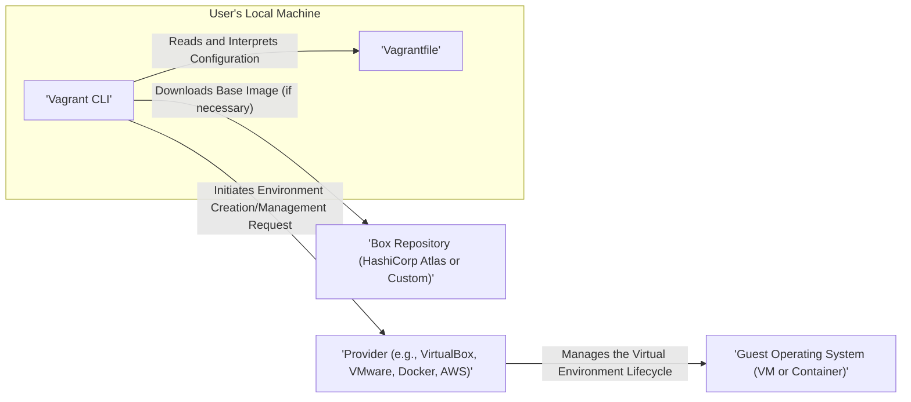
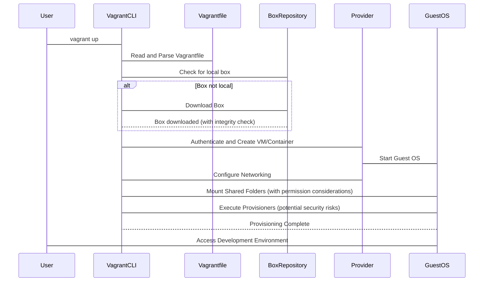

# Project Design Document: HashiCorp Vagrant (Improved)

**Version:** 1.1
**Date:** October 26, 2023
**Author:** AI Software Architect

## 1. Introduction

This document provides an enhanced architectural design of the HashiCorp Vagrant project, focusing on details relevant for threat modeling. It elaborates on the key components, their interactions, data flows, and critically, the security implications of each. This document is intended to be a robust foundation for subsequent threat modeling exercises, enabling a comprehensive understanding of potential vulnerabilities and attack vectors.

Vagrant streamlines the creation and management of virtual development environments, offering a consistent workflow across various virtualization providers (e.g., VirtualBox, VMware, AWS) and containerization technologies (Docker). Its core function is to abstract the complexities of environment setup, allowing developers to focus on coding rather than infrastructure.

## 2. Goals and Objectives

* **Provide a detailed and refined overview of Vagrant's architecture, specifically tailored for threat modeling.**
* **Clearly define the responsibilities and functionalities of each key component.**
* **Illustrate the interactions and data flow between components with a focus on security boundaries and data sensitivity.**
* **Explicitly highlight potential security considerations, vulnerabilities, and attack surfaces associated with each component and interaction.**
* **Serve as a comprehensive and actionable basis for conducting thorough threat modeling sessions, including identifying assets, threats, and vulnerabilities.**

## 3. High-Level Architecture

Vagrant, operating from a user's local machine, interprets configuration files to orchestrate the creation and management of development environments. It acts as an intermediary, abstracting the specifics of different virtualization and cloud providers.

## 4. Detailed Component Design

### 4.1. Vagrant CLI

* **Description:** The primary command-line interface through which users interact with Vagrant. It's responsible for parsing commands, interpreting the `Vagrantfile`, and coordinating actions across other components.
* **Responsibilities:**
    * Parsing and validating user commands.
    * Reading, interpreting, and validating the `Vagrantfile` configuration.
    * Authenticating and authorizing interactions with configured providers.
    * Managing the lifecycle of virtual environments (creation, startup, shutdown, suspension, destruction).
    * Downloading and managing base images (boxes), including verifying their integrity (e.g., checksums).
    * Executing provisioners within the guest operating system.
    * Handling plugin management and execution.
    * Logging and reporting events and errors.
* **Key Features:**
    * Command-line interface with a defined set of commands and options.
    * Extensible plugin system allowing for custom functionality and provider support.
    * Robust logging mechanisms for auditing and troubleshooting.
    * Configuration management for global and project-specific settings.

### 4.2. Vagrantfile

* **Description:** A Ruby file that declaratively defines the configuration of the development environment. It specifies the base image (box), provider, networking settings, shared folders, provisioners, and other environment-specific parameters.
* **Responsibilities:**
    * Defining the desired state of the virtual environment in a reproducible manner.
    * Specifying the provider to be used for environment creation.
    * Configuring network interfaces, including port forwarding and private networks.
    * Defining shared folders for file synchronization between the host and guest.
    * Specifying provisioners for automated software installation and configuration within the guest.
    * Allowing for conditional configurations based on environment variables or other factors.
* **Key Features:**
    * Declarative syntax for easy understanding and modification.
    * Version control friendly, allowing for tracking changes to environment configurations.
    * Utilizes Ruby syntax, enabling more complex and dynamic configurations.
    * Can include sensitive information if not handled carefully (a key security consideration).

### 4.3. Providers

* **Description:** Plugins that provide the interface to specific virtualization technologies or cloud platforms. They abstract the underlying infrastructure, allowing Vagrant to manage environments consistently across different platforms. Examples include VirtualBox, VMware, Hyper-V, Docker, AWS, Google Cloud, and Azure.
* **Responsibilities:**
    * Authenticating and authorizing with the underlying virtualization platform or cloud provider.
    * Creating, starting, stopping, pausing, and destroying virtual machines or containers.
    * Managing network configurations for the virtual environment, including virtual switches and network interfaces.
    * Configuring resource allocation (CPU, memory, storage) for the virtual environment.
    * Managing snapshots and other lifecycle operations specific to the provider.
    * Interacting with the provider's API or command-line tools.
* **Key Features:**
    * Abstraction layer, enabling provider-agnostic environment definitions.
    * Provider-specific configurations and options exposed through the `Vagrantfile`.
    * Plugin architecture allows for adding support for new providers.

### 4.4. Boxes

* **Description:** Package formats containing a base image for the virtual environment. They typically include a minimal operating system installation and potentially pre-installed software or configurations. Boxes are downloaded from online repositories or can be created locally.
* **Responsibilities:**
    * Providing a consistent and reproducible starting point for virtual environments.
    * Containing the base operating system and potentially pre-configured software packages.
    * Facilitating rapid environment setup by providing a pre-built image.
    * Defining default settings and configurations for the guest operating system.
* **Key Features:**
    * Versioning, allowing for managing different versions of base images.
    * Metadata associated with the box (e.g., description, provider compatibility, checksums for integrity verification).
    * Can be hosted on public repositories (like HashiCorp Atlas) or private, internal repositories.

### 4.5. Provisioners

* **Description:** Tools and scripts used to automate the configuration of the guest operating system after it has been created. They ensure the environment meets the desired specifications by installing software, configuring settings, and deploying applications. Examples include Shell scripts, Ansible playbooks, Chef cookbooks, and Puppet manifests.
* **Responsibilities:**
    * Automating the installation of software packages and dependencies.
    * Configuring system settings, such as users, services, and network configurations.
    * Deploying applications and their associated configurations.
    * Ensuring the guest environment reaches the desired state in an idempotent manner.
    * Executing commands and scripts within the guest operating system.
* **Key Features:**
    * Automation of repetitive environment setup tasks.
    * Idempotency, ensuring that running a provisioner multiple times has the same effect as running it once.
    * Support for various configuration management tools, providing flexibility in environment configuration.

### 4.6. Guest Operating System

* **Description:** The operating system running inside the virtual machine or container managed by Vagrant. This is the environment where the development work takes place.
* **Responsibilities:**
    * Running the applications and services required for development.
    * Interacting with the host operating system through shared folders and network connections.
    * Executing provisioner scripts and commands.
    * Managing user accounts and permissions within the guest environment.

### 4.7. Host Operating System

* **Description:** The operating system on which Vagrant is installed and executed. It provides the resources and environment for running the Vagrant CLI and the virtualization provider.
* **Responsibilities:**
    * Running the Vagrant CLI and its dependencies.
    * Hosting the virtualization provider software (e.g., VirtualBox).
    * Providing the necessary resources (CPU, memory, disk space) for the guest operating system.
    * Managing network connectivity for the guest operating system.

## 5. Data Flow with Security Considerations

The process of creating and managing a Vagrant environment involves a series of data flows, each with its own security implications:

1. **User executes a Vagrant command (e.g., `vagrant up`) on the Host OS.** This initiates the process.
2. **The Vagrant CLI reads and parses the `Vagrantfile`.**  **Security Consideration:** A malicious `Vagrantfile` from an untrusted source could contain commands that compromise the host system or the guest environment during provisioning.
3. **Based on the `Vagrantfile`, the CLI determines the required provider and box.**
4. **If the specified box is not available locally, Vagrant downloads it from the configured Box Repository (defaulting to HashiCorp Atlas).** **Security Consideration:** Downloading boxes from untrusted repositories exposes the environment to potentially malicious base images containing vulnerabilities or malware. Integrity checks (checksums) are crucial here.
5. **The Vagrant CLI authenticates with the chosen Provider (if necessary) and instructs it to create a new virtual machine or container based on the downloaded box.** **Security Consideration:**  Compromised provider credentials could allow unauthorized access and control over the virtual environment.
6. **The Provider interacts with the underlying virtualization technology (e.g., VirtualBox API) to create and start the Guest OS.** **Security Consideration:** Vulnerabilities in the virtualization software itself could be exploited during this stage.
7. **Once the Guest OS is running, Vagrant configures networking (e.g., port forwarding, private networks) as specified in the `Vagrantfile`.** **Security Consideration:** Improperly configured network settings can expose the guest environment to external attacks. Port forwarding should be carefully managed.
8. **Shared folders are mounted between the Host and Guest Operating Systems.** **Security Consideration:** Incorrect permissions on shared folders can lead to unauthorized access or modification of files on either the host or the guest.
9. **Provisioners defined in the `Vagrantfile` are executed within the Guest OS to install software, configure settings, and deploy applications.** **Security Consideration:** Malicious or poorly written provisioner scripts can introduce vulnerabilities, install malware, or compromise the guest operating system. Privilege escalation within the guest is also a risk.
10. **The User can then access the development environment within the Guest OS.**

## 6. Security Considerations (Detailed)

This section expands on the security considerations, providing more specific examples of potential threats and vulnerabilities:

* **Vagrantfile Security:**
    * **Threat:** Execution of arbitrary code on the host machine or within the guest OS through malicious Ruby code in the `Vagrantfile`.
    * **Vulnerability:** Lack of input validation and sandboxing for `Vagrantfile` execution.
    * **Mitigation:** Only use `Vagrantfile` from trusted sources. Implement static analysis tools to scan `Vagrantfile` for potential security issues.
    * **Threat:** Exposure of sensitive information (passwords, API keys) if hardcoded in the `Vagrantfile`.
    * **Vulnerability:**  Storing secrets in plain text within configuration files.
    * **Mitigation:** Utilize environment variables, secure vault solutions (e.g., HashiCorp Vault), or Vagrant plugins for secret management.
* **Box Security:**
    * **Threat:** Introduction of malware or vulnerabilities into the development environment through compromised base images.
    * **Vulnerability:** Lack of rigorous security scanning and verification of boxes in public repositories.
    * **Mitigation:** Download boxes only from trusted sources. Verify box integrity using checksums. Implement automated vulnerability scanning of boxes. Consider using internally built and managed base boxes.
    * **Threat:** Use of outdated software within the box, containing known vulnerabilities.
    * **Vulnerability:** Infrequent updates and patching of base images.
    * **Mitigation:** Implement provisioners to automatically update software packages within the guest OS during environment setup.
* **Provider Security:**
    * **Threat:** Unauthorized access and control over virtual environments due to compromised provider credentials.
    * **Vulnerability:** Weak or default provider credentials, insecure storage of credentials.
    * **Mitigation:** Use strong, unique credentials for provider accounts. Securely manage and store provider credentials (e.g., using credential management tools).
    * **Threat:** Exploitation of vulnerabilities in the underlying virtualization software (e.g., VirtualBox escape).
    * **Vulnerability:** Unpatched or outdated virtualization software.
    * **Mitigation:** Keep virtualization provider software up to date with the latest security patches. Follow security best practices for configuring the virtualization environment.
* **Provisioner Security:**
    * **Threat:** Command injection vulnerabilities in provisioner scripts, allowing attackers to execute arbitrary commands within the guest OS.
    * **Vulnerability:** Improper input sanitization and lack of secure coding practices in provisioner scripts.
    * **Mitigation:** Carefully review and sanitize all inputs used in provisioner scripts. Follow secure coding guidelines. Use configuration management tools with built-in security features.
    * **Threat:** Privilege escalation within the guest OS due to poorly configured provisioner scripts.
    * **Vulnerability:** Running provisioner scripts with excessive privileges.
    * **Mitigation:** Adhere to the principle of least privilege when configuring provisioners. Avoid running scripts as root unless absolutely necessary.
* **Network Security:**
    * **Threat:** Unauthorized access to the guest environment through exposed ports.
    * **Vulnerability:** Overly permissive port forwarding rules.
    * **Mitigation:** Only forward necessary ports. Use private networks for communication between the host and guest. Implement firewalls within the guest OS.
    * **Threat:** Data breaches through insecurely configured shared folders.
    * **Vulnerability:** Incorrect permissions on shared folders.
    * **Mitigation:** Configure shared folder permissions carefully, ensuring only necessary access is granted. Avoid sharing sensitive data through shared folders if possible.
* **Secrets Management:**
    * **Threat:** Exposure of sensitive credentials used during provisioning or within the guest environment.
    * **Vulnerability:** Hardcoding secrets in configuration files or provisioner scripts.
    * **Mitigation:** Utilize secure secret management solutions (e.g., HashiCorp Vault, Ansible Vault). Avoid hardcoding secrets.

## 7. Deployment Considerations

Vagrant's flexibility allows for diverse deployment scenarios:

* **Developer Workstations:** Providing isolated and reproducible development environments, enhancing consistency and reducing "it works on my machine" issues.
* **CI/CD Pipelines:** Automating the creation of consistent build and test environments, ensuring reliable and repeatable builds.
* **Cloud Environments:** Provisioning and managing infrastructure and applications in cloud platforms, leveraging Vagrant's provider model.
* **Educational Purposes:** Creating isolated and safe environments for learning and experimentation.

## 8. Future Considerations

* **Enhanced Security Integrations:**  Direct integration with security scanning tools for automated vulnerability assessments of boxes, provisioners, and guest environments.
* **Improved Secrets Management Capabilities:** Built-in features for secure secret injection and management within Vagrant environments, reducing reliance on external tools.
* **Fine-grained Permission Controls:** More granular control over access and permissions within Vagrant environments, enhancing security and isolation.
* **Formal Security Audits:** Regular security audits of the Vagrant codebase and its core components to identify and address potential vulnerabilities.

This improved design document provides a more detailed and security-focused overview of the HashiCorp Vagrant project architecture. The enhanced descriptions, refined data flow diagrams, and expanded security considerations are intended to provide a robust foundation for comprehensive threat modeling activities. By understanding these aspects, security professionals can effectively identify potential threats, vulnerabilities, and attack vectors associated with using Vagrant.