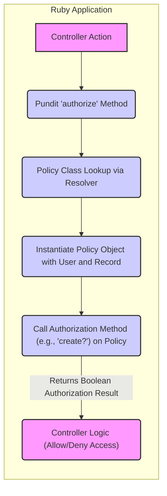
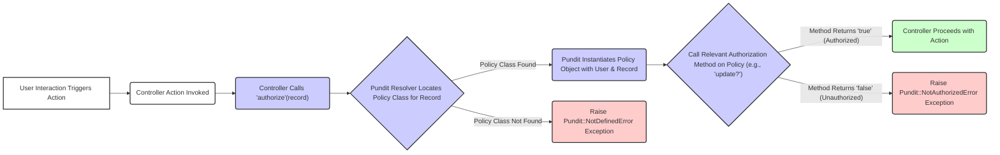

# Project Design Document: Pundit Authorization Library

**Version:** 1.1
**Date:** October 26, 2023
**Author:** AI Software Architect

## 1. Introduction

This document provides a detailed design overview of the Pundit authorization library, a Ruby gem designed to provide a simple, convention-based way to implement authorization in Ruby applications. This document aims to clearly articulate the architecture, components, and data flow of Pundit, making it suitable for subsequent threat modeling activities. This revision includes more detail on component interactions and potential security considerations.

## 2. Goals and Objectives

The primary goals of Pundit are to:

*   Provide a clear and maintainable way to define authorization rules, promoting readability and reducing errors.
*   Encourage the separation of authorization logic from controllers and models, improving code organization and testability.
*   Promote the use of plain Ruby objects (policies) for authorization, leveraging the power and flexibility of the Ruby language.
*   Offer a flexible and extensible authorization framework that can adapt to various application needs.
*   Simplify common authorization patterns through conventions and helper methods.

## 3. System Architecture

Pundit operates within the context of a Ruby application, typically a web application using a framework like Ruby on Rails. It doesn't exist as a standalone service but rather as a library integrated into the application's code.



**Key Architectural Components:**

*   **Controller Integration:** Pundit provides helper methods within controllers (and sometimes views) to initiate authorization checks, acting as the entry point for the authorization process.
*   **Policy Classes:**  These are plain Ruby classes that encapsulate the authorization logic for a specific model or resource. They define *what* actions are allowed for a given user and record.
*   **Authorization Methods:**  Methods within policy classes (e.g., `create?`, `update?`, `destroy?`) that define whether a user is authorized to perform a specific action on a resource. These methods receive the current user and the record as arguments.
*   **User and Record:**  Authorization decisions are fundamentally based on the identity and roles of the current user attempting the action and the specific record (object) being acted upon.
*   **Resolver:** Pundit uses a resolver component to dynamically determine which policy class should be instantiated for a given record, based on naming conventions.
*   **Scopes:**  A mechanism to define authorization rules for collections of records, allowing developers to specify which records a user is authorized to access within a larger set.

## 4. Component Details

This section provides a more detailed description of the key components of Pundit, including their responsibilities and interactions.

### 4.1. Policy Classes

*   Represent the central point for defining authorization rules within the application.
*   Conventionally named after the model they authorize, with a `Policy` suffix (e.g., `ArticlePolicy` for the `Article` model). This convention is crucial for the Resolver to function correctly.
*   Contain methods corresponding to actions that can be performed on the associated model. The naming convention for these methods typically follows Rails conventions (e.g., `index?`, `show?`, `create?`, `update?`, `destroy?`).
*   Each authorization method accepts at least the `user` and the `record` as arguments, providing the context for the authorization decision.
*   Return a boolean value (`true` if the user is authorized to perform the action, `false` otherwise).
*   Can include helper methods to encapsulate common authorization logic, promoting code reuse and maintainability within the policy. These helpers are typically private methods.

**Example Policy Method:**

```ruby
class ArticlePolicy < ApplicationPolicy
  def update?
    # Admins can update any article, and the author can update their own articles.
    user.admin? || record.user == user
  end
end
```

### 4.2. Authorization Methods (`authorize`, `policy`)

*   **`authorize`:** A controller helper method that is the primary way to enforce authorization.
    *   Takes the record to be authorized as its main argument. Pundit will then infer the policy and action to check.
    *   Optionally takes the policy name or action name as arguments for more explicit control.
    *   Internally uses the Resolver to find the correct policy and calls the appropriate authorization method on the instantiated policy object.
    *   Crucially, if the authorization check returns `false`, the `authorize` method raises a `Pundit::NotAuthorizedError`, halting the controller action and requiring the application to handle this exception.
*   **`policy`:** A method to explicitly retrieve the policy object for a given record without immediately performing an authorization check.
    *   Useful for accessing policy methods directly, beyond simple boolean authorization checks, such as retrieving a scoped collection of records.
    *   Allows for more complex authorization workflows where multiple checks or actions are needed based on policy rules.

### 4.3. Resolver

*   Responsible for the critical task of dynamically locating the correct policy class for a given record at runtime.
*   Follows a predictable naming convention by default (e.g., for a `Post` model instance, it looks for a class named `PostPolicy`).
*   This convention-based approach simplifies the process of associating models with their corresponding authorization logic.
*   Can be customized to use different resolution strategies if the default naming convention is not suitable for a particular application's structure.

### 4.4. Scopes

*   Provide a structured way to define authorization rules that apply to collections of records, rather than individual instances.
*   Implemented as inner classes within policy classes, conventionally named `Scope` (e.g., `ArticlePolicy::Scope`).
*   The `Scope` class typically inherits from `Pundit::Scope` and must implement a `resolve` method.
*   The `resolve` method receives the current `user` and the `scope` (an ActiveRecord relation representing the initial collection of records) as arguments.
*   The `resolve` method is responsible for filtering the `scope` based on the user's permissions, returning a new ActiveRecord relation containing only the records the user is authorized to access.

**Example Scope:**

```ruby
class ArticlePolicy < ApplicationPolicy
  class Scope < Scope
    # When resolving the scope, admins see all articles, while regular users only see their own.
    def resolve
      if user.admin?
        scope.all
      else
        scope.where(user: user)
      end
    end
  end
end
```

### 4.5. `ApplicationPolicy`

*   Serves as a base class from which all application-specific policy classes should inherit.
*   Provides default behavior and helper methods that can be shared across multiple policies, reducing code duplication.
*   Allows for centralized configuration and customization of Pundit's behavior within the application.
*   Often includes helper methods to check user roles or common permissions, simplifying policy logic.

## 5. Data Flow

The typical data flow for an authorization check initiated by the `authorize` method in Pundit is as follows:



**Detailed Steps:**

*   A user interaction within the application (e.g., submitting a form, clicking a button) triggers a specific action.
*   The application's controller receives the request and the corresponding controller action is invoked.
*   Within the controller action, the developer calls the `authorize` method provided by Pundit, passing the relevant record (the object being acted upon).
*   Pundit's Resolver component takes the record and uses its naming convention rules to determine the appropriate policy class to use for authorization.
*   If a matching policy class is found, Pundit instantiates an instance of that policy class, passing the current user object and the record object to the policy's constructor.
*   If no matching policy class is found, Pundit raises a `Pundit::NotDefinedError` exception, indicating a configuration issue.
*   Pundit then calls the corresponding authorization method on the instantiated policy object. The specific method called (e.g., `update?`, `destroy?`) is typically inferred from the controller action name or can be explicitly specified.
*   The authorization method within the policy evaluates the defined authorization rules based on the provided user and record.
*   The authorization method returns a boolean value: `true` if the user is authorized to perform the action, and `false` otherwise.
*   If the authorization method returns `true`, the `authorize` method in the controller completes successfully, and the controller proceeds with the intended action (e.g., updating the record in the database).
*   If the authorization method returns `false`, the `authorize` method raises a `Pundit::NotAuthorizedError` exception. The application must have a mechanism to catch and handle this exception, typically by redirecting the user or displaying an error message.

## 6. Security Considerations

Understanding the security considerations related to Pundit is crucial for building secure applications. Potential risks include:

*   **Policy Logic Flaws Leading to Privilege Escalation:** Incorrectly implemented or overly permissive logic within policy methods can grant unauthorized users access to sensitive data or functionality. For example, a missing condition in an `update?` method might allow any user to modify a resource they shouldn't.
*   **Circumventing Authorization Checks:** Developers might mistakenly bypass Pundit's `authorize` calls in certain parts of the application, leaving those actions unprotected. This could occur due to developer error or oversight.
*   **Information Disclosure through Policy Logic:** Policy logic might inadvertently reveal information about the existence or attributes of resources to unauthorized users through the structure of authorization rules or error messages. For instance, an error message stating "You are not allowed to update *this specific* article" reveals the article's existence.
*   **Insecure Defaults or Insufficiently Restrictive Initial Policies:** If initial policies are too permissive or rely on insecure defaults, vulnerabilities can be introduced from the start.
*   **Vulnerabilities in Pundit Itself (though less likely):** While Pundit is a well-maintained library, potential vulnerabilities in its code could theoretically be exploited. Keeping Pundit updated is essential.
*   **Lack of Comprehensive Test Coverage for Policies:** Insufficient testing of policy logic can lead to undetected vulnerabilities. Thorough testing, including edge cases, is crucial.
*   **Complexity Creep in Policies:** As application requirements grow, policy logic can become complex and difficult to maintain, increasing the risk of introducing errors or overlooking vulnerabilities.
*   **Reliance on Client-Side Logic for Authorization Decisions:** Pundit enforces authorization on the server-side. Relying on client-side checks for security is insecure and easily bypassed.
*   **Improper Handling of `Pundit::NotAuthorizedError`:** If the application doesn't handle `Pundit::NotAuthorizedError` correctly, it might expose internal application details or lead to unexpected behavior.

## 7. Deployment Considerations

Pundit is deployed as a Ruby gem and integrated directly into the application's codebase. There are no separate deployment steps specifically for Pundit. Security considerations during deployment primarily revolve around ensuring the overall security of the application environment:

*   **Secure Deployment Practices:** Follow secure deployment practices to protect the application and its dependencies, including Pundit.
*   **Regular Security Audits:** Conduct regular security audits of the application's codebase, including the policy logic implemented with Pundit.
*   **Dependency Management and Updates:** Keep Pundit and all its dependencies up-to-date to patch any known security vulnerabilities. Use tools like `bundle audit` to identify and address vulnerabilities.
*   **Proper Error Handling and Logging:** Ensure that `Pundit::NotAuthorizedError` exceptions are handled gracefully and logged appropriately for security monitoring, without revealing sensitive information to end-users.
*   **Environment-Specific Configurations:** If authorization rules differ across environments (e.g., development, staging, production), ensure these configurations are managed securely and consistently.

## 8. Future Considerations

Potential future enhancements to Pundit, from a design and security perspective, could include:

*   **More Granular Authorization Results:**  Providing more detailed information about why an authorization failed, beyond a simple boolean, could aid in debugging and auditing.
*   **Built-in Audit Logging Capabilities:**  Integrating mechanisms for automatically logging authorization attempts and outcomes could enhance security monitoring and compliance.
*   **Enhanced Policy Testing Framework or DSL:**  Developing more robust tools or a domain-specific language for writing and testing policy logic could improve the reliability and security of authorization rules.
*   **Support for Asynchronous Authorization Patterns:**  Providing better mechanisms for handling authorization in asynchronous or background job contexts.
*   **Integration with Centralized Identity and Access Management (IAM) Systems:**  Exploring ways to integrate with external IAM systems for more complex authorization scenarios.
*   **Static Analysis Tools for Policy Logic:** Development of tools that can statically analyze policy code for potential security vulnerabilities or logical errors.

This document provides a comprehensive and improved design overview of the Pundit authorization library, focusing on its architecture, components, and data flow, with a stronger emphasis on security considerations. This information is intended to be a valuable resource for subsequent threat modeling activities, enabling a deeper understanding of potential security vulnerabilities and areas for improvement.
