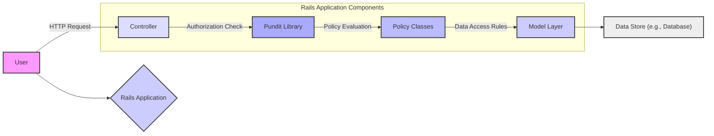
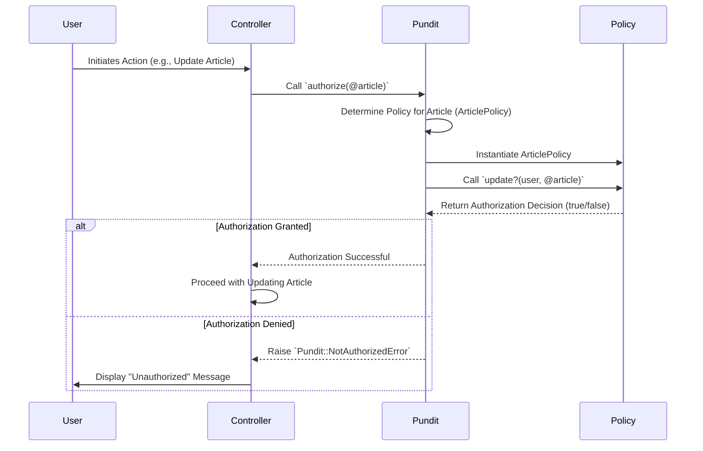

# Project Design Document: Pundit Authorization Library

**Version:** 1.1
**Date:** October 26, 2023
**Author:** Gemini (AI Language Model)

## 1. Introduction

This document provides an enhanced and detailed design overview of the Pundit authorization library for Ruby on Rails applications. Its primary goal is to offer a clear articulation of Pundit's architecture, components, and data flow, specifically tailored to facilitate a comprehensive threat modeling exercise. This document will serve as the foundational resource for identifying potential security vulnerabilities and designing appropriate mitigation strategies.

## 2. Goals of this Document

*   Provide a clear, comprehensive, and easily understandable description of Pundit's architecture and functionality.
*   Identify and describe the key components of Pundit and their precise interactions within the library and the encompassing Rails application.
*   Illustrate the complete data flow during a typical authorization request, highlighting critical data points and transformations.
*   Serve as a robust and reliable basis for conducting a thorough and effective threat modeling exercise.
*   Enable all relevant stakeholders, regardless of their technical background, to understand the security-relevant aspects of Pundit.

## 3. Overview of Pundit

Pundit is a Ruby gem designed to provide a straightforward and convention-based approach to implementing authorization within Ruby on Rails applications. It promotes the use of simple, well-defined Ruby classes known as "Policies" to encapsulate all authorization logic. At its core, Pundit helps developers definitively answer the question: "Is this specific user currently allowed to perform this particular action on this specific record or resource?".

## 4. Architectural Design

Pundit's architecture is centered around the concept of Policy classes and their interactions with Rails Controllers and potentially other service layers within the application.

### 4.1. Key Components

*   **Policy Classes:** These are plain Ruby classes that encapsulate the authorization rules for specific models or resources within the application. There's a strong convention of having one policy class per model (e.g., `ArticlePolicy` for the `Article` model).
*   **User:** Represents the currently authenticated entity attempting to perform an action. Pundit relies on the presence of a `current_user` method being available within the controller context.
*   **Record:** This is the specific model instance or the model class itself upon which the action is being performed. It could be an individual `Article` object or the `Article` class when authorizing actions like creating a new article.
*   **Actions:** These represent the specific operations that are being authorized. Common examples include `create?`, `read?`, `update?`, and `destroy?`. Policy methods are typically named to correspond to these actions.
*   **`authorize` Method:** This is a controller method provided by Pundit. When invoked, it initiates the authorization process for a given record and action.
*   **`policy` Method:** A helper method that facilitates the retrieval of the appropriate policy instance for a given record. It uses naming conventions to locate the correct policy class.
*   **`policy_scope` Method:** A crucial helper method used to filter collections of records based on the authorization rules defined within the corresponding policy's `Scope` class. This ensures users only see authorized data.
*   **`Pundit::NotAuthorizedError`:** This is the specific exception that Pundit raises when an authorization check fails. It signals that the current user is not permitted to perform the requested action.

### 4.2. Component Interactions

The following diagram illustrates the detailed interaction between the key components during a typical authorization request initiated from a controller:

```mermaid
graph LR
    A["User Request (e.g., HTTP Request)"] --> B{"Controller Action"};
    B --> C{"`authorize` Method"};
    C -- "Record, User, Action Info" --> D{"`policy` Method (Finds Policy)"};
    D -- "Policy Class Name" --> E["Policy Instance (e.g., 'ArticlePolicy')"];
    E -- "User, Record" --> F{"Policy Method (e.g., 'update?')"};
    F -- "Authorization Decision (True/False)" --> C;
    alt Authorization Granted
        C -- "Proceed" --> G{"Controller Logic"};
        G --> H["Response to User"];
    else Authorization Denied
        C -- "Failure" --> I{"Raise 'Pundit::NotAuthorizedError'"};
        I --> J["Error Handling/Redirection"];
    end
    style A fill:#f9f,stroke:#333,stroke-width:2px
    style B fill:#ccf,stroke:#333,stroke-width:2px
    style C fill:#ddf,stroke:#333,stroke-width:2px
    style D fill:#aaf,stroke:#333,stroke-width:2px
    style E fill:#bbf,stroke:#333,stroke-width:2px
    style F fill:#ccb,stroke:#333,stroke-width:2px
    style G fill:#eef,stroke:#333,stroke-width:2px
    style H fill:#efe,stroke:#333,stroke-width:2px
    style I fill:#faa,stroke:#333,stroke-width:2px
    style J fill:#fbb,stroke:#333,stroke-width:2px
```

### 4.3. Policy Structure

A standard policy class will contain methods that directly correspond to the actions that can be performed on the associated model. These methods accept the `user` attempting the action and the `record` in question as arguments. They return a boolean value: `true` if the action is authorized, and `false` otherwise.

```ruby
class ArticlePolicy < ApplicationPolicy
  def update?
    user.present? && (record.user == user || user.admin?)
  end

  def destroy?
    user.present? && user.admin?
  end

  class Scope < Scope
    def resolve
      if user.admin?
        scope.all
      else
        scope.where(user: user)
      end
    end
  end
end
```

### 4.4. Controller Integration

Pundit is seamlessly integrated into Rails controllers. The `authorize` method is typically invoked within a controller action to explicitly check if the `current_user` is authorized to perform the specific action on the designated record.

```ruby
class ArticlesController < ApplicationController
  def update
    @article = Article.find(params[:id])
    authorize @article # Checks if current_user can update @article
    if @article.update(article_params)
      redirect_to @article
    else
      render :edit
    end
  rescue Pundit::NotAuthorizedError
    redirect_to root_path, alert: "You are not authorized to perform this action."
  end
end
```

## 5. Data Flow

The data flow during an authorization request can be meticulously broken down into the following steps:

1. **User Initiates Action:** A user interacts with the application's user interface, triggering an event that results in an HTTP request being sent to the Rails server. This request is routed to a specific controller action.
2. **Controller Receives Request:** The designated Rails controller receives the incoming HTTP request and begins the process of handling the requested action.
3. **`authorize` Method Invoked:** Within the controller action, the `authorize` method is explicitly called. This method is provided by Pundit and is the primary entry point for the authorization process. The `authorize` method is typically passed the specific record that the user is attempting to interact with.
4. **Policy Resolution:** Pundit utilizes a clear naming convention to dynamically determine the appropriate policy class that corresponds to the record being authorized. For instance, if the record is an instance of the `Article` model, Pundit will look for a policy class named `ArticlePolicy`.
5. **Policy Method Invocation:** Pundit instantiates an instance of the resolved policy class. It then calls the specific method within that policy class that corresponds to the action being performed (e.g., if the action is `update`, Pundit will call the `update?` method on the `ArticlePolicy` instance). The `current_user` and the `record` being acted upon are passed as arguments to this policy method.
6. **Authorization Logic Execution:** The invoked policy method executes its defined authorization logic. This logic typically involves evaluating the user's attributes, roles, and permissions in relation to the attributes and state of the record.
7. **Authorization Decision:** The policy method returns a boolean value. `true` indicates that the user is authorized to perform the action, and `false` indicates that the user is not authorized.
8. **Controller Action Based on Decision:**
    *   **If `true`:** The `authorize` method returns without raising an exception, and the controller proceeds with the intended business logic of the action.
    *   **If `false`:** The `authorize` method raises a `Pundit::NotAuthorizedError` exception.
9. **Error Handling (if applicable):** The Rails controller (or a global exception handling mechanism) catches the `Pundit::NotAuthorizedError` exception. The application then executes appropriate error handling logic, such as redirecting the user to an error page, displaying an unauthorized message, or logging the event.

## 6. Key Components in Detail

*   **Policy Classes:**
    *   Conventionally located within the `app/policies` directory of the Rails application.
    *   Often inherit from a base `ApplicationPolicy` class. This is a common pattern to share common authorization logic across different policies.
    *   Contain individual methods, each named after a specific action that can be performed on the associated model (e.g., `create?`, `read?`, `update?`, `destroy?`, and potentially custom actions).
    *   Each policy method accepts two primary arguments: the `user` object representing the current user and the `record` object representing the resource being acted upon.
    *   Policy methods are expected to return a boolean value (`true` for authorized, `false` for unauthorized).
    *   May include an inner `Scope` class. This nested class is used to define how collections of the associated model should be filtered based on authorization rules. The `resolve` method within the `Scope` class is typically where this filtering logic resides.

*   **`authorize` Method:**
    *   This method is injected into `ActionController::Base` by the Pundit gem, making it readily available within all Rails controllers.
    *   The primary argument is the `record` that needs to be authorized. Pundit will automatically infer the action being authorized based on the controller action name (e.g., in an `update` action, it will check the `update?` policy method).
    *   Optionally, you can explicitly specify the policy class and the action name as arguments for more fine-grained control over the authorization process.
    *   Crucially, this method will raise a `Pundit::NotAuthorizedError` exception if the corresponding policy method returns `false`, indicating that the user is not authorized.

*   **`policy` Method:**
    *   A helper method designed to simplify the retrieval of the correct policy instance for a given record.
    *   It adheres to Pundit's naming conventions to locate the appropriate policy class (e.g., given an `Article` instance, it will find `ArticlePolicy`).
    *   This method can be used to directly interact with policy methods without triggering the automatic authorization failure mechanism of the `authorize` method. This is useful for checking authorization status without necessarily enforcing it.

*   **`policy_scope` Method:**
    *   Specifically designed for filtering collections of records based on authorization rules.
    *   It leverages the `Scope` class defined within the relevant policy.
    *   When called, it instantiates the `Scope` class and calls its `resolve` method. The `resolve` method should contain the logic for filtering the collection based on the current user's permissions.
    *   Ensures that users only have access to the records they are explicitly authorized to view, preventing unauthorized data access.

*   **`Pundit::NotAuthorizedError`:**
    *   A standard Ruby exception class that is specifically raised by the `authorize` method when an authorization check fails.
    *   Provides a clear and consistent way for controllers to detect and handle authorization failures.
    *   Allows developers to implement centralized error handling logic for unauthorized access attempts, improving the application's security and user experience.

## 7. Security Considerations (Detailed for Threat Modeling)

This section provides a more detailed outline of security considerations that should be thoroughly explored during the threat modeling process.

*   **Policy Logic Vulnerabilities Leading to Privilege Escalation:**
    *   **Overly Permissive Rules:**  Policy methods might contain logic that unintentionally grants excessive permissions, allowing users to perform actions they shouldn't.
    *   **Incorrect Attribute Checks:** Flaws in the logic that compares user attributes or record attributes could lead to incorrect authorization decisions.
    *   **Logic Errors in Conditional Statements:** Mistakes in `if/else` statements or other conditional logic within policy methods can create bypasses.
*   **Circumvention of Authorization Checks:**
    *   **Missing `authorize` Calls:**  Controllers might lack necessary `authorize` calls for certain actions, leaving them unprotected.
    *   **Incorrect `authorize` Scope:**  Authorizing the wrong record or at the wrong point in the request lifecycle can lead to vulnerabilities.
    *   **Bypassing Controller Actions:** Attackers might attempt to directly access model methods or other parts of the application logic, bypassing controller-level authorization.
*   **Information Disclosure through Policy Scope Issues:**
    *   **Flawed `Scope` Logic:**  Errors in the `resolve` method of the `Scope` class could result in users being able to see records they are not authorized to access.
    *   **Lack of Filtering:**  Forgetting to apply `policy_scope` when fetching collections can expose sensitive data.
    *   **Inconsistent Scope Application:** Applying different or incomplete scoping logic in different parts of the application can lead to inconsistencies and vulnerabilities.
*   **Security of Policy Definition and Management:**
    *   **Exposure of Policy Logic:**  If policy files are inadvertently exposed (e.g., through misconfigured web servers), attackers could gain insights into authorization rules.
    *   **Lack of Version Control for Policies:** Changes to policies should be tracked and auditable to prevent accidental or malicious modifications.
*   **Dependency Chain Vulnerabilities:**
    *   **Vulnerabilities in Pundit's Dependencies:**  Security flaws in gems that Pundit relies on could indirectly affect the security of applications using Pundit. Regular dependency updates are crucial.
*   **Indirect Injection Attacks:**
    *   **SQL Injection via Policy Logic:** While Pundit doesn't directly handle user input, policy logic that constructs database queries based on user input without proper sanitization could be vulnerable to SQL injection.
    *   **Cross-Site Scripting (XSS) via Policy Messages:** If error messages derived from policy decisions are not properly sanitized before being displayed to the user, they could be exploited for XSS attacks.
*   **Denial of Service (DoS) Potential:**
    *   **Complex Policy Logic:**  Overly complex or inefficient policy logic could consume excessive resources, potentially leading to DoS if many authorization checks are performed concurrently.
    *   **Resource-Intensive Scope Filtering:**  Inefficient filtering logic within `policy_scope` could strain database resources.

## 8. Diagrams

### 8.1. High-Level Architecture



### 8.2. Detailed Authorization Request Flow



## 9. Future Considerations

*   **Enhanced Integration with GraphQL:**  Further explore and document best practices for utilizing Pundit within GraphQL APIs, considering the nuances of GraphQL authorization.
*   **Attribute-Based Access Control (ABAC) Extensions:** Investigate patterns and potential extensions to support more fine-grained authorization based on attributes of the user, resource, and environment.
*   **Centralized Policy Management and Auditing Tools:** Explore the feasibility of developing or integrating with tools that facilitate the centralized management, auditing, and visualization of authorization policies in complex applications.
*   **Improved Testing Framework and Best Practices for Policies:**  Provide more comprehensive guidance and potentially tooling to aid developers in thoroughly testing their policy logic, including edge cases and complex scenarios.
*   **Consideration for Asynchronous Authorization:**  Explore patterns for handling authorization in asynchronous workflows or background jobs.

This improved document provides a more detailed and nuanced design overview of the Pundit authorization library, with a strong focus on aspects relevant to thorough threat modeling. The information presented here aims to be a valuable resource for identifying potential security vulnerabilities and developing robust mitigation strategies.