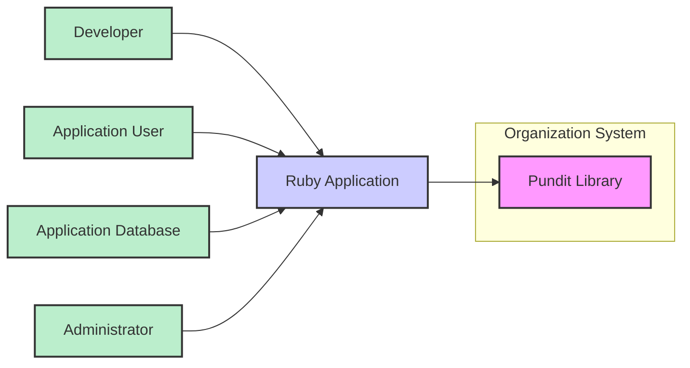
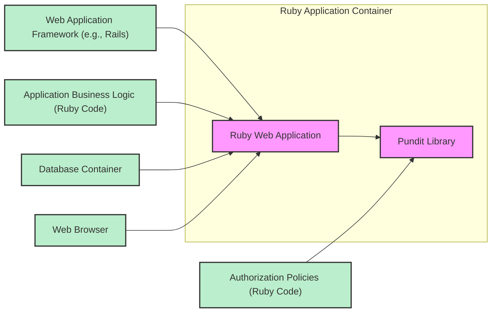
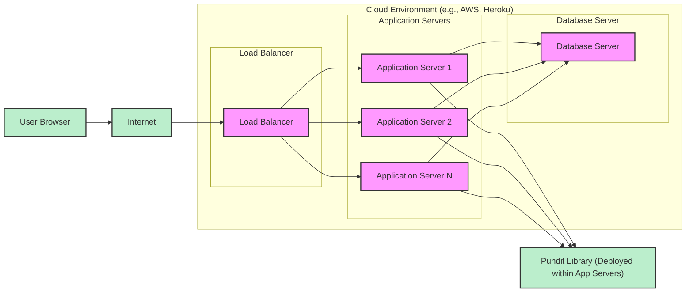

# BUSINESS POSTURE

This project, represented by the Pundit GitHub repository, aims to provide a robust and flexible authorization system for Ruby applications. The primary business goal is to empower developers to easily implement fine-grained access control within their applications, enhancing security and data protection.

Business priorities include:

*   Ease of integration and use for Ruby developers.
*   Flexibility to accommodate diverse authorization logic and application requirements.
*   Maintainability and long-term support to ensure continued security and reliability.
*   Performance efficiency to minimize impact on application responsiveness.

Key business risks associated with this project are:

*   Authorization bypass vulnerabilities in Pundit itself could lead to unauthorized access to application resources and data.
*   Incorrect implementation or misconfiguration of Pundit by developers could result in unintended security gaps.
*   Lack of ongoing maintenance and security updates could leave applications vulnerable to newly discovered threats.
*   Performance bottlenecks introduced by complex authorization logic could negatively impact user experience.

# SECURITY POSTURE

Existing security controls for the Pundit project include:

*   security control Open source nature, allowing for community review and scrutiny of the codebase. Described in: GitHub repository being publicly accessible.
*   security control Unit and integration tests to verify the correctness of authorization logic. Described in: Test suite within the GitHub repository.
*   security control Reliance on RubyGems for distribution, which provides a level of package integrity and versioning. Described in: RubyGems packaging and distribution process.

Accepted risks for the Pundit project include:

*   accepted risk Dependence on community contributions for identifying and addressing security vulnerabilities.
*   accepted risk Potential for vulnerabilities to exist in dependencies used by Pundit.
*   accepted risk Risk of developers misusing or misconfiguring Pundit, leading to security issues in their applications.

Recommended security controls to enhance the security posture of Pundit:

*   recommended security control Implement static application security testing (SAST) to automatically identify potential vulnerabilities in the codebase.
*   recommended security control Integrate dependency scanning to detect known vulnerabilities in third-party libraries used by Pundit.
*   recommended security control Establish a clear vulnerability reporting and response process to handle security issues reported by the community.
*   recommended security control Provide comprehensive security documentation and best practices for developers using Pundit to minimize misconfiguration risks.

Security requirements for the Pundit project:

*   Authentication: Pundit itself does not handle authentication, but it is assumed that applications using Pundit will have a robust authentication mechanism in place to identify users.
*   Authorization: Pundit's core function is authorization. It must provide a flexible and secure way to define and enforce access control policies based on user roles, permissions, and context.
*   Input Validation: Pundit policies should validate inputs to prevent unexpected behavior or security vulnerabilities arising from malformed or malicious data.
*   Cryptography: While Pundit may not directly implement cryptography, it should be designed to be compatible with applications that utilize cryptographic mechanisms for data protection and secure communication.

# DESIGN

The Pundit project is a Ruby library designed to provide authorization capabilities to Ruby applications. It is not a standalone application or service but rather a component integrated into other systems.

## C4 CONTEXT

Context Diagram Elements:

*   Name: Pundit Library
    *   Type: Software System
    *   Description: A Ruby library providing authorization functionality for Ruby applications.
    *   Responsibilities: Define and enforce authorization policies, provide a DSL for policy definition, integrate with Ruby applications.
    *   Security controls: Code review, unit and integration testing, open-source community scrutiny.
*   Name: Ruby Application
    *   Type: Software System
    *   Description: A Ruby application that integrates the Pundit library to manage authorization.
    *   Responsibilities: Implement application logic, handle user requests, integrate with Pundit for authorization checks, manage data persistence.
    *   Security controls: Authentication mechanisms, input validation, secure coding practices, session management, integration with Pundit for authorization.
*   Name: Developer
    *   Type: Person
    *   Description: A software developer who uses Pundit to implement authorization in Ruby applications.
    *   Responsibilities: Integrate Pundit into Ruby applications, define authorization policies, write code that utilizes Pundit for access control.
    *   Security controls: Secure development practices, code reviews, understanding of authorization principles.
*   Name: Application User
    *   Type: Person
    *   Description: An end-user who interacts with the Ruby application.
    *   Responsibilities: Use the application to access resources and perform actions, subject to authorization policies defined by the application and Pundit.
    *   Security controls: Authentication credentials, adherence to application usage policies.
*   Name: Application Database
    *   Type: Software System
    *   Description: A database used by the Ruby application to store application data, including potentially user data and resources protected by Pundit.
    *   Responsibilities: Persist application data, provide data access to the Ruby application.
    *   Security controls: Access control lists, encryption at rest and in transit, database auditing.
*   Name: Administrator
    *   Type: Person
    *   Description: An administrator who manages the Ruby application and potentially its authorization policies.
    *   Responsibilities: Configure and manage the Ruby application, potentially define or modify authorization policies within the application or Pundit.
    *   Security controls: Strong authentication, role-based access control, audit logging of administrative actions.

## C4 CONTAINER

Container Diagram Elements:

*   Name: Ruby Web Application
    *   Type: Web Application
    *   Description: The main container representing the Ruby web application that utilizes Pundit for authorization.
    *   Responsibilities: Handles HTTP requests, renders web pages, executes application business logic, integrates with Pundit for authorization, interacts with the database.
    *   Security controls: Web application firewall (WAF), input validation, output encoding, session management, authentication, integration with Pundit for authorization.
*   Name: Pundit Library
    *   Type: Library
    *   Description: The Pundit Ruby library, integrated into the Ruby Web Application container.
    *   Responsibilities: Provides authorization logic, evaluates policies based on user, action, and resource, returns authorization decisions.
    *   Security controls: Secure coding practices, unit and integration testing, SAST, dependency scanning.
*   Name: Web Application Framework (e.g., Rails)
    *   Type: Framework
    *   Description: The underlying web framework (e.g., Ruby on Rails) that provides the foundation for the Ruby Web Application.
    *   Responsibilities: Routing, request handling, templating, ORM, and other web application functionalities.
    *   Security controls: Framework-provided security features (e.g., CSRF protection, parameter sanitization), security updates for the framework.
*   Name: Authorization Policies (Ruby Code)
    *   Type: Code
    *   Description: Ruby code defining the authorization policies used by Pundit. These policies are typically part of the application codebase.
    *   Responsibilities: Define the rules and logic for authorization decisions within the application.
    *   Security controls: Code review of authorization policies, unit testing of policies to ensure correct authorization logic.
*   Name: Application Business Logic (Ruby Code)
    *   Type: Code
    *   Description: Ruby code implementing the core business functionality of the web application.
    *   Responsibilities: Implement application features, interact with data storage, utilize Pundit for authorization before performing actions.
    *   Security controls: Secure coding practices, input validation, output encoding, proper error handling.
*   Name: Database Container
    *   Type: Database
    *   Description: A database system (e.g., PostgreSQL, MySQL) used to store application data.
    *   Responsibilities: Persist application data, provide data access to the Ruby Web Application.
    *   Security controls: Database access controls, encryption at rest and in transit, database auditing, regular security patching.
*   Name: Web Browser
    *   Type: Client Application
    *   Description: A web browser used by users to interact with the Ruby Web Application.
    *   Responsibilities: Render web pages, send HTTP requests to the web application, display application UI.
    *   Security controls: Browser security features (e.g., Content Security Policy, XSS protection), user awareness of phishing and other web-based attacks.

## DEPLOYMENT

Pundit itself is deployed as a library dependency within Ruby applications. There isn't a separate deployment for Pundit. The deployment architecture described here is for a typical Ruby web application that utilizes Pundit.

Deployment Architecture: Cloud-based deployment using a platform-as-a-service (PaaS) like Heroku or AWS Elastic Beanstalk.

Deployment Diagram Elements:

*   Name: Load Balancer
    *   Type: Infrastructure Component
    *   Description: Distributes incoming traffic across multiple application servers for scalability and high availability.
    *   Responsibilities: Traffic distribution, health checks, SSL termination.
    *   Security controls: DDoS protection, SSL/TLS encryption, access control lists.
*   Name: Application Server 1, 2, N
    *   Type: Compute Instance
    *   Description: Virtual machines or containers running the Ruby web application and Pundit library.
    *   Responsibilities: Run the application code, handle requests, execute authorization checks using Pundit, interact with the database.
    *   Security controls: Operating system hardening, security patching, application-level firewalls, intrusion detection systems (IDS), runtime application self-protection (RASP).
*   Name: Database Server
    *   Type: Database Instance
    *   Description: A managed database service instance storing application data.
    *   Responsibilities: Data persistence, data retrieval, database management.
    *   Security controls: Database access controls, encryption at rest and in transit, database auditing, regular backups, security patching.
*   Name: Internet
    *   Type: Network
    *   Description: The public internet, providing connectivity for users to access the application.
    *   Responsibilities: Global network connectivity.
    *   Security controls: N/A (external network).
*   Name: User Browser
    *   Type: Client Application
    *   Description: User's web browser accessing the application over the internet.
    *   Responsibilities: Rendering web pages, sending requests, user interaction.
    *   Security controls: Browser security features, user security practices.
*   Name: Pundit Library (Deployed within App Servers)
    *   Type: Software Library
    *   Description: Pundit library deployed as part of the Ruby application on each application server.
    *   Responsibilities: Provide authorization functionality within each application server instance.
    *   Security controls: Inherits security controls of the application server environment, secure library dependencies.

## BUILD

The build process for a Ruby application using Pundit typically involves standard Ruby development and deployment workflows. Security in the build process is crucial to ensure the integrity and security of the final application.

```mermaid
flowchart LR
    Developer["Developer"] --> CodeRepository["Code Repository (e.g., GitHub)"]
    CodeRepository --> CI["CI/CD System (e.g., GitHub Actions)"]
    CI --> BuildProcess["Build Process"]
    BuildProcess --> SecurityChecks["Security Checks (SAST, Dependency Scan, Linting)"]
    SecurityChecks --> BuildArtifacts["Build Artifacts (e.g., Docker Image, RubyGem)"]
    BuildArtifacts --> ArtifactRepository["Artifact Repository (e.g., Docker Registry, RubyGems)"]

    style Developer fill:#bec,stroke:#333,stroke-width:2px
    style CodeRepository fill:#f9f,stroke:#333,stroke-width:2px
    style CI fill:#f9f,stroke:#333,stroke-width:2px
    style BuildProcess fill:#f9f,stroke:#333,stroke-width:2px
    style SecurityChecks fill:#f9f,stroke:#333,stroke-width:2px
    style BuildArtifacts fill:#f9f,stroke:#333,stroke-width:2px
    style ArtifactRepository fill:#f9f,stroke:#333,stroke-width:2px
```

Build Process Elements:

*   Name: Developer
    *   Type: Person
    *   Description: Software developer writing code and contributing to the project.
    *   Responsibilities: Writing code, committing code to the repository, creating pull requests.
    *   Security controls: Secure development environment, code review process, secure coding practices.
*   Name: Code Repository (e.g., GitHub)
    *   Type: Version Control System
    *   Description: A repository hosting the source code of the application and Pundit policies.
    *   Responsibilities: Version control, code collaboration, pull request management.
    *   Security controls: Access control, branch protection, audit logging, vulnerability scanning of repository configurations.
*   Name: CI/CD System (e.g., GitHub Actions)
    *   Type: Automation System
    *   Description: A continuous integration and continuous delivery system automating the build, test, and deployment pipeline.
    *   Responsibilities: Automated build, testing, security checks, artifact creation, deployment.
    *   Security controls: Secure CI/CD configuration, access control, secret management, audit logging.
*   Name: Build Process
    *   Type: Automated Script
    *   Description: Automated scripts and tools used to compile, package, and prepare the application for deployment.
    *   Responsibilities: Dependency management, compilation (if needed), packaging, artifact creation.
    *   Security controls: Secure build scripts, dependency integrity checks, minimized build environment.
*   Name: Security Checks (SAST, Dependency Scan, Linting)
    *   Type: Security Tools
    *   Description: Automated security tools integrated into the build process to identify vulnerabilities and code quality issues.
    *   Responsibilities: Static application security testing (SAST), dependency vulnerability scanning, code linting, policy checks.
    *   Security controls: Regularly updated security tools, configured security rules and policies, automated reporting of findings.
*   Name: Build Artifacts (e.g., Docker Image, RubyGem)
    *   Type: Package
    *   Description: The packaged application ready for deployment (e.g., Docker image, RubyGem).
    *   Responsibilities: Deployable application package.
    *   Security controls: Artifact signing, vulnerability scanning of base images (for Docker), secure artifact storage.
*   Name: Artifact Repository (e.g., Docker Registry, RubyGems)
    *   Type: Storage System
    *   Description: A repository for storing and managing build artifacts.
    *   Responsibilities: Secure storage of build artifacts, versioning, access control.
    *   Security controls: Access control, encryption at rest, vulnerability scanning of repository infrastructure.

# RISK ASSESSMENT

Critical business processes protected by Pundit are authorization and access control within Ruby applications. This includes ensuring that only authorized users can access specific resources and perform certain actions.

Data being protected depends on the application using Pundit. It can range from non-sensitive public data to highly sensitive personal or financial information. The sensitivity of the data directly impacts the criticality of robust authorization.

Examples of data sensitivity levels:

*   Low Sensitivity: Publicly available blog posts, marketing materials. Authorization might be needed to control who can create or edit these.
*   Medium Sensitivity: User profiles, order history, internal documents. Authorization is crucial to prevent unauthorized access and data breaches.
*   High Sensitivity: Financial transactions, medical records, personal identifiable information (PII). Strict authorization is paramount to comply with regulations and protect user privacy.

The impact of a security breach due to authorization failures can range from minor inconvenience to significant financial loss, reputational damage, legal liabilities, and privacy violations, depending on the sensitivity of the data and the nature of the application.

# QUESTIONS & ASSUMPTIONS

Questions:

*   What are the primary use cases and types of applications for which Pundit is intended (e.g., web applications, APIs, background jobs)?
*   Are there specific compliance requirements (e.g., GDPR, HIPAA, PCI DSS) that applications using Pundit might need to adhere to?
*   What is the expected scale and performance requirements for authorization checks in typical Pundit deployments?
*   Are there any known limitations or edge cases in Pundit's authorization logic that developers should be aware of from a security perspective?

Assumptions:

*   It is assumed that applications using Pundit will implement proper authentication mechanisms to identify users before authorization checks are performed.
*   It is assumed that developers using Pundit have a basic understanding of authorization concepts and secure coding practices.
*   It is assumed that Pundit is intended to be used in environments where security and access control are important considerations.
*   It is assumed that the Ruby applications integrating Pundit will be deployed in environments with standard security measures in place, such as firewalls, intrusion detection, and regular security updates.