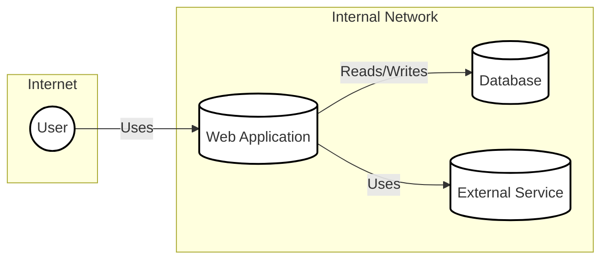
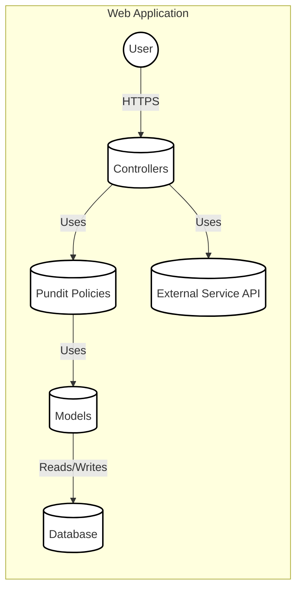
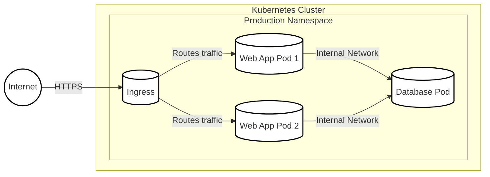
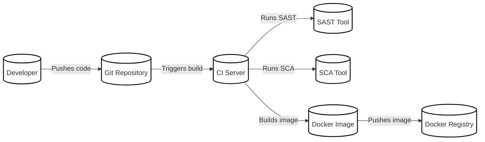

Okay, let's create a design document for the Pundit library, focusing on its use within a larger application context. I'll assume we're integrating Pundit into a Ruby on Rails web application, as that's its primary use case.  I'll also assume a mid-sized company with an established online presence, meaning they have a moderate risk tolerance and existing security practices, but also need to move quickly.

# BUSINESS POSTURE

*   _Priorities and Goals_:
    *   Provide a clean and maintainable authorization system for a Ruby on Rails application.
    *   Ensure consistent application of authorization rules across the application.
    *   Reduce the risk of unauthorized access to sensitive data and functionality.
    *   Enable developers to easily define and understand authorization policies.
    *   Improve the overall security posture of the application.
    *   Minimize code complexity related to authorization.

*   _Business Risks_:
    *   _Data Breach_: Unauthorized access to sensitive user data (PII, financial data, etc.) due to flaws in authorization logic.
    *   _Reputational Damage_:  A security incident related to authorization could damage the company's reputation and erode customer trust.
    *   _Compliance Violations_:  Failure to meet regulatory requirements (e.g., GDPR, CCPA) related to data access control.
    *   _Business Disruption_:  Exploitation of authorization vulnerabilities could lead to service disruption or data loss.
    *   _Development Overhead_:  Poorly designed authorization can lead to increased development time and maintenance costs.

# SECURITY POSTURE

*   _Existing Security Controls_:
    *   _security control_: Authentication system (e.g., Devise, a custom solution) is assumed to be in place and securely implemented. This is a prerequisite for Pundit, as it only handles authorization.  (Described in application's authentication implementation documentation).
    *   _security control_: Secure coding practices are followed, including input validation, output encoding, and protection against common web vulnerabilities (e.g., OWASP Top 10). (Described in company's secure coding guidelines).
    *   _security control_: Regular security audits and penetration testing are conducted. (Described in company's security audit policy).
    *   _security control_: Rails framework security features are enabled and properly configured (e.g., CSRF protection, strong parameters). (Described in Rails application configuration).
    *   _security control_: Deployment pipeline includes security checks (e.g., static code analysis, vulnerability scanning). (Described in deployment pipeline configuration).

*   _Accepted Risks_:
    *   _accepted risk_:  Pundit relies on the developer to correctly implement policies.  Incorrectly written policies can lead to authorization bypasses. This is mitigated by code reviews and testing.
    *   _accepted risk_:  Performance overhead of authorization checks.  While Pundit is generally performant, complex policies or excessive checks can impact application performance. This is mitigated by careful policy design and performance testing.
    *   _accepted risk_: The application is at risk from vulnerabilities that are not covered by the OWASP Top 10.

*   _Recommended Security Controls_:
    *   _security control_: Implement comprehensive test coverage for all Pundit policies, including both positive and negative test cases.
    *   _security control_: Conduct regular code reviews with a specific focus on authorization logic and policy implementation.
    *   _security control_: Integrate a policy linter or static analysis tool to help identify potential issues in Pundit policies.
    *   _security control_: Monitor application logs for authorization-related events (e.g., policy violations, unauthorized access attempts).
    *   _security control_: Establish a clear process for updating and reviewing authorization policies as the application evolves.

*   _Security Requirements_:
    *   _Authentication_:  Pundit does *not* handle authentication.  The application *must* have a separate, securely implemented authentication system.
    *   _Authorization_:
        *   All controller actions *must* be authorized using Pundit policies.
        *   Policies *must* be defined for all resources (models) that require access control.
        *   Policies *must* follow the principle of least privilege, granting only the necessary permissions to users.
        *   Authorization logic *must* be centralized in Pundit policies, not scattered throughout the application code.
    *   _Input Validation_:  While not directly related to Pundit, input validation is crucial for preventing many security vulnerabilities.  All user input *must* be validated before being used in authorization logic or any other part of the application.
    *   _Cryptography_: Pundit itself does not handle cryptography. However, any sensitive data used in authorization decisions (e.g., user roles, permissions) *must* be stored securely, potentially using encryption.

# DESIGN

## C4 CONTEXT

*   _Elements Description_:
    *   _User_:
        *   _Name_: User
        *   _Type_: Person
        *   _Description_: A user interacting with the web application.
        *   _Responsibilities_: Accessing and using the application's features.
        *   _Security Controls_: Authentication (handled separately), session management.
    *   _Web Application_:
        *   _Name_: Web Application
        *   _Type_: System
        *   _Description_: The Ruby on Rails application using Pundit for authorization.
        *   _Responsibilities_: Handling user requests, enforcing authorization policies, interacting with the database and external services.
        *   _Security Controls_: Pundit policies, input validation, output encoding, CSRF protection, secure configuration.
    *   _Database_:
        *   _Name_: Database
        *   _Type_: System
        *   _Description_: The application's database (e.g., PostgreSQL, MySQL).
        *   _Responsibilities_: Storing application data.
        *   _Security Controls_: Access control, encryption at rest, regular backups.
    *   _External Service_:
        *   _Name_: External Service
        *   _Type_: System
        *   _Description_: Any external service the application interacts with (e.g., payment gateway, email provider).
        *   _Responsibilities_: Providing specific functionality to the application.
        *   _Security Controls_: API keys, authentication, secure communication (HTTPS).

## C4 CONTAINER

*   _Elements Description_:
    *   _User_:
        *   _Name_: User
        *   _Type_: Person
        *   _Description_: A user interacting with the web application.
        *   _Responsibilities_: Accessing and using the application's features.
        *   _Security Controls_: Authentication (handled separately), session management.
    *   _Controllers_:
        *   _Name_: Controllers
        *   _Type_: Container
        *   _Description_: Rails controllers that handle user requests.
        *   _Responsibilities_: Receiving requests, invoking actions, rendering views, interacting with models and policies.
        *   _Security Controls_:  `authorize` calls to Pundit policies, input validation, CSRF protection.
    *   _Pundit Policies_:
        *   _Name_: Pundit Policies
        *   _Type_: Container
        *   _Description_:  Ruby classes that define authorization rules.
        *   _Responsibilities_:  Encapsulating authorization logic, determining whether a user is allowed to perform an action on a resource.
        *   _Security Controls_:  Policy logic itself, following the principle of least privilege.
    *   _Models_:
        *   _Name_: Models
        *   _Type_: Container
        *   _Description_:  Rails models representing application data.
        *   _Responsibilities_:  Interacting with the database, encapsulating business logic.
        *   _Security Controls_:  Data validation, potentially data-level access control (though this is often handled by Pundit).
    *   _Database_:
        *   _Name_: Database
        *   _Type_: Container
        *   _Description_: The application's database.
        *   _Responsibilities_: Storing application data.
        *   _Security Controls_: Access control, encryption at rest, regular backups.
    *   _External Service API_:
        *   _Name_: External Service API
        *   _Type_: Container
        *   _Description_: API of external service.
        *   _Responsibilities_: Providing specific functionality to the application.
        *   _Security Controls_: API keys, authentication, secure communication (HTTPS).

## DEPLOYMENT

Possible deployment solutions:

1.  Traditional server deployment (e.g., using Capistrano to deploy to a VPS).
2.  Platform as a Service (PaaS) deployment (e.g., Heroku, AWS Elastic Beanstalk).
3.  Containerized deployment (e.g., Docker, Kubernetes).

We'll describe the containerized deployment using Docker and Kubernetes, as it's a modern and common approach.

*   _Elements Description_:
    *   _Internet_:
        *   _Name_: Internet
        *   _Type_: Node
        *   _Description_: The public internet.
        *   _Responsibilities_:  Source of user traffic.
        *   _Security Controls_:  Firewall, DDoS protection (typically handled by the cloud provider).
    *   _Kubernetes Cluster_:
        *   _Name_: Kubernetes Cluster
        *   _Type_: Node
        *   _Description_: The Kubernetes cluster hosting the application.
        *   _Responsibilities_:  Orchestrating containers, managing resources, providing networking.
        *   _Security Controls_:  RBAC, network policies, pod security policies, regular security updates.
    *   _Production Namespace_:
        *   _Name_: Production Namespace
        *   _Type_: Node
        *   _Description_:  A Kubernetes namespace isolating the production environment.
        *   _Responsibilities_:  Providing a logical separation for production resources.
        *   _Security Controls_:  Namespace-level access control, resource quotas.
    *   _Web App Pod 1 & 2_:
        *   _Name_: Web App Pod 1 & 2
        *   _Type_: Node
        *   _Description_:  Instances of the web application container.
        *   _Responsibilities_:  Running the Rails application.
        *   _Security Controls_:  Read-only filesystem, limited privileges, resource limits.
    *   _Database Pod_:
        *   _Name_: Database Pod
        *   _Type_: Node
        *   _Description_:  The database container.
        *   _Responsibilities_:  Running the database server.
        *   _Security Controls_:  Strong passwords, access control, encryption at rest, regular backups, limited network access.
    *   _Ingress_:
        *   _Name_: Ingress
        *   _Type_: Node
        *   _Description_:  Kubernetes Ingress controller.
        *   _Responsibilities_:  Routing external traffic to the web application pods.
        *   _Security Controls_:  TLS termination, potentially a web application firewall (WAF).

## BUILD

*   _Process Description_:
    1.  _Developer_ pushes code changes to the _Git Repository_.
    2.  The _Git Repository_ triggers a build on the _CI Server_ (e.g., GitHub Actions, Jenkins, CircleCI).
    3.  The _CI Server_ runs a series of steps:
        *   Checks out the code.
        *   Runs a _SAST Tool_ (Static Application Security Testing) to analyze the code for vulnerabilities (e.g., Brakeman for Rails).
        *   Runs an _SCA Tool_ (Software Composition Analysis) to identify vulnerabilities in third-party dependencies (e.g., Bundler-Audit).
        *   Builds a _Docker Image_ containing the application and its dependencies.
        *   Runs unit and integration tests.
        *   If all checks and tests pass, pushes the _Docker Image_ to a _Docker Registry_ (e.g., Docker Hub, AWS ECR).

*   _Security Controls_:
    *   _security control_:  _SAST_ identifies vulnerabilities in the application's code.
    *   _security control_:  _SCA_ identifies vulnerabilities in third-party libraries.
    *   _security control_:  Automated build process ensures consistent and repeatable builds.
    *   _security control_:  Build artifacts (Docker images) are stored in a secure registry.
    *   _security control_:  Build fails if security checks or tests fail, preventing vulnerable code from being deployed.
    *   _security control_: Code reviews are required before merging changes to the main branch.

# RISK ASSESSMENT

*   _Critical Business Processes_:
    *   User authentication and authorization.
    *   Data access and manipulation (CRUD operations).
    *   Any business-specific workflows that involve sensitive data or actions.

*   _Data Sensitivity_:
    *   _User Data_:  PII (Personally Identifiable Information), such as names, email addresses, passwords (hashed), and potentially other sensitive information depending on the application's purpose.  _Sensitivity: High_.
    *   _Application Data_:  Data specific to the application's functionality.  _Sensitivity: Varies depending on the application, but could range from Low to High_.
    *   _Financial Data_:  If the application handles payments or financial transactions, this data is highly sensitive. _Sensitivity: High_.
    *   _Session Data_:  Data related to user sessions. _Sensitivity: Medium_.

# QUESTIONS & ASSUMPTIONS

*   _Questions_:
    *   What specific types of user data are stored by the application?
    *   Are there any specific compliance requirements (e.g., GDPR, CCPA, HIPAA) that apply?
    *   What external services does the application interact with, and what data is exchanged?
    *   What is the existing authentication mechanism?
    *   What is the current testing strategy for authorization?
    *   What is the expected load and performance requirements for the application?
    *   Are there any existing security policies or guidelines that need to be followed?
    *   What is the team's experience level with Pundit and secure coding practices?

*   _Assumptions_:
    *   _BUSINESS POSTURE_: The company has a moderate risk tolerance and values security, but also needs to maintain development velocity.
    *   _SECURITY POSTURE_: A basic level of security awareness and practices are already in place.  A secure authentication system is already implemented.
    *   _DESIGN_: The application is a Ruby on Rails web application.  Pundit is used correctly and consistently throughout the application.  The deployment environment is Kubernetes. The build process is automated using a CI/CD pipeline.