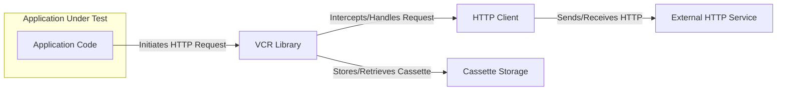
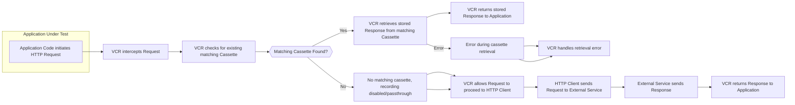

# Project Design Document: VCR Library

**Version:** 1.1
**Date:** October 26, 2023
**Author:** AI Software Architect

## 1. Introduction

This document provides a detailed design overview of the VCR library (as represented by the GitHub repository: https://github.com/vcr/vcr). This document aims to serve as a robust foundation for subsequent threat modeling activities. It outlines the key components, data flow, and interactions within the VCR library with a focus on security implications.

## 2. Goals

The primary goals of this design document are to:

*   Provide a clear and comprehensive description of the VCR library's architecture and functionality.
*   Identify and detail the key components and their interactions, emphasizing data exchange and control flow.
*   Illustrate the data flow within the library for both recording and replaying scenarios, including potential error conditions.
*   Establish a solid basis for identifying potential security threats, vulnerabilities, and attack vectors.
*   Serve as a valuable and up-to-date reference point for future development, security analysis, and onboarding of new team members.

## 3. Scope

This document focuses on the core functional aspects of the VCR library relevant to security, specifically:

*   The process of intercepting outgoing HTTP requests initiated by the application.
*   The mechanisms for recording HTTP request and response data.
*   The structure and storage of recorded interactions (cassettes).
*   The logic for matching incoming requests to existing recorded interactions.
*   The process of replaying stored HTTP responses.
*   Configuration options that directly impact recording, replaying, and data handling.
*   The interaction points between VCR, the application under test, and external services.

This document does not explicitly cover:

*   Implementation details specific to individual language ports of VCR (e.g., vcrpy for Python, vcr for Ruby) beyond their shared core concepts. Security nuances within specific language implementations may require separate analysis.
*   The intricate internal workings of the underlying HTTP client libraries that VCR integrates with. However, the interaction points are considered.
*   The low-level details of specific cassette storage implementations (e.g., file system operations, database interactions) unless they directly introduce security concerns.

## 4. System Architecture

The VCR library acts as an intermediary layer, intercepting HTTP requests made by an application before they reach the network and either recording the interaction or replaying a previously recorded one.

### 4.1. Component Diagram

### 4.2. Component Descriptions

*   **Application Code:** The software application that utilizes the VCR library to manage and potentially mock its HTTP interactions for testing or other purposes. This is the initiator of HTTP requests.
*   **VCR Library:** The central component responsible for intercepting HTTP requests, managing cassettes, and orchestrating the recording and replaying processes. It contains the core logic for matching requests and handling cassette storage. This component is the primary focus for security analysis.
*   **HTTP Client:** The underlying library (e.g., `requests` in Python, `Net::HTTP` in Ruby) used by the application to execute HTTP requests. VCR typically hooks into or wraps this client to intercept calls. Security vulnerabilities in the HTTP client could indirectly affect VCR's security posture.
*   **External HTTP Service:** The remote server, API endpoint, or other network resource that the application intends to communicate with. This is the target of the HTTP requests.
*   **Cassette Storage:** The persistent storage mechanism where recorded HTTP interactions (cassettes) are saved and retrieved. This is often the local file system but could potentially be other storage solutions. The security of this storage is critical for protecting sensitive data.

## 5. Data Flow

The data flow within VCR differs depending on whether the library is in recording or replaying mode.

### 5.1. Recording Flow

```mermaid
graph LR
    subgraph "Application Under Test"
        A1["Application Code initiates HTTP Request"]
    end
    B1["VCR intercepts Request"]
    C1["VCR checks for existing matching Cassette"]
    D1{{"Matching Cassette Found?"}}
    E1["VCR allows Request to proceed to HTTP Client"]
    F1["HTTP Client sends Request to External Service"]
    G1["External Service sends Response"]
    H1["VCR intercepts Response"]
    I1["VCR stores Request and Response in new Cassette"]
    J1["VCR returns Response to Application"]
    K1["Error during external request"] --> L1["VCR handles error, potentially stores error info"]
    M1["Error during cassette storage"] --> N1["VCR handles storage error"]

    A1 --> B1
    B1 --> C1
    C1 --> D1
    D1 -- No --> E1
    E1 --> F1
    F1 -- Success --> G1
    F1 -- Error --> K1
    G1 --> H1
    H1 --> I1
    I1 -- Success --> J1
    I1 -- Error --> M1
    K1 --> L1
    M1 --> N1
```

**Detailed Steps for Recording:**

*   The application code initiates an HTTP request using its configured HTTP client.
*   The VCR library intercepts this request before it reaches the actual network.
*   VCR checks if a matching cassette already exists for this request based on configured matching rules.
*   If no matching cassette is found:
    *   VCR allows the request to proceed to the underlying HTTP client.
    *   The HTTP client sends the request to the external HTTP service.
    *   The external service processes the request and sends a response (or an error occurs).
    *   VCR intercepts the response (or detects the error).
    *   VCR stores the request and response (including headers and body) in a new cassette within the designated storage. This may involve serialization of the HTTP objects.
    *   VCR returns the response to the application.
    *   Error handling: If an error occurs during the external request, VCR may store information about the error in the cassette. If an error occurs during cassette storage, VCR needs to handle this gracefully, potentially logging the error or notifying the user.

### 5.2. Replaying Flow

**Detailed Steps for Replaying:**

*   The application code initiates an HTTP request.
*   VCR intercepts the request.
*   VCR checks if a matching cassette exists for this request based on the configured matching rules.
*   If a matching cassette is found:
    *   VCR retrieves the stored response from the cassette. This involves deserialization of the stored HTTP objects.
    *   VCR returns the stored response to the application, bypassing the actual network call.
    *   Error handling: If an error occurs during cassette retrieval (e.g., file not found, corrupted data), VCR needs to handle this, potentially falling back to a live request or raising an error.
*   If no matching cassette is found:
    *   If recording is enabled or VCR is in a "passthrough" mode, VCR may allow the request to proceed to the HTTP client. The interaction might be recorded if recording is enabled.
    *   If recording is disabled and no match is found, VCR's behavior is configuration-dependent (e.g., raise an error, allow the request).

## 6. Key Components and their Functionality

*   **Recorder:** The central engine responsible for intercepting HTTP requests and responses. It determines whether to record a new interaction or replay an existing one based on the current configuration and the presence of matching cassettes.
    *   Manages the overall recording process, including interaction with the Cassette Manager.
    *   Implements the core logic for matching incoming requests to existing recorded interactions based on configurable matching rules. This matching logic is crucial for correct replay and needs to be robust against manipulation.
    *   Handles the serialization of HTTP request and response objects into a storable format for cassettes. Vulnerabilities in the serialization/deserialization process could lead to security issues.
*   **Cassette Manager:** Responsible for managing the lifecycle of cassettes, including loading, saving, searching, and potentially deleting them.
    *   Provides an abstraction layer for interacting with the underlying Cassette Storage, isolating the core VCR logic from specific storage implementations.
    *   May implement logic for organizing and naming cassettes, which can have implications for discoverability and access control.
    *   The security of the Cassette Manager directly impacts the integrity and confidentiality of the stored interactions.
*   **Cassette Storage:** The mechanism used to persistently store recorded HTTP interactions. The security characteristics of this storage are paramount.
    *   **File System (Common):** Cassettes are typically stored as files (e.g., YAML, JSON). Security considerations include file permissions, access control, and the potential for information leakage if files are not properly protected.
    *   **Other Storage (Less Common):**  Potentially databases or cloud storage. These have their own security models that need to be considered.
    *   The format used for storing cassettes (e.g., YAML, JSON) can introduce vulnerabilities if not handled securely during serialization and deserialization.
*   **Configuration:** VCR provides various configuration options that significantly influence its behavior and security posture.
    *   **Recording Mode:** Controls when and how new HTTP interactions are recorded (`once`, `new_episodes`, `none`, `all`). Incorrect configuration could lead to unintended recording of sensitive data.
    *   **Replay Mode:** Determines how VCR behaves when matching cassettes are found or not found. This affects how the application interacts with external services.
    *   **Matching Rules:** Defines the criteria used to determine if an incoming request matches a recorded interaction (e.g., URL, method, headers, body). Weak or overly broad matching rules could lead to incorrect replay scenarios or the unintended use of cached responses.
    *   **Ignore Parameters/Headers/Body Parts:** Allows specifying parts of the request to ignore during matching. While useful, incorrect usage could bypass necessary distinctions.
    *   **Filter Sensitive Data:** Mechanisms to redact or remove sensitive information from recorded interactions before storage. The effectiveness and security of these filters are critical. Insufficient filtering can lead to the storage of sensitive data.
    *   **Cassette Location/Permissions:** Configuration of where cassettes are stored and the access permissions associated with that location directly impacts the security of the recorded data.

## 7. Security Considerations (Detailed Threat Analysis)

Based on the architecture and data flow, the following security considerations are crucial for threat modeling:

*   **Exposure of Sensitive Data in Cassettes:** Cassettes inherently store copies of HTTP requests and responses, which may contain sensitive information.
    *   **Threat:** Unauthorized access to cassette files could expose API keys, authentication tokens (e.g., OAuth tokens, session cookies), personal data, financial information, and other confidential details.
    *   **Threat:** Accidental or intentional inclusion of cassettes containing sensitive data in version control systems or public repositories.
    *   **Threat:**  Insufficient or improperly configured data filtering mechanisms failing to redact sensitive information before storage.
*   **Integrity of Cassettes:** Tampering with cassette files can lead to unpredictable application behavior and potential security vulnerabilities.
    *   **Threat:** Malicious modification of cassette content to inject false responses, potentially bypassing security checks or causing incorrect application logic.
    *   **Threat:** Data corruption due to storage errors or accidental modifications, leading to unexpected replay scenarios and potentially revealing inconsistencies.
*   **Access Control to Cassettes:**  Restricting access to cassette storage is essential to prevent unauthorized viewing or modification.
    *   **Threat:** Lack of proper file system permissions allowing unauthorized users or processes to read, write, or delete cassette files.
    *   **Threat:**  If using alternative storage mechanisms, inadequate access controls within those systems.
*   **Replay Attacks (Misuse Scenario):** While VCR is primarily for testing, its functionality could be misused.
    *   **Threat:**  In a non-testing environment, replaying recorded interactions could potentially bypass security measures on external systems if those systems rely solely on request characteristics that are captured in the cassettes.
*   **Configuration Vulnerabilities:** Incorrect or insecure configuration can weaken VCR's security.
    *   **Threat:**  Leaving recording mode enabled in production environments, potentially leading to the unintended storage of sensitive production data.
    *   **Threat:**  Using overly broad matching rules that cause incorrect responses to be replayed for legitimate requests.
    *   **Threat:**  Disabling or misconfiguring data filtering, leading to the storage of sensitive information.
*   **Dependency Vulnerabilities:** VCR relies on underlying libraries.
    *   **Threat:** Vulnerabilities in the HTTP client library used by the application could be exploited if VCR doesn't handle interactions with the client securely.
    *   **Threat:** Vulnerabilities in serialization/deserialization libraries (e.g., YAML or JSON parsers) used for storing cassettes could be exploited to achieve remote code execution or other attacks if malicious cassette content is processed.
*   **Injection Attacks:**
    *   **Threat:** If cassette content is not properly sanitized during replay, it could potentially introduce injection vulnerabilities in the application if the application processes the replayed data without proper validation.

## 8. Deployment Considerations

The security implications of VCR vary depending on the environment in which it is deployed.

*   **Development Environment:**  Typically lower security concerns, but best practices should still be followed to avoid accidental exposure of sensitive data.
*   **Testing Environment (CI/CD):**  More critical as cassettes might contain realistic data. Secure storage and handling of cassettes in CI/CD pipelines are important. Secrets management should be used to avoid storing sensitive credentials directly in cassettes.
*   **Production Environment (Generally Discouraged):** Using VCR in production is generally not recommended due to the potential for replaying stale data or introducing security risks. If used, extreme caution and robust security measures are necessary. This scenario requires careful consideration of access control, data encryption, and the potential for replay attacks.

## 9. Future Considerations (Potential Security Enhancements)

*   **Encrypted Cassette Storage:** Implementing encryption for cassette files at rest to protect sensitive data from unauthorized access.
*   **Role-Based Access Control for Cassettes:**  Implementing mechanisms to control access to specific cassettes based on user roles or permissions, especially in shared environments.
*   **Digital Signatures for Cassettes:**  Using digital signatures to ensure the integrity and authenticity of cassette files, preventing tampering.
*   **Enhanced Filtering and Redaction Capabilities:**  Providing more sophisticated and configurable options for filtering and redacting sensitive data, including support for custom redaction logic.
*   **Secure Secrets Management Integration:**  Direct integration with secure secrets management solutions to automatically retrieve and inject sensitive credentials during recording, avoiding their direct storage in cassettes.
*   **Content Security Policy (CSP) for Replayed Responses:**  Potentially incorporating CSP headers in replayed responses to mitigate certain types of injection attacks if the application relies on VCR in less controlled environments.

This enhanced design document provides a more detailed and security-focused overview of the VCR library. It serves as a stronger foundation for identifying and mitigating potential security threats.