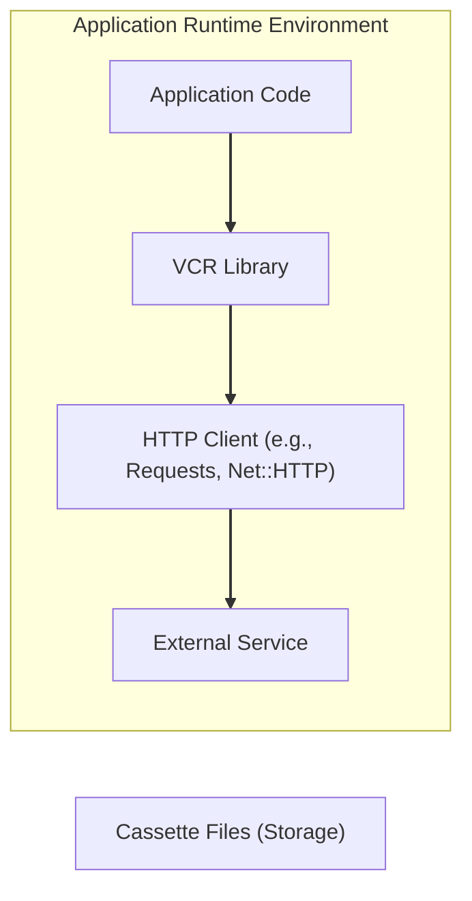
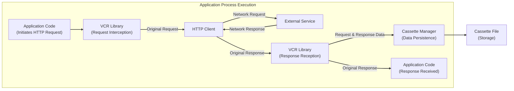
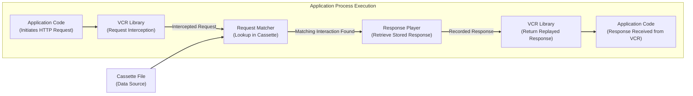

# Project Design Document: VCR (HTTP Interaction Recording and Replay)

**Version:** 1.1
**Date:** October 26, 2023
**Author:** Gemini (AI Expert)

## 1. Introduction

This document provides an enhanced design overview of the VCR library, a tool for recording HTTP interactions for subsequent replay. This detailed design is specifically crafted to facilitate comprehensive threat modeling by clearly outlining VCR's architecture, components, and data flow.

## 2. Goals and Objectives

* **Primary Goal:** To deliver a refined and more detailed architectural overview of the VCR library, optimized for threat modeling.
* **Objectives:**
    * Provide a more granular description of VCR's core components and their functionalities.
    * Offer clearer illustrations of the data flow during both recording and replay scenarios.
    * Explicitly identify key interfaces and the nature of interactions within the system.
    * Furnish sufficient and specific details to enable effective and targeted threat modeling.

## 3. System Architecture

VCR functions as an intermediary within an application's HTTP request lifecycle, acting as an interceptor. It captures outgoing HTTP requests, along with their corresponding responses, and persists them in files known as "cassettes." When configured for replay, VCR intercepts outgoing requests and responds with the pre-recorded responses from the cassettes, effectively bypassing the intended network communication.

### 3.1. Key Components

* **Application Code:** The user-written code that initiates HTTP requests, intending to interact with external services.
* **VCR Library:** The central component responsible for the core functionalities of intercepting, recording, and replaying HTTP interactions.
* **HTTP Client:** The underlying library employed by the application to execute HTTP requests (e.g., `requests` in Python, `Net::HTTP` in Ruby). VCR integrates with these clients through adapters or hook mechanisms.
* **External Service:** The remote server, API endpoint, or service that the application aims to communicate with over the network.
* **Cassette Files:** Persistent storage, typically in YAML or JSON format, where recorded HTTP request-response pairs are saved.

## 4. Detailed Component Description

### 4.1. VCR Library Core

* **Interceptor/Hook Mechanism:** This mechanism, often language and HTTP client specific, allows VCR to intercept outgoing HTTP requests before they are transmitted over the network. Techniques include monkey-patching, middleware implementation, or leveraging client library-specific interceptors.
* **Configuration Manager:** This module manages VCR's operational settings, including:
    * **Recording Mode:** Determines VCR's behavior: `once` (record new, replay existing), `new_episodes` (record only new), `none` (disable interception), `all` (record all).
    * **Cassette Location Strategy:** Defines the directory and naming conventions for cassette files.
    * **Request Matching Rules:** Specifies the criteria for matching an outgoing request with recorded requests in a cassette (e.g., URL, HTTP method, headers, request body).
    * **Sensitive Data Filtering:** Rules to identify and redact sensitive information (e.g., authorization tokens, API keys) before storing them in cassettes.
    * **Ignore Options:** Allows specifying certain headers or query parameters to ignore during request matching.
* **Cassette Manager:** This component handles the lifecycle of cassette files:
    * **Cassette Loading:** Reads and parses cassette files from the designated storage location.
    * **Cassette Saving:** Writes recorded HTTP interactions to cassette files, adhering to the configured format.
    * **New Cassette Creation:** Generates new cassette files when a requested interaction is not found in replay mode and recording is enabled.
    * **Cassette Ejection:**  Manages the process of removing or invalidating cassettes based on certain criteria.
* **Request Matcher:** This module compares an outgoing HTTP request against the requests stored within the currently active cassette, using the configured matching rules.
* **Interaction Recorder:** When VCR is in a recording mode, this component captures the complete outgoing HTTP request and the subsequent response received from the external service. This captured interaction is then passed to the Cassette Manager for storage.
* **Response Player:** In replay mode, upon finding a matching request in the cassette, this component retrieves the corresponding recorded response. This stored response is then returned to the application, preventing the actual network request from being executed.

### 4.2. Cassette Files

* **Format:**  Typically utilizes human-readable formats like YAML or JSON for storing interaction data.
* **Structure:** Consists of an array of individual "interactions," where each interaction represents a single HTTP request-response cycle.
* **Interaction Data Details:** Each interaction entry typically includes:
    * **Request Details:**
        * `"method"`: The HTTP method used (e.g., "GET", "POST").
        * `"uri"`: The complete Uniform Resource Identifier of the request.
        * `"headers"`: An object or dictionary containing the HTTP request headers.
        * `"body"`: The request body content (if present).
    * **Response Details:**
        * `"status"`: The HTTP status code returned by the server (e.g., 200, 404).
        * `"headers"`: An object or dictionary containing the HTTP response headers.
        * `"body"`: The response body content.
        * `"http_version"`: The HTTP protocol version used for the response.

## 5. Data Flow

### 5.1. Recording Mode Data Flow

**Detailed Steps:**

1. The application code executes, generating an HTTP request intended for an external service.
2. The VCR library intercepts this outgoing request through its configured hook or adapter.
3. VCR allows the original request to proceed through the HTTP client towards the external service.
4. The external service processes the request and generates a corresponding HTTP response.
5. The HTTP client receives the response from the external service.
6. VCR intercepts the incoming response.
7. The Interaction Recorder within VCR captures both the complete request and the full response.
8. The Cassette Manager receives the captured interaction data and persists it to the designated cassette file.
9. VCR then passes the original response back to the requesting application code.

### 5.2. Replay Mode Data Flow

**Detailed Steps:**

1. The application code initiates an HTTP request.
2. VCR intercepts the outgoing request.
3. The Request Matcher within VCR attempts to find a matching request within the currently loaded cassette file, based on the configured matching rules.
4. If a matching interaction is found in the cassette:
    * The Response Player retrieves the pre-recorded response associated with the matched request.
    * VCR returns this recorded response to the application code, **preventing the actual network request from being executed**.
5. If no matching interaction is found in the cassette (behavior depends on the configured recording mode):
    * VCR might allow the request to proceed to the external service (and potentially record the interaction if in a recording-enabled replay mode).
    * Alternatively, VCR might raise an error or exception, indicating that no matching interaction was found.

## 6. Key Interfaces and Interactions

* **Application Code <-> VCR Library Interface:** The primary interaction point involves the seamless interception of outgoing HTTP requests and the subsequent return of HTTP responses. These responses can originate from either a live network call (during recording) or from a pre-recorded cassette (during replay).
* **VCR Library <-> HTTP Client Interface:** VCR interacts with the underlying HTTP client library through its interception or hook mechanism. The specifics of this interaction are often dependent on the particular programming language and the HTTP client library being used.
* **VCR Library <-> Cassette Files Interface:** VCR interacts with the file system to read data from cassette files (during replay) and write data to cassette files (during recording). This involves standard file I/O operations.
* **VCR Library <-> External Service Interaction (Recording Mode):** When operating in a recording mode, VCR effectively acts as a proxy, forwarding requests to the external service and receiving responses. This interaction mirrors a standard HTTP client-server communication.

## 7. Security Considerations (Detailed for Threat Modeling)

This section outlines potential security vulnerabilities and threats associated with the VCR library, providing a basis for comprehensive threat modeling.

* **Exposure of Sensitive Data in Cassettes:**
    * **Threat:** Cassette files might inadvertently store sensitive information such as API keys, authentication tokens, passwords, personally identifiable information (PII), or other confidential data if not properly filtered.
    * **Impact:** Unauthorized access to cassette files could lead to the compromise of sensitive credentials and data breaches.
    * **Mitigation Considerations:** Implement robust filtering mechanisms, consider encrypting cassette files at rest, and enforce strict access controls on cassette storage locations.
* **Manipulation of Cassette Files (Tampering):**
    * **Threat:** Attackers gaining write access to cassette files could modify recorded interactions, leading to the application receiving manipulated responses.
    * **Impact:** This could result in incorrect application behavior, bypassing security checks, or even injecting malicious content.
    * **Mitigation Considerations:** Implement file integrity checks, secure the storage location of cassettes, and potentially sign cassette files to detect tampering.
* **Information Disclosure through Error Messages:**
    * **Threat:** VCR's error messages, especially when failing to find a matching request, might inadvertently reveal information about the application's internal API calls, parameter structures, or sensitive endpoints.
    * **Impact:** This information could be valuable to attackers for reconnaissance and planning further attacks.
    * **Mitigation Considerations:** Implement generic error messages, avoid exposing sensitive details in error outputs, and log detailed errors securely.
* **Replay Attacks and Environment Mismatches:**
    * **Threat:** Replaying recorded interactions in unintended environments (e.g., production) or without proper context could lead to unexpected behavior or security vulnerabilities. For instance, replaying a "create user" request in production.
    * **Impact:** Data corruption, unintended state changes, or bypassing security controls.
    * **Mitigation Considerations:** Clearly define the intended environments for VCR usage, implement environment checks, and avoid using production data for recording.
* **Serialization/Deserialization Vulnerabilities:**
    * **Threat:** If custom serialization formats are used for cassettes, vulnerabilities in the serialization or deserialization process could be exploited by attackers who can modify cassette files.
    * **Impact:** Potential for remote code execution or denial-of-service attacks.
    * **Mitigation Considerations:** Use well-vetted and secure serialization libraries, avoid custom implementations, and implement input validation.
* **Insecure Default Configurations:**
    * **Threat:** Default VCR configurations that do not enforce strong filtering rules or secure storage practices could increase the likelihood of security vulnerabilities.
    * **Impact:** Unintentional exposure of sensitive data or susceptibility to tampering.
    * **Mitigation Considerations:** Provide secure default configurations, guide users towards secure practices, and offer clear documentation on security best practices.

## 8. Deployment Considerations

VCR is primarily intended for use in development, testing, and staging environments to create reliable and repeatable test suites by simulating interactions with external dependencies. It is generally **not recommended** for use in production environments for normal application operation due to the risk of using stale or incorrect data and the complexities associated with managing and maintaining cassette files in a live environment.

## 9. Future Considerations

* **Advanced Request Matching Techniques:** Implementing more sophisticated algorithms for matching requests, going beyond basic header and body comparisons (e.g., semantic matching).
* **Encrypted Cassette Storage:** Providing built-in options for encrypting cassette files to enhance the protection of sensitive data at rest.
* **Seamless CI/CD Integration:** Enhancing integration with Continuous Integration and Continuous Deployment pipelines for automated testing and verification.
* **Expanded HTTP Client Support:** Extending compatibility to support a broader range of HTTP client libraries and frameworks across different programming languages.
* **Centralized Cassette Management:** Exploring options for centralized storage and management of cassette files for larger projects or teams.

This revised document offers a more detailed and refined understanding of the VCR library's architecture and data flow, specifically tailored to facilitate thorough and effective threat modeling activities.
