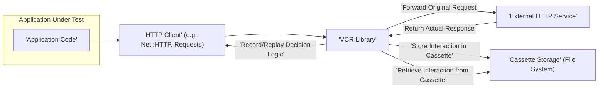

# Project Design Document: VCR (HTTP Interaction Recording and Replay)

**Version:** 1.1
**Date:** October 26, 2023
**Author:** AI Software Architect

## 1. Introduction

This document provides an enhanced design overview of the VCR library, a crucial tool for recording and replaying HTTP interactions primarily used in software testing. This document serves as a foundational resource for subsequent threat modeling activities, offering a detailed breakdown of VCR's architecture, functionality, and operational flow.

### 1.1. Project Overview

VCR streamlines testing by capturing HTTP requests initiated by an application and their corresponding responses. These captured interactions are persisted within "cassettes," which are then utilized to simulate the responses during subsequent test executions. This eliminates the dependency on live external HTTP calls, resulting in faster, more reliable, and isolated tests.

### 1.2. Purpose of this Document

The primary objective of this design document is to provide a comprehensive and unambiguous understanding of VCR's internal workings and architecture. This detailed understanding is essential for security engineers, developers, and QA personnel to effectively identify potential security vulnerabilities and threats during the threat modeling process.

### 1.3. Target Audience

This document is specifically intended for:

*   Security engineers and architects responsible for conducting threat modeling and security assessments.
*   Software developers who integrate with or contribute to the VCR library.
*   Quality assurance engineers who leverage VCR for creating and executing tests.

## 2. Architectural Overview

VCR functions as an intermediary layer, strategically positioned to intercept HTTP requests and responses. Its core operations involve recording these interactions into cassettes and replaying them based on defined matching rules.

### 2.1. High-Level Architecture Diagram

### 2.2. Component Descriptions

*   **Application Code:** The software application under test that initiates external HTTP requests using an HTTP client library.
*   **VCR Library:** The central component responsible for intercepting HTTP requests, determining whether to record or replay, managing cassettes, and interacting with the storage mechanism.
*   **HTTP Client:** The specific library employed by the application to execute HTTP requests. VCR integrates with these clients through various mechanisms like hooks or monkey patching. Examples include `Net::HTTP` in Ruby or `requests` in Python.
*   **External HTTP Service:** The external API or service that the application communicates with over HTTP.
*   **Cassette Storage:** The persistent storage mechanism where recorded HTTP interactions are saved. This is typically the local file system, with cassettes stored as files in formats like YAML or JSON.

## 3. Detailed Design

### 3.1. Core Functionality

*   **Request Interception:** VCR intercepts outgoing HTTP requests made by the application. This is typically achieved by hooking into or monkey-patching the underlying HTTP client library's request execution methods.
*   **Cassette Management:** VCR handles the lifecycle of "cassettes," which are the files used to persist recorded HTTP interactions.
    *   **Cassette Selection/Creation:** VCR determines which cassette to use based on configuration and context. If a cassette doesn't exist and recording is enabled, it may create a new one.
    *   **Cassette Loading:** VCR loads the appropriate cassette from storage when an interaction needs to be replayed or when recording is initiated.
    *   **Cassette Writing:** When a new, unrecorded interaction occurs and recording is enabled, VCR writes the details of the request and the received response to the active cassette.
*   **Request Matching:** Upon intercepting an HTTP request, VCR attempts to locate a matching recorded interaction within the currently loaded cassette. The matching process is based on configurable criteria.
    *   **Matching Criteria:** Common matching criteria include the HTTP method, URL, request headers, and request body. The specific matching rules can be customized.
*   **Response Replay:** If a matching interaction is found in the cassette:
    *   VCR retrieves the stored response from the cassette.
    *   VCR constructs a response object mimicking the original response.
    *   VCR returns this simulated response to the application, preventing the actual HTTP request from being sent to the external service.
*   **Request Forwarding (and Recording):** If no matching interaction is found in the cassette and recording is enabled:
    *   VCR allows the original HTTP request to proceed to the **External HTTP Service**.
    *   Once the **External HTTP Service** responds, VCR intercepts the response.
    *   VCR records both the original request and the received response into the currently active cassette.

### 3.2. Data Flow

1. The **Application Code** initiates an HTTP request using the configured **HTTP Client**.
2. The **VCR Library** intercepts the outgoing request via its integration with the **HTTP Client**.
3. VCR consults its configuration and the currently loaded **Cassette Storage** to determine if a matching interaction exists.
    *   **Scenario A (Match Found in Cassette):**
        *   VCR retrieves the pre-recorded response from the relevant cassette in the **Cassette Storage**.
        *   VCR constructs a response object based on the recorded data.
        *   VCR returns this simulated response to the **HTTP Client**.
        *   The **HTTP Client** passes the response back to the **Application Code**, as if it came from the external service.
    *   **Scenario B (No Match Found, Recording Enabled):**
        *   VCR allows the original request to be forwarded by the **HTTP Client** to the **External HTTP Service**.
        *   The **External HTTP Service** processes the request and returns the actual response.
        *   VCR intercepts the response from the **External HTTP Service**.
        *   VCR stores the details of the original request and the received response as a new interaction within the active cassette in the **Cassette Storage**.
        *   VCR then returns the actual response to the **HTTP Client**.
        *   The **HTTP Client** passes the response back to the **Application Code**.
    *   **Scenario C (No Match Found, Recording Disabled):**
        *   The behavior depends on the VCR configuration. It might:
            *   Allow the request to proceed to the **External HTTP Service** without recording.
            *   Raise an error indicating that no matching interaction was found and recording is disabled.

### 3.3. Key Interactions

*   **Application Code <-> HTTP Client:** This represents the standard process of the application making an HTTP request and receiving a response.
*   **HTTP Client <-> VCR Library:** This is the crucial interaction where VCR intercepts outgoing requests and injects pre-recorded responses, effectively simulating external service behavior.
*   **VCR Library <-> Cassette Storage:** This interaction involves VCR reading from and writing to cassette files, managing the persistence of recorded interactions.
*   **VCR Library <-> External HTTP Service:** This interaction occurs only when recording is enabled and no matching interaction is found. VCR facilitates the actual HTTP communication with the external service.

### 3.4. Configuration

VCR's behavior is highly customizable through various configuration options. Key aspects of configuration include:

*   **Cassette Path/Location:** Specifies the directory or location where cassette files are stored. This is critical for managing and securing cassette data.
*   **Record Mode:** Determines the conditions under which new HTTP interactions are recorded. Common modes include:
    *   `once`: Records only when a cassette is empty.
    *   `new_episodes`: Records new interactions that are not already present in the cassette.
    *   `none`: Disables recording entirely.
    *   `all`: Records all interactions.
*   **Matching Rules/Matchers:** Defines the criteria used to determine if an incoming request matches a recorded interaction. This can be based on:
    *   `method`: The HTTP method (GET, POST, PUT, DELETE, etc.).
    *   `uri` or `url`: The request URI or full URL.
    *   `body`: The request body content.
    *   `headers`: Specific request headers and their values.
*   **Data Filtering/Sanitization:** Allows for the removal or modification of sensitive data from recorded interactions before they are stored in cassettes. This is crucial for preventing accidental exposure of secrets. Examples include filtering specific headers or body parameters.
*   **Ignored Hosts/Requests:** Specifies a list of hosts or request patterns that VCR should ignore and allow to proceed without interception or recording. This is useful for excluding internal services or specific APIs.
*   **Serialization Format:** Defines the format used to store cassette data. Common formats include YAML and JSON. The choice of format can impact readability and performance.

## 4. Security Considerations (For Threat Modeling)

This section outlines potential security considerations and potential threats associated with the use of VCR. These points will serve as a starting point for a more in-depth threat modeling exercise.

*   **Exposure of Sensitive Data in Cassettes:** Cassette files may inadvertently contain sensitive information such as API keys, authentication tokens, passwords, or personally identifiable information (PII) within request headers, bodies, or response bodies.
    *   **Potential Threat:** Unauthorized access to cassette files could lead to the compromise of sensitive credentials or data.
    *   **Mitigation Strategies:**
        *   Utilize VCR's filtering capabilities extensively to sanitize sensitive data before recording.
        *   Implement strict access controls on cassette files and directories.
        *   Avoid committing sensitive cassettes to version control systems.
        *   Consider encrypting cassette files at rest.
*   **Vulnerability to Replay Attacks via Cassette Manipulation:** If cassette files are compromised or maliciously modified, attackers could inject fabricated responses.
    *   **Potential Threat:** Replaying manipulated responses could lead to incorrect application behavior, bypass security checks, or facilitate data manipulation.
    *   **Mitigation Strategies:**
        *   Implement integrity checks for cassette files to detect tampering.
        *   Store cassettes in secure locations with restricted write access.
        *   Consider signing or checksumming cassettes to verify their authenticity.
*   **Information Disclosure through Error Messages in Recorded Responses:** Error messages or debugging information captured in recorded responses might reveal sensitive details about the application's internal workings or backend systems.
    *   **Potential Threat:** Attackers could leverage this information to gain insights into potential vulnerabilities or attack vectors.
    *   **Mitigation Strategies:**
        *   Carefully review recorded interactions and filter out potentially sensitive debugging information or error details.
        *   Configure VCR to be more selective about what response data is recorded.
*   **Security Vulnerabilities in VCR Dependencies:** VCR relies on underlying HTTP client libraries and other dependencies. Vulnerabilities in these dependencies could introduce security risks.
    *   **Potential Threat:** Exploitation of vulnerabilities in VCR's dependencies could compromise the application or the system running the tests.
    *   **Mitigation Strategies:**
        *   Regularly update VCR and all its dependencies to the latest secure versions.
        *   Perform security audits of VCR's dependency tree.
*   **Insecure Storage of Cassettes:** If cassette files are stored in publicly accessible locations or without proper access controls, they become vulnerable to unauthorized access.
    *   **Potential Threat:** Exposure of cassette data, including potentially sensitive information.
    *   **Mitigation Strategies:**
        *   Store cassettes in secure locations with appropriate file system permissions.
        *   Avoid storing cassettes in publicly accessible cloud storage without proper access controls.
*   **Man-in-the-Middle Attacks During Recording (over HTTP):** If recording occurs over insecure HTTP connections, the recorded interactions could be intercepted and tampered with by an attacker performing a man-in-the-middle attack.
    *   **Potential Threat:** Compromised recordings could lead to tests that replay malicious responses, masking real issues or introducing vulnerabilities.
    *   **Mitigation Strategies:**
        *   Prioritize recording over secure HTTPS connections.
        *   Implement network security measures to prevent man-in-the-middle attacks in the testing environment.

## 5. Conclusion

This enhanced design document provides a more detailed and comprehensive understanding of the VCR library's architecture, functionality, and potential security considerations. This information is crucial for conducting a thorough threat modeling exercise to identify and mitigate potential security risks associated with the use of VCR in software development and testing workflows. The identified threats and mitigation strategies will inform security best practices and secure configuration of the VCR library.