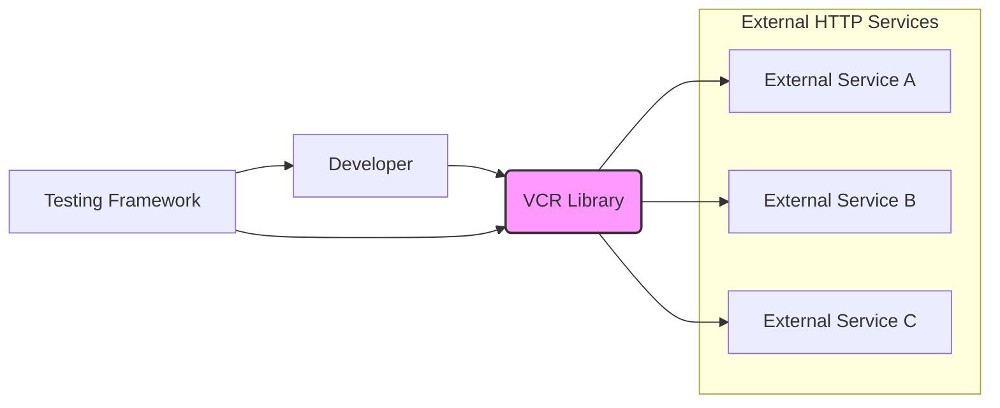
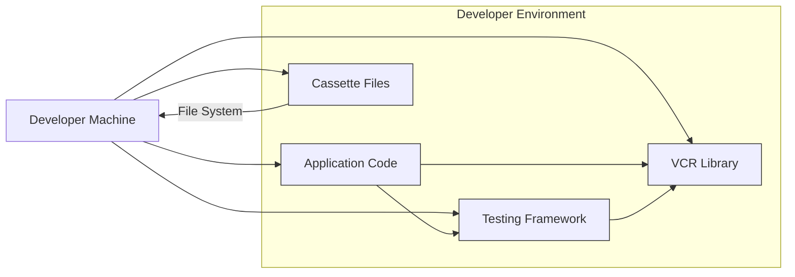
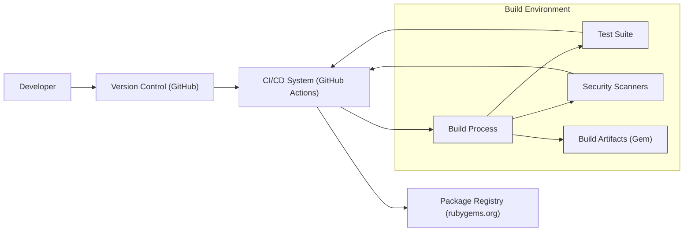

# BUSINESS POSTURE

- Business Priorities and Goals:
 - Goal: Improve software quality and reliability by enabling robust and efficient testing of applications that interact with external HTTP services.
 - Priority: Ensure tests are fast, reliable, and repeatable, even when external services are slow, unreliable, or unavailable.
 - Goal: Reduce dependency on external services during testing, allowing for offline testing and faster feedback loops for developers.
 - Priority: Minimize the risk of test failures due to external service outages or changes.
 - Goal: Facilitate testing of edge cases and error scenarios that might be difficult to reproduce with live external services.
 - Priority: Enhance test coverage and confidence in application behavior under various conditions.

- Business Risks:
 - Risk: Incorrectly recorded or replayed HTTP interactions could lead to false positive or false negative test results, undermining the reliability of the testing process.
 - Risk: Misconfiguration or misuse of VCR could lead to tests that are not representative of real-world application behavior.
 - Risk: Security vulnerabilities in VCR itself could be exploited if it's used in production or if recorded cassettes contain sensitive data.
 - Risk: Cassette files, if not properly managed, could become outdated or inconsistent with the actual behavior of external services over time, leading to test drift.
 - Risk: Accidental inclusion of sensitive data in cassette files could lead to data leaks if these files are not properly secured.

# SECURITY POSTURE

- Existing Security Controls:
 - security control: Dependency management - VCR uses `bundler` for managing dependencies, which helps in tracking and potentially auditing dependencies for known vulnerabilities. (Implemented in `Gemfile` and `Gemfile.lock`)
 - security control: Code review -  The project is hosted on GitHub, suggesting that pull requests and code reviews are likely part of the development process, although not explicitly stated. (Implemented in GitHub workflow)
 - security control: Open source - Being open source allows for community scrutiny and contributions, potentially leading to faster identification and resolution of security issues. (Implemented in GitHub repository)
 - security control: Version control - Git is used for version control, providing a history of changes and enabling rollback if necessary. (Implemented in Git repository)

- Accepted Risks:
 - accepted risk:  VCR is primarily a development/testing tool and is not intended for production use, so risks associated with direct production exposure are low.
 - accepted risk:  Security vulnerabilities in VCR itself are considered low risk as it's not directly exposed to external network traffic in production environments.
 - accepted risk:  The primary security concern is the potential for accidental exposure of sensitive data within recorded cassettes, which is considered a user responsibility to manage.

- Recommended Security Controls:
 - security control: Cassette sanitization - Implement or promote features and best practices for automatically sanitizing sensitive data (e.g., API keys, passwords, PII) from recorded cassettes before they are stored or shared.
 - security control: Documentation on security best practices - Provide clear documentation and guidance on secure usage of VCR, especially regarding the handling of sensitive data in cassettes and secure storage of cassette files.
 - security control: Security scanning - Integrate automated security scanning tools (e.g., dependency vulnerability scanners, SAST) into the development and release pipeline to proactively identify potential security issues in VCR and its dependencies.
 - security control: Regular security audits - Conduct periodic security audits or code reviews focused on security to identify and address potential vulnerabilities.

- Security Requirements:
 - Authentication: Not directly applicable to VCR itself, as it's a testing library. However, applications using VCR will need to handle authentication to external services, and VCR should not interfere with or compromise this. Cassettes might record authenticated sessions, so care must be taken to sanitize sensitive authentication data.
 - Authorization: Not directly applicable to VCR itself. Applications using VCR will handle authorization. Cassettes should not bypass or weaken application authorization logic.
 - Input Validation: Not directly applicable to VCR itself. VCR records and replays HTTP interactions, so input validation is the responsibility of the application being tested and the external services it interacts with. VCR should faithfully record and replay interactions, including invalid inputs, to ensure comprehensive testing.
 - Cryptography: Not directly applicable to VCR itself in terms of implementing cryptographic algorithms. However, VCR needs to handle HTTPS traffic correctly and ensure that recorded cassettes accurately represent encrypted communication. Cassette sanitization might involve cryptographic techniques to mask or remove sensitive data.

# DESIGN

## C4 CONTEXT



- Context Diagram Elements:
 - Element:
  - Name: Developer
  - Type: Person
  - Description: Software developer using VCR to write and run tests for their application.
  - Responsibilities: Writes tests that use VCR to record and replay HTTP interactions. Configures VCR for their testing needs. Manages cassette files.
  - Security controls: Responsible for sanitizing sensitive data in cassettes. Follows secure coding practices when using VCR.
 - Element:
  - Name: Testing Framework
  - Type: Software System
  - Description: Testing framework (e.g., RSpec, Minitest) used to execute tests that incorporate VCR.
  - Responsibilities: Runs tests, integrates with VCR to manage recording and replaying of HTTP interactions during test execution.
  - Security controls:  Security controls of the testing framework itself are relevant, but not directly related to VCR's security.
 - Element:
  - Name: VCR Library
  - Type: Software System
  - Description: Ruby library that intercepts HTTP requests made by the application under test and records/replays them from cassette files.
  - Responsibilities: Intercepts HTTP requests. Records HTTP requests and responses to cassette files. Replays HTTP responses from cassette files. Provides configuration options for recording and replaying behavior.
  - Security controls: Code review, dependency management, security scanning, cassette sanitization features (recommended).
 - Element:
  - Name: External Service A, B, C
  - Type: Software System
  - Description: External HTTP services that the application under test interacts with. These could be APIs, web services, or other external systems.
  - Responsibilities: Provide HTTP responses to requests from the application under test.  Their security is independent of VCR, but interactions with them are recorded by VCR.
  - Security controls: Security controls of external services are independent of VCR.

## C4 CONTAINER

```mermaid
graph LR
    subgraph "VCR Library"
        A("Request Interceptor")
        B("Cassette Manager")
        C("Configuration Manager")
        D("HTTP Client Wrapper")
        E("Cassette Storage")
    end
    F["Testing Framework"]

    F --> A
    A --> D
    A --> B
    B --> E
    C --> B
    C --> A
    D --> "External HTTP Services"

    style A fill:#ccf,stroke:#333,stroke-width:1px
    style B fill:#ccf,stroke:#333,stroke-width:1px
    style C fill:#ccf,stroke:#333,stroke-width:1px
    style D fill:#ccf,stroke:#333,stroke-width:1px
    style E fill:#ccf,stroke:#333,stroke-width:1px
```

- Container Diagram Elements:
 - Element:
  - Name: Request Interceptor
  - Type: Container (Code Module)
  - Description: Component responsible for intercepting HTTP requests made by the application under test. It determines whether to record a new request or replay an existing one from a cassette.
  - Responsibilities: Intercept HTTP requests. Check if a cassette exists for the request. Delegate to Cassette Manager for recording or replaying.
  - Security controls:  Relies on the security of the underlying HTTP client library. No direct security controls within this component itself, but it's crucial for correctly handling requests and responses.
 - Element:
  - Name: Cassette Manager
  - Type: Container (Code Module)
  - Description: Component responsible for managing cassette files. This includes loading, saving, and searching for cassettes. It also handles cassette configuration and sanitization.
  - Responsibilities: Load cassette files from storage. Save cassette files to storage. Search for matching interactions within cassettes. Apply cassette sanitization rules.
  - Security controls: Cassette sanitization logic. Secure file handling practices. Access control to cassette storage (at the file system level, managed by the developer/environment).
 - Element:
  - Name: Configuration Manager
  - Type: Container (Code Module)
  - Description: Component responsible for managing VCR's configuration, including recording mode, cassette library directory, and request matching rules.
  - Responsibilities: Load configuration from user settings. Provide configuration options to other components.
  - Security controls: Configuration settings can influence security behavior (e.g., recording mode, sanitization). Secure configuration defaults and clear documentation are important.
 - Element:
  - Name: HTTP Client Wrapper
  - Type: Container (Code Module)
  - Description:  Wrapper around the underlying HTTP client library (e.g., Net::HTTP, HTTParty). Used to make actual HTTP requests when recording new interactions.
  - Responsibilities: Make HTTP requests to external services when recording. Delegate to the underlying HTTP client.
  - Security controls: Relies on the security of the underlying HTTP client library. VCR should use a secure and up-to-date HTTP client library.
 - Element:
  - Name: Cassette Storage
  - Type: Container (File System)
  - Description: File system directory where cassette files are stored. Cassettes are typically stored as YAML or JSON files.
  - Responsibilities: Persistently store cassette files. Provide access to cassette files for reading and writing.
  - Security controls: File system permissions to control access to cassette files. Encryption of cassette files at rest (optional, user responsibility). Secure storage location for cassette files (user responsibility).

## DEPLOYMENT

- Deployment Options:
 - Option 1: Local Development Environment - Developers run tests with VCR on their local machines. Cassettes are stored locally within the project directory.
 - Option 2: Continuous Integration (CI) Environment - Tests are executed in a CI pipeline. Cassettes might be stored within the CI environment's workspace or version controlled with the project.
 - Option 3: Shared Test Environment - A dedicated test environment where tests are run, potentially shared among developers or teams. Cassettes might be stored in a shared location accessible to the test environment.

- Detailed Deployment (Local Development Environment):



- Deployment Diagram Elements (Local Development Environment):
 - Element:
  - Name: Developer Machine
  - Type: Infrastructure (Physical Machine/VM)
  - Description: Developer's local computer where they develop and run tests.
  - Responsibilities: Host the developer environment, including application code, VCR library, testing framework, and cassette files. Execute tests.
  - Security controls: Security controls of the developer's machine are relevant (e.g., OS security, endpoint protection). Access control to the machine itself.
 - Element:
  - Name: Application Code
  - Type: Software
  - Description: The application being developed and tested, which uses VCR for testing HTTP interactions.
  - Responsibilities: Application logic, making HTTP requests that are intercepted by VCR during testing.
  - Security controls: Security controls of the application itself (independent of VCR).
 - Element:
  - Name: VCR Library
  - Type: Software Library
  - Description: VCR library installed in the developer environment.
  - Responsibilities: Record and replay HTTP interactions during test execution.
  - Security controls: Security controls of the VCR library itself (as described in Security Posture).
 - Element:
  - Name: Testing Framework
  - Type: Software
  - Description: Testing framework used to run tests in the developer environment.
  - Responsibilities: Execute tests, integrate with VCR.
  - Security controls: Security controls of the testing framework.
 - Element:
  - Name: Cassette Files
  - Type: Data (Files)
  - Description: Files storing recorded HTTP interactions, located in the file system of the developer machine.
  - Responsibilities: Persistently store recorded interactions.
  - Security controls: File system permissions on the developer machine. Encryption of cassette files at rest (optional, user responsibility). Secure storage location on the developer machine (user responsibility).

## BUILD



- Build Process Description:
 - Developer commits code changes to the version control system (GitHub).
 - CI/CD system (e.g., GitHub Actions) is triggered by code changes.
 - Build process is initiated, which typically includes:
  - Code checkout from version control.
  - Dependency installation using Bundler.
  - Running linters and static analysis tools.
  - Running unit tests and integration tests.
  - Running security scanners (dependency vulnerability scanning, SAST).
  - Building the gem package.
 - Build artifacts (gem package) are created.
 - Build artifacts are published to a package registry (rubygems.org).

- Build Diagram Elements:
 - Element:
  - Name: Developer
  - Type: Person
  - Description: Software developer contributing to the VCR project.
  - Responsibilities: Writes code, commits changes to version control.
  - Security controls: Secure development practices, code review.
 - Element:
  - Name: Version Control (GitHub)
  - Type: Software System
  - Description: GitHub repository hosting the VCR project source code.
  - Responsibilities: Source code management, version history, access control.
  - Security controls: Access control to the repository, branch protection, audit logs.
 - Element:
  - Name: CI/CD System (GitHub Actions)
  - Type: Software System
  - Description: GitHub Actions used for automating the build, test, and release process.
  - Responsibilities: Automate build, test, and release workflows. Execute build steps in a controlled environment.
  - Security controls: Secure CI/CD pipeline configuration, secrets management, access control to CI/CD workflows.
 - Element:
  - Name: Build Process
  - Type: Process
  - Description: Automated build process executed by the CI/CD system.
  - Responsibilities: Compile code (if necessary), run tests, perform security checks, package artifacts.
  - Security controls: Dependency scanning, SAST, linting, secure build environment.
 - Element:
  - Name: Test Suite
  - Type: Software System
  - Description: Automated test suite for VCR, ensuring code quality and functionality.
  - Responsibilities: Verify the correctness of VCR's functionality.
  - Security controls: Tests should cover security-relevant aspects of VCR.
 - Element:
  - Name: Security Scanners
  - Type: Software System
  - Description: Automated security scanning tools integrated into the build process (e.g., dependency vulnerability scanners, SAST).
  - Responsibilities: Identify potential security vulnerabilities in dependencies and source code.
  - Security controls: Regular updates of security scanners, configuration of scanners to detect relevant vulnerabilities.
 - Element:
  - Name: Build Artifacts (Gem)
  - Type: Software Artifact
  - Description: Gem package produced by the build process, containing the VCR library.
  - Responsibilities: Distributable package of the VCR library.
  - Security controls: Signing of gem packages (rubygems.org), integrity checks during download and installation.
 - Element:
  - Name: Package Registry (rubygems.org)
  - Type: Software System
  - Description: Public package registry for Ruby gems, hosting the VCR gem.
  - Responsibilities: Host and distribute gem packages.
  - Security controls: Package signing, malware scanning, access control for publishing packages.

# RISK ASSESSMENT

- Critical Business Processes Protected:
 - Ensuring software quality and reliability through effective testing.
 - Reducing the risk of software defects and regressions.
 - Accelerating the development cycle by enabling faster and more reliable tests.
 - Maintaining developer productivity by reducing dependencies on external services during testing.

- Data to Protect and Sensitivity:
 - Cassette files: These files contain recordings of HTTP requests and responses.
  - Sensitivity: Can be high if cassettes contain sensitive data such as API keys, passwords, personal information, or confidential business data. The sensitivity depends entirely on what kind of interactions are recorded and whether sanitization is properly implemented.
 - VCR library code: The source code of VCR itself.
  - Sensitivity: Moderate. Vulnerabilities in VCR could potentially be exploited by users or in development environments, but the direct impact is limited as it's not a production-facing system. Supply chain security is relevant here.
 - Build artifacts (gem package): The packaged VCR library.
  - Sensitivity: Moderate. Compromised build artifacts could lead to supply chain attacks if malicious versions are distributed.

# QUESTIONS & ASSUMPTIONS

- Questions:
 - What are the typical use cases for VCR in terms of the types of applications and external services it's used with? Understanding this would help to better assess the potential sensitivity of data in cassettes.
 - Are there any existing guidelines or best practices for secure usage of VCR, especially regarding cassette sanitization and handling of sensitive data?
 - What is the current process for security vulnerability management for the VCR project? Are there regular security audits or vulnerability scanning in place?
 - What is the intended audience and user base for VCR? Is it primarily used by individual developers, small teams, or larger organizations? This can influence the risk appetite and security requirements.

- Assumptions:
 - BUSINESS POSTURE: The primary business goal is to improve software testing efficiency and reliability. Security is important but secondary to functionality and usability for a development/testing tool.
 - SECURITY POSTURE:  Currently, security controls are focused on standard open-source development practices (code review, version control, dependency management). Cassette sanitization is assumed to be primarily a user responsibility.
 - DESIGN: VCR is designed as a modular library with clear separation of concerns (request interception, cassette management, configuration). Deployment is primarily in development and CI environments, not production. Build process includes basic automated checks but could be enhanced with more comprehensive security scanning.