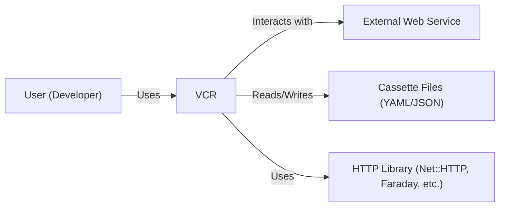
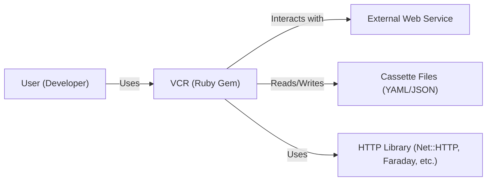
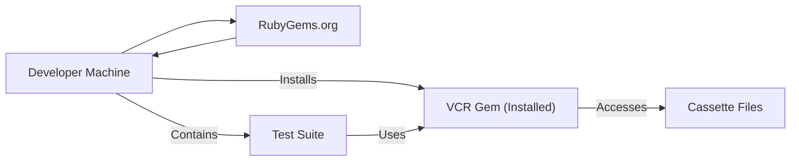
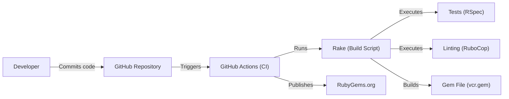

# BUSINESS POSTURE

Business Priorities and Goals:

*   Provide a tool for accurately replaying HTTP interactions in Ruby tests.
*   Simplify testing of code that interacts with external web services.
*   Improve test reliability by eliminating dependence on live web services.
*   Reduce test execution time by avoiding network requests to external services.
*   Maintain an active and well-maintained open-source project.

Business Risks:

*   Inaccurate recording or playback of HTTP interactions could lead to false positives or negatives in tests, undermining the reliability of the test suite.
*   Security vulnerabilities in VCR could expose sensitive data recorded in cassettes, or allow attackers to manipulate test results.
*   Lack of compatibility with newer Ruby versions or HTTP libraries could limit the project's adoption and usefulness.
*   Insufficient maintenance or community support could lead to the project becoming obsolete.
*   Failure to adequately address user issues and pull requests could damage the project's reputation.

# SECURITY POSTURE

Existing Security Controls:

*   security control: Sensitive data filtering: VCR provides mechanisms for filtering sensitive data (e.g., API keys, passwords) from recorded cassettes. (Described in the README and documentation).
*   security control: Cassette format: Cassettes are stored in a human-readable format (YAML or JSON), allowing for manual inspection and auditing. (Described in the README).
*   security control: Code reviews: Contributions to the project are subject to code review, helping to identify potential security issues. (Implicit in the open-source development model).
*   security control: Issue tracking: Security vulnerabilities can be reported and tracked through the project's issue tracker on GitHub. (Standard GitHub functionality).

Accepted Risks:

*   accepted risk: Users are responsible for managing the security of their recorded cassettes, including protecting them from unauthorized access.
*   accepted risk: VCR does not encrypt cassette data at rest. Users who store sensitive data in cassettes (even after filtering) must take appropriate measures to protect the files.
*   accepted risk: VCR relies on the underlying HTTP library (e.g., Net::HTTP, Faraday) for handling secure connections (HTTPS). Any vulnerabilities in the underlying library could affect VCR.

Recommended Security Controls:

*   security control: Implement automated security scanning (SAST) in the CI pipeline to detect potential vulnerabilities in the codebase.
*   security control: Provide documentation and guidance on securely configuring and using VCR, including best practices for handling sensitive data.
*   security control: Consider adding support for encrypting cassette data at rest, providing an additional layer of security for sensitive information.
*   security control: Regularly audit dependencies for known vulnerabilities and update them promptly.
*   security control: Establish a clear security policy, including instructions for reporting vulnerabilities.

Security Requirements:

*   Authentication: N/A - VCR itself does not perform authentication. It records and replays HTTP interactions, which may include authentication credentials.
*   Authorization: N/A - VCR does not implement authorization mechanisms.
*   Input Validation:
    *   VCR should validate user-provided configuration options to prevent unexpected behavior or security issues.
    *   VCR should sanitize cassette names to prevent path traversal vulnerabilities.
*   Cryptography:
    *   VCR should rely on the underlying HTTP library for handling cryptographic operations (e.g., HTTPS).
    *   If cassette encryption is implemented, a strong, well-vetted cryptographic algorithm should be used.
*   Data Protection:
    *   VCR should provide clear guidance on how to protect sensitive data recorded in cassettes.
    *   VCR should offer options for filtering or scrubbing sensitive data from cassettes.

# DESIGN

## C4 CONTEXT

Element Descriptions:

*   Element: User
    *   Name: User (Developer)
    *   Type: Person
    *   Description: A developer writing and running tests that use VCR.
    *   Responsibilities: Configures VCR, writes tests, manages cassette files.
    *   Security controls: None directly implemented by the user, but the user is responsible for securing their development environment and cassette files.

*   Element: VCR
    *   Name: VCR
    *   Type: Software System
    *   Description: The VCR library itself.
    *   Responsibilities: Records and replays HTTP interactions, manages cassette files, provides configuration options.
    *   Security controls: Sensitive data filtering, cassette format (human-readable), code reviews.

*   Element: External Web Service
    *   Name: External Web Service
    *   Type: Software System
    *   Description: Any external web service that the user's code interacts with.
    *   Responsibilities: Provides services consumed by the user's code.
    *   Security controls: Relies on the security controls implemented by the external service.

*   Element: Cassette Files
    *   Name: Cassette Files (YAML/JSON)
    *   Type: Data Store
    *   Description: Files that store recorded HTTP interactions.
    *   Responsibilities: Persistently store HTTP request and response data.
    *   Security controls: Human-readable format allows for manual inspection. Users are responsible for securing these files.

*   Element: HTTP Library
    *   Name: HTTP Library (Net::HTTP, Faraday, etc.)
    *   Type: Software Library
    *   Description: The underlying Ruby library used for making HTTP requests.
    *   Responsibilities: Handles low-level HTTP communication.
    *   Security controls: Relies on the security controls implemented by the chosen HTTP library.

## C4 CONTAINER

Element Descriptions:

*   Element: VCR
    *   Name: VCR (Ruby Gem)
    *   Type: Container: Ruby Gem
    *   Description: The VCR library packaged as a Ruby gem.
    *   Responsibilities: Records and replays HTTP interactions, manages cassette files, provides configuration options.
    *   Security controls: Sensitive data filtering, cassette format (human-readable), code reviews.

*   Element: External Web Service
    *   Name: External Web Service
    *   Type: Software System
    *   Description: Any external web service that the user's code interacts with.
    *   Responsibilities: Provides services consumed by the user's code.
    *   Security controls: Relies on the security controls implemented by the external service.

*   Element: Cassette Files
    *   Name: Cassette Files (YAML/JSON)
    *   Type: Data Store
    *   Description: Files that store recorded HTTP interactions.
    *   Responsibilities: Persistently store HTTP request and response data.
    *   Security controls: Human-readable format allows for manual inspection. Users are responsible for securing these files.

*   Element: HTTP Library
    *   Name: HTTP Library (Net::HTTP, Faraday, etc.)
    *   Type: Software Library
    *   Description: The underlying Ruby library used for making HTTP requests.
    *   Responsibilities: Handles low-level HTTP communication.
    *   Security controls: Relies on the security controls implemented by the chosen HTTP library.

*   Element: User
    *   Name: User (Developer)
    *   Type: Person
    *   Description: A developer writing and running tests that use VCR.
    *   Responsibilities: Configures VCR, writes tests, manages cassette files.
    *   Security controls: None directly implemented by the user, but the user is responsible for securing their development environment and cassette files.

## DEPLOYMENT

Possible Deployment Solutions:

1.  Bundler/Gemfile: VCR is typically installed as a gem using Bundler, a dependency manager for Ruby.
2.  Manual Gem Installation: VCR can also be installed manually using the `gem install` command.

Chosen Solution (Bundler/Gemfile):

Element Descriptions:

*   Element: Developer Machine
    *   Name: Developer Machine
    *   Type: Infrastructure Node
    *   Description: The developer's local machine where tests are written and run.
    *   Responsibilities: Hosts the development environment, including the Ruby interpreter, VCR gem, test suite, and cassette files.
    *   Security controls: Relies on the security of the developer's machine and operating system.

*   Element: RubyGems.org
    *   Name: RubyGems.org
    *   Type: Infrastructure Node
    *   Description: The central repository for Ruby gems.
    *   Responsibilities: Hosts and distributes the VCR gem.
    *   Security controls: RubyGems.org implements its own security measures to protect against malicious gems.

*   Element: VCR Gem (Installed)
    *   Name: VCR Gem (Installed)
    *   Type: Software
    *   Description: The installed VCR gem on the developer's machine.
    *   Responsibilities: Provides the functionality for recording and replaying HTTP interactions.
    *   Security controls: Inherits security controls from the VCR codebase and the Ruby environment.

*   Element: Cassette Files
    *   Name: Cassette Files
    *   Type: Data Store
    *   Description: Files storing the recorded HTTP interactions, located on the developer's machine.
    *   Responsibilities: Persistently store HTTP request and response data.
    *   Security controls: Relies on the file system permissions of the developer's machine.

*   Element: Test Suite
    *   Name: Test Suite
    *   Type: Software
    *   Description: The collection of tests written by the developer that utilize VCR.
    *   Responsibilities: Executes tests and interacts with VCR to record or replay HTTP interactions.
    *   Security controls: Relies on the security of the test code and the VCR gem.

## BUILD

VCR uses Rake for build automation and GitHub Actions for continuous integration. The build process includes running tests, checking code style, and building the gem.

Element Descriptions:

*   Developer: A contributor to the VCR project.
*   GitHub Repository: The VCR source code repository hosted on GitHub.
*   GitHub Actions: The CI/CD service used by VCR.
*   Rake: The Ruby build tool used to define and run build tasks.
*   Tests (RSpec): The test suite for VCR, written using RSpec.
*   Linting (RuboCop): Code style checking using RuboCop.
*   Gem File (vcr.gem): The packaged VCR gem file.
*   RubyGems.org: The public repository for Ruby gems.

Security Controls in Build Process:

*   security control: Automated Testing: The CI pipeline runs the test suite on every commit, ensuring that new code changes do not introduce regressions or security vulnerabilities.
*   security control: Code Style Checking (Linting): RuboCop enforces code style guidelines, which can help prevent certain types of errors that could lead to security issues.
*   security control: Continuous Integration: GitHub Actions provides a consistent and automated build environment, reducing the risk of manual errors or inconsistencies.

# RISK ASSESSMENT

Critical Business Processes:

*   Accurate recording and playback of HTTP interactions during testing.
*   Maintaining a reliable and trustworthy open-source library.

Data Protection:

*   Data: HTTP request and response data, including headers and bodies, stored in cassette files.
*   Sensitivity: Potentially sensitive, depending on the content of the HTTP interactions. May include API keys, authentication tokens, user data, or other confidential information. It is crucial to filter or scrub this data before storing it in cassettes.

# QUESTIONS & ASSUMPTIONS

Questions:

*   Are there any specific compliance requirements (e.g., GDPR, HIPAA) that apply to the use of VCR or the data stored in cassettes?
*   What is the expected level of sensitivity of the data being recorded in cassettes?
*   Are there any existing security policies or guidelines for handling sensitive data in test environments?

Assumptions:

*   BUSINESS POSTURE: The primary goal is to provide a reliable and easy-to-use tool for testing HTTP interactions. Security is a concern, but usability and maintainability are also important.
*   SECURITY POSTURE: Users are responsible for securing their cassette files and filtering sensitive data. VCR provides mechanisms for filtering, but it is ultimately the user's responsibility to use them correctly.
*   DESIGN: The design is relatively simple, with a focus on minimizing dependencies and maximizing compatibility with different HTTP libraries.