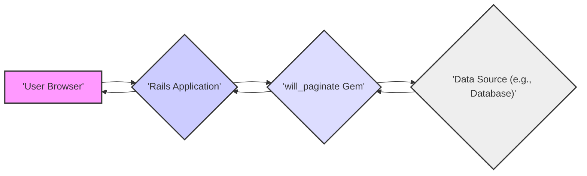

# Project Design Document: will_paginate Gem

**Version:** 1.1
**Date:** October 26, 2023
**Author:** AI Software Architect

## 1. Introduction

This document provides an enhanced and more detailed design overview of the `will_paginate` Ruby gem. This revised document builds upon the previous version and aims to provide a more comprehensive understanding of the gem's architecture, data flow, and potential security considerations, making it more suitable for threat modeling activities.

## 2. Goals

*   Provide a comprehensive and refined architectural overview of the `will_paginate` gem.
*   Identify key components and their interactions with greater detail.
*   Describe the data flow within the gem's context with more granularity.
*   Establish a clearer and more detailed understanding of the system for thorough threat modeling purposes.

## 3. Overview

The `will_paginate` gem is a widely used pagination library for Ruby on Rails applications. It significantly simplifies the process of displaying large datasets in a user-friendly manner by dividing them into smaller, navigable pages. The gem offers a suite of helper methods for generating pagination links, displaying current page information, and seamlessly integrating with various data sources commonly used in Rails applications.

## 4. Architecture

The `will_paginate` gem operates as an integral part of a Ruby on Rails application. Its core functionalities are exposed through helper methods that are primarily utilized within the application's view layer to render pagination controls.

### 4.1. Key Components

*   **`WillPaginate::Collection`:** This class is the central data structure representing a paginated collection. It encapsulates:
    *   The array of items for the currently displayed page.
    *   The total number of items across all pages.
    *   The number of items to be displayed per page.
    *   The current page number.
    This class provides methods for accessing pagination metadata and iterating over the current page's items.
*   **View Helpers:** The gem provides a set of view helper methods designed to be used within Rails templates (ERB, Haml, etc.) for rendering pagination UI elements. Key helpers include:
    *   `will_paginate(@collection, options = {})`:  The primary helper responsible for rendering the pagination links (e.g., previous, next, page numbers). It accepts various options to customize the appearance and behavior of the pagination controls.
    *   `page_entries_info(@collection, options = {})`:  Displays informative text about the current page and the total number of entries (e.g., "Displaying items 1 - 10 of 100 total").
*   **Controller Integration:** While the core pagination logic resides within the gem and view helpers, the Rails controller plays a crucial role in preparing the data for pagination:
    *   **Fetching Data:** The controller action is responsible for retrieving the initial dataset from the data source (e.g., using ActiveRecord queries).
    *   **Pagination Invocation:** The controller uses the `paginate` method (provided by `will_paginate` for ActiveRecord relations) or manually instantiates a `WillPaginate::Collection` for other data sources. This involves specifying the current page number (typically obtained from request parameters) and the per-page limit.
    *   **Passing to View:** The controller then passes the paginated collection object (either the `WillPaginate::Collection` instance or the paginated ActiveRecord relation) to the view for rendering.
*   **Data Source Adapters:** `will_paginate` offers seamless integration with various data sources through adapters:
    *   **ActiveRecord:** For ActiveRecord models, `will_paginate` extends the `ActiveRecord::Relation` class with a `paginate` method. This method efficiently fetches only the records required for the current page using database-level LIMIT and OFFSET clauses.
    *   **Arrays and Enumerables:** For in-memory arrays or other enumerable objects, developers can manually create a `WillPaginate::Collection` instance, providing the array, the current page number, and the per-page limit.

### 4.2. Interactions

1. **User Initiates Navigation:** A user interacts with the pagination links in the browser (e.g., clicks on "Next Page" or a specific page number).
2. **Browser Sends Request:** The browser sends a new HTTP request to the Rails application. This request typically includes a `page` parameter in the query string (e.g., `/articles?page=2`).
3. **Rails Router Directs Request:** The Rails router maps the incoming request to the appropriate controller action.
4. **Controller Action Executes:** The controller action receives the request, extracts the `page` parameter (if present), and proceeds with data fetching.
5. **Data Retrieval and Pagination:**
    *   **ActiveRecord:** The controller might use `Article.paginate(page: params[:page], per_page: 10)` to fetch and paginate data directly from the database.
    *   **Arrays:** The controller might fetch the entire array and then create a `WillPaginate::Collection.create(params[:page], 10, all_items.length) do |pager| all_items[pager.offset, pager.per_page] end`.
6. **Paginated Data Passed to View:** The controller makes the paginated collection object available to the view template.
7. **View Helper Renders Links:** The `will_paginate(@articles)` helper (or similar) is invoked within the view template. This helper uses the metadata within the paginated collection (current page, total pages, etc.) to generate the HTML for the pagination links.
8. **HTML Response Sent:** The Rails application renders the HTML, including the paginated data and the generated pagination links, and sends it back to the user's browser.
9. **User Sees Paginated Content:** The user's browser displays the current page of data along with the navigation controls.

## 5. Data Flow

The data flow within the context of `will_paginate` can be described in a more detailed manner:

1. **User Action Triggers Request:** A user's interaction (e.g., clicking a pagination link) initiates an HTTP request to the Rails application. This request often includes the `page` number as a parameter.
2. **Request Routing and Controller Invocation:** The Rails router directs the request to the appropriate controller action.
3. **Parameter Extraction:** The controller extracts relevant parameters from the request, particularly the `page` parameter, which indicates the desired page number.
4. **Data Retrieval from Source:** The controller interacts with the data source (e.g., database, external API) to retrieve the *total* dataset or a sufficient portion to determine the total number of records.
5. **Pagination Logic Application:**
    *   **ActiveRecord:** The `paginate` method on an `ActiveRecord::Relation` constructs a database query with `LIMIT` and `OFFSET` clauses based on the requested `page` and the configured `per_page` value. The database returns only the records for the current page.
    *   **Arrays/Enumerables:** The `WillPaginate::Collection` logic calculates the starting and ending indices for the current page based on the `page` number and `per_page` value. It then extracts the relevant slice of data from the original array.
6. **Creation of Paginated Collection Object:** A `WillPaginate::Collection` object (or a paginated `ActiveRecord::Relation`) is created, containing the data for the current page and metadata about the pagination (current page, total pages, etc.).
7. **Passing Data to the View:** The controller passes this paginated collection object to the view layer.
8. **View Helper Processing:** The `will_paginate` view helper receives the collection object.
9. **Link Generation:** The helper iterates through the pagination metadata and generates the appropriate HTML links for navigation. These links typically include the `page` parameter with the corresponding page number.
10. **HTML Rendering:** The Rails view renders the complete HTML, embedding the paginated data and the generated pagination links.
11. **Response Transmission:** The HTML response is sent back to the user's browser.

## 6. Security Considerations (Detailed for Threat Modeling)

This section provides a more detailed analysis of potential security considerations relevant for threat modeling the `will_paginate` gem within a Rails application.

*   **Input Validation and Parameter Tampering (CWE-20):**
    *   **Threat:** Malicious users can manipulate the `page` parameter in the URL to inject unexpected values (e.g., negative numbers, extremely large numbers, non-numeric values).
    *   **Impact:** This could lead to:
        *   **Application Errors:** Causing exceptions or unexpected behavior within the application.
        *   **Resource Exhaustion (DoS):**  Requesting extremely large page numbers might trigger inefficient database queries or excessive memory usage, potentially leading to denial of service.
        *   **Information Disclosure (Indirect):** While less direct, if the application doesn't handle invalid page numbers gracefully, error messages might reveal internal information.
    *   **Mitigation:** Implement robust input validation on the `page` parameter in the controller. Ensure it's a positive integer within a reasonable range.

*   **Denial of Service (DoS) through Pagination Abuse (CWE-400):**
    *   **Threat:** Attackers might repeatedly request pages with very high numbers or manipulate other pagination-related parameters (if exposed) to overload the server or database.
    *   **Impact:**  Server slowdowns, application unavailability, and potential database overload.
    *   **Mitigation:**
        *   Implement rate limiting on requests to pagination endpoints.
        *   Optimize database queries used for pagination to handle large offsets efficiently.
        *   Consider using cursor-based pagination for very large datasets as an alternative to offset-based pagination.

*   **Information Disclosure through Inconsistent Pagination Logic:**
    *   **Threat:** If the logic for determining the total number of items or the number of items per page is flawed or inconsistent, it could lead to unintended information disclosure. For example, revealing the total count of items even if a user doesn't have permission to see all of them.
    *   **Impact:** Unauthorized access to information about the dataset size or structure.
    *   **Mitigation:** Carefully review and test the logic for calculating total items and per-page limits. Ensure access controls are applied consistently before pagination.

*   **Indirect Vulnerabilities Related to Data Fetching (e.g., SQL Injection - CWE-89):**
    *   **Threat:** While `will_paginate` itself doesn't directly execute SQL queries, vulnerabilities in the data fetching logic within the controller (which provides data to `will_paginate`) can be indirectly exploited. If user-supplied input is used to construct database queries without proper sanitization, it could lead to SQL injection.
    *   **Impact:** Data breaches, unauthorized data modification, or complete compromise of the database.
    *   **Mitigation:**  Always use parameterized queries or ORM features that automatically handle input sanitization when fetching data to be paginated.

*   **Cross-Site Scripting (XSS) in Paginated Content (CWE-79):**
    *   **Threat:** If the data being paginated includes user-generated content that is not properly sanitized before being displayed in the view, it can lead to XSS vulnerabilities. This is not a vulnerability within `will_paginate` itself, but a crucial consideration when using it.
    *   **Impact:**  Malicious scripts can be injected into the user's browser, potentially leading to session hijacking, data theft, or defacement.
    *   **Mitigation:**  Implement robust output encoding and sanitization of all user-generated content before displaying it in the view, regardless of pagination.

## 7. Dependencies

The `will_paginate` gem has the following key dependencies:

*   **Ruby:** The programming language in which the gem is written.
*   **Rails (if used within a Rails application):** The web application framework it is primarily designed to integrate with. It leverages Rails' view helpers and controller functionalities.

## 8. Deployment

The `will_paginate` gem is deployed as part of a Ruby on Rails application. It is typically included in the application's `Gemfile` and installed using Bundler. The gem's code resides within the application's `vendor/bundle` directory (or a similar location managed by the dependency management system). Its functionality is invoked during the application's runtime when processing web requests.

## 9. Future Considerations (Potential Enhancements or Changes)

While not directly impacting the security of the current version, potential future enhancements or changes to `will_paginate` could introduce new security considerations:

*   **API Endpoints for Pagination:** If pagination logic is exposed through API endpoints, new authentication and authorization mechanisms would need to be considered.
*   **Cursor-Based Pagination:** Implementing cursor-based pagination might introduce different types of vulnerabilities related to cursor manipulation or information leakage through cursor values.
*   **Client-Side Pagination:** If the gem were to support client-side pagination (though unlikely given its current architecture), security considerations related to data transfer and client-side data manipulation would become relevant.

This improved document provides a more detailed and comprehensive design overview of the `will_paginate` gem, making it more suitable for thorough threat modeling and security analysis. It elaborates on the key components, data flow, and potential security vulnerabilities associated with its use within a Ruby on Rails application.