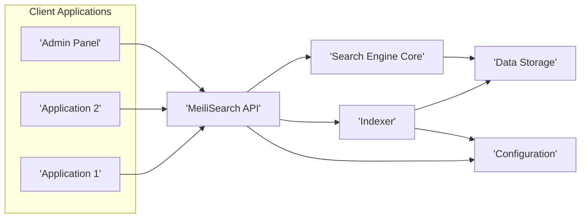
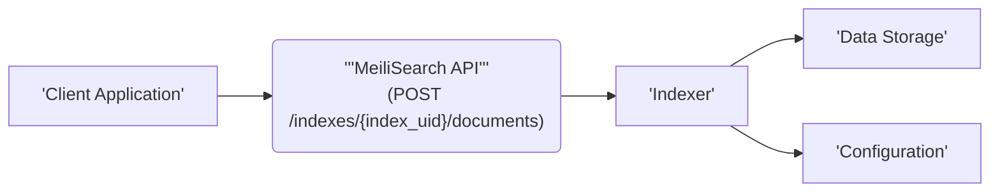
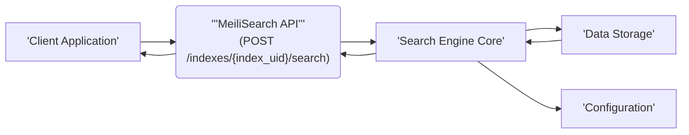

# Project Design Document: MeiliSearch

**Version:** 1.1
**Date:** October 26, 2023
**Author:** AI Software Architect

## 1. Introduction

This document provides an enhanced design overview of the MeiliSearch project, an open-source, blazing-fast, and hyper-relevant search engine. This document aims to clearly articulate the system's architecture, components, data flow, and deployment considerations with greater detail. It will serve as a robust foundation for subsequent threat modeling activities.

### 1.1. Purpose

The primary purpose of this document is to provide a comprehensive and detailed understanding of the MeiliSearch system's design. This enhanced understanding is crucial for identifying a wider range of potential security vulnerabilities and attack vectors during the threat modeling process.

### 1.2. Scope

This document covers the core architectural components of MeiliSearch in greater depth, including specific examples within its API, a more detailed breakdown of the indexing process, and further clarification on data storage mechanisms. It also expands on deployment considerations. The focus remains on the logical architecture, avoiding specific implementation details while providing more context.

### 1.3. Audience

This document is intended for:

*   Security engineers and architects performing detailed threat modeling.
*   Developers working on or integrating with MeiliSearch requiring a deeper understanding.
*   Operations teams responsible for deploying, maintaining, and securing MeiliSearch.

## 2. System Overview

MeiliSearch is designed as a standalone search engine that can be seamlessly integrated into various applications. It provides a well-defined RESTful API for both indexing and searching data, emphasizing speed, relevance tuning, and ease of integration.

## 3. Architectural Design

The following diagram illustrates the enhanced high-level architecture of MeiliSearch:

### 3.1. Key Components

*   **Client Applications:** These are external applications or services that interact with MeiliSearch to manage data and perform searches. This includes user-facing applications, backend services, and administrative tools.
*   **MeiliSearch API:** This is the central interface for interacting with MeiliSearch, exposing a comprehensive set of RESTful endpoints. Examples include:
    *   **Indexing:** `POST /indexes/{index_uid}/documents`, `PUT /indexes/{index_uid}/documents`, `DELETE /indexes/{index_uid}/documents`.
    *   **Searching:** `POST /indexes/{index_uid}/search`, `GET /indexes/{index_uid}/search`.
    *   **Index Management:** `POST /indexes`, `GET /indexes`, `GET /indexes/{index_uid}`, `PUT /indexes/{index_uid}`, `DELETE /indexes/{index_uid}`.
    *   **Settings Management:** `GET /indexes/{index_uid}/settings`, `PATCH /indexes/{index_uid}/settings`.
    *   **Key Management (if enabled):** Endpoints for creating, listing, and revoking API keys.
    *   **Health and Status:** `GET /health`, `GET /stats`.
*   **Indexer:** This component is responsible for the crucial task of processing incoming documents and constructing the search index. Its key processes include:
    *   **Data Ingestion:** Receiving documents from the API.
    *   **Tokenization:** Breaking down text fields into individual terms or tokens based on defined rules and language.
    *   **Stop Word Removal:** Eliminating common, non-informative words (e.g., "the", "a", "is").
    *   **Synonym Handling:** Expanding search terms to include synonyms.
    *   **Stemming/Lemmatization:** Reducing words to their root form to improve search relevance.
    *   **Inverted Index Creation:** Building the core data structure that maps terms to the documents containing them, enabling efficient searching.
    *   **Data Persistence:** Storing the generated index in the Data Storage.
*   **Search Engine Core:** This is the core logic responsible for executing search queries and retrieving relevant results. Its key functions include:
    *   **Query Parsing:** Analyzing the user's search query to understand the intent and keywords.
    *   **Index Lookup:** Efficiently retrieving candidate documents from the inverted index based on the query terms.
    *   **Ranking Algorithm:** Applying a sophisticated ranking algorithm to determine the relevance of each document to the query. This often involves factors like term frequency, document frequency, and custom ranking rules.
    *   **Filtering and Sorting:** Applying any specified filters or sorting criteria to the result set.
    *   **Result Formatting:** Preparing the search results to be returned to the API.
*   **Data Storage:** This component handles the persistent storage of the indexed data and configuration settings. MeiliSearch primarily uses:
    *   **LMDB (Lightning Memory-Mapped Database):**  The default embedded key-value store for storing the inverted index and other metadata.
    *   **Configuration Files:** Storing settings related to indexes, API keys, and server configuration.
*   **Configuration:** This component manages the various settings and configurations for MeiliSearch, including:
    *   **Index Settings:**  Customizable parameters for each index, such as searchable attributes, ranking rules, and stop words.
    *   **API Key Configuration:**  Defining permissions and expiry for API keys (if authentication is enabled).
    *   **Server Configuration:** Settings related to port, host, and other server-level parameters.

## 4. Data Flow

The following diagrams illustrate the data flow for indexing and searching operations with more detail:

### 4.1. Indexing Data Flow

*   **Client Application:** Sends data (documents in JSON format) to be indexed to the MeiliSearch API, specifying the target index.
*   **MeiliSearch API:**
    *   Receives the indexing request and performs initial validation (e.g., data format).
    *   May perform authentication and authorization checks based on configured API keys.
    *   Forwards the data to the Indexer.
*   **Indexer:**
    *   Receives the documents from the API.
    *   Applies tokenization, stop word removal, stemming, and other processing steps.
    *   Builds or updates the inverted index.
    *   Stores the updated index in the Data Storage.
    *   May read configuration settings from the Configuration component to guide the indexing process.
*   **Data Storage:** Persistently stores the updated inverted index and related metadata.
*   **Configuration:** Provides index-specific settings to the Indexer.

### 4.2. Searching Data Flow

*   **Client Application:** Sends a search query (typically as a JSON payload or URL parameters) to the MeiliSearch API, specifying the target index and search parameters.
*   **MeiliSearch API:**
    *   Receives the search request and performs validation.
    *   May perform authentication and authorization checks.
    *   Forwards the search query to the Search Engine Core.
*   **Search Engine Core:**
    *   Receives the search query.
    *   Parses the query to identify keywords and search parameters.
    *   Retrieves relevant data from the Data Storage (the inverted index).
    *   Applies the ranking algorithm to score and rank the matching documents.
    *   Applies any specified filters or sorting rules.
    *   May consult the Configuration component for index-specific settings like ranking rules.
*   **Data Storage:** Provides the indexed data (inverted index) to the Search Engine Core.
*   **Configuration:** Provides index-specific settings, such as ranking rules, to the Search Engine Core.
*   **MeiliSearch API:** Receives the ranked search results from the Search Engine Core.
*   **Client Application:** Receives the formatted search results.

## 5. Deployment Considerations

MeiliSearch offers flexible deployment options:

*   **Standalone Server:** Running MeiliSearch as a single process directly on an operating system. This is suitable for development or small-scale deployments.
*   **Containerized Environment (Docker):** Utilizing official Docker images for easy deployment, scaling, and management. This is a common and recommended approach for production environments.
*   **Cloud Platforms:** Deploying on various cloud platforms, such as:
    *   **AWS:** Using EC2 instances, container services like ECS or EKS, or managed database services if persistence is externalized.
    *   **Google Cloud:** Using Compute Engine instances, Google Kubernetes Engine (GKE), or managed database options.
    *   **Azure:** Using Virtual Machines, Azure Kubernetes Service (AKS), or managed database services.
*   **Clustered Environment:** Deploying multiple MeiliSearch instances in a cluster for high availability, fault tolerance, and increased indexing/search capacity. This typically involves a load balancer to distribute traffic.

## 6. Security Considerations (Detailed for Threat Modeling)

This section provides a more detailed breakdown of security considerations relevant for threat modeling:

*   **Authentication and Authorization:**
    *   **API Keys:** MeiliSearch uses API keys for authentication. Weak key generation, insecure storage, or lack of key rotation can lead to unauthorized access.
    *   **Permissions:**  Understanding the granularity of permissions associated with API keys is crucial. Can a key only search, or can it also index and manage settings?
    *   **Lack of Built-in User Management:** MeiliSearch doesn't have built-in user accounts. Relying solely on API keys requires careful management.
*   **Input Validation:**
    *   **Indexing:** Insufficient validation of data during indexing can lead to stored cross-site scripting (XSS) vulnerabilities or injection attacks if data is later displayed.
    *   **Search Queries:**  While less common, poorly validated search queries could potentially lead to unexpected behavior or resource exhaustion.
*   **Data Storage Security:**
    *   **Data at Rest:**  Consider the security of the underlying file system where LMDB stores the index. Encryption at rest might be necessary for sensitive data.
    *   **Access Control:**  Permissions on the data directory are critical to prevent unauthorized access or modification of the index.
    *   **Backup and Recovery:** Secure backup and recovery mechanisms are essential to protect against data loss.
*   **Network Security:**
    *   **TLS/HTTPS:**  Enforcing HTTPS for all API communication is crucial to protect data in transit.
    *   **Firewall Rules:**  Properly configured firewalls should restrict access to the MeiliSearch API to authorized sources.
    *   **CORS Configuration:**  Incorrectly configured CORS policies can allow malicious websites to make unauthorized requests to the MeiliSearch API.
*   **Rate Limiting:**  Implementing rate limiting is essential to prevent denial-of-service (DoS) attacks by limiting the number of requests from a single IP address or API key within a given timeframe.
*   **Logging and Monitoring:**
    *   **Audit Logs:**  Detailed logs of API requests, indexing operations, and configuration changes are crucial for security auditing and incident response.
    *   **Performance Monitoring:** Monitoring resource usage can help detect anomalies that might indicate an attack.
*   **API Key Management:**
    *   **Secure Generation:** API keys should be generated using cryptographically secure methods.
    *   **Secure Storage:**  API keys should be stored securely and never hardcoded in client-side code.
    *   **Key Rotation:**  Regularly rotating API keys reduces the impact of a potential key compromise.
    *   **Revocation Mechanisms:**  Having a clear process for revoking compromised API keys is essential.
*   **Dependency Management:**  Keeping MeiliSearch and its dependencies up-to-date with the latest security patches is crucial to mitigate known vulnerabilities.
*   **Error Handling:**  Detailed error messages can sometimes reveal sensitive information to attackers.

## 7. Future Considerations (Potential Extensions with Security Implications)

These are potential future features or changes that could impact the architecture and security, requiring careful consideration during their design and implementation:

*   **More Granular Access Control:** Implementing role-based access control (RBAC) or attribute-based access control (ABAC) for finer-grained permissions on API endpoints and data access. This would require careful design to avoid overly complex or insecure configurations.
*   **Plugin System with Security Sandboxing:** Allowing developers to extend MeiliSearch functionality through plugins introduces the risk of malicious plugins. Implementing robust sandboxing and security reviews for plugins would be necessary.
*   **Support for External Authentication Providers:** Integrating with OAuth 2.0 or other identity providers could simplify authentication but requires careful implementation to avoid vulnerabilities in the integration.
*   **Data Masking/Redaction:** Implementing features to mask or redact sensitive data during indexing or search results would add a layer of data protection.
*   **Web Application Firewall (WAF) Integration:**  Providing guidance or features to facilitate integration with WAFs for enhanced protection against web-based attacks.

This improved document provides a more detailed and comprehensive understanding of the MeiliSearch architecture, specifically focusing on aspects relevant to security. This enhanced detail will be invaluable for conducting a more thorough and effective threat modeling exercise.