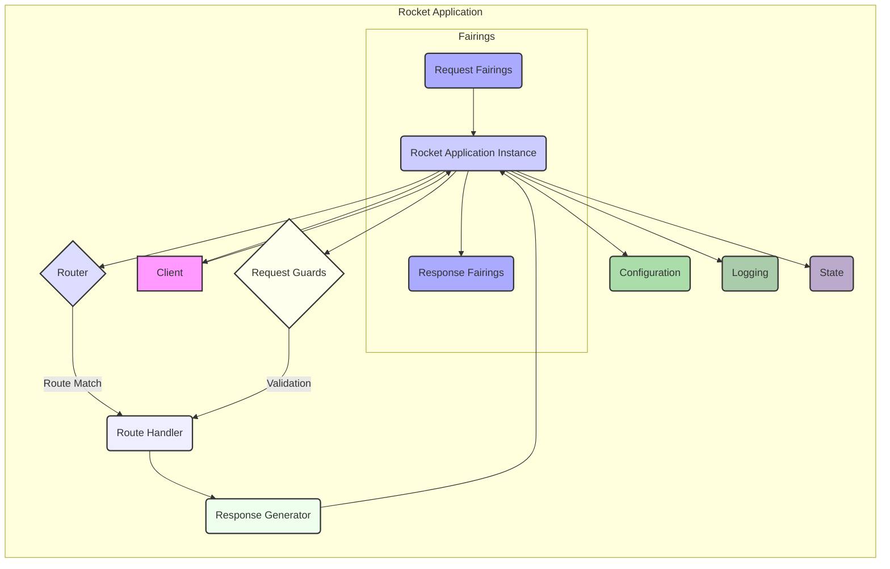
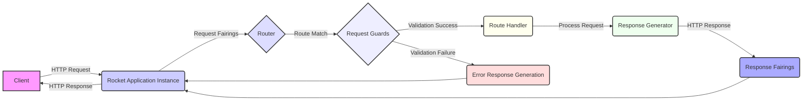

# Project Design Document: Rocket Web Framework - Improved

**Version:** 1.1
**Date:** October 26, 2023
**Prepared By:** Gemini (AI Language Model)

## 1. Project Overview

This document provides an enhanced design overview of the Rocket web framework, a fast, type-safe, and expressive web framework for Rust. It aims to offer a more detailed understanding of the framework's architecture, components, and data flow, specifically tailored for effective threat modeling. This document focuses on the core framework and a typical application built using Rocket.

## 2. Goals and Objectives

*   Deliver a refined and more detailed architectural overview of the Rocket framework.
*   Provide clearer descriptions of key components and their interactions, including security-relevant aspects.
*   Elaborate on the typical data flow within a Rocket application, highlighting potential security checkpoints.
*   Offer more specific and actionable security considerations for threat modeling exercises.
*   Serve as an improved foundational document for subsequent security analysis and threat modeling efforts.

## 3. Target Audience

*   Security engineers and architects conducting threat modeling and security assessments.
*   Developers contributing to or building applications with the Rocket framework.
*   System administrators responsible for deploying and maintaining Rocket applications.

## 4. Scope

This document encompasses the following aspects of the Rocket framework:

*   Detailed explanation of core architectural components (e.g., request handling, routing, response generation, state management).
*   In-depth description of key abstractions and concepts (e.g., routes, handlers, guards, fairings, state).
*   Comprehensive illustration of the typical data flow for incoming requests and outgoing responses, emphasizing security-relevant stages.
*   Interaction with external components (e.g., databases, clients, other services).

This document continues to *not* cover:

*   Specific user applications built with Rocket (implementation details).
*   Extremely low-level implementation specifics of individual Rocket modules' internal workings.
*   Third-party libraries or crates used in conjunction with Rocket, unless they are integral to the core framework's operation.
*   Precise deployment configurations or infrastructure specifics (these are considered in the "Deployment Considerations" section at a higher level).

## 5. System Architecture

The Rocket framework employs a layered architecture, designed to facilitate the development of robust and secure web applications in Rust. The interaction between core components ensures efficient handling of requests and generation of responses.

### 5.1. Core Components

*   **Client:** The entity initiating an HTTP request to the Rocket application. Examples include web browsers, mobile applications, and other backend services.
*   **Rocket Application Instance:** The central orchestrator of a Rocket application. It manages routes, handlers, fairings, application state, and the overall application lifecycle.
*   **Router:** The component responsible for inspecting incoming requests and matching them to the appropriate route handler based on the HTTP method and the request path.
*   **Route Handlers:**  Asynchronous functions or blocks of code associated with specific routes. They contain the core application logic for processing requests and generating responses.
*   **Request Guards:** Types implementing the `FromRequest` trait. They act as interceptors, validating and potentially extracting information from incoming requests *before* they reach the handler. Guards can enforce authentication, authorization, and other preconditions.
*   **Fairings:** A powerful middleware mechanism allowing interception and modification of requests and responses at various stages of the application lifecycle. Fairings can be used for logging, security header injection, request/response transformation, and more. They operate at a broader scope than guards.
    *   **Request Fairings:** Executed before the request reaches the route handler.
    *   **Response Fairings:** Executed after the route handler generates a response, but before it's sent to the client.
*   **Response Generators:** Components responsible for converting the data returned by route handlers into well-formed HTTP responses, including setting status codes, headers, and body content.
*   **State:** A mechanism for sharing data across the application. Rocket provides type-safe access to shared state, which can include database connections, configuration settings, and other resources.
*   **Configuration:** Settings that govern the behavior of the Rocket application, such as the listening port, environment variables, database connection strings, and security-related parameters.
*   **Logging:** The system for recording events and information about the application's execution, crucial for monitoring, debugging, and security auditing.

### 5.2. Component Diagram (Mermaid)

## 6. Data Flow

The processing of an incoming HTTP request within a Rocket application follows a well-defined sequence, with opportunities for security checks and modifications at various stages.

1. **Request Reception:** The `Client` sends an HTTP request to the Rocket application's listening port.
2. **Application Entry:** The `Rocket Application Instance` receives the raw HTTP request.
3. **Request Fairing Execution:** Registered Request `Fairings` are executed sequentially. These fairings can inspect, modify, or even short-circuit the request processing. For example, a fairing could add security headers or perform initial logging.
4. **Routing:** The `Router` examines the request method and path to find a matching route definition. If no match is found, a "404 Not Found" response is typically generated.
5. **Guard Evaluation:** If a matching route is found, the `Request Guards` associated with that route are evaluated in order. Guards can extract data from the request (e.g., authentication tokens), validate preconditions, and potentially reject the request with an error response if the conditions are not met.
6. **Handler Invocation:** If all guards pass successfully, the corresponding `Route Handler` function is invoked. The handler receives the extracted and validated data from the guards.
7. **Handler Logic Execution:** The `Route Handler` executes its application-specific logic to process the request. This might involve interacting with databases, external services, or the application's `State`.
8. **Response Generation:** The `Route Handler` returns data, which is then processed by the `Response Generator` to construct the HTTP response. This includes setting the status code, headers, and the response body.
9. **Response Fairing Execution:** Registered Response `Fairings` are executed sequentially. These fairings can inspect and modify the outgoing response. For instance, a fairing could add security headers (if not already added by a request fairing), log the response, or compress the response body.
10. **Response Transmission:** The `Rocket Application Instance` sends the fully formed HTTP response back to the `Client`.

### 6.1. Data Flow Diagram (Mermaid)

## 7. Security Considerations

This section provides a more detailed breakdown of potential security considerations within the Rocket framework, crucial for effective threat modeling.

*   **Input Validation in Route Handlers and Guards:**
    *   **Threat:** Injection attacks (SQL injection, command injection, XSS), data corruption, unexpected application behavior.
    *   **Mitigation:** Implement robust input validation and sanitization within route handlers and request guards. Use type-safe data extraction provided by Rocket and validate data against expected formats and ranges.
*   **Authentication and Authorization using Guards:**
    *   **Threat:** Unauthorized access to resources, privilege escalation, data breaches.
    *   **Mitigation:** Utilize request guards to enforce authentication (verifying user identity) and authorization (verifying user permissions). Implement secure authentication mechanisms (e.g., JWT, session tokens) and role-based access control.
*   **Secure Session Management:**
    *   **Threat:** Session hijacking, session fixation, unauthorized access.
    *   **Mitigation:** Employ secure session management practices. Use HTTP-only and secure cookies, implement session timeouts, and regenerate session IDs upon login. Consider using Rocket's built-in session management features or external session stores.
*   **Cross-Site Request Forgery (CSRF) Protection:**
    *   **Threat:** Unauthorized actions performed on behalf of an authenticated user.
    *   **Mitigation:** Implement CSRF protection mechanisms, such as synchronizer tokens or the SameSite cookie attribute. Fairings can be used to enforce CSRF protection.
*   **Cross-Site Scripting (XSS) Prevention:**
    *   **Threat:** Injection of malicious scripts into web pages, leading to data theft, session hijacking, and defacement.
    *   **Mitigation:**  Employ proper output encoding and escaping of user-generated content before rendering it in HTML. Utilize Rocket's built-in templating features securely. Implement a strong Content Security Policy (CSP) using fairings.
*   **HTTP Security Headers:**
    *   **Threat:** Various web-based attacks, such as clickjacking, MIME sniffing attacks, and insecure connections.
    *   **Mitigation:** Configure appropriate HTTP security headers (e.g., `Content-Security-Policy`, `Strict-Transport-Security`, `X-Frame-Options`, `X-Content-Type-Options`) using response fairings.
*   **Dependency Vulnerabilities:**
    *   **Threat:** Exploitation of known vulnerabilities in third-party libraries.
    *   **Mitigation:** Regularly audit and update dependencies. Use tools to scan for known vulnerabilities in project dependencies.
*   **Secure Error Handling and Logging:**
    *   **Threat:** Information leakage through error messages, insufficient logging for security audits.
    *   **Mitigation:** Implement secure error handling that avoids exposing sensitive information in error responses. Implement comprehensive logging of security-relevant events (authentication attempts, authorization failures, etc.).
*   **Denial of Service (DoS) Considerations:**
    *   **Threat:** Application unavailability due to resource exhaustion.
    *   **Mitigation:** Implement rate limiting, request size limits, and other mechanisms to prevent resource exhaustion. Consider deploying behind a reverse proxy with DoS protection capabilities.
*   **Configuration Security:**
    *   **Threat:** Exposure of sensitive information (API keys, database credentials) through insecure configuration.
    *   **Mitigation:** Store sensitive configuration data securely (e.g., using environment variables or dedicated secrets management tools). Avoid hardcoding sensitive information in the application code.

## 8. Deployment Considerations

Understanding common deployment patterns is crucial for assessing the overall security posture of a Rocket application.

*   **Reverse Proxies (e.g., Nginx, Apache):** Often used to handle TLS termination, load balancing, and provide an additional layer of security. Proper configuration of the reverse proxy is critical.
*   **Containerization (e.g., Docker):** Provides isolation and simplifies deployment. Security considerations include securing the container image and the container runtime environment.
*   **Cloud Platforms (e.g., AWS, Azure, GCP):** Leverage cloud-provided security services (firewalls, identity management, etc.). Proper configuration of cloud resources is essential.
*   **Operating System Security:** The security of the underlying operating system and its configurations directly impacts the security of the Rocket application. Keep the OS and its components updated.

## 9. Technologies Used

*   **Rust:** The core programming language, providing memory safety and performance benefits.
*   **Hyper:** The underlying asynchronous HTTP library.
*   **Tokio:** The asynchronous runtime environment.

## 10. Future Considerations

*   More detailed sequence diagrams illustrating the interaction between components for specific scenarios (e.g., authentication flow).
*   Formalization of security best practices and patterns within the framework's documentation and examples.
*   Integration with security scanning tools and frameworks for automated vulnerability detection.
*   Further exploration of advanced security features and mitigations within the Rocket ecosystem.
