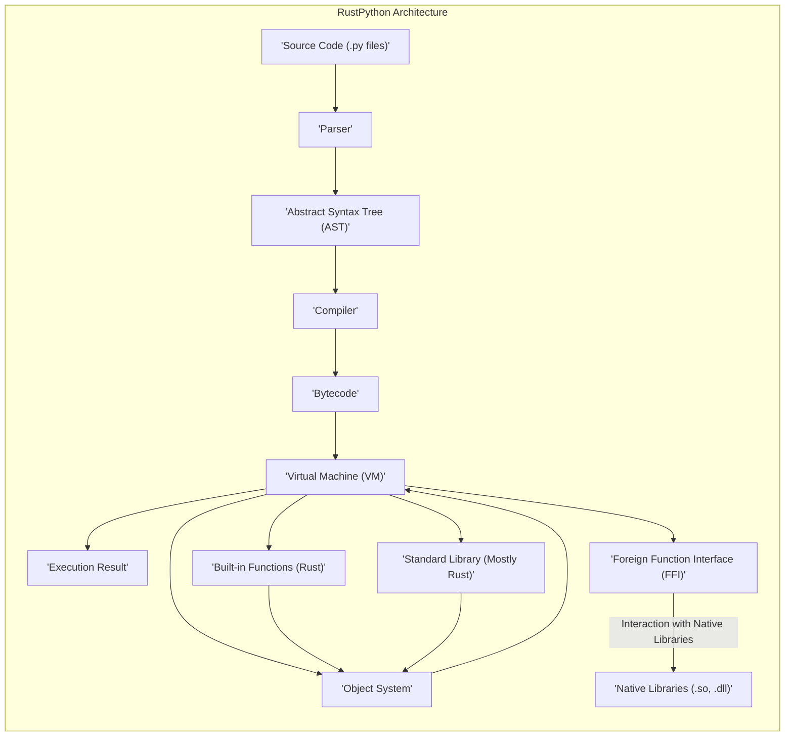
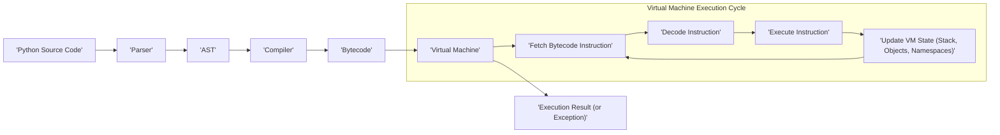

## Project Design Document: RustPython (Improved)

**1. Introduction**

This document provides an enhanced architectural overview of the RustPython project, a Python 3 interpreter implemented in Rust. RustPython aims to be a performant, embeddable, and secure alternative to the standard CPython interpreter. This document details the key components, data flow, and architectural decisions, serving as a robust foundation for subsequent threat modeling activities. The focus is on providing the necessary context to identify potential vulnerabilities and attack vectors.

**2. Goals**

*   **Strict CPython 3.x Compatibility:** Achieve a high degree of fidelity with the CPython 3.x language specification, including syntax, semantics, and built-in functions.
*   **Performance Optimization:** Deliver competitive execution speed compared to CPython, leveraging Rust's performance characteristics and exploring optimization opportunities within the interpreter.
*   **Seamless Embeddability:** Design the interpreter to be easily integrated and invoked within other Rust applications as a library.
*   **Enhanced Security Posture:** Leverage Rust's memory safety guarantees to inherently mitigate classes of vulnerabilities prevalent in C-based interpreters, such as buffer overflows and dangling pointers.
*   **Code Maintainability and Extensibility:**  Maintain a well-structured, modular, and thoroughly documented codebase to facilitate ongoing development, maintenance, and the addition of new features.

**3. Overall Architecture**

RustPython's architecture is deliberately aligned with CPython's, employing a classic interpreter design. The core stages involve parsing the source code, compiling it into bytecode, and then executing that bytecode within a virtual machine.

**4. Component Breakdown**

*   **Parser:**
    *   **Functionality:** Takes raw Python source code as input and transforms it into an Abstract Syntax Tree (AST).
    *   **Implementation:** Implements the formal grammar of the Python language, handling lexical analysis (tokenization) and syntactic analysis.
    *   **Security Relevance:**  Crucial for preventing injection attacks by ensuring only valid Python syntax is processed. Robust error handling prevents unexpected behavior.
*   **Abstract Syntax Tree (AST):**
    *   **Functionality:** A hierarchical tree representation of the Python code's structure.
    *   **Implementation:** Nodes in the AST represent various language constructs like statements, expressions, and function definitions.
    *   **Security Relevance:**  A well-formed AST is essential for subsequent compilation and execution. Errors or inconsistencies here could lead to unexpected behavior.
*   **Compiler:**
    *   **Functionality:** Converts the AST into bytecode, the instruction set for the Virtual Machine.
    *   **Implementation:** Performs semantic analysis, checking for type errors and other semantic inconsistencies. May include optimizations on the generated bytecode. Creates code objects encapsulating bytecode and related metadata.
    *   **Security Relevance:**  Responsible for ensuring the AST translates into safe and predictable bytecode. Vulnerabilities here could lead to code injection or privilege escalation if malicious code is somehow introduced into the AST.
*   **Bytecode:**
    *   **Functionality:** A set of low-level instructions executed by the Virtual Machine.
    *   **Implementation:** Represents the compiled form of the Python code, similar in concept to CPython's bytecode.
    *   **Security Relevance:**  The integrity of the bytecode is paramount. If compromised, it could lead to arbitrary code execution within the interpreter's context.
*   **Virtual Machine (VM):**
    *   **Functionality:** The core execution engine of RustPython.
    *   **Implementation:** Fetches, decodes, and executes bytecode instructions. Manages the execution stack, frame objects, and the global and local namespaces. Handles object creation, manipulation, and destruction. Includes a garbage collector for automatic memory management.
    *   **Security Relevance:**  The primary component responsible for enforcing security boundaries. Vulnerabilities in the VM could allow for sandbox escapes, memory corruption, or arbitrary code execution. The garbage collector's correctness is also crucial for preventing memory-related issues.
*   **Object System:**
    *   **Functionality:** Defines the structure and behavior of Python objects (e.g., integers, strings, lists, dictionaries).
    *   **Implementation:** Implements object protocols (e.g., iteration, attribute access, method calls). Manages object lifetimes and memory allocation.
    *   **Security Relevance:**  Ensuring the object system behaves as expected is vital. Type confusion vulnerabilities or issues with object lifecycle management could lead to security problems.
*   **Built-in Functions (Rust):**
    *   **Functionality:** Fundamental functions always available in the Python environment (e.g., `print()`, `len()`, `type()`).
    *   **Implementation:** Implemented directly in Rust for performance and safety.
    *   **Security Relevance:**  These functions have direct access to the interpreter's internals and the underlying system. Vulnerabilities here could have significant security implications.
*   **Standard Library (Mostly Rust):**
    *   **Functionality:** A collection of modules providing a wide range of functionalities (e.g., file I/O, networking, data structures, cryptography).
    *   **Implementation:** Many standard library modules are reimplemented in Rust for performance and to minimize C dependencies. Some modules may wrap or interact with native system libraries via FFI.
    *   **Security Relevance:**  A large attack surface. Modules dealing with external resources (files, network) or sensitive operations (cryptography) require careful implementation to prevent vulnerabilities like path traversal, command injection, or cryptographic weaknesses.
*   **Foreign Function Interface (FFI):**
    *   **Functionality:** Enables RustPython code to interact with native libraries written in other languages (primarily C).
    *   **Implementation:** Provides mechanisms to call functions in shared libraries and exchange data.
    *   **Security Relevance:**  A significant potential source of vulnerabilities. Incorrectly handling memory, data types, or permissions when crossing the FFI boundary can lead to crashes, memory corruption, or arbitrary code execution in the context of the native library.

**5. Data Flow (Detailed)**

The execution of Python code in RustPython involves a series of transformations and operations:

1. **Source Code Input:** The process begins with Python source code, typically in `.py` files or as a string.
2. **Parsing:** The `Parser` analyzes the source code, breaking it down into tokens and building the Abstract Syntax Tree (AST). Syntax errors are detected and reported at this stage.
3. **AST Generation:** The `Parser` outputs the AST, a structured representation of the code's syntax.
4. **Compilation:** The `Compiler` takes the AST as input and performs semantic analysis, type checking (to some extent), and generates bytecode instructions.
5. **Bytecode Generation:** The `Compiler` produces bytecode, a sequence of instructions understood by the Virtual Machine.
6. **Virtual Machine Initialization:** The `Virtual Machine` is initialized with the generated bytecode and the necessary execution context.
7. **Fetch Bytecode Instruction:** The VM fetches the next bytecode instruction to be executed.
8. **Decode Instruction:** The fetched instruction is decoded to determine the operation to be performed.
9. **Execute Instruction:** The VM executes the decoded instruction. This may involve manipulating objects, calling functions, performing arithmetic operations, or altering the control flow.
10. **Update VM State:** The execution of an instruction updates the VM's internal state, including the execution stack, object references, local and global namespaces, and the program counter.
11. **Loop:** Steps 7-10 are repeated until the end of the bytecode is reached or an exception occurs.
12. **Execution Result:** The execution process concludes, producing a result (the return value of the script or function) or raising an exception.

**6. Security Considerations (Detailed)**

*   **Memory Safety (Rust's Guarantees):** Rust's ownership and borrowing system inherently prevents many common memory errors like buffer overflows, use-after-free, and dangling pointers within the core interpreter logic. This significantly reduces the attack surface compared to CPython.
*   **Parser Vulnerabilities:**
    *   **Threats:**  Maliciously crafted Python code could exploit vulnerabilities in the parser to cause crashes, infinite loops (DoS), or potentially influence the generated AST in unintended ways.
    *   **Mitigations:**  Rigorous testing with a wide range of valid and invalid inputs, fuzzing, and adherence to the Python language specification.
*   **Compiler Vulnerabilities:**
    *   **Threats:**  Exploits in the compiler could lead to the generation of incorrect or malicious bytecode, potentially allowing for code injection or privilege escalation.
    *   **Mitigations:**  Careful implementation of semantic analysis and bytecode generation logic, thorough testing of different code constructs, and potentially formal verification techniques for critical parts of the compiler.
*   **Virtual Machine Vulnerabilities:**
    *   **Threats:**  Bugs in the VM's instruction execution logic, object management, or garbage collector could lead to memory corruption, sandbox escapes (if embedded), or arbitrary code execution.
    *   **Mitigations:**  Extensive unit and integration testing, memory safety audits (even within Rust), and careful handling of object lifetimes and references.
*   **Object System Vulnerabilities:**
    *   **Threats:**  Type confusion errors, incorrect object protocol implementations, or vulnerabilities in object lifecycle management could lead to unexpected behavior or security breaches.
    *   **Mitigations:**  Strong type checking within the object system, thorough testing of object interactions, and careful design of object protocols.
*   **Built-in Function Vulnerabilities:**
    *   **Threats:**  Bugs in built-in functions could provide avenues for exploiting system resources or bypassing security checks.
    *   **Mitigations:**  Secure coding practices, input validation within built-in functions, and careful consideration of their privileges.
*   **Standard Library Vulnerabilities:**
    *   **Threats:**  Modules interacting with the file system, network, or external processes are potential sources of vulnerabilities like path traversal, command injection, or insecure deserialization. Cryptographic modules must be implemented correctly to avoid weaknesses.
    *   **Mitigations:**  Following secure coding guidelines for each module, input validation, output sanitization, and using well-vetted cryptographic libraries. Regular security audits of standard library modules are crucial.
*   **Foreign Function Interface (FFI) Vulnerabilities:**
    *   **Threats:**  Incorrectly handling memory allocation, data type conversions, or function calls across the FFI boundary can lead to memory corruption, crashes, or arbitrary code execution in the context of the native library.
    *   **Mitigations:**  Careful use of Rust's `unsafe` blocks, thorough testing of FFI interactions, and potentially using safer FFI wrappers or code generation techniques.
*   **Dependency Management:**
    *   **Threats:**  Vulnerabilities in third-party Rust crates used by RustPython could be exploited.
    *   **Mitigations:**  Regularly auditing and updating dependencies, using dependency scanning tools, and being mindful of the security posture of external crates.
*   **Denial of Service (DoS):**
    *   **Threats:**  Malicious code could be designed to consume excessive resources (CPU, memory) or trigger infinite loops, leading to a denial of service.
    *   **Mitigations:**  Implementing resource limits, timeouts, and detecting and preventing infinite loops or excessive recursion.

**7. Deployment Scenarios**

RustPython offers flexible deployment options:

*   **Standalone Interpreter:**  Distributed as an executable, providing a direct replacement for the standard `python` interpreter for running Python scripts.
*   **Embedded Library:**  Integrated as a library within other Rust applications, allowing those applications to execute Python code programmatically. This is a key use case for extending Rust applications with scripting capabilities.
*   **WebAssembly (Wasm) Target:**  Compiled to WebAssembly, enabling execution within web browsers or other Wasm runtime environments. This opens up possibilities for client-side Python execution in web applications.

**8. Technologies Used**

*   **Primary Language:** Rust (for the interpreter core and many standard library modules).
*   **Build System:** Cargo (Rust's package manager and build tool).
*   **Testing Framework:**  Rust's built-in testing framework and potentially other testing libraries.
*   **Parsing Libraries:**  Potentially custom-built parser or leveraging existing Rust parsing libraries.
*   **Documentation Generation:**  Rustdoc (for generating API documentation).

**9. Future Considerations**

*   **Performance Enhancements:**  Ongoing efforts to optimize the interpreter's performance through techniques like tracing JIT compilation or other VM optimizations.
*   **Expanded Standard Library Coverage:**  Continuously increasing the number of CPython standard library modules implemented natively in Rust.
*   **Improved Error Reporting and Debugging:**  Providing more detailed and user-friendly error messages and debugging tools.
*   **Formal Security Audits:**  Regularly engaging external security experts to conduct thorough audits of the codebase.
*   **Sandboxing and Isolation Mechanisms:**  Exploring and implementing robust mechanisms for sandboxing or isolating RustPython execution environments, particularly for embedded use cases.

This improved design document provides a more comprehensive and detailed understanding of the RustPython project's architecture, with a stronger emphasis on security considerations relevant for threat modeling. It highlights potential vulnerabilities at each architectural layer and suggests mitigation strategies. This document will be a valuable asset for identifying and addressing security risks in RustPython.