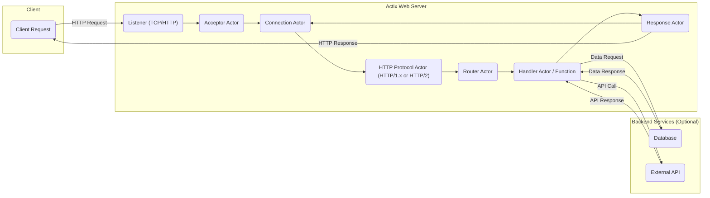
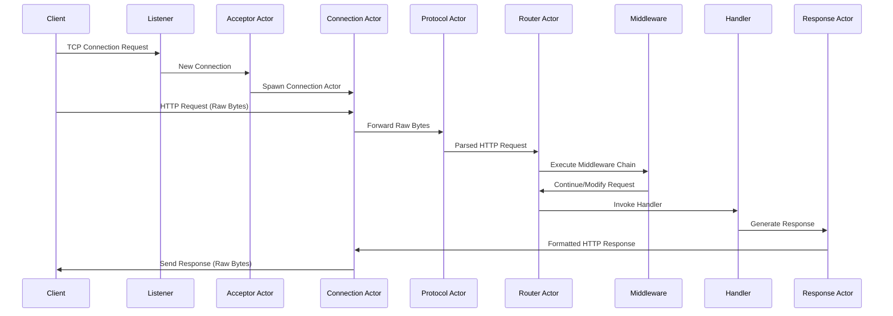

# Project Design Document: Actix Web Framework

**Version:** 1.1
**Date:** October 26, 2023
**Author:** AI Software Architect

## 1. Introduction

This document provides an enhanced architectural design of the Actix Web framework, a powerful, pragmatic, and extremely fast web framework for Rust. Building upon the previous version, this iteration aims for greater clarity and detail, specifically tailored for effective threat modeling. Understanding the framework's structure, component interactions, and data flow is paramount for identifying potential security vulnerabilities.

## 2. Goals and Objectives

The primary goals of Actix Web are:

* **Performance:** Achieve high throughput and low latency in handling concurrent web requests efficiently.
* **Concurrency:** Leverage Rust's ownership and borrowing system, along with its actor model, for safe and highly concurrent operations.
* **Usability:** Provide a developer-friendly and intuitive API for building robust web applications and services.
* **Extensibility:** Allow developers to easily extend the framework's functionality through custom middleware, request extractors, and other composable components.
* **Security:** Provide a secure foundation for building web applications by offering features like TLS support and encouraging secure development practices through its design.

## 3. High-Level Architecture

Actix Web's architecture is fundamentally based on the actor model, enabling high concurrency and fault tolerance. Asynchronous message passing between actors is the core mechanism for handling requests.

**Key Components at a High Level:**

* **Listener:**  The entry point for incoming network connections, responsible for listening on a specified port for TCP traffic.
* **Acceptor Actor:** Accepts new TCP connections from the `Listener` and spawns a dedicated `Connection Actor` to manage each connection.
* **Connection Actor:** Manages the lifecycle of a single TCP connection, handling the flow of raw bytes.
* **HTTP Protocol Actor (HTTP/1.x or HTTP/2):**  Parses incoming raw bytes into HTTP request structures and formats HTTP response structures into raw bytes for transmission. Handles protocol-specific logic.
* **Router Actor:**  Matches incoming HTTP requests to the appropriate handler based on configured routes and dispatches the request.
* **Handler Actor / Function:**  The application-defined logic that processes the request and generates a response. This can be a simple function or a more complex actor.
* **Response Actor:**  Formats the response data into a valid HTTP response, including headers and body.

## 4. Detailed Component Design

This section provides a more in-depth look at each component, highlighting responsibilities and security considerations relevant for threat modeling.

### 4.1. Listener

* **Functionality:** Creates and binds to a network socket, listening for incoming TCP connection requests on a specified address and port.
* **Implementation:** Typically utilizes the standard Rust `TcpListener`.
* **Security Considerations:**
    * **Port Security:**  Ensure the listening port is appropriately secured and not unnecessarily exposed.
    * **Resource Exhaustion:**  Susceptible to SYN flood attacks if not protected by operating system or network-level mechanisms.
    * **TLS Termination Point:** Often the point where TLS encryption is terminated (or happens before, at a reverse proxy). Misconfiguration can lead to vulnerabilities.

### 4.2. Acceptor Actor

* **Functionality:** Accepts new connections from the `Listener` and spawns a new `Connection Actor` to handle the newly established connection. Manages the initial handshake.
* **Concurrency:** Multiple acceptor actors can be employed to handle a high volume of incoming connections concurrently.
* **Implementation:** An Actix actor that receives messages indicating new connection attempts.
* **Security Considerations:**
    * **Resource Exhaustion:**  If the rate of new connections overwhelms the system, it can lead to denial of service.
    * **Connection Limiting:**  Implementing limits on the number of accepted connections can mitigate resource exhaustion attacks.

### 4.3. Connection Actor

* **Functionality:** Manages the state of a single TCP connection. Receives raw bytes from the socket and forwards them to the `HTTP Protocol Actor`. Receives formatted response bytes from the `Response Actor` and sends them back over the socket.
* **Lifecycle:** Exists for the duration of the TCP connection.
* **Implementation:** An Actix actor, often with per-connection state.
* **Security Considerations:**
    * **Data Confidentiality and Integrity:** Relies on underlying TLS encryption (if enabled) for secure communication.
    * **Connection Hijacking:**  Vulnerable if the underlying TCP connection is compromised.
    * **Resource Management:**  Needs to manage resources (e.g., buffers) efficiently to prevent leaks or exhaustion.

### 4.4. HTTP Protocol Actor (HTTP/1.x and HTTP/2)

* **Functionality:**
    * **Request Parsing:** Parses raw bytes received from the `Connection Actor` into structured HTTP request objects (headers, body, method, path, etc.).
    * **Response Formatting:** Formats HTTP response objects into raw bytes for transmission back to the client.
    * **Protocol Handling:** Implements the specific rules and semantics of the HTTP/1.1 or HTTP/2 protocol, including header parsing, body handling (chunked encoding, content length), and connection management (keep-alive, multiplexing).
* **Implementation:**  Leverages libraries like `httparse` for HTTP/1.x and `h2` for HTTP/2.
* **Security Considerations:**
    * **HTTP Request Smuggling:**  Vulnerabilities in parsing logic can allow attackers to inject malicious requests.
    * **Header Injection:**  Improper handling of headers can lead to security issues.
    * **Response Splitting:**  Flaws in response formatting can allow attackers to inject arbitrary content.
    * **Denial of Service:**  Malformed requests can potentially crash the parser or consume excessive resources.

### 4.5. Router Actor

* **Functionality:** Receives parsed HTTP request objects from the `HTTP Protocol Actor`. Matches the request's method and path to a registered route. Executes associated middleware and dispatches the request to the appropriate `Handler Actor / Function`.
* **Routing Logic:** Supports various routing patterns, including exact matches, path parameters, and wildcards.
* **Middleware Execution:** Manages the execution of registered middleware functions in a defined order.
* **Implementation:**  Often uses a tree-like structure (e.g., a trie) for efficient route matching.
* **Security Considerations:**
    * **Route Hijacking:**  Overlapping or poorly defined routes can lead to unintended handlers being invoked.
    * **Exposure of Sensitive Endpoints:**  Incorrectly configured routes can expose administrative or internal endpoints.
    * **Middleware Vulnerabilities:**  Security flaws in middleware can affect all routes it applies to.

### 4.6. Handler Actor / Function

* **Functionality:** Contains the core application logic. Receives a request object (potentially with extracted data) and generates a response. May interact with databases, external APIs, or other services.
* **Implementation:** Can be a simple Rust function or an Actix actor, allowing for more complex state management and asynchronous operations.
* **Security Considerations:**
    * **Application-Specific Vulnerabilities:**  The primary location for common web application vulnerabilities such as SQL injection, cross-site scripting (XSS), command injection, and business logic flaws.
    * **Data Validation and Sanitization:**  Crucial to validate and sanitize all user-provided input before processing.
    * **Authorization Checks:**  Ensuring that the user has the necessary permissions to perform the requested action.

### 4.7. Response Actor

* **Functionality:** Receives a response object from the `Handler Actor / Function`. Formats the response into a valid HTTP response, including setting headers (e.g., content type, caching directives), encoding the response body, and setting the HTTP status code. Sends the formatted response back to the `Connection Actor`.
* **Implementation:** Handles setting appropriate headers and serializing the response body.
* **Security Considerations:**
    * **Header Injection:**  Care must be taken to prevent attackers from injecting malicious headers through the application logic.
    * **Information Disclosure:**  Error responses should not reveal sensitive information.
    * **CORS Misconfiguration:**  Incorrectly configured CORS headers can lead to security vulnerabilities.

### 4.8. Middleware

* **Functionality:** Functions or actors that intercept requests before they reach the handler and/or responses before they are sent to the client. Allows for cross-cutting concerns to be addressed.
* **Use Cases:** Logging, authentication, authorization, request modification, response modification, compression, security headers.
* **Implementation:** Registered with the `Router` and executed in a specific order, forming a chain of responsibility.
* **Security Considerations:**
    * **Authentication and Authorization Bypass:**  Vulnerabilities in authentication or authorization middleware can grant unauthorized access.
    * **Security Header Misconfiguration:**  Incorrectly set security headers can weaken the application's security posture.
    * **Data Tampering:**  Middleware that modifies requests or responses needs to be carefully implemented to prevent malicious manipulation.

### 4.9. Extractors

* **Functionality:**  Facilitate the extraction of data from the incoming request (e.g., path parameters, query parameters, request body, headers) and convert it into usable types for the handler. Simplifies access to request data.
* **Implementation:**  Leverages Rust's type system and traits for flexible and type-safe data extraction.
* **Security Considerations:**
    * **Injection Attacks:**  If extractors do not perform proper validation and sanitization, they can be vulnerable to injection attacks.
    * **Data Type Mismatches:**  Errors in extraction logic can lead to unexpected behavior or vulnerabilities.

## 5. Data Flow

The typical data flow for an incoming HTTP request through the Actix Web framework is as follows:

1. **Client sends an HTTP request to the server.**
2. **The Listener accepts the incoming TCP connection.**
3. **The Acceptor Actor spawns a dedicated Connection Actor for this connection.**
4. **The Connection Actor receives raw bytes from the socket.**
5. **The HTTP Protocol Actor parses the raw bytes into a structured HTTP request object.**
6. **The Router Actor matches the request to a defined route and its associated middleware.**
7. **The registered Middleware chain is executed in order, potentially modifying the request or response.**
8. **The Router Actor invokes the appropriate Handler Actor or function.**
9. **The Handler processes the request, potentially interacting with backend services, and generates a response.**
10. **The Response Actor formats the response into a valid HTTP response.**
11. **The Connection Actor sends the formatted response (as raw bytes) back over the socket.**
12. **The Client receives the HTTP response.**

## 6. Security Considerations (Detailed for Threat Modeling)

This section expands on the preliminary security considerations, providing more specific details relevant for threat modeling activities.

* **Input Validation:**
    * **Attack Surface:** Request headers, URL parameters, request body (all content types).
    * **Threats:** Injection attacks (SQL, command, XSS), buffer overflows, data corruption.
    * **Mitigation:** Implement robust validation and sanitization for all input data using appropriate libraries and techniques. Employ allow-listing where possible.
* **Authentication and Authorization:**
    * **Attack Surface:** Login forms, API endpoints, protected resources.
    * **Threats:** Unauthorized access, privilege escalation, data breaches.
    * **Mitigation:** Use established authentication protocols (e.g., OAuth 2.0, OpenID Connect). Implement role-based access control (RBAC) or attribute-based access control (ABAC). Securely store credentials (hashing, salting).
* **Session Management:**
    * **Attack Surface:** Session cookies, session storage mechanisms.
    * **Threats:** Session hijacking, session fixation, replay attacks.
    * **Mitigation:** Use secure session IDs (cryptographically random). Implement secure cookie attributes (HttpOnly, Secure, SameSite). Implement session timeouts and renewals.
* **TLS/HTTPS:**
    * **Attack Surface:** Network communication between client and server.
    * **Threats:** Man-in-the-middle attacks, eavesdropping, data tampering.
    * **Mitigation:** Enforce HTTPS. Use strong TLS configurations (disable weak ciphers). Implement HSTS (HTTP Strict Transport Security). Ensure valid and up-to-date SSL/TLS certificates.
* **CORS (Cross-Origin Resource Sharing):**
    * **Attack Surface:** Browser-based requests from different origins.
    * **Threats:** Unauthorized access to resources from malicious websites.
    * **Mitigation:** Configure CORS policies restrictively, allowing only trusted origins. Avoid using wildcard (`*`) for `Access-Control-Allow-Origin` in production.
* **Denial of Service (DoS):**
    * **Attack Surface:** All network entry points.
    * **Threats:** Service unavailability, resource exhaustion.
    * **Mitigation:** Implement rate limiting, request size limits, connection limits. Use load balancing and auto-scaling. Consider using a Web Application Firewall (WAF).
* **Dependency Management:**
    * **Attack Surface:** Third-party libraries and crates.
    * **Threats:** Exploitation of known vulnerabilities in dependencies.
    * **Mitigation:** Regularly audit and update dependencies. Use dependency scanning tools. Employ Software Composition Analysis (SCA).
* **Error Handling:**
    * **Attack Surface:** Error responses and logging mechanisms.
    * **Threats:** Information disclosure (stack traces, internal details).
    * **Mitigation:** Implement generic error messages for clients. Log detailed error information securely. Avoid exposing sensitive data in error responses.
* **HTTP Protocol Vulnerabilities:**
    * **Attack Surface:** HTTP request parsing and response formatting logic.
    * **Threats:** Request smuggling, header injection, response splitting.
    * **Mitigation:** Use well-vetted HTTP parsing libraries. Follow secure coding practices when handling headers and bodies.
* **Middleware Security:**
    * **Attack Surface:** Custom and third-party middleware components.
    * **Threats:** Introduction of new vulnerabilities, bypass of security controls.
    * **Mitigation:** Thoroughly review and test all middleware components. Follow secure development practices when creating custom middleware.
* **Resource Exhaustion:**
    * **Attack Surface:**  Any part of the application that consumes resources (memory, CPU, file handles, etc.).
    * **Threats:**  Application crashes, service unavailability.
    * **Mitigation:**  Implement resource limits and quotas. Employ techniques like connection pooling and efficient memory management.

## 7. Deployment Considerations

Actix Web applications can be deployed in various environments, each with its own security implications:

* **Bare Metal Servers:** Requires manual configuration and security hardening of the operating system and network.
* **Virtual Machines (VMs):** Offers isolation but still requires careful configuration and patching of the VM image. Cloud providers offer security features that can be leveraged.
* **Containers (Docker, Podman):** Provides a consistent and isolated environment. Security depends on the base image, container configuration, and orchestration platform security.
* **Serverless Platforms (e.g., AWS Lambda with custom runtime):**  Security is largely managed by the platform provider, but the application code still needs to be secure.

Common deployment practices include:

* **Reverse Proxy (e.g., Nginx, HAProxy):**  Essential for TLS termination, load balancing, and adding a layer of security (e.g., WAF integration).
* **Process Manager (e.g., systemd):**  Ensures the application runs reliably and can be restarted if it crashes.
* **Firewalls:**  Control network access to the application.

## 8. Technologies Used

* **Rust:**  The core programming language, providing memory safety and performance.
* **Tokio:**  The asynchronous runtime that powers Actix Web's concurrency model.
* **HTTP Parsing Libraries (e.g., `httparse`, `h2`):**  For efficient and correct handling of HTTP protocols.
* **Actix Ecosystem Crates:**  A collection of crates providing functionalities like web sockets, HTTP client, and more.
* **Various Third-Party Crates:**  For tasks like serialization (e.g., `serde`), database interaction (e.g., `sqlx`), and cryptography (e.g., `ring`).

## 9. Future Considerations

* **Enhanced HTTP/3 Support:**  Full support for the latest HTTP protocol version, including QUIC.
* **Improved Observability and Monitoring Tools:**  Better integration with tracing and metrics systems.
* **More Granular Control over Resource Limits:**  Allowing developers to fine-tune resource usage for different parts of the application.

This enhanced design document provides a more detailed and security-focused overview of the Actix Web framework's architecture. This information is intended to be a valuable resource for conducting thorough threat modeling and implementing appropriate security measures.