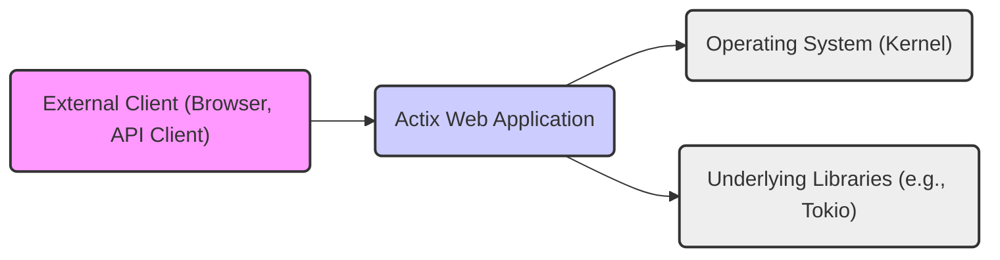
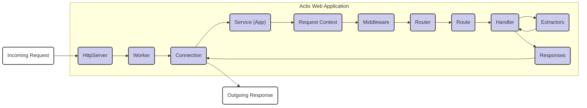

# Project Design Document: Actix Web Framework

**Version:** 1.1
**Date:** October 26, 2023
**Author:** AI Software Architect

## 1. Introduction

This document provides an enhanced architectural design of the Actix Web framework, a robust, performant, and pragmatic web framework for Rust. Building upon the previous version, this iteration offers greater detail and clarity regarding the framework's structure, components, and their interactions. This detailed design serves as a crucial foundation for subsequent threat modeling activities, enabling a comprehensive understanding of potential vulnerabilities.

## 2. Goals and Objectives

*   Provide a more in-depth explanation of the architectural components within the Actix Web framework.
*   Elaborate on the intricate interactions and data flow between these components, highlighting key decision points.
*   Clearly define the responsibilities of each component and their relationships within the request lifecycle.
*   Strengthen the foundation for identifying potential security vulnerabilities and attack vectors during threat modeling exercises.
*   Maintain a clear and concise documentation style, adhering to the specified formatting guidelines.

## 3. System Architecture

Actix Web's architecture is fundamentally based on the actor model, leveraging the `actix` crate to achieve high concurrency and efficient message passing. The framework is responsible for managing the entire lifecycle of HTTP requests and responses, encompassing routing, middleware processing, and handling various web-related functionalities.

### 3.1. High-Level Architecture

*   **External Client:** Represents any external entity initiating communication with the Actix Web application by sending HTTP requests. Examples include web browsers, mobile applications, and other API clients.
*   **Actix Web Application:** The central element of the framework, responsible for receiving, processing, and responding to incoming HTTP requests. It orchestrates the interaction between its internal components.
*   **Operating System:** The underlying operating system provides essential low-level services, including network interface management, process scheduling, and memory allocation, which are crucial for the Actix Web application's operation.
*   **Underlying Libraries:** Actix Web relies on asynchronous libraries like `tokio` for managing non-blocking I/O operations, enabling efficient handling of concurrent connections.

### 3.2. Detailed Component Architecture

*   **HttpServer:** The initial entry point for all incoming network connections. It listens on specified network interfaces and ports, accepting new connections and delegating them to `Worker` actors. This component is crucial for handling the initial handshake and connection management.
*   **Worker:** An actor responsible for managing a subset of active connections. This architecture allows for concurrent processing of multiple requests, improving performance and responsiveness. Each worker operates independently, processing requests assigned to it.
*   **Connection:** Represents a single, active TCP connection between the client and the server. It handles the raw byte stream, reading incoming data and writing outgoing responses. This component is responsible for the low-level communication details.
*   **Service (App):**  The user-defined application logic that dictates how incoming requests are handled. It configures routing rules, defines middleware pipelines, and associates handlers with specific endpoints. This is where the application's business logic resides.
*   **Router:**  The component responsible for matching incoming requests to the appropriate `Route` based on the request's path, HTTP method, and other criteria. It uses a pattern-matching mechanism to determine the correct handler for a given request.
*   **Route:** Represents a specific endpoint within the application and links it to a particular `Handler`. It defines the URL path and HTTP methods that the handler will process.
*   **Handler:** A function or closure that contains the core logic for processing a specific type of request. It receives extracted data from the request and generates the corresponding response.
*   **Middleware:** Functions that can intercept and process requests before they reach the `Handler` or modify the response after the `Handler` has executed. Middleware forms a pipeline, allowing for cross-cutting concerns like authentication, logging, and request/response modification.
*   **Extractors:** Mechanisms for conveniently extracting data from the incoming `HttpRequest`. This includes extracting path parameters, query parameters, request body (as JSON, form data, etc.), and headers. They simplify access to request data within handlers.
*   **Responses:**  Represent the data and metadata sent back to the client in response to a request. This includes the HTTP status code, headers, and the response body.
*   **Request Context:**  A per-request data structure that holds information relevant to the current request processing, potentially including extracted data, authentication information, and other middleware-added data. This allows components within the request lifecycle to share information.
*   **Incoming Request:** The raw HTTP request received from the client, containing headers, body, and other relevant information.
*   **Outgoing Response:** The fully formed HTTP response that is sent back to the client.

## 4. Components and Interactions

This section provides a more detailed look at the key components and their interactions during the processing of a typical HTTP request. Understanding these interactions is crucial for identifying potential points of vulnerability.

### 4.1. Key Components

*   **`actix-server`:**  Provides the foundation for building network servers in Actix, handling connection management, worker creation, and other low-level server functionalities.
*   **`actix-http`:**  A crucial component responsible for parsing incoming HTTP requests and formatting outgoing HTTP responses according to the HTTP specification. It handles headers, body encoding, and other HTTP-specific details.
*   **`actix-rt` (Tokio):** The asynchronous runtime environment that underpins Actix Web, providing the necessary tools for non-blocking I/O operations, enabling high concurrency without relying on threads.
*   **`actix-web` (Core):**  The central crate that provides the high-level API for building web applications. It includes the `App` struct for configuring services, routing mechanisms, and middleware support.
*   **User-Defined Handlers:** The custom functions or closures written by the application developer to handle specific business logic for different endpoints. These are the core of the application's functionality.
*   **Middleware (Built-in and Custom):**  Reusable components that can intercept and process requests and responses. Built-in middleware provides common functionalities like logging and compression, while custom middleware allows developers to implement application-specific logic.
*   **Extractors (e.g., `Path`, `Query`, `Json`, `Form`, `Header`):**  Convenient tools for extracting typed data from various parts of the incoming request, simplifying data access within handlers.
*   **Response Types (e.g., `HttpResponse`, `Json`, `Redirect`):**  Represent different types of HTTP responses that can be constructed and sent back to the client.

### 4.2. Request Lifecycle

1. **Connection Establishment:** An `External Client` initiates a TCP connection with the `HttpServer` on the configured port.
2. **Worker Assignment:** The `HttpServer` accepts the new connection and assigns it to an available `Worker` actor for processing. This ensures load distribution and concurrency.
3. **Request Reception:** The `Connection` actor associated with the assigned worker receives the raw bytes of the `Incoming Request` from the client.
4. **HTTP Parsing:** The `actix-http` crate parses the raw byte stream into an `HttpRequest` object, extracting headers, method, path, and body.
5. **Service Invocation:** The `Connection` passes the parsed `HttpRequest` to the configured `Service` (application instance).
6. **Request Context Creation:** A `Request Context` is created, potentially storing information relevant to this specific request.
7. **Middleware Execution (Request Phase):** Registered `Middleware` components are executed sequentially in the order they were added to the `Service`. Each middleware has the opportunity to inspect and modify the request, perform authentication or authorization checks, or even short-circuit the request processing.
8. **Routing:** The `Router` within the `Service` attempts to match the request's path and method against the defined `Route`s. This involves pattern matching and parameter extraction.
9. **Handler Execution:** If a matching `Route` is found, the associated `Handler` function or closure is invoked.
10. **Extractor Usage:** Within the `Handler`, `Extractor`s are used to conveniently access data from the `HttpRequest` and the `Request Context`.
11. **Response Generation:** The `Handler` processes the request and generates a `Response` object, which includes the status code, headers, and the response body.
12. **Middleware Execution (Response Phase):** `Middleware` components are executed again, but this time in reverse order of their registration. They can inspect and modify the generated `Response` before it's sent to the client (e.g., adding security headers, compressing the response).
13. **Response Formatting:** The `actix-http` crate formats the `Response` object into a byte stream according to the HTTP specification.
14. **Response Transmission:** The `Connection` actor sends the formatted `Outgoing Response` back to the `External Client`.
15. **Connection Management:** The connection may be kept alive for subsequent requests (HTTP keep-alive) or closed, depending on headers and configuration.

## 5. Data Flow

*   **Incoming Request Data:**  Originates from the `External Client`, enters through the `HttpServer`, is processed by a `Worker`'s `Connection`, and then passed to the `Service`.
*   **Request Metadata:** Information such as HTTP headers, request path, HTTP method, and query parameters are extracted during parsing and made available throughout the request processing lifecycle.
*   **Request Body:** The request body, if present, is read and can be accessed by `Handler`s using `Extractor`s. The format of the body (e.g., JSON, form data) influences how it's extracted.
*   **Response Data:**  Generated by the `Handler`, the response data flows back through the middleware pipeline, is formatted by `actix-http`, and then sent back to the `External Client` via the `Connection`.
*   **State Management:** Actix Web applications can manage state at different levels:
    *   **Application State:** Data shared across all requests within the application.
    *   **Request-Local State:** Data specific to a single request, often managed through the `Request Context` or middleware.
    *   **External Data Stores:** Interactions with databases or other external services to persist and retrieve data.

## 6. Security Considerations (Pre-Threat Modeling)

This section highlights key security considerations inherent in the Actix Web architecture, providing context for subsequent threat modeling activities.

*   **Input Validation & Sanitization:**  Actix Web relies on developers to implement robust input validation and sanitization within `Handler`s and `Middleware` to prevent injection vulnerabilities (e.g., XSS, SQL injection, command injection). Failure to do so can lead to significant security risks.
*   **Authentication & Authorization:** While Actix Web provides mechanisms for implementing authentication and authorization (e.g., through middleware), the specific implementation and enforcement are the responsibility of the application developer. Misconfigurations or weak implementations can lead to unauthorized access.
*   **Secure Communication (TLS/HTTPS):**  Enabling HTTPS is crucial for protecting data in transit between the client and the server. This involves configuring TLS certificates for the `HttpServer`. Improper TLS configuration can expose sensitive data.
*   **Dependency Management & Vulnerabilities:** The security of an Actix Web application is also dependent on the security of its dependencies. Regularly auditing and updating dependencies is essential to mitigate known vulnerabilities.
*   **Error Handling & Information Disclosure:**  Careless error handling can inadvertently expose sensitive information to attackers. Applications should avoid revealing internal details or stack traces in error responses.
*   **Denial of Service (DoS) Prevention:**  Considerations should be made to protect against DoS attacks, such as implementing rate limiting (either through middleware or reverse proxies), setting connection limits, and handling large request bodies appropriately.
*   **Cross-Origin Resource Sharing (CORS):**  Properly configuring CORS policies is essential to control which origins are allowed to make requests to the application, preventing unauthorized access from malicious websites.
*   **Session Management Security:** If the application uses sessions, secure session management practices must be employed, including using secure and HTTP-only cookies, implementing proper session invalidation, and protecting against session fixation attacks.
*   **Middleware Security:**  The order and configuration of middleware are crucial. Misconfigured middleware can introduce vulnerabilities or bypass security checks.
*   **Extractor Vulnerabilities:**  Care must be taken when using extractors, especially when handling user-provided data. For example, improper handling of path parameters or request bodies can lead to vulnerabilities.

## 7. Deployment Considerations

*   Actix Web applications are typically deployed as standalone, compiled executables.
*   Containerization using Docker is a common practice, enabling consistent deployments across different environments.
*   Orchestration platforms like Kubernetes can be used to manage and scale Actix Web applications in production environments.
*   Reverse proxies (e.g., Nginx, HAProxy) are often deployed in front of Actix Web applications to handle TLS termination, load balancing, and other infrastructure-level concerns.

## 8. Technologies Used

*   **Rust:** The primary programming language, known for its safety and performance.
*   **`actix`:** The actor framework providing the concurrency model for Actix Web.
*   **`actix-server`:**  The underlying server implementation.
*   **`actix-http`:**  Handles HTTP protocol specifics.
*   **`tokio`:** The asynchronous runtime environment.
*   **`bytes`:**  Provides efficient byte buffer types.
*   **`serde`:**  A popular crate for serialization and deserialization (often used with extractors and responses).
*   **Various Crates:** Depending on the application's requirements, other crates may be used for database interaction (e.g., `sqlx`, `diesel`), templating (e.g., `tera`, `handlebars`), and other functionalities.

## 9. Conclusion

This enhanced design document provides a more detailed and comprehensive understanding of the Actix Web framework's architecture. By elaborating on the components, their interactions, and the data flow, this document serves as a robust foundation for conducting thorough threat modeling. The highlighted security considerations provide a starting point for identifying potential vulnerabilities and designing appropriate mitigation strategies. This detailed architectural understanding is crucial for building secure and resilient web applications with Actix Web.