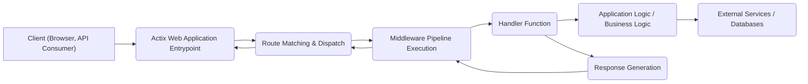
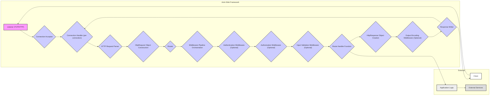

# Project Design Document: Actix Web Framework

**Version:** 1.1
**Date:** October 26, 2023
**Author:** Gemini (AI Language Model)

## 1. Introduction

This document provides an enhanced architectural design of the Actix Web framework, a powerful, pragmatic, and extremely fast web framework for Rust. This revised document is specifically tailored to serve as a robust foundation for subsequent threat modeling activities. It offers a more detailed exploration of the key components, data flow, and interactions within the framework, with a heightened focus on areas relevant to security considerations.

## 2. Goals and Objectives

The primary goal of this document remains to provide a comprehensive architectural overview of Actix Web to facilitate effective threat modeling. Specific objectives have been refined and expanded:

*   Clearly identifying and elaborating on the major components of the Actix Web framework, including their specific responsibilities.
*   Illustrating the flow of data during request processing with greater detail, highlighting potential transformation points.
*   Describing the interactions between different components, emphasizing security-relevant communication pathways.
*   Highlighting potential security-relevant aspects of the design with specific examples of potential vulnerabilities.
*   Providing a robust basis for identifying potential vulnerabilities, attack vectors, and security controls.
*   Offering insights into deployment considerations and their impact on the security posture.

## 3. High-Level Architecture

The high-level architecture of Actix Web, based on the actor model and asynchronous operations, is visualized as follows:

*   **Client (Browser, API Consumer):**  Any entity initiating an HTTP request to the Actix Web application. This could be a web browser, a mobile application, or another service.
*   **Actix Web Application Entrypoint:** The initial point of contact for incoming requests, responsible for setting up the application environment and initiating request processing.
*   **Route Matching & Dispatch:**  The component responsible for analyzing the incoming request's path and method and determining the appropriate handler function to invoke.
*   **Middleware Pipeline Execution:**  The sequence of middleware components that intercept and process requests and responses, enabling cross-cutting concerns.
*   **Handler Function:** The specific asynchronous function or block of code designed to handle a particular route and implement the core application logic for that endpoint.
*   **Application Logic / Business Logic:** The custom code developed by the application developer to fulfill specific business requirements and process data.
*   **External Services / Databases:**  External systems that the application interacts with, such as databases, third-party APIs, message queues, or other microservices.
*   **Response Generation:** The process of constructing the HTTP response to be sent back to the client, including setting headers, status codes, and the response body.

## 4. Detailed Architecture and Components

The following diagram provides a more granular view of the request processing flow within Actix Web, emphasizing security-relevant stages:

Detailed descriptions of key components:

*   **Listener (TCP/HTTP):**  Accepts incoming TCP connections on the configured port. This is the entry point for all network traffic. Potential vulnerabilities here involve denial-of-service attacks at the network level.
*   **Connection Acceptor:**  Handles the acceptance of new connections and delegates them to individual connection handlers.
*   **Connection Handler (per connection):** Manages the lifecycle of a single client connection. This component is responsible for reading data from the socket and writing responses back. Security considerations include managing connection limits and preventing resource exhaustion.
*   **HTTP Request Parser:**  Parses the raw HTTP request data into a structured format. Vulnerabilities in the parser can lead to HTTP request smuggling, buffer overflows, or other injection attacks if not implemented robustly according to HTTP specifications.
*   **HttpRequest Object Construction:** Creates the `HttpRequest` object, which encapsulates all the information about the incoming request (headers, method, path, body, etc.).
*   **Router:** Matches the incoming request's path and method to a registered route handler. Misconfiguration of routes can lead to unintended access or exposure of functionality.
*   **Middleware Pipeline Orchestration:** Executes the configured middleware components in a defined order. This is a critical point for implementing security controls.
*   **Authentication Middleware (Optional):** Verifies the identity of the client making the request. Failure to implement or properly configure authentication middleware can lead to unauthorized access.
*   **Authorization Middleware (Optional):** Determines if the authenticated client has the necessary permissions to access the requested resource. Improper authorization can lead to privilege escalation.
*   **Input Validation Middleware (Optional):** Validates the incoming request data to ensure it conforms to expected formats and constraints. This helps prevent injection attacks and data corruption.
*   **Route Handler Function:** The specific function responsible for handling the request and generating a response. This is where application-specific vulnerabilities like SQL injection, cross-site scripting (XSS), and business logic flaws can occur.
*   **HttpResponse Object Creation:** Creates the `HttpResponse` object, which contains the status code, headers, and body of the response.
*   **Output Encoding Middleware (Optional):** Encodes the response data to prevent vulnerabilities like XSS. This middleware ensures that data sent to the client is safe to render.
*   **Response Writer:** Serializes the `HttpResponse` object into raw HTTP data and sends it back to the client.

## 5. Data Flow (with Security Focus)

The flow of data through Actix Web, with an emphasis on security-relevant transformations and checks:

1. A **Client** sends an HTTP request containing potentially malicious data.
2. The **Listener** accepts the connection.
3. The **Connection Handler** receives the raw request data.
4. The **HTTP Request Parser** attempts to parse the raw data. **Potential vulnerability:** Malformed requests could exploit parser weaknesses.
5. The **HttpRequest Object** is constructed, holding the potentially malicious data.
6. The **Router** matches the request to a **Route Handler**. **Potential vulnerability:** Incorrect routing can expose unintended endpoints.
7. The **Middleware Pipeline** executes:
    *   **Authentication Middleware:** Verifies the client's identity. **Security control:** Prevents unauthorized access.
    *   **Authorization Middleware:** Checks if the client has permission. **Security control:** Enforces access control.
    *   **Input Validation Middleware:** Validates request data. **Security control:** Prevents injection attacks and data corruption. **Potential vulnerability:** Insufficient or incorrect validation.
8. The **Route Handler Function** processes the request data. **Potential vulnerabilities:** Application-level flaws like SQL injection, XSS, insecure deserialization, etc.
9. The **Route Handler Function** generates data for the **HttpResponse**.
10. The **Output Encoding Middleware** encodes the response data. **Security control:** Prevents XSS attacks. **Potential vulnerability:** Incorrect or missing encoding.
11. The **Response Writer** sends the response back to the **Client**.

## 6. Security Considerations (Expanded)

This section expands on the security considerations, providing more specific examples and potential threats:

*   **HTTP Parsing Vulnerabilities:**
    *   **Threats:** HTTP Request Smuggling, Buffer Overflows, Denial of Service.
    *   **Mitigation:** Rely on Actix Web's underlying HTTP parsing library (likely `httparse` or `tokio-util`) and ensure it's regularly updated. Be aware of potential vulnerabilities in the specific parser version.
*   **Routing Misconfiguration:**
    *   **Threats:** Unauthorized Access, Information Disclosure, Functionality Exposure.
    *   **Mitigation:** Implement robust routing logic, avoid overly permissive wildcards, and carefully review route definitions.
*   **Middleware Security:**
    *   **Threats:** Bypass of security controls, vulnerabilities within custom middleware.
    *   **Mitigation:** Thoroughly test and review custom middleware. Use well-established and vetted middleware libraries for common security tasks. Ensure proper ordering of middleware.
*   **Route Handler Vulnerabilities:**
    *   **Threats:** SQL Injection, Cross-Site Scripting (XSS), Cross-Site Request Forgery (CSRF), Insecure Deserialization, Business Logic Flaws.
    *   **Mitigation:** Implement secure coding practices, perform input validation and output encoding, use parameterized queries, implement CSRF protection, and carefully design business logic.
*   **Data Handling and Storage:**
    *   **Threats:** Data breaches, unauthorized access to sensitive information.
    *   **Mitigation:** Encrypt sensitive data at rest and in transit (HTTPS), sanitize data before storage, follow least privilege principles for database access.
*   **Authentication and Authorization Flaws:**
    *   **Threats:** Unauthorized access, privilege escalation.
    *   **Mitigation:** Implement strong authentication mechanisms (e.g., OAuth 2.0, OpenID Connect), use robust authorization models (e.g., RBAC, ABAC), and avoid storing credentials directly in the application.
*   **Input Validation Failures:**
    *   **Threats:** Injection attacks (SQL, command, etc.), data corruption, denial of service.
    *   **Mitigation:** Implement comprehensive input validation on all user-supplied data, validate data types, formats, and ranges. Use allow-lists rather than deny-lists.
*   **Output Encoding Negligence:**
    *   **Threats:** Cross-Site Scripting (XSS).
    *   **Mitigation:** Encode output data based on the context (HTML escaping, JavaScript escaping, URL encoding). Utilize Actix Web's built-in tools or established libraries for output encoding.
*   **Error Handling and Logging (Security Perspective):**
    *   **Threats:** Information leakage through verbose error messages, insufficient logging for security audits.
    *   **Mitigation:** Implement generic error messages for clients, log detailed error information securely, and monitor logs for suspicious activity.
*   **Dependency Vulnerabilities:**
    *   **Threats:** Exploitation of known vulnerabilities in third-party libraries.
    *   **Mitigation:** Regularly update dependencies, use dependency scanning tools to identify vulnerabilities, and carefully evaluate the security posture of external libraries.
*   **Asynchronous Programming Risks:**
    *   **Threats:** Race conditions, deadlocks, and other concurrency issues that can lead to security vulnerabilities.
    *   **Mitigation:** Employ safe concurrency patterns, use appropriate synchronization primitives, and thoroughly test asynchronous code.

## 7. Deployment Considerations (Security Implications)

The deployment environment significantly impacts the security of an Actix Web application:

*   **Containerization (Docker, Podman):** Provides isolation and can limit the impact of vulnerabilities. Use minimal base images and follow container security best practices.
*   **Cloud Platforms (AWS, Azure, GCP):** Offer various security services (firewalls, WAFs, intrusion detection). Leverage these services to enhance security. Configure security groups and network access controls appropriately.
*   **Reverse Proxies (Nginx, Apache):** Can provide an additional layer of security, including TLS termination, request filtering, and load balancing. Configure reverse proxies securely to prevent bypasses.
*   **Operating System Security:** Keep the underlying operating system and its components updated to patch vulnerabilities. Harden the OS according to security best practices.
*   **Network Security:** Implement firewalls and network segmentation to restrict access to the application and its dependencies.

## 8. Future Considerations

As Actix Web evolves, this design document should be revisited and updated. Future considerations include:

*   Changes to the framework's internal architecture.
*   New features or components introduced in Actix Web.
*   Emerging security threats and best practices.
*   Adoption of new Rust language features that impact security.

This enhanced design document provides a more detailed and security-focused view of the Actix Web framework, making it a more effective tool for threat modeling and security analysis. By understanding the intricacies of the architecture and potential vulnerabilities, developers and security professionals can build more secure and resilient applications.