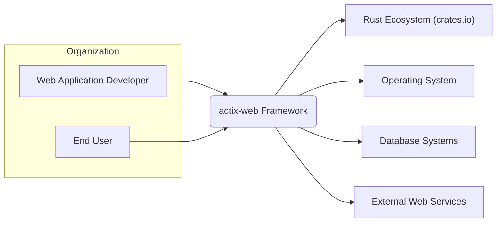
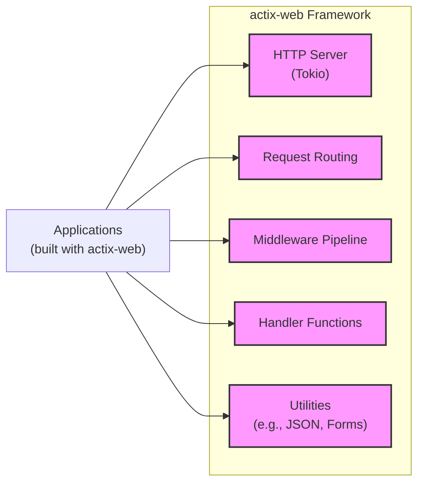
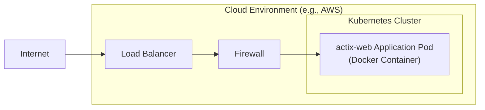
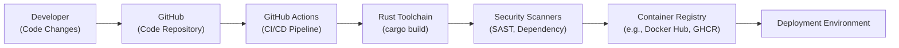

# BUSINESS POSTURE

This project, represented by the GitHub repository `actix/actix-web`, aims to provide a fast, ergonomic, and reliable web framework for Rust. It targets developers who want to build web applications and services using the Rust programming language, leveraging its performance and safety features.

- Business Priorities:
  - High Performance: `actix-web` prioritizes speed and efficiency in handling web requests.
  - Developer Ergonomics: The framework aims to be easy to use and understand for Rust developers, promoting productivity.
  - Reliability and Stability: Ensuring the framework is robust and dependable for building production applications.
  - Community Growth: Fostering a strong and active community around the framework to drive adoption and contribution.

- Business Goals:
  - Become a leading web framework in the Rust ecosystem.
  - Enable developers to build high-performance and secure web applications quickly.
  - Attract and retain a large and active community of users and contributors.

- Business Risks:
  - Security Vulnerabilities: Flaws in the framework could expose applications built with `actix-web` to security risks, damaging reputation and user trust.
  - Performance Bottlenecks: Inefficiencies in the framework could limit the performance of applications, hindering adoption for performance-critical use cases.
  - Community Fragmentation: Lack of community engagement or disagreements within the community could slow down development and adoption.
  - Dependency Issues: Problems with underlying dependencies could impact the stability and security of `actix-web`.

# SECURITY POSTURE

- Security Controls:
  - security control: Memory Safety: Rust's core language features provide inherent memory safety, reducing vulnerabilities like buffer overflows and use-after-free errors. Implemented by Rust compiler.
  - security control: Type System: Rust's strong type system helps prevent type-related errors that can lead to security issues. Implemented by Rust compiler.
  - security control: Dependency Management: Cargo, Rust's package manager, facilitates dependency management and versioning, aiding in controlling dependency-related risks. Implemented by Cargo.
  - security control: HTTPS Support: `actix-web` supports HTTPS for secure communication. Implemented within `actix-web` and underlying libraries like `tokio-rustls` or `native-tls`.
  - security control: Middleware: `actix-web` provides middleware functionality that can be used to implement security features like authentication, authorization, and request logging. Implemented within `actix-web`.
  - security control: Community Review: As an open-source project, the code is subject to community review, which can help identify potential security vulnerabilities. Implemented by GitHub and community contribution process.

- Accepted Risks:
  - accepted risk: Dependency Vulnerabilities: Despite dependency management, vulnerabilities can still exist in dependencies, requiring monitoring and updates.
  - accepted risk: Logic Errors: Application-level logic errors introduced by developers using `actix-web` are outside the scope of the framework's direct control.
  - accepted risk: Denial of Service: Web applications are inherently susceptible to denial-of-service attacks, and `actix-web` applications are no exception.
  - accepted risk: Configuration Errors: Misconfiguration of `actix-web` or the underlying deployment environment can introduce security vulnerabilities.

- Recommended Security Controls:
  - security control: Static Analysis Security Testing (SAST): Integrate SAST tools into the development pipeline to automatically scan the `actix-web` codebase for potential vulnerabilities.
  - security control: Dependency Scanning: Implement automated dependency scanning to detect and alert on known vulnerabilities in `actix-web`'s dependencies.
  - security control: Fuzzing: Employ fuzzing techniques to automatically test `actix-web` for unexpected behavior and potential vulnerabilities by providing invalid or malformed inputs.
  - security control: Security Audits: Conduct periodic security audits by external security experts to identify and address potential security weaknesses in the framework.
  - security control: Security Training for Contributors: Provide security training to contributors to raise awareness of secure coding practices and common web security vulnerabilities.
  - security control: Vulnerability Disclosure Policy: Establish a clear vulnerability disclosure policy to guide security researchers and users on how to report potential security issues.

- Security Requirements:
  - Authentication: `actix-web` should provide mechanisms and guidance for implementing various authentication methods (e.g., session-based, token-based) in applications built with it.
  - Authorization: The framework should facilitate the implementation of fine-grained authorization controls to manage access to resources and functionalities within applications.
  - Input Validation: `actix-web` should encourage and provide tools for developers to perform robust input validation to prevent injection attacks (e.g., SQL injection, cross-site scripting). Middleware and request guards are relevant here.
  - Cryptography: `actix-web` should support and recommend best practices for using cryptography for protecting sensitive data in transit and at rest. This includes TLS/HTTPS configuration and guidance on using cryptographic libraries for application-level encryption.

# DESIGN

## C4 Context

- Context Diagram Elements:
  - - Name: Web Application Developer
    - Type: Person
    - Description: Developers who use `actix-web` to build web applications and services.
    - Responsibilities: Develop, deploy, and maintain web applications using `actix-web`.
    - Security controls: Secure coding practices, dependency management in applications, secure configuration of applications.
  - - Name: End User
    - Type: Person
    - Description: Users who interact with web applications built using `actix-web`.
    - Responsibilities: Use web applications to access information or services.
    - Security controls: Browser security features, user account security practices.
  - - Name: actix-web Framework
    - Type: Software System
    - Description: A fast, ergonomic, and reliable web framework for Rust.
    - Responsibilities: Provide core functionalities for building web applications, including HTTP handling, routing, middleware, and utilities.
    - Security controls: Memory safety (Rust), input validation guidance, HTTPS support, middleware for security features, community security reviews, recommended security controls (SAST, dependency scanning, fuzzing, audits).
  - - Name: Rust Ecosystem (crates.io)
    - Type: Software System
    - Description: The collection of Rust libraries and tools available through crates.io, the Rust package registry.
    - Responsibilities: Provide reusable libraries and dependencies for `actix-web` and applications built with it.
    - Security controls: Dependency scanning for crates, crate review process (community-driven).
  - - Name: Operating System
    - Type: Infrastructure
    - Description: The operating system on which `actix-web` applications are deployed.
    - Responsibilities: Provide the runtime environment for `actix-web` applications.
    - Security controls: OS-level security hardening, access controls, patching.
  - - Name: Database Systems
    - Type: Software System
    - Description: Database systems used by applications built with `actix-web` to store and retrieve data. Examples: PostgreSQL, MySQL, MongoDB.
    - Responsibilities: Persist and manage application data.
    - Security controls: Database access controls, encryption at rest, encryption in transit, database security hardening.
  - - Name: External Web Services
    - Type: Software System
    - Description: External APIs and web services that `actix-web` applications might interact with. Examples: payment gateways, social media APIs, third-party services.
    - Responsibilities: Provide external functionalities and data to `actix-web` applications.
    - Security controls: API authentication and authorization, secure communication protocols (HTTPS), input validation of external data.

## C4 Container

- Container Diagram Elements:
  - - Name: HTTP Server (Tokio)
    - Type: Container (Library/Component)
    - Description: Handles low-level HTTP protocol processing using the Tokio asynchronous runtime. Manages connections, parses requests, and sends responses.
    - Responsibilities: Accept incoming HTTP connections, parse HTTP requests, manage request/response lifecycle, handle HTTP protocol details.
    - Security controls: TLS/HTTPS configuration, protection against HTTP-specific attacks (e.g., request smuggling), rate limiting (can be implemented via middleware).
  - - Name: Request Routing
    - Type: Container (Library/Component)
    - Description: Matches incoming HTTP requests to appropriate handler functions based on defined routes (URLs, methods).
    - Responsibilities: Define and manage application routes, map requests to handlers, parameter extraction from URLs.
    - Security controls: Route definition security (avoiding overly permissive routes), input validation of route parameters, protection against route injection vulnerabilities.
  - - Name: Middleware Pipeline
    - Type: Container (Library/Component)
    - Description: A chain of interceptors that process HTTP requests and responses. Middleware can be used for logging, authentication, authorization, request modification, and more.
    - Responsibilities: Implement cross-cutting concerns, modify requests and responses, enforce security policies, provide reusable functionalities.
    - Security controls: Authentication middleware, authorization middleware, input validation middleware, security headers middleware, rate limiting middleware, logging and auditing middleware.
  - - Name: Handler Functions
    - Type: Container (Library/Component)
    - Description: Application-specific functions that implement the core business logic for handling requests and generating responses.
    - Responsibilities: Process requests, interact with databases or external services, generate responses based on application logic.
    - Security controls: Input validation within handlers, output encoding, secure data handling, authorization checks within handlers, protection against application-specific vulnerabilities.
  - - Name: Utilities (e.g., JSON, Forms)
    - Type: Container (Library/Component)
    - Description: Helper libraries and components for common tasks like JSON serialization/deserialization, form data parsing, and other utilities to simplify web application development.
    - Responsibilities: Provide reusable functionalities, simplify common web development tasks, handle data serialization and parsing.
    - Security controls: Input validation in data parsing utilities (e.g., JSON parsing), protection against injection attacks through utility functions, secure handling of data formats.
  - - Name: Applications (built with actix-web)
    - Type: Container (Software System)
    - Description: Web applications and services built by developers using the `actix-web` framework.
    - Responsibilities: Implement specific business logic, utilize `actix-web` framework features, deploy and operate web services.
    - Security controls: Application-level security controls (authentication, authorization, input validation, secure coding practices), deployment security, configuration security.

## DEPLOYMENT

Deployment Scenario: Docker Container in Cloud Environment (e.g., AWS, GCP, Azure)

- Deployment Diagram Elements:
  - - Name: actix-web Application Pod (Docker Container)
    - Type: Container Instance
    - Description: A Docker container running an `actix-web` application, deployed within a Kubernetes pod.
    - Responsibilities: Run the application code, handle HTTP requests, execute application logic.
    - Security controls: Container image security scanning, least privilege container configuration, network policies within Kubernetes, application-level security controls.
  - - Name: Load Balancer
    - Type: Infrastructure
    - Description: Distributes incoming traffic across multiple instances of the `actix-web` application for scalability and availability.
    - Responsibilities: Load balancing, traffic distribution, SSL termination (optional).
    - Security controls: SSL/TLS configuration, DDoS protection, access control lists, security monitoring.
  - - Name: Firewall
    - Type: Infrastructure
    - Description: Controls network traffic to and from the Kubernetes cluster and application pods.
    - Responsibilities: Network security, access control, traffic filtering.
    - Security controls: Network access control lists (ACLs), intrusion detection/prevention systems (IDS/IPS), security rules configuration.
  - - Name: Internet
    - Type: Environment
    - Description: The public internet from which users access the `actix-web` application.
    - Responsibilities: Provide network connectivity for users.
    - Security controls: N/A (external environment).

## BUILD

- Build Diagram Elements:
  - - Name: Developer (Code Changes)
    - Type: Person
    - Description: Developers writing and modifying the `actix-web` framework code.
    - Responsibilities: Write code, commit changes, create pull requests, contribute to the project.
    - Security controls: Secure coding practices, code review process, access control to the repository.
  - - Name: GitHub (Code Repository)
    - Type: Software System
    - Description: Hosts the `actix-web` source code repository, manages version control, and facilitates collaboration.
    - Responsibilities: Source code management, version control, collaboration platform, pull request management.
    - Security controls: Access control (authentication and authorization), branch protection rules, audit logs, vulnerability scanning (GitHub Dependabot).
  - - Name: GitHub Actions (CI/CD Pipeline)
    - Type: Software System
    - Description: Automates the build, test, and deployment processes for `actix-web`.
    - Responsibilities: Automated build process, running tests, performing security checks, publishing build artifacts.
    - Security controls: Secure pipeline configuration, secret management, access control to workflows, code scanning actions, dependency scanning actions.
  - - Name: Rust Toolchain (cargo build)
    - Type: Software System
    - Description: The Rust compiler and build system (Cargo) used to compile and build `actix-web`.
    - Responsibilities: Compile Rust code, manage dependencies, create build artifacts.
    - Security controls: Rust compiler memory safety features, Cargo dependency management, build reproducibility.
  - - Name: Security Scanners (SAST, Dependency)
    - Type: Software System
    - Description: Static analysis security testing (SAST) tools and dependency scanners integrated into the CI/CD pipeline to identify potential vulnerabilities in the code and dependencies.
    - Responsibilities: Automated security vulnerability detection during the build process.
    - Security controls: SAST tool configuration, dependency scanner configuration, vulnerability reporting and remediation process.
  - - Name: Container Registry (e.g., Docker Hub, GHCR)
    - Type: Software System
    - Description: Stores and distributes Docker container images for `actix-web` applications (if containerized deployment is used).
    - Responsibilities: Store container images, manage image versions, provide image distribution.
    - Security controls: Access control to the registry, image signing, vulnerability scanning of container images, registry security hardening.
  - - Name: Deployment Environment
    - Type: Environment
    - Description: The target environment where `actix-web` applications are deployed (e.g., Kubernetes cluster, cloud platform).
    - Responsibilities: Run and host the deployed applications.
    - Security controls: Deployment environment security controls (as described in the Deployment section).

# RISK ASSESSMENT

- Critical Business Processes:
  - Secure and reliable delivery of web applications built using `actix-web`.
  - Maintaining the reputation and trust of the `actix-web` framework and its community.
  - Ensuring the performance and stability of applications built with `actix-web`.

- Data to Protect and Sensitivity:
  - Source code of `actix-web`: High sensitivity. Confidentiality and integrity are crucial to prevent unauthorized modifications or exposure of vulnerabilities.
  - Framework binaries and libraries: Medium sensitivity. Integrity is important to ensure users are using trusted and unmodified components.
  - User data in applications built with `actix-web`: Sensitivity varies greatly depending on the application. Could range from low (public data) to high (personal identifiable information, financial data). `actix-web` itself does not directly handle user data, but applications built with it do. The framework's security impacts the security of this data indirectly.

# QUESTIONS & ASSUMPTIONS

- Questions:
  - What is the current process for security vulnerability reporting and handling in `actix-web`? Is there a public security policy?
  - Are there any plans for formal security audits of `actix-web`?
  - What security testing is currently integrated into the CI/CD pipeline? (e.g., SAST, dependency scanning, fuzzing)
  - Are there any specific security features or middleware components planned for future development?
  - What is the process for updating dependencies and addressing dependency vulnerabilities?

- Assumptions:
  - Security is a significant concern for the `actix-web` project and its community.
  - The project aims to provide a secure foundation for building web applications.
  - Developers using `actix-web` are expected to implement application-level security controls in addition to relying on the framework's security features.
  - The target deployment environments for `actix-web` applications include cloud environments and containerized deployments.
  - The project benefits from the inherent memory safety and type safety provided by the Rust programming language.