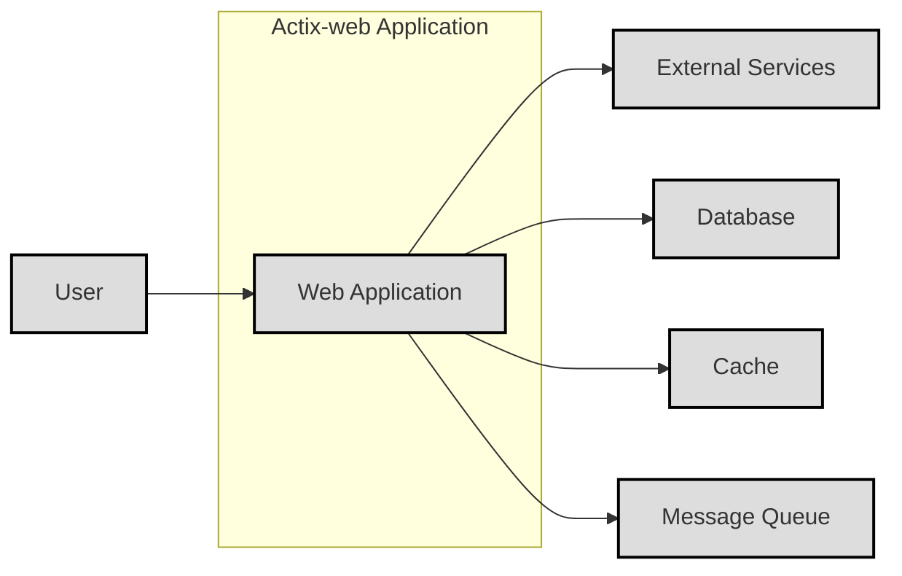
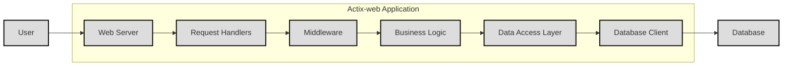
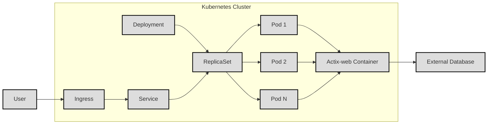

Okay, let's create a design document for the Actix-Web project.

# BUSINESS POSTURE

Actix-web is a popular, high-performance, open-source Rust web framework.  It's used for building a wide variety of web applications and APIs.  Given its nature, the business priorities and goals revolve around:

*   Performance and Scalability:  Actix-web's core value proposition is its speed and ability to handle high loads.  This is critical for businesses that need to serve many concurrent users or process large volumes of requests.
*   Reliability and Stability:  As a foundational component of web applications, Actix-web must be reliable and stable.  Crashes or unexpected behavior can directly impact the availability and functionality of the applications built upon it.
*   Developer Productivity:  The framework should be easy to use and allow developers to build applications quickly and efficiently.  This includes clear documentation, a well-designed API, and a supportive community.
*   Extensibility: The framework should allow developers to easily extend its functionality to meet their specific needs. This includes a robust middleware system and the ability to integrate with other libraries and tools.
*   Security: As a web framework, security is paramount. Actix-web must provide mechanisms to protect against common web vulnerabilities and allow developers to build secure applications.
*   Open Source Community: Maintaining a healthy and active open-source community is crucial for the long-term success of the project. This includes attracting and retaining contributors, responding to issues and pull requests, and fostering a welcoming environment.

Most important business risks that need to be addressed:

*   Performance Degradation: Any changes that significantly degrade performance could undermine the core value proposition of the framework.
*   Security Vulnerabilities:  Exploitable vulnerabilities in Actix-web could lead to breaches in applications built using the framework, causing significant damage to businesses and users.
*   Loss of Community Support:  If the open-source community around Actix-web diminishes, the project's long-term viability could be at risk.
*   Breaking Changes: Frequent or poorly managed breaking changes can disrupt the developer experience and make it difficult for users to upgrade to newer versions.
*   Lack of Maintainability: If the codebase becomes difficult to maintain, it will be harder to fix bugs, add new features, and ensure the long-term health of the project.

# SECURITY POSTURE

Actix-web, being a framework, provides building blocks and tools, but the ultimate security posture of an application built with it heavily relies on how developers utilize these tools and implement security best practices.

Existing Security Controls:

*   security control: Middleware System: Actix-web's middleware system allows developers to implement cross-cutting concerns, including security-related ones like authentication, authorization, and input validation. (Described in Actix-web documentation and examples).
*   security control: Secure by Default (Headers): Actix-web sets some secure HTTP headers by default, such as `X-Content-Type-Options: nosniff`. (Source code and documentation).
*   security control: Routing and Parameter Handling: Actix-web provides mechanisms for securely handling URL routing and extracting parameters, reducing the risk of injection vulnerabilities if used correctly. (Described in Actix-web documentation).
*   security control: TLS/SSL Support: Actix-web supports TLS/SSL encryption for secure communication. (Described in Actix-web documentation and examples).
*   security control: Regular Updates and Dependency Management: The Actix-web project actively manages dependencies and releases updates to address security vulnerabilities in the framework and its dependencies. (GitHub repository and release notes).
*   security control: Community Scrutiny: Being an open-source project, Actix-web benefits from community scrutiny, where developers and security researchers can identify and report potential vulnerabilities. (GitHub repository and issue tracker).

Accepted Risks:

*   accepted risk: Developer Misuse: Actix-web, like any framework, can be misused.  Developers might not implement security best practices, leading to vulnerabilities in their applications. This is a significant accepted risk, as the framework itself cannot enforce all security measures.
*   accepted risk: Zero-Day Vulnerabilities:  There's always a risk of undiscovered vulnerabilities (zero-days) in Actix-web or its dependencies.
*   accepted risk: Supply Chain Attacks: While Actix-web manages its dependencies, there's a risk of vulnerabilities being introduced through compromised dependencies (supply chain attacks).

Recommended Security Controls (High Priority):

*   security control: Integrate SAST Tools: Integrate Static Application Security Testing (SAST) tools into the CI/CD pipeline to automatically scan for vulnerabilities in the Actix-web codebase.
*   security control: Integrate DAST Tools: Integrate Dynamic Application Security Testing (DAST) tools to test running instances of Actix-web applications for vulnerabilities.
*   security control: Implement SCA: Implement Software Composition Analysis (SCA) to identify and manage vulnerabilities in third-party dependencies.
*   security control: Fuzz Testing: Regularly perform fuzz testing on Actix-web's core components to identify potential vulnerabilities related to unexpected input.
*   security control: Security Audits: Conduct regular security audits of the Actix-web codebase and its dependencies.

Security Requirements:

*   Authentication:
    *   Actix-web should provide clear guidance and examples for integrating with various authentication mechanisms (e.g., JWT, OAuth 2.0, session-based authentication).
    *   The framework should not dictate a specific authentication method but should be flexible enough to support different approaches.
*   Authorization:
    *   Actix-web should provide mechanisms for implementing authorization checks, such as role-based access control (RBAC) or attribute-based access control (ABAC).
    *   Middleware should be the primary mechanism for implementing authorization.
*   Input Validation:
    *   Actix-web should encourage and facilitate input validation at multiple levels (e.g., request parsing, data models, business logic).
    *   The framework should provide utilities or integrate with libraries that simplify input validation (e.g., data validation libraries).
*   Cryptography:
    *   Actix-web should provide secure defaults for cryptographic operations (e.g., hashing passwords, generating random numbers).
    *   The framework should integrate with well-established cryptographic libraries and avoid implementing its own cryptographic primitives.
    *   Provide clear documentation on how to securely handle secrets and keys.

# DESIGN

## C4 CONTEXT



Element Description:

*   Element:
    *   Name: User
    *   Type: Person
    *   Description: Represents a user interacting with the web application.
    *   Responsibilities:
        *   Initiates requests to the web application.
        *   Receives responses from the web application.
    *   Security Controls:
        *   Authentication mechanisms (e.g., username/password, OAuth, etc.) implemented in the Web Application.
        *   Authorization checks within the Web Application.

*   Element:
    *   Name: Web Application
    *   Type: Software System
    *   Description: The web application built using the Actix-web framework.
    *   Responsibilities:
        *   Handles user requests.
        *   Processes business logic.
        *   Interacts with external services, databases, caches, and message queues.
        *   Returns responses to the user.
    *   Security Controls:
        *   Input validation.
        *   Authentication and authorization middleware.
        *   Output encoding.
        *   Secure session management.
        *   Error handling.
        *   TLS/SSL encryption.

*   Element:
    *   Name: External Services
    *   Type: Software System
    *   Description: Represents external services that the web application interacts with (e.g., payment gateways, email providers, third-party APIs).
    *   Responsibilities:
        *   Provides specific services to the web application.
    *   Security Controls:
        *   Secure communication channels (e.g., HTTPS).
        *   API keys or other authentication mechanisms.
        *   Input validation on the external service side.

*   Element:
    *   Name: Database
    *   Type: Software System
    *   Description: Represents the database used by the web application to store data.
    *   Responsibilities:
        *   Stores and retrieves data.
    *   Security Controls:
        *   Database user authentication and authorization.
        *   Data encryption at rest and in transit.
        *   Regular backups.
        *   SQL injection prevention (implemented in the Web Application).

*   Element:
    *   Name: Cache
    *   Type: Software System
    *   Description: Represents a caching system used to improve performance.
    *   Responsibilities:
        *   Stores frequently accessed data.
    *   Security Controls:
        *   Secure communication with the Web Application.
        *   Cache invalidation mechanisms.

*   Element:
    *   Name: Message Queue
    *   Type: Software System
    *   Description: Represents a message queue used for asynchronous communication.
    *   Responsibilities:
        *   Handles asynchronous tasks.
    *   Security Controls:
        *   Secure communication with the Web Application.
        *   Message authentication and authorization.

## C4 CONTAINER



Element Description:

*   Element:
    *   Name: User
    *   Type: Person
    *   Description: Represents a user interacting with the web application.
    *   Responsibilities: Initiates HTTP requests.
    *   Security Controls: Authentication and authorization handled by the Web Application.

*   Element:
    *   Name: Web Server
    *   Type: Container: Actix-web
    *   Description: The core Actix-web server that handles incoming requests.
    *   Responsibilities:
        *   Listens for incoming connections.
        *   Parses HTTP requests.
        *   Routes requests to the appropriate handlers.
        *   Manages worker threads.
    *   Security Controls:
        *   TLS/SSL configuration.
        *   Connection limits.
        *   Timeout settings.

*   Element:
    *   Name: Request Handlers
    *   Type: Container: Rust Code
    *   Description:  Functions or closures that process specific requests.
    *   Responsibilities:
        *   Handles specific routes and HTTP methods.
        *   Extracts data from requests.
        *   Invokes business logic.
        *   Returns responses.
    *   Security Controls:
        *   Input validation.
        *   Authorization checks (often implemented via middleware).

*   Element:
    *   Name: Middleware
    *   Type: Container: Rust Code
    *   Description: Components that intercept requests and responses for cross-cutting concerns.
    *   Responsibilities:
        *   Authentication.
        *   Authorization.
        *   Logging.
        *   Request/response transformation.
        *   Error handling.
    *   Security Controls:
        *   Implementation of security-related logic (authentication, authorization, etc.).

*   Element:
    *   Name: Business Logic
    *   Type: Container: Rust Code
    *   Description: The core application logic.
    *   Responsibilities:
        *   Implements the application's functionality.
        *   Interacts with the data access layer.
    *   Security Controls:
        *   Business rule validation.
        *   Data sanitization.

*   Element:
    *   Name: Data Access Layer
    *   Type: Container: Rust Code
    *   Description:  Abstraction layer for interacting with the database.
    *   Responsibilities:
        *   Provides an interface for accessing and manipulating data.
        *   Hides database-specific details.
    *   Security Controls:
        *   Parameterized queries (to prevent SQL injection).
        *   Data validation.

*   Element:
    *   Name: Database Client
    *   Type: Container: Library/Driver
    *   Description: The library or driver used to connect to the database.
    *   Responsibilities:
        *   Establishes connections to the database.
        *   Executes queries.
        *   Handles data serialization/deserialization.
    *   Security Controls:
        *   Secure connection configuration (e.g., TLS/SSL).
        *   Authentication credentials.

*   Element:
    *   Name: Database
    *   Type: Software System
    *   Description: The database system (e.g., PostgreSQL, MySQL, MongoDB).
    *   Responsibilities: Stores and manages data.
    *   Security Controls: Database-level security controls (authentication, authorization, encryption).

## DEPLOYMENT

Actix-web applications can be deployed in various ways, including:

1.  Bare Metal Servers: Deploying directly onto physical servers.
2.  Virtual Machines: Deploying onto virtual machines (e.g., AWS EC2, Azure VMs, Google Compute Engine).
3.  Containers: Deploying as Docker containers, often managed by orchestration platforms like Kubernetes.
4.  Serverless Functions: Deploying individual request handlers as serverless functions (e.g., AWS Lambda, Azure Functions, Google Cloud Functions). This approach is less common for entire Actix-web applications but can be used for specific parts.

We'll describe deployment using **Containers (Docker) and Kubernetes**:



Element Description:

*   Element:
    *   Name: User
    *   Type: Person
    *   Description: Represents a user accessing the application.
    *   Responsibilities: Initiates requests to the application.
    *   Security Controls:  Authentication and authorization handled by the application within the Kubernetes cluster.

*   Element:
    *   Name: Ingress
    *   Type: Kubernetes Resource
    *   Description:  Exposes the application to the outside world.
    *   Responsibilities:
        *   Routes external traffic to the appropriate service.
        *   Can handle TLS termination.
    *   Security Controls:
        *   TLS/SSL certificates.
        *   Ingress rules (defining allowed paths and hosts).

*   Element:
    *   Name: Service
    *   Type: Kubernetes Resource
    *   Description:  Provides a stable endpoint for accessing the application pods.
    *   Responsibilities:
        *   Load balances traffic across multiple pods.
    *   Security Controls:
        *   Network policies (restricting traffic to specific pods or namespaces).

*   Element:
    *   Name: Deployment
    *   Type: Kubernetes Resource
    *   Description: Manages the desired state of the application pods.
    *   Responsibilities:
        *   Creates and updates ReplicaSets.
        *   Handles rolling updates.
    *   Security Controls:  None directly, but manages the deployment of secure configurations.

*   Element:
    *   Name: ReplicaSet
    *   Type: Kubernetes Resource
    *   Description: Ensures that a specified number of pod replicas are running.
    *   Responsibilities:
        *   Creates and deletes pods as needed.
    *   Security Controls: None directly.

*   Element:
    *   Name: Pod 1, Pod 2, Pod N
    *   Type: Kubernetes Resource
    *   Description:  Instances of the running application.
    *   Responsibilities:
        *   Hosts the Actix-web container.
    *   Security Controls:
        *   Resource limits (CPU, memory).
        *   Security context (user, privileges).

*   Element:
    *   Name: Actix-web Container
    *   Type: Container: Docker
    *   Description: The Docker container running the Actix-web application.
    *   Responsibilities:
        *   Runs the Actix-web application.
    *   Security Controls:
        *   All security controls implemented within the Actix-web application (see previous sections).
        *   Container image security (using minimal base images, scanning for vulnerabilities).

*   Element:
    *   Name: External Database
    *   Type: Software System
    *   Description: The database used by the application, running outside the Kubernetes cluster.
    *   Responsibilities: Stores and manages data.
    *   Security Controls: Database-level security controls (authentication, authorization, encryption).

## BUILD

The build process for an Actix-web project typically involves the following steps:

1.  Developer writes code and commits it to a version control system (e.g., Git).
2.  A Continuous Integration (CI) system (e.g., GitHub Actions, Jenkins, CircleCI) detects the changes.
3.  The CI system checks out the code.
4.  The CI system runs `cargo build --release` to compile the code in release mode. This includes:
    *   Dependency resolution and fetching (using Cargo).
    *   Compilation of the Rust code.
    *   Linking of dependencies.
5.  The CI system runs `cargo test` to execute unit and integration tests.
6.  (Optional) The CI system runs linters (e.g., Clippy) and formatters (e.g., rustfmt) to enforce code style and identify potential issues.
7.  (Optional) The CI system runs security scanners (SAST, SCA) to identify vulnerabilities.
8.  If all checks pass, the CI system creates a Docker image containing the compiled binary.
9.  The CI system pushes the Docker image to a container registry (e.g., Docker Hub, Amazon ECR, Google Container Registry).
10. (Optional) The CI system triggers a deployment to a staging or production environment.

```mermaid
graph LR
    A[Developer] --> B[Git Repository]
    B --> C[CI System (e.g., GitHub Actions)]
    C --> D[Checkout Code]
    D --> E[cargo build --release]
    E --> F[cargo test]
    F --> G[Linters & Formatters]
    G --> H[Security Scanners (SAST, SCA)]
    H --> I[Create Docker Image]
    I --> J[Push to Container Registry]
    J --> K[Deploy (Optional)]
    L[Build Artifacts (Docker Image)]
    J --> L

    classDef default fill:#ddd,stroke:#000,stroke-width:2px;
    class A,B,C,D,E,F,G,H,I,J,K,L default
```

Security Controls in the Build Process:

*   security control: Version Control (Git): Tracks changes to the codebase, allowing for auditing and rollbacks.
*   security control: CI System (GitHub Actions, Jenkins, etc.): Automates the build process, ensuring consistency and repeatability.
*   security control: Dependency Management (Cargo):  Manages dependencies and their versions, reducing the risk of using outdated or vulnerable libraries.
*   security control: Automated Testing (`cargo test`):  Helps identify bugs and regressions early in the development cycle.
*   security control: Linters (Clippy) and Formatters (rustfmt): Enforce code style and identify potential code quality issues, which can indirectly improve security.
*   security control: SAST Tools:  Scan the source code for vulnerabilities.
*   security control: SCA Tools:  Identify vulnerabilities in third-party dependencies.
*   security control: Docker Image Security:
    *   Using minimal base images.
    *   Scanning Docker images for vulnerabilities.
    *   Using multi-stage builds to reduce the final image size.
*   security control: Container Registry Authentication: Securely storing and retrieving Docker images.

# RISK ASSESSMENT

Critical Business Processes:

*   Serving web requests reliably and efficiently.
*   Maintaining the integrity and confidentiality of user data.
*   Ensuring the availability of the web application.
*   Protecting against financial losses due to security breaches or service disruptions.
*   Maintaining the reputation and trustworthiness of the application and the organization behind it.

Data Sensitivity:

The data sensitivity depends on the specific application built using Actix-web. However, common types of data and their sensitivity levels include:

*   Personally Identifiable Information (PII): High sensitivity (e.g., names, addresses, email addresses, phone numbers).
*   Financial Data: High sensitivity (e.g., credit card numbers, bank account details).
*   Authentication Credentials: High sensitivity (e.g., passwords, API keys, session tokens).
*   User-Generated Content: Variable sensitivity, depending on the content (e.g., public forum posts vs. private messages).
*   Application Data: Variable sensitivity, depending on the application's purpose (e.g., business data, configuration settings).
*   Logs and Monitoring Data: Medium sensitivity (can contain sensitive information if not properly configured).

# QUESTIONS & ASSUMPTIONS

Questions:

*   What specific types of applications are most commonly built with Actix-web within the organization? (This helps tailor the risk assessment and security recommendations.)
*   What are the existing security policies and procedures within the organization? (This helps understand the current security posture and identify any gaps.)
*   What are the regulatory compliance requirements for the applications built with Actix-web? (e.g., GDPR, HIPAA, PCI DSS)
*   What is the organization's risk appetite? (This helps determine the appropriate level of security controls.)
*   Are there any specific security concerns or incidents that have occurred in the past?
*   What is deployment model for applications build on top of Actix-web?

Assumptions:

*   BUSINESS POSTURE: The primary goal is to build high-performance, reliable, and secure web applications.
*   SECURITY POSTURE: Developers using Actix-web have a basic understanding of web security principles, but may not be security experts. There is a need for clear guidance and tooling to help them build secure applications.
*   DESIGN: The design will follow common web application patterns, with a focus on modularity and maintainability. The deployment will leverage containerization and Kubernetes for scalability and resilience. The build process will be automated using a CI/CD pipeline.