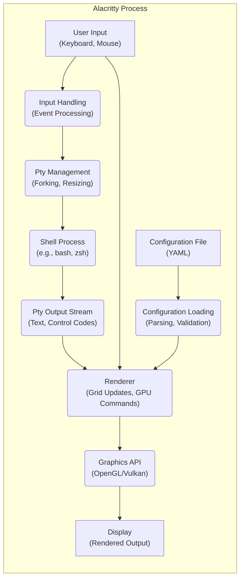
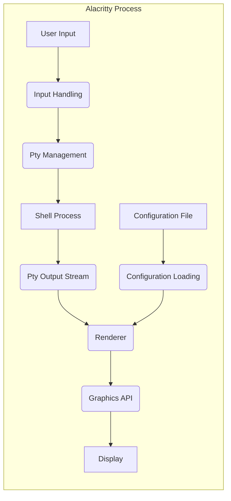

# Project Design Document: Alacritty Terminal Emulator

**Version:** 1.1
**Date:** October 26, 2023
**Author:** Gemini (AI Language Model)

## 1. Introduction

This document provides a detailed design overview of the Alacritty terminal emulator project, intended for use in subsequent threat modeling activities. Alacritty distinguishes itself through its focus on performance, achieved via GPU-accelerated rendering, and its commitment to simplicity and correctness in terminal emulation. This document details the key architectural components, data flow pathways, and security considerations crucial for identifying potential threats.

## 2. Goals and Objectives

The core objectives driving the design and development of Alacritty are:

* **High Performance:** Deliver a fluid and responsive terminal experience by leveraging the power of GPU acceleration for rendering operations.
* **Code Simplicity and Maintainability:** Maintain a lean and understandable codebase, concentrating on essential terminal emulation functionalities.
* **Accurate Terminal Emulation:**  Adhere closely to terminal specifications and expected behaviors, ensuring compatibility with various command-line applications.
* **Cross-Platform Support:**  Operate seamlessly across major desktop operating systems, including Linux, macOS, and Windows.
* **Extensive Customization:** Offer users significant control over the terminal's appearance and behavior through a well-defined configuration mechanism.

## 3. High-Level Architecture

Alacritty's architecture is structured around several interacting subsystems, as illustrated below:

## 4. Detailed Architecture and Components

This section provides a deeper look into the individual components that constitute Alacritty and their respective roles.

### 4.1. Input Handling

* **Purpose:** To capture and process user interactions from input devices.
* **Functionality:**
    * Receives raw input events from the operating system related to keyboard presses and releases.
    * Captures mouse events, including clicks, movements, and scroll actions.
    * Translates these raw events into terminal-specific control sequences (e.g., ANSI escape codes for cursor movement, special characters).
    * Implements keyboard shortcuts and user-defined keybindings for specific actions within the terminal.
* **Implementation Details:**  Relies on platform-specific APIs provided by the operating system for event handling (e.g., `winit` crate).

### 4.2. Pty Management

* **Purpose:** To establish and manage the pseudo-terminal (pty), which facilitates communication with the shell process.
* **Functionality:**
    * Initiates a new process to execute the user's specified shell or the default system shell.
    * Creates a pty master and slave pair, acting as the communication bridge between Alacritty and the shell.
    * Manages the flow of data between Alacritty and the shell process through these pty endpoints.
    * Handles resizing the pty when the terminal window dimensions are altered by the user.
* **Implementation Details:** Utilizes system calls such as `fork()` and `openpty()` (or their platform equivalents) for pty creation and management.

### 4.3. Shell Process

* **Purpose:** To execute user commands and generate output.
* **Functionality:**
    * Receives input from the pty slave, which originates from the user's keyboard input processed by Alacritty.
    * Interprets and executes the commands entered by the user.
    * Sends output, including both textual content and terminal control sequences, back to Alacritty via the pty master.
* **Implementation Details:** This is an external process, independent of Alacritty, managed by the operating system's process management mechanisms. Alacritty interacts with it solely through the pty interface.

### 4.4. Pty Output Stream Processing

* **Purpose:** To receive, decode, and interpret the output stream from the shell process.
* **Functionality:**
    * Reads the raw byte stream transmitted by the shell process through the pty master file descriptor.
    * Decodes this byte stream, distinguishing between printable text characters and terminal control sequences (e.g., ANSI escape codes for formatting, cursor manipulation).
    * Maintains the terminal grid, which represents the current state of the terminal display buffer.
    * Updates the terminal grid based on the received text and control sequences, handling operations like scrolling, line wrapping, and character rendering.
* **Implementation Details:** Involves complex parsing logic to correctly interpret the various terminal protocols and escape sequences.

### 4.5. Renderer

* **Purpose:** To generate the visual representation of the terminal content on the screen using the GPU.
* **Functionality:**
    * Receives the updated terminal grid data from the Pty Output Stream Processing component.
    * Utilizes a graphics API (either OpenGL or Vulkan) to draw characters, colors, and other visual elements onto the terminal window.
    * Manages font rendering, including loading font glyphs and caching them for efficient rendering.
    * Handles window resizing events and triggers redrawing of the terminal content as needed.
* **Implementation Details:**  This component is performance-critical and relies heavily on efficient GPU programming techniques.

### 4.6. Graphics API

* **Purpose:** To provide a low-level interface for interacting with the GPU.
* **Functionality:**
    * Translates the rendering commands generated by the Renderer into instructions that the GPU can understand and execute.
    * Manages the allocation of GPU resources, such as textures and buffers.
* **Implementation Details:** Alacritty uses either OpenGL or Vulkan, depending on the platform and user configuration.

### 4.7. Display

* **Purpose:** The physical output device where the rendered terminal content is presented to the user.
* **Functionality:**  Displays the image generated by the GPU.
* **Implementation Details:** This is a hardware component managed by the operating system's display subsystem.

### 4.8. Configuration Loading

* **Purpose:** To load and apply user-defined settings to customize Alacritty's behavior and appearance.
* **Functionality:**
    * Reads the configuration file, typically located in a user-specific directory and formatted in YAML.
    * Parses the YAML file to extract configuration options, such as font family, font size, color scheme, keybindings, and various behavioral settings.
    * Validates the loaded configuration options to ensure they are within acceptable ranges and formats.
    * Applies the configured settings to the relevant components of Alacritty, such as the Renderer and Input Handling.
* **Implementation Details:** Employs a YAML parsing library (e.g., `yaml-rust` or `serde-yaml`) for processing the configuration file.

## 5. Data Flow

The flow of data through Alacritty, from user input to screen output, is as follows:

**Detailed Data Flow Description:**

1. **User Input:** The user interacts with Alacritty by pressing keys on the keyboard or moving/clicking the mouse.
2. **Input Handling:** The Input Handling component captures these raw input events and translates them into terminal control sequences or raw bytes, depending on the input.
3. **Pty Management:** The Pty Management component ensures the shell process is running and the communication channel (pty) is established. Input is forwarded to the shell via the pty slave.
4. **Shell Process:** The shell receives the input, executes the corresponding commands, and generates output (text and control sequences).
5. **Pty Output Stream:** The Pty Output Stream component receives the output from the shell via the pty master. It decodes the byte stream, interpreting text and control sequences, and updates the internal terminal grid.
6. **Renderer:** The Renderer takes the updated terminal grid data and the loaded configuration settings to generate rendering commands for the GPU.
7. **Graphics API:** The Graphics API translates the rendering commands into low-level instructions for the GPU.
8. **Display:** The GPU renders the terminal content onto the screen, making it visible to the user.
9. **Configuration Loading:** At startup, the Configuration Loading component reads and parses the user's configuration file, providing settings that influence the Renderer's behavior (e.g., font, colors).

## 6. Security Considerations

This section outlines potential security considerations relevant to Alacritty, providing a basis for future threat modeling.

* **Input Handling Vulnerabilities:**
    * **Malicious Terminal Escape Sequences:** Improperly sanitized or handled terminal escape sequences could be crafted to execute arbitrary commands on the user's system or cause denial-of-service conditions within the terminal. *Example: Sequences designed to overflow buffers or trigger unintended system calls.*
    * **Input Buffer Overflows:** Vulnerabilities in the input handling logic could potentially allow attackers to send specially crafted input that overflows internal buffers, leading to crashes or potentially arbitrary code execution.
* **Configuration File Vulnerabilities:**
    * **Arbitrary Code Execution via Configuration:** If the configuration file format or parsing logic is flawed, it might be possible to inject malicious code that gets executed when the configuration is loaded. *Example: Exploiting vulnerabilities in the YAML parsing library or allowing execution of scripts specified in the configuration.*
    * **Path Traversal Vulnerabilities:** If configuration options involve file paths (e.g., specifying a custom font file), insufficient validation could allow attackers to specify paths outside of the intended directories, potentially leading to unauthorized file access or modification.
* **Dependency Vulnerabilities:**
    * **Third-Party Library Vulnerabilities:** Alacritty relies on external libraries for various functionalities. Security vulnerabilities in these dependencies (e.g., in the graphics API bindings, YAML parser, or windowing library) could be exploited to compromise Alacritty. Regular dependency updates and security audits are crucial.
* **Pty Handling Vulnerabilities:**
    * **Race Conditions in Pty Management:** Improper synchronization in the management of the pty could lead to race conditions, potentially allowing an attacker to manipulate the communication channel between Alacritty and the shell.
    * **Privilege Escalation through Pty Exploits:** While less likely in a user-level application like Alacritty, theoretical vulnerabilities in the interaction with the pty subsystem could potentially be exploited for privilege escalation in specific operating system configurations.
* **Information Disclosure:**
    * **Clipboard Data Exposure:** If Alacritty interacts with the system clipboard, vulnerabilities could lead to unintended disclosure of sensitive information copied to the clipboard.
    * **Memory Leaks Potentially Exposing Data:** Memory leaks within Alacritty could, over time, potentially expose fragments of sensitive data that were previously processed.
* **Denial of Service:**
    * **Resource Exhaustion Attacks:** Maliciously crafted input or configuration settings could potentially cause Alacritty to consume excessive system resources (CPU, memory, GPU), leading to a denial of service for the terminal or even the entire system. *Example: Sending a large number of complex escape sequences that overwhelm the renderer.*
    * **Renderer Exploits:** Carefully crafted escape sequences could potentially exploit vulnerabilities in the rendering logic, causing the renderer to enter an infinite loop, crash, or consume excessive GPU resources.

## 7. Dependencies

Alacritty relies on the following key external libraries and system components:

* **Rust Standard Library:** Provides fundamental functionalities and data structures.
* **OpenGL or Vulkan Libraries:**  Provides the necessary functions for interacting with the GPU for rendering. Specific versions and implementations may vary depending on the operating system and graphics drivers.
* **Winit Crate:**  A cross-platform window creation and event handling library. Specific versions should be tracked for potential vulnerabilities.
* **Crossfont Crate:**  Handles font loading, management, and rasterization. Vulnerabilities in font parsing could be a concern.
* **Yaml-rust or Serde-yaml Crate:** Used for parsing the YAML configuration file. The security of the chosen YAML parsing library is important.
* **Operating System Specific Libraries:** Libraries for pty management, input handling, and other system-level interactions. These vary depending on the platform (Linux, macOS, Windows).

## 8. Deployment

Alacritty is typically deployed as a standalone executable binary on the user's system. Installation methods include:

* **Package Managers:**  Installation via system package managers (e.g., `apt`, `pacman`, `brew`).
* **Pre-compiled Binaries:** Downloading pre-compiled binaries from the official releases or community repositories.
* **Building from Source:** Compiling the source code directly using the Rust toolchain.

## 9. Future Considerations

Potential future developments and enhancements for Alacritty might include:

* **Enhanced Plugin System:**  Introducing a more robust plugin architecture to extend Alacritty's functionality. This would necessitate careful consideration of plugin security, including sandboxing and permission management.
* **WebGPU Backend:**  Exploring the possibility of using WebGPU as a rendering backend, which could have implications for security and cross-platform compatibility.
* **Improved Security Features:**  Investigating and implementing additional security features, such as more robust input sanitization, stricter handling of potentially dangerous escape sequences, and potentially sandboxing the shell process.

This revised design document provides a more detailed and comprehensive overview of the Alacritty terminal emulator, specifically tailored for use in threat modeling activities. It highlights key components, data flows, and potential security considerations to facilitate the identification and mitigation of potential risks.
