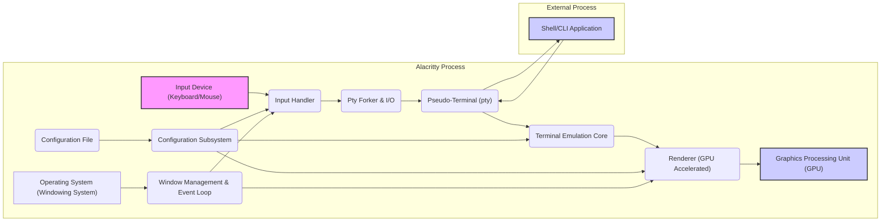
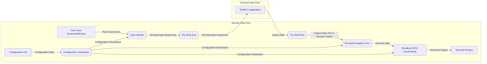

## Project Design Document: Alacritty Terminal Emulator

**Version:** 1.1
**Date:** October 26, 2023
**Prepared By:** AI Software Architect

### 1. Introduction

This document provides a detailed design overview of the Alacritty terminal emulator project, specifically tailored for use in threat modeling activities. It outlines the system's architecture, key components, data flow, and security considerations. This document aims to provide a clear and comprehensive understanding of Alacritty's structure and functionality to facilitate the identification of potential security vulnerabilities and attack vectors.

### 2. Project Overview

Alacritty is a modern, GPU-accelerated terminal emulator focused on performance and simplicity. Its core objective is to provide a fast and efficient terminal experience by leveraging the GPU for rendering. Configuration is managed through a user-editable YAML file, emphasizing a straightforward and customizable setup. Alacritty prioritizes speed and correctness over extensive feature sets, aiming for a lean and reliable terminal application.

### 3. Architecture Overview

Alacritty's architecture is structured around several key modules that interact to provide the terminal emulation functionality:

* **Input Handling:** Manages the capture and processing of user input events from devices like the keyboard and mouse.
* **Pty Forker & I/O:** Responsible for creating and managing the pseudo-terminal (pty) and handling the communication of data between Alacritty and the shell or other command-line applications.
* **Terminal Emulation Core:** The central logic responsible for interpreting control sequences and escape codes received from the pty, maintaining the terminal state, and managing screen buffer updates.
* **Renderer (GPU Accelerated):**  Utilizes the GPU via a graphics API (OpenGL or Vulkan) to efficiently render the terminal content based on the terminal state. This includes font rendering, glyph caching, and color application.
* **Configuration Subsystem:**  Handles loading, parsing, and managing the `alacritty.yml` configuration file, providing settings to other components.
* **Window Management & Event Loop:** Interacts with the operating system's windowing system to create and manage the terminal window and handles the main event loop for processing input and rendering.

### 4. Key Components

* **Input Handler:**
    * Responsibilities:
        * Listens for raw keyboard and mouse events from the operating system's input APIs.
        * Translates these raw events into terminal-specific input sequences (e.g., keycodes, escape sequences for special keys).
        * Handles keyboard layout and modifier key states.
        * Manages copy/paste functionality, potentially interacting with the system clipboard.
    * Interactions: Sends processed input sequences to the Pty Forker & I/O component. Receives configuration parameters from the Configuration Subsystem (e.g., keybindings).

* **Pty Forker & I/O:**
    * Responsibilities:
        * Creates a new pseudo-terminal (pty) pair using operating system APIs.
        * Forks a new process to execute the user's specified shell or command.
        * Establishes communication channels (file descriptors) between Alacritty and the pty.
        * Handles reading data from the pty's output stream and writing data to the pty's input stream.
    * Interactions: Receives input sequences from the Input Handler. Sends output data from the pty to the Terminal Emulation Core. Communicates with the operating system for pty creation and process management.

* **Terminal Emulation Core:**
    * Responsibilities:
        * Receives byte streams from the Pty Forker & I/O component.
        * Parses ANSI escape codes, control characters, and UTF-8 encoded text.
        * Maintains the internal state of the terminal, including:
            * The character grid (screen buffer).
            * Cursor position and attributes.
            * Text attributes (colors, styles).
            * Scrollback buffer.
            * Terminal modes (e.g., bracketed paste).
        * Manages screen updates and redraw requests.
    * Interactions: Receives output data from the Pty Forker & I/O. Sends the current terminal state to the Renderer. Receives configuration parameters from the Configuration Subsystem (e.g., terminal type, supported escape codes).

* **Renderer (GPU Accelerated):**
    * Responsibilities:
        * Receives the terminal state (character grid and attributes) from the Terminal Emulation Core.
        * Manages font loading, glyph rasterization, and caching.
        * Utilizes a graphics API (OpenGL or Vulkan) to draw the terminal content on the GPU.
        * Handles color palette management and application.
        * Implements smooth scrolling and other visual effects.
    * Interactions: Receives terminal state from the Terminal Emulation Core. Interacts with the GPU for rendering operations. Receives configuration parameters from the Configuration Subsystem (e.g., font family, font size, colors). Interacts with the Window Management & Event Loop for window updates.

* **Configuration Subsystem:**
    * Responsibilities:
        * Locates and reads the `alacritty.yml` configuration file.
        * Parses the YAML file into a structured configuration object.
        * Provides access to configuration parameters for other components.
        * Handles reloading the configuration file when changes are detected (e.g., through file system monitoring).
        * Validates configuration values.
    * Interactions: Provides configuration data to the Input Handler, Terminal Emulation Core, and Renderer.

* **Window Management & Event Loop:**
    * Responsibilities:
        * Creates and manages the terminal window using the operating system's windowing system APIs (e.g., X11, Wayland, Windows API).
        * Handles window resizing, minimizing, and closing events.
        * Manages the main event loop, processing operating system events (input, window events, etc.).
        * Triggers rendering updates.
    * Interactions: Provides the rendering surface to the Renderer. Sends input events to the Input Handler.

### 5. Data Flow

The primary data flows within Alacritty are critical for understanding potential attack vectors:

* **User Input Flow:**
    * User interacts with input devices (keyboard, mouse).
    * The "Input Device" generates raw input events.
    * "Input Handler" receives and translates these events into terminal input sequences.
    * "Input Sequences" are sent to the "Pty Forker & I/O".
    * "Input Sequences" are written to the write end of the "Pseudo-Terminal (pty)".
    * The shell or application running in the pty receives the user input.

* **Command Output Flow:**
    * The "Shell/CLI Application" generates output data (text and ANSI escape codes).
    * This "Output Data" is written to the read end of the "Pseudo-Terminal (pty)".
    * "Pty Forker & I/O" reads the "Output Data".
    * "Output Data" is sent to the "Terminal Emulation Core".
    * "Terminal Emulation Core" interprets the escape codes and updates the internal terminal state.
    * The "Terminal State" is sent to the "Renderer (GPU Accelerated)".
    * The "Renderer (GPU Accelerated)" uses the "Terminal State" to generate "Rendered Output".
    * "Rendered Output" is displayed in the terminal window.

* **Configuration Flow:**
    * At startup (or on configuration reload), the "Configuration Subsystem" reads and parses the "Configuration File".
    * "Configuration Parameters" are provided to the "Input Handler" (e.g., keybindings).
    * "Configuration Parameters" are provided to the "Terminal Emulation Core" (e.g., terminal type, supported features).
    * "Configuration Parameters" are provided to the "Renderer (GPU Accelerated)" (e.g., font, colors).

### 6. Security Considerations (Pre-Threat Modeling)

This section details potential security concerns that should be the focus of subsequent threat modeling activities:

* **ANSI Escape Code Vulnerabilities:**
    * Potential Threats: Malicious applications could inject carefully crafted ANSI escape sequences to:
        * Execute arbitrary commands on the user's system.
        * Modify the terminal display in deceptive ways (e.g., hiding commands).
        * Trigger denial-of-service conditions by overwhelming the terminal emulator.
        * Leak sensitive information from the terminal buffer.
    * Relevant Components: Terminal Emulation Core.

* **Configuration File Parsing Vulnerabilities:**
    * Potential Threats: A maliciously crafted `alacritty.yml` file could exploit vulnerabilities in the YAML parsing library or Alacritty's configuration handling logic, leading to:
        * Arbitrary code execution during configuration loading.
        * Denial of service due to excessive resource consumption.
        * Unexpected behavior or crashes.
    * Relevant Components: Configuration Subsystem.

* **Dependency Vulnerabilities:**
    * Potential Threats: Vulnerabilities in third-party libraries used by Alacritty (e.g., `winit`, graphics libraries, YAML parser) could be exploited.
    * Relevant Components: All components, depending on the specific dependency.

* **Pty Handling Vulnerabilities:**
    * Potential Threats: Improper handling of the pty could lead to:
        * Information leaks between different terminal sessions or processes.
        * Privilege escalation if Alacritty is not properly sandboxed.
        * Denial of service by manipulating pty resources.
    * Relevant Components: Pty Forker & I/O.

* **GPU Driver Vulnerabilities:**
    * Potential Threats: Although less directly within Alacritty's codebase, vulnerabilities in the underlying GPU drivers could be triggered through the rendering process, potentially leading to:
        * Denial of service.
        * Information disclosure.
        * In rare cases, even arbitrary code execution within the driver context.
    * Relevant Components: Renderer (GPU Accelerated).

* **Input Handling Vulnerabilities:**
    * Potential Threats:
        * Improper handling of input sequences could lead to unexpected behavior or crashes.
        * Vulnerabilities in copy/paste functionality could be exploited to inject malicious content.
    * Relevant Components: Input Handler.

* **Resource Exhaustion:**
    * Potential Threats: Malicious input or configuration could cause Alacritty to consume excessive CPU, memory, or GPU resources, leading to:
        * Denial of service.
        * System instability.
    * Relevant Components: Terminal Emulation Core, Renderer (GPU Accelerated).

### 7. Technology Stack

* **Core Programming Language:** Rust (known for memory safety and performance)
* **Graphics API:**
    * OpenGL (using crates like `gl`)
    * Vulkan (using crates like `ash`)
    * Selection is often configurable at build time.
* **Windowing System Integration:**
    * `winit` crate (cross-platform window creation and event handling)
* **YAML Parsing:**
    * `serde_yaml` crate (for deserializing the configuration file)
* **Font Rendering:**
    * `freetype-rs` crate (for font loading and rasterization)
    * Potentially `fontconfig-rs` for font discovery.
* **Terminal Emulation Library:**
    * Likely a custom implementation within Alacritty, potentially leveraging or inspired by existing terminal emulation crates but not explicitly relying on a large external library.
* **Other Dependencies:** Various other crates for tasks like logging, command-line argument parsing, etc.

### 8. Deployment Model

Alacritty is typically deployed as a standalone, locally installed application on various operating systems (Linux, macOS, Windows). Installation methods include:

* Package managers (e.g., `apt`, `pacman`, `brew`).
* Downloading pre-compiled binaries from the official releases.
* Building from source.

It is not designed for a client-server deployment model.

### 9. Assumptions and Constraints

* **Secure Host Operating System:** Alacritty assumes it is running on a reasonably secure operating system with standard security features enabled (e.g., address space layout randomization, stack canaries).
* **Trusted User:** The primary user of Alacritty is assumed to be a trusted individual who is not intentionally trying to harm the system through Alacritty.
* **Standard Hardware:** The design assumes the availability of standard desktop or laptop hardware with a compatible GPU and appropriate drivers.
* **Configuration File Integrity (Initial State):** While Alacritty handles configuration reloading, the initial state of the `alacritty.yml` file is generally assumed to be non-malicious.
* **Network Isolation (Default):** By default, Alacritty does not directly interact with the network, reducing the attack surface related to network vulnerabilities.

This improved design document provides a more detailed and nuanced understanding of Alacritty's architecture and data flows, making it a more effective foundation for conducting thorough threat modeling. The expanded security considerations section highlights specific potential threats and their relevant components, guiding the threat modeling process.