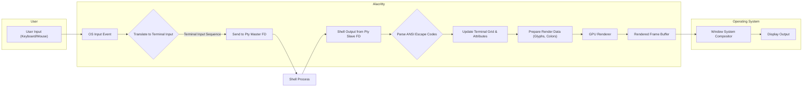

## Project Design Document: Alacritty - A Cross-Platform, GPU-Accelerated Terminal Emulator

**Version:** 1.1
**Date:** October 26, 2023
**Author:** AI Software Architect

### 1. Introduction

This document provides an enhanced design overview of Alacritty, a modern terminal emulator distinguished by its focus on performance, simplicity, and GPU acceleration. This document aims to provide a comprehensive understanding of Alacritty's architecture, component interactions, and data flows, specifically tailored for subsequent threat modeling activities. It expands upon the previous version with more detail and clarity.

### 2. Goals and Objectives

The core design goals and objectives of Alacritty are:

* **High Performance:** Achieve superior rendering performance and minimal latency by leveraging GPU acceleration for all rendering operations.
* **Simplicity and Minimalism:** Offer a clean and efficient terminal emulator, avoiding feature bloat and focusing on core terminal functionality.
* **Cross-Platform Compatibility:** Ensure seamless operation across major desktop operating systems, including Linux, macOS, and Windows, while adhering to platform-specific conventions.
* **Terminal Specification Adherence:**  Accurately implement relevant terminal specifications (e.g., xterm) to ensure compatibility with a wide range of terminal applications.
* **Security by Design:**  Prioritize security considerations throughout the design and implementation to minimize potential vulnerabilities.

### 3. High-Level Architecture

Alacritty's architecture is structured around distinct modules that interact to provide the terminal emulation functionality. The following diagram illustrates the primary components and their relationships:

```mermaid
graph LR
    subgraph "User Interaction"
        A["User Input (Keyboard, Mouse, Clipboard)"]
    end
    subgraph "Alacritty Core"
        B["Input Handling & Event Processing"] --> C["Pty Management (Forking, I/O)"];
        C --> D["Shell Process (User's Shell)"];
        D --> E["Pty Output Stream"];
        E --> F["Terminal State Management (Grid, Attributes)"];
        F --> G["Renderer (GPU Accelerated)"];
        A --> B;
        G --> H["Window Management & OS Integration"];
    end
    subgraph "Operating System"
        H --> I["Display Server (X11, Wayland, macOS Native, Windows DWM)"];
    end
    I --> J["Screen Output"];
```

### 4. Detailed Component Description

* **User Input Handling & Event Processing:**
    * Captures raw input events from the operating system, including keyboard strokes, mouse movements, button clicks, and clipboard operations.
    * Translates these raw events into terminal-specific control sequences (e.g., escape codes) or character input.
    * Manages keyboard shortcuts, keybindings, and modifier keys (Ctrl, Shift, Alt).
    * Handles clipboard integration for copy and paste operations.

* **Pty Management (Forking, I/O):**
    * Creates a pseudo-terminal (pty) pair, consisting of a master and a slave end.
    * Forks a new process to execute the user's specified shell (or the system default shell) as a child process connected to the slave end of the pty.
    * Manages the bidirectional communication channels (file descriptors) between Alacritty (connected to the master end) and the shell process (connected to the slave end).
    * Handles signals and process lifecycle management for the shell process.

* **Shell Process (User's Shell):**
    * Represents the actual command-line interpreter (e.g., bash, zsh, fish) that executes user commands.
    * Operates independently within the isolated environment provided by the pty.
    * Its input and output are redirected through the pty.

* **Pty Output Stream:**
    * Receives the raw byte stream output from the shell process via the slave end of the pty.
    * This stream contains both printable characters and ANSI escape codes that control terminal formatting and behavior.

* **Terminal State Management (Grid, Attributes):**
    * Parses the incoming byte stream from the Pty Output Stream, specifically interpreting ANSI escape codes.
    * Maintains an internal representation of the terminal display, often referred to as the "grid," which stores the characters displayed at each cell.
    * Tracks character attributes such as foreground and background colors, text styles (bold, italic, underline), and other visual properties based on the parsed escape codes.
    * Implements scrolling, line wrapping, and other terminal display functionalities.

* **Renderer (GPU Accelerated):**
    * The core component responsible for visually presenting the terminal content on the screen.
    * Utilizes the GPU for accelerated rendering, typically using graphics APIs like OpenGL (on Linux and older macOS versions), Metal (on newer macOS versions), or Direct3D (on Windows).
    * Manages font loading, glyph caching, and rendering of individual characters based on the Terminal State Management's grid and attributes.
    * Implements features like ligatures, transparency, and potentially custom shaders for visual effects.

* **Window Management & OS Integration:**
    * Creates and manages the application window that hosts the rendered terminal output.
    * Handles window resizing, minimizing, maximizing, and closing events.
    * Integrates with the underlying operating system's windowing system (e.g., X server on Linux, WindowServer on macOS, Desktop Window Manager on Windows) to handle window drawing and event handling.
    * Manages application lifecycle events and interactions with the operating system.

* **Display Server (Operating System):**
    * The fundamental system component responsible for managing the display hardware and coordinating the drawing of application windows.
    * Examples include Xorg or Wayland compositors on Linux, the WindowServer on macOS, and the Desktop Window Manager (DWM) on Windows.

### 5. Data Flow

The following flowchart illustrates the detailed flow of data within Alacritty, from user input to the final display on the screen:

**Detailed Data Flow Description:**

1. **User Input (Keyboard/Mouse):** The user interacts with the terminal by pressing keys, moving the mouse, or performing other input actions.
2. **OS Input Event:** The operating system captures the user's input and sends an event to the Alacritty application.
3. **Translate to Terminal Input:** Alacritty's input handling logic translates the raw OS input event into a terminal-specific input sequence. This involves mapping key presses to characters or control sequences, considering keyboard layouts and modifier keys.
4. **Send to Pty Master FD:** The generated terminal input sequence is written to the file descriptor associated with the master end of the pseudo-terminal (pty).
5. **Shell Process:** The user's shell process, running in the background, reads the input from the slave end of the pty.
6. **Shell Output from Pty Slave FD:** The shell process executes commands and generates output, which is written to the slave end of the pty. Alacritty reads this output from the master end of the pty.
7. **Parse ANSI Escape Codes:** Alacritty's terminal state management component parses the incoming byte stream for ANSI escape codes. These codes instruct the terminal how to format text, change colors, move the cursor, and perform other display-related actions.
8. **Update Terminal Grid & Attributes:** Based on the parsed escape codes and character data, Alacritty updates its internal representation of the terminal display grid and the attributes associated with each cell (e.g., foreground color, background color, font style).
9. **Prepare Render Data (Glyphs, Colors):** The renderer prepares the necessary data for drawing the terminal content. This involves selecting the appropriate glyphs from the loaded font, determining the correct colors based on the cell attributes, and organizing this information for efficient GPU processing.
10. **GPU Renderer:** The GPU renderer utilizes the operating system's graphics API (e.g., OpenGL, Metal, Direct3D) to draw the terminal content onto an off-screen buffer. This leverages the GPU's parallel processing capabilities for fast rendering.
11. **Rendered Frame Buffer:** The GPU renderer produces a rendered frame buffer containing the visual representation of the terminal.
12. **Window System Compositor:** Alacritty submits the rendered frame buffer to the operating system's window system compositor.
13. **Display Output:** The window system compositor combines the rendered output with other application windows and finally displays the terminal on the user's screen.

### 6. Security Considerations

Security is a crucial aspect of Alacritty's design. The following points highlight potential security considerations and mitigation strategies:

* **Input Handling Vulnerabilities:**
    * **Threat:** Maliciously crafted input sequences containing unexpected or excessively long escape codes could potentially exploit vulnerabilities in the terminal emulator's parser, leading to denial-of-service (DoS), crashes, or even potentially arbitrary code execution.
    * **Mitigation:** Implement robust input validation and sanitization to ensure that incoming data conforms to expected terminal standards. Employ fuzzing techniques and regular security audits to identify and address potential parsing vulnerabilities. Consider using a well-vetted and actively maintained terminal parsing library.

* **Pty Management Risks:**
    * **Threat:** Improper handling of pty creation or communication could lead to privilege escalation if an attacker can manipulate the pty to gain access to resources they shouldn't have. Information leaks could occur if sensitive data is inadvertently exposed through the pty.
    * **Mitigation:** Adhere to secure coding practices for process creation and inter-process communication. Ensure proper permissions are set on pty devices. Avoid exposing pty file descriptors unnecessarily.

* **Shell Process Security:**
    * **Threat:** While Alacritty doesn't directly execute commands, it provides the environment for the shell. The security of the shell and the commands executed within it are paramount. Users executing untrusted commands could compromise their system.
    * **Mitigation:** Encourage users to be cautious about the commands they execute. Alacritty can provide features like warnings about potentially dangerous operations or integration with security tools. Consider implementing features to limit the capabilities of the shell process if necessary.

* **Renderer Exploits:**
    * **Threat:** Bugs in the rendering engine or font rendering libraries could be exploited by specially crafted escape sequences or malicious fonts to cause crashes, memory corruption, or even remote code execution.
    * **Mitigation:** Utilize well-established and regularly updated rendering libraries. Implement sandboxing or process isolation for the rendering component to limit the impact of potential vulnerabilities. Be cautious about loading arbitrary fonts.

* **Configuration Security:**
    * **Threat:** Insecurely configured Alacritty settings could introduce vulnerabilities. For example, allowing arbitrary commands to be executed via specific escape sequences or overly permissive clipboard access.
    * **Mitigation:** Provide secure default configurations and clear documentation outlining the security implications of various configuration options. Implement mechanisms to restrict potentially dangerous configurations.

* **Dependency Management:**
    * **Threat:** Alacritty relies on external libraries. Vulnerabilities in these dependencies could indirectly affect Alacritty's security.
    * **Mitigation:** Employ a robust dependency management system and regularly update dependencies to their latest secure versions. Monitor security advisories for known vulnerabilities in used libraries.

* **Update Mechanism Security:**
    * **Threat:** If the update mechanism is insecure, attackers could potentially distribute malicious updates that compromise the user's system.
    * **Mitigation:** Utilize secure channels (HTTPS) for downloading updates. Implement mechanisms to verify the integrity and authenticity of updates, such as using digital signatures.

### 7. Deployment Considerations

Alacritty's deployment typically involves:

* **Compilation from Source:**  Given its Rust implementation, Alacritty is often compiled directly from source code using the Rust toolchain (`rustc` and `cargo`). This allows for platform-specific optimizations.
* **Pre-built Binaries:**  Pre-compiled binaries are also available for various platforms, simplifying installation for end-users. These binaries are typically distributed through package managers or direct downloads.
* **Configuration File:** Users configure Alacritty's behavior through a YAML-based configuration file (`alacritty.yml`), typically located in platform-specific configuration directories. Secure handling and validation of this configuration file are important.

### 8. Future Considerations

Potential future development areas with security implications include:

* **Enhanced Plugin Security:** If a plugin system is implemented, careful consideration must be given to plugin sandboxing and permission models to prevent malicious plugins from compromising the terminal or the system.
* **Improved Isolation:** Exploring further isolation techniques for different components, such as separating the rendering process more strictly.
* **Formal Security Audits:** Conducting regular formal security audits by external experts to identify and address potential vulnerabilities proactively.

This enhanced design document provides a more detailed and comprehensive overview of Alacritty's architecture, specifically focusing on aspects relevant for threat modeling. By understanding these components, data flows, and security considerations, security professionals can better assess and mitigate potential risks associated with the use of Alacritty.