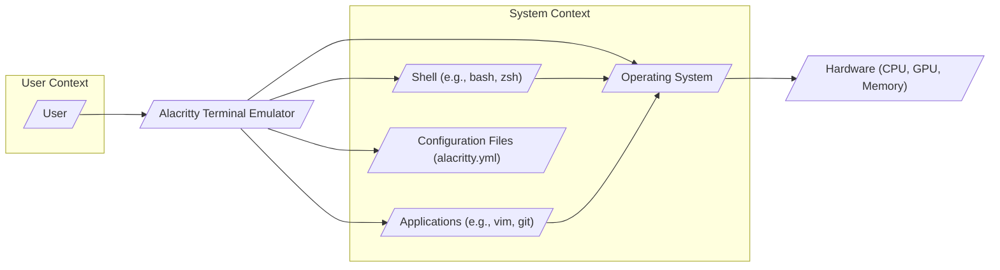
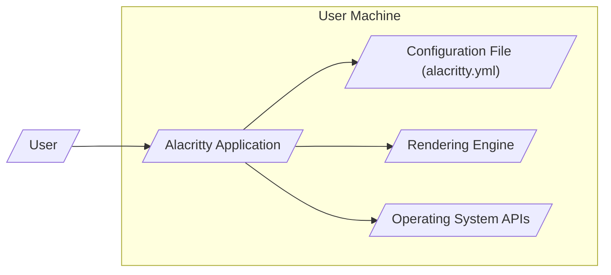
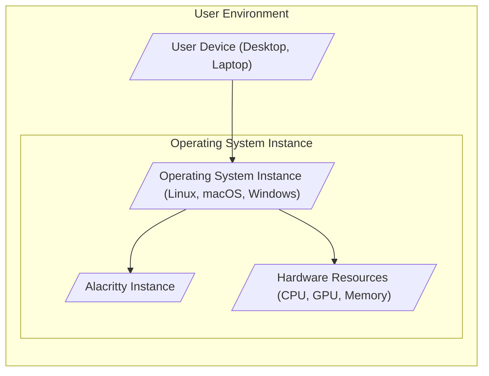
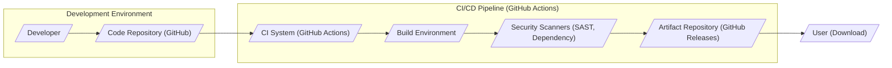

# BUSINESS POSTURE

- Business Priorities and Goals:
  - Provide a fast, GPU-accelerated terminal emulator.
  - Offer a simple and configuration-centric terminal experience.
  - Maintain cross-platform compatibility (Linux, macOS, Windows).
  - Foster an open-source community and encourage contributions.
  - Prioritize performance and resource efficiency.
- Business Risks:
  - Security vulnerabilities in the terminal emulator could lead to command injection or privilege escalation, damaging user trust and adoption.
  - Performance issues or instability could negatively impact user experience and adoption.
  - Lack of community support or maintainer burnout could lead to project stagnation and security vulnerabilities not being addressed promptly.
  - Compatibility issues across different operating systems could limit user base and adoption.

# SECURITY POSTURE

- Existing Security Controls:
  - security control: Open Source Development - The project is publicly accessible on GitHub, allowing for community review and scrutiny of the codebase. Implemented in: GitHub repository.
  - security control: Rust Language - Alacritty is written in Rust, a memory-safe language that reduces the risk of certain classes of vulnerabilities like buffer overflows. Implemented in: Source code.
  - security control: Input Sanitization -  Terminal emulators inherently perform some level of input sanitization to interpret control sequences and escape codes. Implemented in: Terminal emulator core logic (not explicitly documented, but assumed).
- Accepted Risks:
  - accepted risk: Reliance on Community Contributions - Security vulnerabilities might be introduced by community contributors and may not be immediately identified or addressed.
  - accepted risk: Dependency Vulnerabilities - The project relies on external Rust crates, which could contain security vulnerabilities.
  - accepted risk: Complex Codebase - Terminal emulators are inherently complex software, increasing the potential for subtle security vulnerabilities.
- Recommended Security Controls:
  - security control: Automated Security Scanning - Implement automated static analysis security testing (SAST) and dependency scanning in the CI/CD pipeline to identify potential vulnerabilities early in the development process.
  - security control: Regular Security Audits - Conduct periodic security audits, potentially by external security experts, to identify and address vulnerabilities that might be missed by automated tools and community review.
  - security control: Fuzzing - Implement fuzzing techniques to test the terminal emulator's robustness against malformed input and identify potential crash or vulnerability scenarios.
  - security control: Secure Configuration Defaults - Ensure default configuration settings are secure and minimize potential attack surface.
- Security Requirements:
  - Authentication:
    - Not directly applicable to a terminal emulator itself, as it relies on the underlying operating system for user authentication.
  - Authorization:
    - Not directly applicable to a terminal emulator itself, as it relies on the underlying operating system for user authorization and permissions.
  - Input Validation:
    - Requirement: Robustly validate and sanitize all input received by the terminal emulator, including user input, control sequences, and escape codes, to prevent command injection and other input-based vulnerabilities.
    - Requirement: Properly handle and escape special characters to prevent unintended execution of commands or scripts.
  - Cryptography:
    - Requirement: While not directly handling sensitive data storage, ensure that if any cryptographic operations are introduced (e.g., for future features), they are implemented securely using well-vetted libraries and best practices.
    - Requirement: If supporting features like SSH agent forwarding, ensure secure handling of cryptographic keys and communication channels.

# DESIGN

## C4 CONTEXT

- Context Diagram Elements:
  - - Name: User
    - Type: Person
    - Description: A human user interacting with the Alacritty terminal emulator. This could be a developer, system administrator, or general computer user.
    - Responsibilities: Executes commands and interacts with applications through the terminal. Configures the terminal to their preferences.
    - Security controls: User authentication to the operating system, user permissions and access control on the operating system.
  - - Name: Alacritty Terminal Emulator
    - Type: Software System
    - Description: A fast, GPU-accelerated terminal emulator written in Rust. It provides a command-line interface for users to interact with the operating system and applications.
    - Responsibilities: Renders terminal output, processes user input, interprets terminal control sequences, manages terminal sessions, and interacts with the operating system kernel.
    - Security controls: Input validation, memory safety (Rust), configuration management, adherence to terminal standards.
  - - Name: Operating System
    - Type: Software System
    - Description: The underlying operating system (e.g., Linux, macOS, Windows) on which Alacritty is running. Provides system resources, kernel services, and manages hardware.
    - Responsibilities: Process management, memory management, file system access, hardware interaction, user authentication and authorization.
    - Security controls: Operating system level security controls (kernel security, access control lists, process isolation, security updates).
  - - Name: Shell (e.g., bash, zsh)
    - Type: Software System
    - Description: A command-line interpreter that runs within the terminal emulator. It interprets user commands and executes them, interacting with the operating system.
    - Responsibilities: Command parsing, command execution, scripting, environment management.
    - Security controls: Shell security features (command history controls, process isolation, shell scripting security best practices).
  - - Name: Applications (e.g., vim, git)
    - Type: Software System
    - Description: Command-line applications and tools that are executed within the terminal emulator.
    - Responsibilities: Perform specific tasks based on user commands, interact with the operating system and other systems.
    - Security controls: Application-specific security controls, input validation, secure coding practices.
  - - Name: Configuration Files (alacritty.yml)
    - Type: Data Store
    - Description: YAML configuration files that store user preferences and settings for Alacritty, such as fonts, colors, and keybindings.
    - Responsibilities: Persistently store user configurations, allow customization of terminal behavior.
    - Security controls: File system permissions to restrict access to configuration files, validation of configuration file content to prevent malicious settings.
  - - Name: Hardware (CPU, GPU, Memory)
    - Type: Infrastructure
    - Description: The physical hardware resources that the operating system and Alacritty run on. Includes CPU, GPU, memory, and storage.
    - Responsibilities: Provide computational resources, rendering capabilities, and memory for software execution.
    - Security controls: Physical security of the hardware, firmware security, hardware-level security features.

## C4 CONTAINER

- Container Diagram Elements:
  - - Name: Alacritty Application
    - Type: Application
    - Description: The main executable of the Alacritty terminal emulator, written in Rust. It handles terminal logic, input processing, and interacts with other containers.
    - Responsibilities: Terminal emulation, input processing, output formatting, communication with rendering engine and operating system APIs, configuration loading.
    - Security controls: Input validation, memory safety (Rust), secure configuration loading, adherence to terminal standards, process isolation.
  - - Name: Configuration File (alacritty.yml)
    - Type: Data Store
    - Description: A YAML file storing Alacritty's configuration settings.
    - Responsibilities: Persistent storage of user preferences, providing configuration data to the Alacritty application.
    - Security controls: File system permissions to restrict access, validation of configuration file content during loading, secure parsing of YAML.
  - - Name: Rendering Engine
    - Type: Library/Component
    - Description:  The component responsible for rendering the terminal output to the screen, likely leveraging GPU acceleration. This might be part of the Alacritty Application container or a separate library.
    - Responsibilities: Text rendering, GPU acceleration, handling fonts and colors, display output.
    - Security controls: Secure rendering pipeline, protection against rendering vulnerabilities, input validation for rendering data.
  - - Name: Operating System APIs
    - Type: System Interface
    - Description: Interfaces provided by the operating system for Alacritty to interact with system resources, such as input devices, display, and process management.
    - Responsibilities: Providing access to system functionalities, managing hardware interaction.
    - Security controls: Reliance on operating system security controls, proper use of system APIs, handling of system calls.

## DEPLOYMENT

- Deployment Diagram Elements:
  - - Name: User Device (Desktop, Laptop)
    - Type: Physical Device
    - Description: The physical computer hardware used by the user to run Alacritty.
    - Responsibilities: Providing the physical platform for running the operating system and Alacritty.
    - Security controls: Physical security of the device, device encryption, boot security.
  - - Name: Operating System Instance (Linux, macOS, Windows)
    - Type: Software Environment
    - Description: A running instance of the operating system on the user device.
    - Responsibilities: Providing the runtime environment for Alacritty, managing system resources, enforcing security policies.
    - Security controls: Operating system security controls (firewall, intrusion detection, security updates, user access control).
  - - Name: Alacritty Instance
    - Type: Software Instance
    - Description: A running instance of the Alacritty terminal emulator application within the operating system.
    - Responsibilities: Providing terminal emulation services to the user.
    - Security controls: Process isolation provided by the operating system, user permissions, application-level security controls.
  - - Name: Hardware Resources (CPU, GPU, Memory)
    - Type: Infrastructure
    - Description: The hardware resources allocated to the operating system and Alacritty instance.
    - Responsibilities: Providing computational power, rendering capabilities, and memory for Alacritty to operate.
    - Security controls: Hardware security features, resource isolation provided by the operating system.

## BUILD

- Build Diagram Elements:
  - - Name: Developer
    - Type: Person
    - Description: Software developers who contribute code to the Alacritty project.
    - Responsibilities: Writing code, fixing bugs, implementing features, submitting code changes.
    - Security controls: Developer workstation security, secure coding practices, code review process, access control to code repository.
  - - Name: Code Repository (GitHub)
    - Type: Code Repository
    - Description: The Git repository hosted on GitHub that stores the Alacritty source code and development history.
    - Responsibilities: Version control, code collaboration, issue tracking, pull request management.
    - Security controls: Access control (authentication and authorization), branch protection, audit logging, vulnerability scanning (GitHub Dependabot).
  - - Name: CI System (GitHub Actions)
    - Type: Automation System
    - Description: GitHub Actions is used for continuous integration and continuous delivery, automating the build, test, and release process.
    - Responsibilities: Automated build process, running tests, performing security scans, creating release artifacts, publishing releases.
    - Security controls: Secure CI configuration, access control to CI workflows, secret management, build environment security.
  - - Name: Build Environment
    - Type: Computing Environment
    - Description: The environment where the Alacritty software is compiled and built. This is typically a containerized or virtualized environment managed by the CI system.
    - Responsibilities: Providing a consistent and reproducible build environment, compiling code, linking libraries, creating executable artifacts.
    - Security controls: Secure build environment configuration, minimal software installed, hardened operating system, access control.
  - - Name: Security Scanners (SAST, Dependency)
    - Type: Security Tool
    - Description: Automated security scanning tools integrated into the CI pipeline, including Static Application Security Testing (SAST) and dependency vulnerability scanners.
    - Responsibilities: Identifying potential security vulnerabilities in the source code and dependencies.
    - Security controls: Regularly updated scanner definitions, configuration of scanners to detect relevant vulnerabilities, reporting of scan results.
  - - Name: Artifact Repository (GitHub Releases)
    - Type: Artifact Storage
    - Description: GitHub Releases is used to store and distribute the compiled binaries and release artifacts of Alacritty.
    - Responsibilities: Storing release artifacts, providing download links for users.
    - Security controls: Access control to release management, integrity checks (checksums) for release artifacts, secure distribution channels (HTTPS).

# RISK ASSESSMENT

- Critical Business Processes:
  - Software development and coding: Developers rely on terminal emulators like Alacritty for coding, compiling, and testing software.
  - System administration and server management: System administrators use terminal emulators to manage servers, configure systems, and troubleshoot issues.
  - General command-line interface usage: Users employ terminal emulators for various command-line tasks, scripting, and interacting with command-line applications.
- Data Sensitivity:
  - User input and commands: Can include sensitive information like passwords, API keys, and confidential data entered into the terminal.
  - Terminal output: Can display sensitive information from applications or system commands, including configuration details, logs, and error messages.
  - Configuration data (alacritty.yml): May contain user preferences and potentially sensitive settings, although typically less sensitive than input/output data.
  - Clipboard data: Data copied to the clipboard from the terminal might contain sensitive information.

# QUESTIONS & ASSUMPTIONS

- Questions:
  - What specific SAST and dependency scanning tools are currently used or planned for Alacritty's CI/CD pipeline?
  - Are there any plans for formal security audits or penetration testing of Alacritty?
  - What is the process for handling and disclosing security vulnerabilities reported by the community or identified through security scans?
  - Are there specific guidelines for contributors regarding secure coding practices?
  - What mechanisms are in place to ensure the integrity and authenticity of Alacritty releases?
- Assumptions:
  - The primary business goal is to provide a fast and efficient terminal emulator for developers and general users.
  - Security is a secondary but important consideration for the project, especially given the nature of terminal emulators and their potential security implications.
  - The project relies heavily on open-source community contributions and GitHub for development and collaboration.
  - Users of Alacritty expect a stable and reliable terminal emulator that does not introduce security risks to their systems.
  - The project aims to adhere to common terminal standards and best practices.