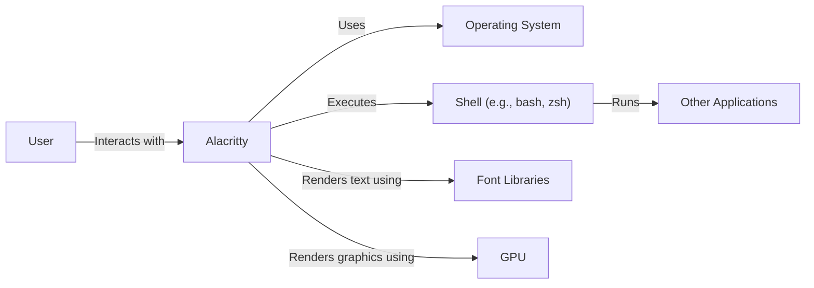
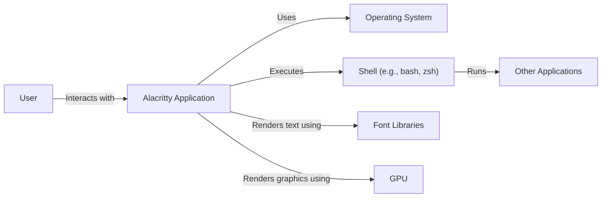
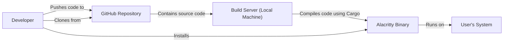
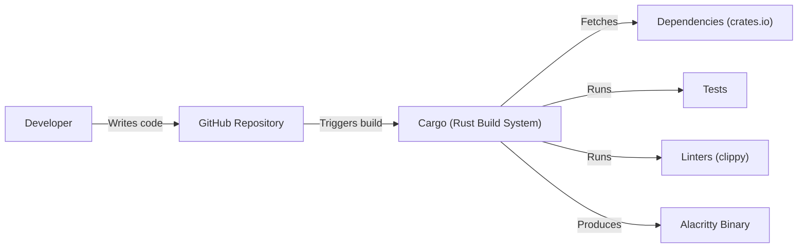

Okay, let's create a design document for the Alacritty project, focusing on aspects relevant to threat modeling.

# BUSINESS POSTURE

Alacritty is a fast, cross-platform, OpenGL terminal emulator.  The primary business goal is to provide a performant and reliable terminal alternative for users, particularly developers and system administrators who spend significant time in the terminal.  The project prioritizes speed and simplicity over a large feature set.  It's an open-source project, relying on community contributions and goodwill rather than direct revenue generation.

Business Priorities:

*   Performance:  Provide the fastest terminal emulator experience possible.
*   Reliability:  Ensure the terminal is stable and doesn't crash or exhibit unexpected behavior.
*   Cross-Platform Compatibility:  Support major operating systems (macOS, Linux, Windows, BSD).
*   Community Engagement:  Foster a healthy open-source community for contributions and support.
*   Simplicity: Maintain a clean and focused codebase, avoiding unnecessary feature bloat.

Business Risks:

*   Reputational Damage:  Security vulnerabilities or performance issues could harm the project's reputation and user trust.
*   Community Disengagement:  Failure to address critical bugs or security concerns could lead to a decline in community participation.
*   Forking and Fragmentation:  A significant vulnerability or disagreement in project direction could lead to the project being forked, diluting the community and development efforts.
*   Dependency Issues: Reliance on external libraries (like OpenGL, font rendering libraries) introduces risks if those dependencies have vulnerabilities or become unmaintained.

# SECURITY POSTURE

Alacritty, being a terminal emulator, inherently deals with potentially untrusted input (from shell sessions, piped commands, etc.).  It also interacts with the operating system at a relatively low level.

Existing Security Controls:

*   security control: Memory Safety (Rust): The use of Rust as the primary programming language provides strong memory safety guarantees, mitigating many common vulnerabilities like buffer overflows and use-after-free errors. (Implemented in the codebase).
*   security control: Limited Scope: Alacritty intentionally avoids features that could introduce security risks, such as built-in scripting or remote access capabilities. (Design decision documented in project philosophy).
*   security control: Dependency Management: Uses Cargo (Rust's package manager) for managing dependencies, allowing for auditing and updates. (Implemented in `Cargo.toml` and `Cargo.lock` files).
*   security control: Code Reviews:  The open-source nature of the project encourages community code reviews, providing an additional layer of scrutiny. (Visible in GitHub pull requests).
*   security control: Fuzzing: Some fuzzing efforts have been made to identify potential vulnerabilities. (Mentioned in project documentation and issue tracker).

Accepted Risks:

*   accepted risk: Terminal Emulator Input:  Alacritty, by its nature, must handle potentially malicious input from the shell or programs running within it.  This is an inherent risk of any terminal emulator.
*   accepted risk: Third-Party Library Vulnerabilities:  Alacritty relies on external libraries (e.g., OpenGL, font rendering).  Vulnerabilities in these libraries could impact Alacritty's security.
*   accepted risk: Configuration File: Alacritty uses a configuration file that, if maliciously crafted or placed in an insecure location, could potentially lead to security issues.

Recommended Security Controls:

*   security control: Continuous Fuzzing: Integrate continuous fuzzing into the CI/CD pipeline to proactively identify vulnerabilities.
*   security control: Security Audits: Conduct periodic security audits by independent experts to identify potential weaknesses.
*   security control: Content Security Policy (CSP): While primarily for web browsers, exploring similar concepts for restricting the capabilities of escape sequences could enhance security.
*   security control: Sandboxing: Investigate sandboxing techniques to further isolate Alacritty from the host system, limiting the impact of potential exploits.

Security Requirements:

*   Authentication: Not directly applicable, as Alacritty itself doesn't handle authentication. It relies on the underlying operating system and shell for authentication.
*   Authorization: Not directly applicable, as Alacritty relies on the operating system's file permissions and user privileges.
*   Input Validation:
    *   Escape Sequence Handling:  Carefully validate and sanitize escape sequences to prevent injection attacks or unintended behavior.
    *   UTF-8 Handling: Ensure correct and secure handling of UTF-8 encoded input to prevent display issues or potential vulnerabilities.
    *   Configuration File Parsing: Securely parse the configuration file, validating all input and preventing injection of malicious code.
*   Cryptography: Not directly used for core functionality. However, if features like encrypted configuration files or secure communication with external services are added, appropriate cryptographic libraries and protocols should be used.

# DESIGN

## C4 CONTEXT

Element Descriptions:

*   1.  Name: User
    *   Type: Person
    *   Description: A person who interacts with the Alacritty terminal.
    *   Responsibilities: Provides input to the terminal, views output from the terminal.
    *   Security controls: Relies on OS-level user authentication and authorization.

*   2.  Name: Alacritty
    *   Type: Software System
    *   Description: The Alacritty terminal emulator application.
    *   Responsibilities: Renders text and graphics, handles user input, interacts with the operating system and shell.
    *   Security controls: Memory safety (Rust), limited scope, dependency management, code reviews, fuzzing.

*   3.  Name: Operating System
    *   Type: Software System
    *   Description: The underlying operating system (e.g., macOS, Linux, Windows).
    *   Responsibilities: Provides system calls, manages resources, handles user authentication and authorization.
    *   Security controls: OS-level security features (e.g., ASLR, DEP, sandboxing).

*   4.  Name: Shell
    *   Type: Software System
    *   Description: The command-line interpreter (e.g., bash, zsh, PowerShell).
    *   Responsibilities: Executes commands, manages processes, interacts with the user and other applications.
    *   Security controls: Shell-specific security features (e.g., command history sanitization).

*   5.  Name: Other Applications
    *   Type: Software System
    *   Description: Applications run within the terminal session.
    *   Responsibilities: Varies depending on the application.
    *   Security controls: Application-specific security controls.

*   6.  Name: Font Libraries
    *   Type: Software System
    *   Description: Libraries used for rendering text (e.g., FreeType).
    *   Responsibilities: Provides font rendering capabilities.
    *   Security controls: Security depends on the specific library and its maintenance.

*   7.  Name: GPU
    *   Type: Hardware
    *   Description: Graphics Processing Unit.
    *   Responsibilities: Handles graphics rendering.
    *   Security controls: Driver-level security and hardware-based security features.

## C4 CONTAINER

In the case of Alacritty, the container diagram is very similar to the context diagram, as Alacritty is a single, self-contained application.

Element Descriptions:

*   1.  Name: User
    *   Type: Person
    *   Description: A person who interacts with the Alacritty terminal.
    *   Responsibilities: Provides input to the terminal, views output from the terminal.
    *   Security controls: Relies on OS-level user authentication and authorization.

*   2.  Name: Alacritty Application
    *   Type: Application
    *   Description: The compiled Alacritty executable.
    *   Responsibilities: Renders text and graphics, handles user input, interacts with the operating system and shell.
    *   Security controls: Memory safety (Rust), limited scope, dependency management, code reviews, fuzzing.

*   3.  Name: Operating System
    *   Type: Software System
    *   Description: The underlying operating system (e.g., macOS, Linux, Windows).
    *   Responsibilities: Provides system calls, manages resources, handles user authentication and authorization.
    *   Security controls: OS-level security features (e.g., ASLR, DEP, sandboxing).

*   4.  Name: Shell
    *   Type: Software System
    *   Description: The command-line interpreter (e.g., bash, zsh, PowerShell).
    *   Responsibilities: Executes commands, manages processes, interacts with the user and other applications.
    *   Security controls: Shell-specific security features (e.g., command history sanitization).

*   5.  Name: Other Applications
    *   Type: Software System
    *   Description: Applications run within the terminal session.
    *   Responsibilities: Varies depending on the application.
    *   Security controls: Application-specific security controls.

*   6.  Name: Font Libraries
    *   Type: Software System
    *   Description: Libraries used for rendering text (e.g., FreeType).
    *   Responsibilities: Provides font rendering capabilities.
    *   Security controls: Security depends on the specific library and its maintenance.

*   7.  Name: GPU
    *   Type: Hardware
    *   Description: Graphics Processing Unit.
    *   Responsibilities: Handles graphics rendering.
    *   Security controls: Driver-level security and hardware-based security features.

## DEPLOYMENT

Alacritty can be deployed in several ways:

1.  **Manual Compilation and Installation:** Users can clone the repository and build Alacritty from source using Cargo.
2.  **Package Managers:** Alacritty is available through various package managers (e.g., apt, brew, choco) on different operating systems.
3.  **Pre-built Binaries:**  The project provides pre-built binaries for some platforms on the GitHub releases page.

We'll describe the manual compilation and installation process, as it provides the most control and transparency.

Element Descriptions:

*   1.  Name: Developer
    *   Type: Person
    *   Description: A developer working on the Alacritty codebase.
    *   Responsibilities: Writes code, submits pull requests, manages releases.
    *   Security controls: Uses secure coding practices, participates in code reviews.

*   2.  Name: GitHub Repository
    *   Type: Source Code Repository
    *   Description: The Git repository hosted on GitHub.
    *   Responsibilities: Stores the Alacritty source code, tracks changes, manages issues and pull requests.
    *   Security controls: GitHub's built-in security features, access controls, branch protection rules.

*   3.  Name: Build Server (Local Machine)
    *   Type: Computing Infrastructure
    *   Description: The developer's local machine used for building Alacritty.
    *   Responsibilities: Compiles the source code, runs tests.
    *   Security controls: Relies on the security of the developer's machine and development environment.

*   4.  Name: Alacritty Binary
    *   Type: Executable File
    *   Description: The compiled Alacritty executable.
    *   Responsibilities: Runs the Alacritty terminal emulator.
    *   Security controls: Inherits security properties from the build process and Rust's memory safety.

*   5.  Name: User's System
    *   Type: Computing Infrastructure
    *   Description: The system where Alacritty is installed and run.
    *   Responsibilities: Provides the environment for Alacritty to run.
    *   Security controls: Relies on the security of the user's operating system and configuration.

## BUILD

Alacritty's build process primarily relies on Cargo, Rust's build system and package manager.

Build Process Description:

1.  **Code Development:** Developers write code and push changes to the GitHub repository.
2.  **Build Trigger:** A developer or a CI system (like GitHub Actions) triggers a build.
3.  **Cargo:** Cargo, the Rust build system, takes over.
4.  **Dependency Resolution:** Cargo fetches the required dependencies (crates) from crates.io (the Rust package registry) based on the `Cargo.toml` and `Cargo.lock` files.
5.  **Compilation:** Cargo compiles the Alacritty source code and its dependencies.
6.  **Testing:** Cargo runs the test suite defined in the project.
7.  **Linting:** Linters like `clippy` are used to check for code style and potential errors.
8.  **Binary Creation:** If all steps are successful, Cargo produces the Alacritty executable (binary).

Security Controls in Build Process:

*   security control: Dependency Management (Cargo): Cargo provides a robust dependency management system, allowing for auditing and updating of dependencies.  The `Cargo.lock` file ensures reproducible builds.
*   security control: Testing: The test suite helps ensure the correctness and stability of the code, reducing the likelihood of vulnerabilities.
*   security control: Linting (clippy): `clippy` helps enforce code style and identify potential bugs, improving code quality and security.
*   security control: CI/CD (GitHub Actions - Optional):  While not explicitly shown in the diagram, Alacritty uses GitHub Actions for continuous integration, which can automate builds, tests, and other security checks.

# RISK ASSESSMENT

Critical Business Processes:

*   Providing a reliable and performant terminal emulator experience.
*   Maintaining a healthy and active open-source community.

Data to Protect:

*   **Source Code:** The Alacritty source code itself is publicly available, but its integrity is crucial.  Unauthorized modifications could introduce vulnerabilities. (Sensitivity: Medium - Publicly available, but integrity is important).
*   **User Data (Indirectly):** Alacritty doesn't directly handle sensitive user data. However, it *processes* data entered by the user and output from applications running within the terminal. This data could include passwords, API keys, or other confidential information. (Sensitivity: High - Alacritty's responsibility is to handle this data securely during processing and display).
*   **Configuration File:** The configuration file may contain user preferences and customizations. While not typically highly sensitive, a maliciously crafted configuration file could potentially lead to security issues. (Sensitivity: Low to Medium).

# QUESTIONS & ASSUMPTIONS

Questions:

*   What is the specific threat model the Alacritty project team uses (if any)?
*   Are there any plans to implement more advanced security features, such as sandboxing or content security policies?
*   What is the process for handling security vulnerability reports?
*   How are dependencies audited and updated to address security vulnerabilities?
*   What level of assurance is required for different components of the system?

Assumptions:

*   BUSINESS POSTURE: The primary goal is to provide a fast and reliable terminal, with security being a high priority but not necessarily the *absolute* top priority (e.g., performance might be prioritized over some security hardening measures).
*   SECURITY POSTURE: The development team is aware of basic security principles and best practices. The use of Rust provides a strong foundation for memory safety.
*   DESIGN: The design is relatively simple and straightforward, with a focus on minimizing attack surface. The system relies heavily on the underlying operating system for security features like authentication and authorization. The build process is standard for a Rust project, using Cargo.